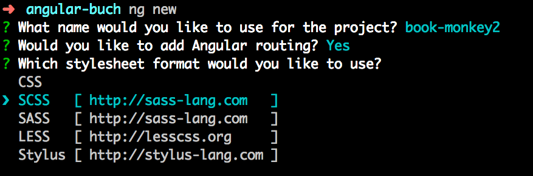

Wieder sind 6 Monate vergangen und Angular strahlt mit einem neuen Major-Release: Am 18. Oktober 2018 wurde Angular 7.0.0 veröffentlicht!
Die beste Nachricht zuerst: Es gibt keine Breaking Changes und das Upgrade funktioniert schnell und reibungslos.
In diesem Artikel stellen wir Ihnen wie immer die wichtigsten Neuigkeiten vor und zeigen Ihnen auch, wie Sie das Beispielprojekt *Book Monkey* auf die neue Version aktualisieren.

Die offizielle Ankündigung des neuen Release finden Sie im [Angular Blog](https://blog.angular.io/c594e22e7b8c).

> **Die Update-Infos für neuere Versionen von Angular finden Sie in separaten Blogartikeln. Wenn Sie das Update durchführen möchten, lesen Sie bitte alle Artikel in der gegebenen Reihenfolge.**
> * [Angular 8 ist da!](/blog/2019-06-angular8)
> * [Angular 9 ist da!](/blog/2020-02-angular9)
> * [Angular 10 ist da!](/blog/2020-06-angular10)
> * [Angular 11 ist da!](/blog/2020-11-angular11)
> * [Angular 12 ist da!](/blog/2021-06-angular12)
> * [Angular 13 ist da!](/blog/2021-11-angular13)
> * [Angular 14 ist da!](/blog/2022-06-angular14)
> * [Angular 15 ist da!](/blog/2022-11-angular15)

## CLI Prompt

Die neue Angular CLI verfügt über einen interaktiven Wizard, der bei der Codeerzeugung die nötigen Einstellungen abfragt.
Probieren Sie es aus: Rufen Sie den Befehl `ng new` einmal ohne weitere Parameter auf!
Dasselbe gilt übrigens auch für alle Generatoren, die einen Namen abfragen, z.B. `ng generate component`.



Zuvor müssen Sie natürlich die neueste Version der CLI auf dem System global installieren, damit der Befehl `ng` verfügbar ist:

```bash
npm i -g @angular/cli
```

## Abhängigkeiten aktualisiert

Die neue Angular-Version setzt jetzt auf das neue TypeScript 3.1 und RxJS 6.3.

## Bugfixes und kleinere Features

Die Version 7 ist geprägt von vielen kleineren Bugfixes und Features, die die Performance von Angular verbessern, allerdings für die meisten Nutzer keine direkt spürbaren Änderungen bringen.
Beispielsweise fällt der Polyfill `reflect-metadata` weg, da er nur für die JIT-Compilation benötigt wurde.

Überfliegen Sie doch bei Gelegenheit einmal den [Changelog von Angular](https://github.com/angular/angular/blob/master/CHANGELOG.md#700-2018-10-18) oder der [Angular CLI](https://github.com/angular/angular-cli/releases/tag/v7.0.1), um ein Gefühl für die aktuellen Änderungen zu bekommen.

## Und was ist mit Ivy?

Der neue View-Renderer *Ivy* lässt noch auf sich warten.
Grundlegend ist Ivy bereits verfügbar, allerdings fehlen noch wesentliche Teile für das finale Release. Den aktuellen Fortschritt der Entwicklung können Sie auf der [Implementation Status Page](https://github.com/angular/angular/blob/master/packages/core/src/render3/STATUS.md) einsehen.
Nach aktuellen Informationen bringt der neue Renderer *keine Breaking Changes* und kann daher auch in einer Minor-Version von Angular veröffentlicht werden.
Derzeit rechnen wir mit einem Release bis April 2019.


## Book Monkey updaten

Da es keine Breaking Changes gibt, ist das Update denkbar einfach.
Ein gutes Hilfsmittel für das Update ist der offizielle [Angular Update Guide](https://update.angular.io/#6.0:7.0).
Außerdem unterstützt uns die Angular CLI mit dem Befehl `ng update`.

Ausgangspunkt für das Update ist der Book Monkey, den wir im Mai 2018 auf Angular aktualisiert haben, siehe [Blogartikel zu Angular 6](/blog/2018-05-angular6). Der passende Befehl lautet wie folgt:

```bash
ng update @angular/cli @angular/core
```

ODER

```bash
ng update --all
```

Die Migrationsskripte der Angular CLI aktualisieren alle Abhängigkeiten und installieren auch die passenden neuen NPM-Pakete.
Nach der Installation können Sie die Anwendung wieder wie gewohnt starten:

```bash
ng serve
```

Sie werden das Update wahrscheinlich nicht bemerken. Um sicherzugehen, dass Sie wirklich Angular 7 verwenden, können Sie die Versionsnummern mit diesem Befehl prüfen:

```bash
ng version
```


<hr>

Viel Spaß mit Angular wünschen<br>
Johannes, Danny und Ferdinand


<small>**Titelbild:** Capitol Reef National Park, Utah, USA, 2018. Foto von Ferdinand Malcher</small>
