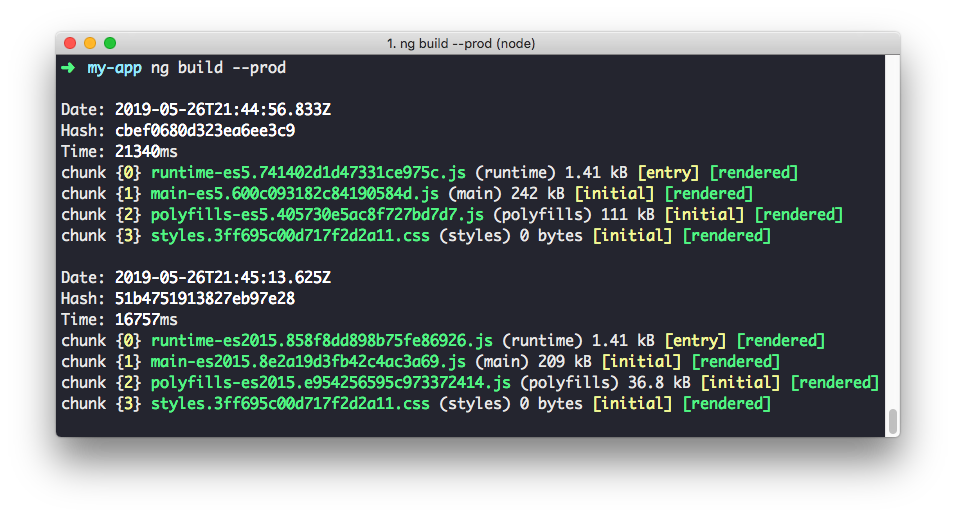

Der neueste Wurf aus der Softwareschmiede Google ist vollbracht: **Angular 8 ist da!**
Am 28. Mai 2019 erschien die neue Major-Version 8.0.0 und bringt wieder einige interessante Neuerungen mit sich.

Die wichtigsten Punkte sind Differential Loading und die neue Syntax für Lazy Loading.
Es gibt kleine Breaking Changes, doch seien Sie beruhigt: Das Update geht leicht von der Hand, und es sind nur selten manuelle Anpassungen nötig.

In diesem Artikel möchten wir kurz die wichtigsten Neuigkeiten vorstellen.
Die offizielle Ankündigung zum neuen Release finden Sie im [Angular Blog](https://blog.angular.io/af0261112a27).

> **Die Update-Infos für neuere Versionen von Angular finden Sie in separaten Blogartikeln. Wenn Sie das Update durchführen möchten, lesen Sie bitte alle Artikel in der gegebenen Reihenfolge.**
> * [Angular 9 ist da!](/blog/2020-02-angular9)
> * [Angular 10 ist da!](/blog/2020-06-angular10)
> * [Angular 11 ist da!](/blog/2020-11-angular11)
> * [Angular 12 ist da!](/blog/2021-05-angular12)
## Update auf Angular 8
Das Update zur neuen Angular-Version ist kinderleicht. Hierzu führen Sie einfach den folgenden Befehl in einem bestehenden Projekt aus:

```sh
ng update @angular/cli @angular/core
```

Die Angular CLI führt automatisch alle nötigen Anpassungen am Code der Anwendung durch.
Auf [update.angular.io](https://update.angular.io/#7.0:8.0) können Sie außerdem alle Migrationsschritte nachvollziehen.


## Differential Loading: Mehrere Bundles für unterschiedliche Browser

Ein bekanntes Praxisproblem mit Angular ist die Größe der ausgelieferten Bundles.
Warum ein Bundle groß und "unhandlich" wird, kann verschiedene Ursachen haben und kann auf verschiedene Weise strategisch gelöst werden, z. B. durch Code Splitting, Tree Shaking oder Lazy Loading.

Alle modernen Browser unterstützen mindestens den JavaScript-Standard ES2015.
Dennoch werden die meisten Angular-Anwendungen weiterhin in ES5 kompiliert, um auch in älteren Browsern lauffähig zu sein – ein wichtiger Grund für wachsende Bundles.
Außerdem müssen Polyfills ausgeliefert werden, um Funktionalitäten in älteren Browsern nachzurüsten.

An dieser Stelle kommt ein neues Feature der Angular CLI ins Spiel: Differential Loading.
Die Angular CLI produziert dabei verschiedene Bundles der Anwendung – für ältere Browser in ES5 und für neuere Browser in ES2015 oder höher.
Der Browser lädt schließlich nur die Bundles herunter, die für ihn relevant sind.
Somit können moderne Browser auf neuere Features zugreifen und müssen nicht zusätzlich Polyfills für Features laden, die Sie bereits nativ unterstützen.
Ältere Browser greifen auf die sogenannten "Legacy Bundles" zurück und laden Polyfills und fehlende Funktionen zusätzlich zum Anwendungscode.

Die Neuerung führt vor allem bei modernen Browsern zu Performance-Verbessungen, weil weniger Code geladen werden muss.





## Lazy Loading: Dynamische Imports statt Magic-Strings

Angular unterstützt nun von Haus aus das `import()`-Statement zum programmatischen Nachladen von Modulen.
Dadurch ändert sich die Schreibweise beim Routing, um Lazy Loading zu konfigurieren.
Die bisherige Syntax verwendet einen "Magic String", um das zu ladende Modul anzugeben:

```ts
{
  path: 'mypath',
  loadChildren: './foo/foo.module#FooModule'
}
```

Diese Schreibweise ist **ab Angular 8** [als **deprecated** gekennzeichnet](https://github.com/angular/angular/pull/30073).
Stattdessen wird ein dynamischer Import verwendet, um das Modul beim Routing nachzuladen:

```ts
{
  path: 'mypath',
  loadChildren: () => import('./foo/foo.module').then(m => m.FooModule)
}
```

Die Syntax sieht zunächst ungewohnt aus.
Im Wesentlichen besteht der Befehl allerdings nur aus einer anonymen Funktion, die aufgerufen wird, wenn die Route aktiviert wird.
Sie ruft `import()` auf und extrahiert im zweiten Schritt das Angular-Modul `FooModule` aus dem heruntergeladenen Bundle.
Diese neue Variante arbeitet vollständig mit nativen Features und ohne einen Magic String, der spezifisch für Angular ist.
Dadurch unterstützt die IDE den Entwickler mit Autovervollständigung und Typprüfung.

Wenn Sie das Update mit der Angular CLI durchführen, werden die Magic Strings automatisch zur neuen Schreibweise migriert.
In der zweiten Auflage des Angular-Buchs, die im Juni 2019 erscheint, ist der neue Weg übrigens schon beschrieben.

Mehr zur neuen Schreibweise für Lazy Loading erfahren Sie auch in der [Angular-Dokumentation](https://v8.angular.io/guide/deprecations#loadchildren-string-syntax).


## Breaking Change: `@ViewChild()` und `@ContentChild()`

Mit den Dekoratoren `@ViewChild()` und `@ContentChild()` können Querys auf DOM-Elemente in der View einer Komponente/Direktive gestellt werden.
Bisher war das Verhalten der Querys nicht gut nachvollziehbar.
Das Verhalten ist nun besser dokumentiert, und man soll sich bei bestehendem Code über die Auswirkungen Gedanken machen.
In Angular 8 gibt zu diesem Zweck eine Übergangsphase, in der man das Verhalten explizit angeben muss. Hierzu müssen Querys zusätzlich mit dem Flag `static` versehen werden: Damit wird definiert, ob es sich bei der Abfrage um eine statisches oder dynamisch veränderbares Element handelt.
Statische Elemente werden einmalig gerendert und sind dann zur Laufzeit der Komponente verfügbar, dynamische Elemente werden zur Laufzeit verändert.

**Bis Angular 7** wurden `@ViewChild()` und `@ContentChild()` wie folgt verwendet.
Das Ergebnis ist dann im LifeCycle-Hook `ngOnInit()` *oder* `ngAfterViewInit()` verfügbar – das genaue Verhalten richtet sich jedoch nach der Struktur des Templates und ist nicht sicher vorhersehbar:

```ts
@ViewChild('foo') foo: ElementRef;
@ViewChild('bar') bar: ElementRef;
```

**Ab Angular 8** müssen `@ViewChild()` und `@ContentChild()` immer das Flag `static` tragen:

```ts
// Statische Query: Ergebnis ist im LifeCycle-Hook `ngOnInit()` verfügbar
@ViewChild('foo', { static: true }) foo: ElementRef;
@ContentChild('bar', { static: true }) bar: ElementRef;

// Dynamische Query: Ergebnis ist im LifeCycle-Hook `ngAfterViewInit()` verfügbar
@ViewChild('foo', { static: false }) foo: ElementRef;
@ContentChild('bar', { static: false }) bar: ElementRef;
```

**Ab Angular 9** wird der Wert `false` wieder das Standardverhalten sein.

### Automatische Migration

Verwenden Sie die Angular CLI für das Update auf Angular 8, so wird die Migration automatisch durchgeführt.
Sollte das Migrationsskript nicht identifizieren können, welcher Wert für `static` gesetzt werden muss, so wird an der entsprechenden Stelle ein Hinweis eingefügt, und Sie müssen manuell „Hand anlegen“:

```ts
/* TODO: add static flag */
```

### Statisch oder dynamisch? – die richtige Einstellung wählen

Wir empfehlen Ihnen, im Regelfall die Einstellung `false` zu verwenden.
Das führt dazu, dass das Ergebnis der Abfrage im Lifecycle-Hook `ngAfterViewInit()` bzw. `ngAfterContentInit()` verfügbar ist.
Somit können Sie sichergehen, dass die Change Detection vollständig ausgeführt wurde und das angefragte Element vollständig geladen wurde.

Die Einstellung `{ static: true }` benötigen Sie nur in wenigen Fällen, beispielsweise wenn Sie auf ein `TemplateRef` zugreifen wollen, um daraus eine eingebettete View zu generieren.
Diese Aktion können Sie nicht in `ngAfterViewInit()` ausführen, weil die Change Detection bereits ausgeführt wurde und die Aktion dann nicht in der View sichtbar wäre.

Lesen Sie mehr zum Thema in der offiziellen [Angular-Dokumentation](https://v8.angular.io/guide/static-query-migration).

Übrigens: Falls Sie `@ViewChildren()` oder `@ContentChildren()` verwenden, müssen Sie nichts ändern – solche Querys sind immer dynamisch.


## Der neue Ivy-Renderer: Opt-In Preview

Die neue Rendering-Engine _Ivy_ kann in Angular 8 als freiwilliges Opt-In aktiviert und genutzt werden.
Zum Ausprobieren können Sie in einem Projekt mit Angular 8 in der Datei `src/tsconfig.app.json` das Flag `enableIvy` setzen:

```json
{
  ...
  "angularCompilerOptions": {
    "enableIvy": true,
    ...
  }
}
```

Alternativ können Sie beim Anlegen eines neuen Angular-Projekts auch direkt die Option `--enable-ivy` nutzen:

```bash
ng new my-app --enable-ivy
```

Ivy soll mit Angular 9 standardmäßig für alle Projekte aktiviert werden.
Bis dahin wird die neue Engine noch einem umfangreichen Praxistest unterzogen.
Einige Features lassen auf sich warten, zum Beispiel die Integration für Internationalisierung (i18n).
Das neue Tooling soll Übersetzungen zur Laufzeit erlauben und auch einen Service zur programmatischen Übersetzung mitbringen. Bis dahin müssen wir uns aber noch gedulden.
Sollte Ihre Anwendung die Internationalisierung von Angular verwenden, so können Sie Ivy noch nicht aktivieren.

Für detaillierte Informationen zu Ivy können wir den Blogartikel ["Understanding Angular Ivy: Incremental DOM and Virtual DOM"](https://blog.nrwl.io/243be844bf36) von Victor Savkin empfehlen.


## Weitere Neuigkeiten

Wir haben in diesem Artikel natürlich nur die wichtigsten Änderungen und Neuigkeiten erwähnt.
Das neue Major-Release bringt dazu eine Vielzahl von Bugfixes, Optimierungen unter der Haube und kleinere Features, die für die meisten Entwicklerinnen und Entwickler zunächst nicht relevant sind.

Beispielsweise verfügt die Angular CLI 8 über die neue **Builders API**.
Damit kann der Buildprozess für ein Projekt durch eigene Skripte gesteuert werden.
Einen Einstieg in die neue Schnittstelle [liefert Hans Larsen in einem Blogartikel](https://blog.angular.io/d012d4489f1b).
Außerdem soll es perspektivisch möglich sein, die Anwendung mit der Angular CLI auf verschiedene Cloud Services zu deployen.

Zusätzlich wird die Integration von **Googles Buildwerkzeug [Bazel](https://bazel.angular.io/)** stetig verbessert – auch hierzu sind im neuen Release von Angular einige Commits zu finden.
Bazel für Angular ist derzeit als Opt-In Preview verfügbar.
Zum Thema möchten wir einen [Vortrag von Alex Eagle von der ng-conf 2019](https://www.youtube.com/watch?v=J1lnp-nU4wM) empfehlen.

Außerdem sind die folgenden Änderungen interessant:

* Das `FormArray` verfügt jetzt über eine Methode `clear()`, um alle Bestandteile aus der Liste zu entfernen (siehe [#28918](https://github.com/angular/angular/pull/28918)).
* `AbstractControl` (und damit auch `FormGroup`, `FormArray` und `FormControl`) besitzen eine Methode `markAllAsTouched()`, um alle Felder rekursiv als `touched` zu markieren. Das kann dann sinnvoll sein, wenn ein Formular vor dem Absenden alle fehlenden Felder visualisieren soll (siehe [#26812](https://github.com/angular/angular/pull/26812)).
* `TestBed.get()` erhält ab sofort typisierte Argumente, liefert aber nach wie vor `any` zurück (siehe [#29290](https://github.com/angular/angular/pull/29290)).
* Das DI-Token `DOCUMENT` wird nur noch von `@angular/common` exportiert, nicht mehr von `@angular/platform-browser` (siehe [#28117](https://github.com/angular/angular/pull/28117)).

Generell lohnt sich immer ein Blick in den [Changelog von Angular](https://github.com/angular/angular/CHANGELOG.md), um die Entwicklung aktiv mitzuverfolgen.

<hr>

Haben Sie Fragen zur neuen Version, zum Update oder zu Angular? Schreiben Sie uns!

**Viel Spaß mit Angular wünschen<br>
Johannes, Danny und Ferdinand**

> **Übrigens: Unser neues Angular-Buch erscheint am 14. Juni 2019 im Handel – vollständig aktualisiert und erweitert. Alle Beispiele sind bereits auf dem Stand von Angular 8. 😊**

<small>**Titelbild:** Badwater Basin, Death Valley National Park, California, 2019. Foto von Ferdinand Malcher</small>
