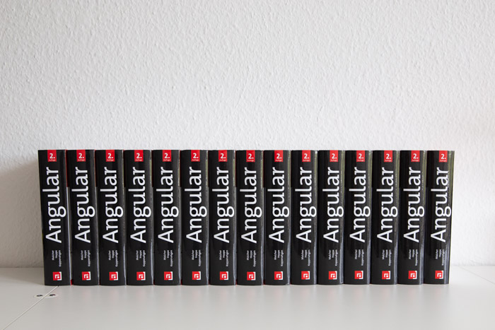
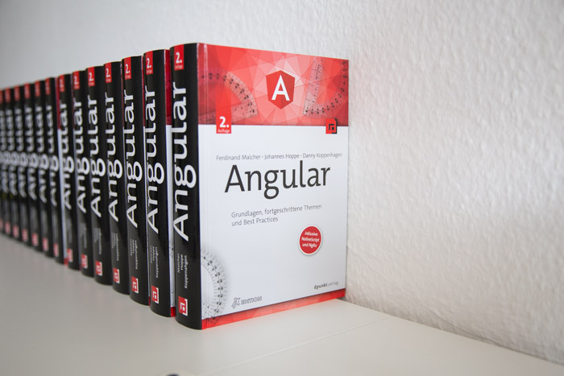
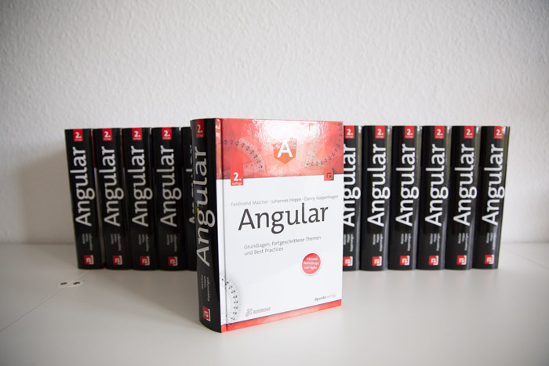

**Das neue deutschsprachige Angular-Buch ist da!**  
Ab sofort ist die 2. Auflage des erfolgreichen Standardwerks im Handel verfügbar.

Mit der neuen Ausgabe erwarten Sie 740 Seiten mit aktuellem Inhalt zum Webframework Angular.
Die neue Ausgabe wurde grundlegend aktualisiert und erweitert.
Alle Inhalte und Beispiele sind auf dem Stand der aktuellen Angular-Version 8 und wurden an etablierte Best Practices angepasst.
Dabei wurden große Teile des Buchs vollständig überarbeitet und neu strukturiert.

Zusätzlich wurden neue Themen in das Buch aufgenommen, sodass es seiner Rolle als Standardwerk gerecht werden kann.
Im [Changelog zur zweiten Auflage](/blog/2019-06-changelog-zweite-auflage) erhalten Sie einen Überblick über die Änderungen und Erweiterungen.
Auch für die Leser der ersten Auflage lohnt sich der Umstieg.

Das Buch ist zum Preis von 36,90 EUR in jeder gut sortierten Buchhandlung und im Online-Handel erhältlich – zum Beispiel direkt beim [dpunkt.verlag](https://www.dpunkt.de/buecher/13231/9783864906466-angular.html) oder bei [Amazon](https://amzn.to/2Wuo7cd).

  

    
  

  

    
  

  

    
  

## Fundierter Einstieg in Angular

Lernen Sie die Grundlagen, fortgeschrittene Themen und Best Practices zu Angular mit diesem Praxisbuch!
Mit einem [zusammenhängenden Beispielprojekt](https://book-monkey3.angular-buch.com/) führen wir Sie durch die Welt von Angular.
Lernen Sie Schritt für Schritt, wie Sie modulare Single-Page-Anwendungen entwickeln.
Praktisch: Der Programmcode zu jeder einzelnen Entwicklungsphase ist [auf GitHub](https://github.com/angular-buch/book-monkey3) verfügbar.
So können Sie alle Schritte gut nachvollziehen und auch Teile überspringen.

Neben den Grundlagen werden auch behandelt:

* Reaktive Programmierung mit RxJS
* State-Management mit Redux/NgRx
* Testing mit Jasmine, Karma und Protractor
* Routing und Modulsystem
* HTTP und Interceptoren
* Formularverarbeitung
* Dependency Injection und Services
* Internationalisierung (i18n)
* Mobile Anwendungen mit NativeScript
* Server-Side Rendering
* und vieles mehr

Das Buch setzt Vorkenntnisse in JavaScript, HTML und CSS voraus.
Wer noch nicht mit TypeScript vertraut ist, findet im Buch eine kompakte Einführung.

## Hintergrund

Die erste Auflage des deutschen Angular-Buchs aus dem dpunkt.verlag erschien im Mai 2017 im Handel.
Das Buch war durchweg auf dem Stand von Angular 4.
Ein Technologiebuch befindet sich stets in einem Spannungsfeld:
Einerseits ist ein gedrucktes Buch für Beständigkeit über mehrere Jahre ausgelegt, andererseits muss ein Enterprise-Framework wie Angular schnell beweglich sein, um mit dem technologischen Fortschritt mitzuhalten.

Wir haben deshalb regelmäßig in [Blogartikeln](/updates) über neue Features und Änderungen informiert.
Die grundsätzlichen Schnittstellen des Frameworks blieben beständig, allerdings waren einige Breaking Changes unvermeidbar.
Zwei Jahre nach dem Erscheinen der ersten Auflage waren so viele Änderungen geschehen, dass eine zweite Auflage ratsam wurde.

Im Sommer 2018 begannen wir die Arbeit an der neuen Auflage.
Dabei haben wir einen guten Kompromiss zwischen einer reinen Aktualisierung und einer vollständigen Neuauflage gefunden.
Einige Inhalte sind komplett neu, andere Kapitel haben wir vollständig gelöscht und neu aufgerollt.
Das Leser-Feedback der letzten zwei Jahre wurde ebenso berücksichtigt, und es wurden viele unklare Stellen des ersten Buchs vereinfacht.
Abschließend kann man sagen, dass jeder Abschnitt im Buch mehr oder weniger stark angepasst wurde.
Das neue Angular-Buch bewegt sich damit wieder am Puls der Zeit und sollte auch in zwei Jahren noch genug Aktualität besitzen.

Wir wünschen Ihnen viel Spaß beim Lesen!
Sollten Sie Feedback, Anmerkungen oder Fragen haben, zögern Sie nicht, uns zu schreiben!
Wir sind per Mail unter [team@angular-buch.com](mailto:team@angular-buch.com) oder [Twitter](https://twitter.com/angular_buch) für Sie da.

Mit besten Grüßen –
das Autorenteam 
**Ferdinand Malcher, Johannes Hoppe und Danny Koppenhagen**

## Danksagung

Dieses Buch hätte nicht seine Reife erreicht ohne die Hilfe und Unterstützung verschiedener Menschen.
Wir danken **Gregor Woiwode** für die Mitwirkung als Autor in der ersten Auflage.
Besonderer Dank geht an **Michael Kaaden** für seine unermüdlichen Anregungen und kritischen Nachfragen.
Michael hat das gesamte Buch mehrfach auf Verständlichkeit und Fehler abgeklopft, alle Codebeispiele nachvollzogen und viel wertvollen Input geliefert.
Er hat zudem maßgeblich am Docker-Beispiel mitgewirkt.
**Matthias Jauernig**, **Dilyana Pavlova**, **Silvio Böhme**, **Danilo Hoffmann** und **Jan-Niklas Wortmann** danken wir ebenso für die hilfreichen Anregungen und Korrekturvorschläge zur zweiten Auflage.
**Julian Steiner** hat uns mit seiner Expertise zu NativeScript bei der Entwicklung der BookMonkey-Mobile-App unterstützt.
Wertvolles Feedback zur ersten Auflage dieses Buchs haben uns außerdem
**Nils Frohne**,
**Johannes Hamfler**,
**Stephan Hartmann**,
**Johannes Hofmeister**,
**Alexander Szczepanski** und
**Daniel Vladut** zukommen lassen.

Dem Team vom dpunkt.verlag, insbesondere **René Schönfeldt** und **Sabrina Dietze**, danken wir für die persönliche Unterstützung und die guten Anregungen zum Buch.
Außerdem danken wir dem **Angular-Team** und der Community dafür, dass sie eine großartige Plattform geschaffen haben, die uns den Entwickleralltag angenehmer macht.
