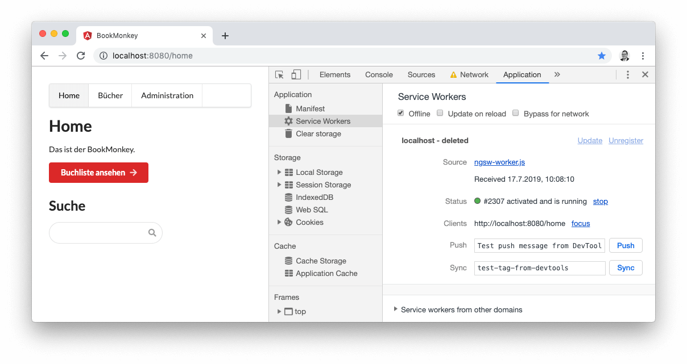
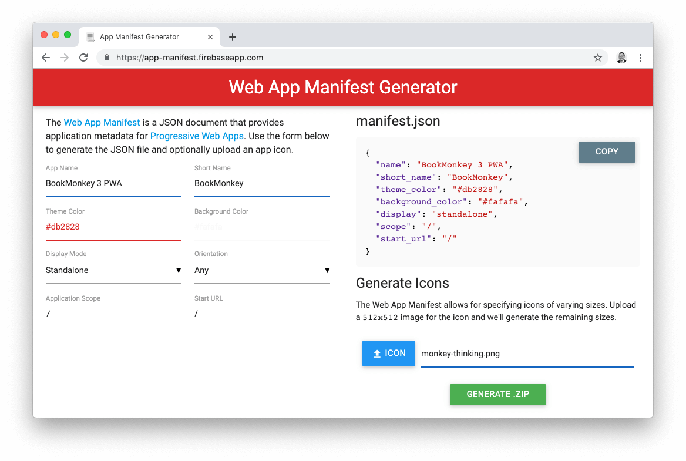

Immer öfter stößt man im Webumfeld auf den Begriff PWA. Doch was genau steckt dahinter und welche Vorteile hat eine PWA gegenüber einer herkömmlichen Webanwendung oder einer App?
PWA steht als Abkürzung für _Progressive Web App_ und bezeichnet eine Webanwendung, die beim Aufruf einer Website als App auf einem lokalen Gerät installiert werden kann – zum Beispiel auf dem Telefon oder Tablet.

## Webanwendung VS. PWAs VS. App

Wir wollen zunächst den Begriff der PWA etwas konkreter einordnen. Dazu schauen wir uns den Unterschied einer PWA im Vergleich zu einer herkömmlichen Webanwendung und einer App an.
Mithilfe einer Webanwendung kann ein Nutzer über eine URL im Browser Informationen abrufen und verarbeiten. Eine App erfüllt einen ähnlichen Zweck, wird allerdings auf einem Gerät lokal installiert und benötigt keinen Browser zur Informationsverarbeitung. Eine PWA stellt nun eine Art Mix von beidem dar: Es handelt sich grundlegend auch um eine Webanwendung, sie wird allerdings durch den Nutzer heruntergeladen und auf dem lokalen Gerät gespeichert. Weiterhin sorgt eine PWA dafür, dass die wichtigsten Daten gecacht werden. Somit bleiben Informationen, die die Anwendung liefert, stets abrufbar – auch wenn ggf. keine durchgängige Internetverbindung vorhanden ist.

## Service Worker

Die Grundvoraussetzung für eine PWA sind die sogenannten *Service Worker*. Service Worker sind gewissermaßen kleine Helfer des Browsers, die bestimmte Aufgaben im Hintergrund übernehmen.
Hierzu zählen vor allem das Speichern und Abrufen der Daten auf einem Endgerät. Service Worker prüfen beispielsweise, ob eine Netzwerkverbindung besteht und senden zur Webanwendung je nach Konfiguration Daten aus dem Cache oder versuchen die Daten online abzurufen.

## Eine bestehende Angular-Anwendung in eine PWA verwandeln

Schauen wir uns das Ganze an einem Beispiel an.
Wie wollen das Beispielprojekt BookMonkey aus dem Angular-Buch in eine PWA verwandeln. Somit können Nutzer die App auf ihrem Gerät installieren und erhalten stets Buchdaten, auch wenn gerade keine Netzwerkkonnektivität vorhanden ist. Zunächst klonen wir uns hierfür die bestehende Webanwendung in ein lokales Repository:

```bash
git clone git@github.com:book-monkey3/iteration-7-i18n.git BookMonkey-PWA
cd BookMonkey-PWA
```

Als Nächstes fügen wir das Paket `@angular/pwa` mithilfe von `ng add` zum Projekt hinzu.
Die dahinterliegenden Schematics nehmen uns bereits einen Großteil der Arbeit zum Erzeugen der PWA ab:

- Hinzufügen des Pakets `@angular/service-worker` zu unserem Projekt
- Aktivieren des Build Support für Service Worker in der Angular CLI
- Importieren und Registrieren des `ServiceWorkerModule` im `AppModule`
- Update der Datei `index.html` mit einem Link zum Web App Manifest (`manifest.json`) sowie Hinzufügen relevanter Meta-Tags
- Erzeugen und Verlinken von Icon-Dateien
- Erzeugen der Konfigurationsdatei `ngsw-config.json` für den Service Worker

```bash
ng add @angular/pwa --project BookMonkey
```

Soweit so gut – das wichtigste ist bereits erledigt. Wir können jetzt schon unsere Anwendung in Form einer PWA erzeugen und nutzen.
Wichtig ist, dass die Anwendung immer im Produktivmodus gebaut wird, denn der Service Worker ist im Entwicklungsmodus nicht aktiv.

```bash
ng build --prod
```

Nach dem Build der Anwendung wollen wir uns diese im Browser ansehen. Dafür können wir das Paket `angular-http-server` nutzen, das einen einfachen Webserver bereitstellt.

> Der `angular-http-server` leitet im Gegensatz zum `http-server` alle Anfragen zu nicht existierenden Verzeichnissen oder Dateien an die Datei `index.html` weiter.
> Dies ist notwendig, da das Routing durch Angular und nicht durch den Webserver durchgeführt wird.

```bash
npm i angular-http-server --save-dev
npx angular-http-server --path=dist/BookMonkey
```

Um nun zu testen, ob wir tatsächlich eine PWA erhalten haben, rufen wir am besten die Google Chrome Developer Tools auf. Dort können wir im Tab _Network_ die Checkbox _Offline_ setzen.
Anschließend laden wir die Seite neu.
Wir sehen, dass trotz des Offline-Modus die Startseite unserer App angezeigt wird, da der Service Worker ein Caching erwirkt hat.
Navigieren wir allerdings zur Buchliste, so können keine Bücher angezeigt werden.



> Achtung: Die PWA verwendet Service Worker. Diese können ausschließlich über gesicherte Verbindungen mit HTTPS oder über eine localhost-Verbindung genutzt werden. Rufen Sie die App, die mittels `angular-http-server` ohne SSL ausgeliefert wird, also über ein anderes Gerät auf, so werden die Service Worker nicht wie gewünscht funktionieren.

### Das Web App Manifests anpassen (`manifest.json`)

Das Web App Manifest ist eine JSON-Datei, die dem Browser mitteilt, wie sich die Anwendung verhalten soll, wenn Sie installiert wird. Hier wird beispielsweise eine Hintergrundfarbe für die Menüleiste auf den nativen Endgeräten hinterlegt, und es werden die Pfade zu hinterlegten Icons angegeben.

Wir wollen die Standard-Datei, die uns die PWA Schematics generiert haben, noch etwas anpassen. Um dies nicht händisch zu tun, verwenden wir am besten einen Generator.
Wir empfehlen hier den [Web App Manifest Generator](https://app-manifest.firebaseapp.com/).
Hierbei sollten wir bei der Einstellung _Display Mode_ die Auswahl _Standalone_ nutzen, da wir eine eigenstände App erhalten wollen, die nicht als Browser erkennbar ist.
Wollen wir das Standard-Icon ändern, laden wir hier einfach ein Bild hoch und lassen die zugehörigen Bilder erzeugen. Nach dem Entpacken der ZIP-Datei speichern wir die Icons in unserem Projekt unter `src/assets/icons` ab. Anschließend sollten wir noch einmal die Pfade in der Datei `manifest.json` prüfen.



### `index.html` für iOS anpassen

Wollen wir unsere PWA unter iOS installieren, sind noch einige Anpassungen an der Datei `index.html` notwendig.
iOS-Geräte benötigen spezielle `meta`- und `link`-Tags zur Identifizierung der zugehörigen Icons. Sie extrahieren diese Informationen nicht aus dem Web-Manifest.

Um das Icon für den Homescreen zu definieren, müssen die folgende Zeilen in die Datei `index.html` eingefügt werden:

```html
<head>
  ...
  <link rel="apple-touch-icon" href="assets/icons/icon-512x512.png">
  <link rel="apple-touch-icon" sizes="152x152" href="assets/icons/icon-152x152.png">
</head>
```

Wir geben den entsprechenden Pfad zum genutzten Icon an. Über das Attribut `sizes` können wir Icons mit bestimmten Größen hinterlegen. Weitere gängige Größen für iOS wären z. B. `180x180` und `167x167`.

Weiterhin können wir über die `link`-Tags für iOS ein Splashscreen-Bild hinterlegen. Dieses wird angezeigt, sobald wir die App vom Homescreen aus starten.
Auch hierfür existiert ein Generator, der uns die Bilder in den entsprechenden Größen erzeugt und und die generierten `link`-Tags anzeigt: [iOS Splash Screen Generator](https://appsco.pe/developer/splash-screens/).

Anschließend fügen wir die Tags ebenfalls in die `index.html` ein. Wir müssen an dieser Stelle noch den Pfad zu den Bildern so anpassen, dass er korrekt auf die tatsächlichen Dateien zeigt.
Die erste Zeile teilt iOS-Geräten mit, dass die Webanwendung als App genutzt werden kann. Nur wenn diese Zeile in der `index.html` angegeben wurde, liest das iOS-Gerät den `link`-Tag mit der Angabe zum Splashscreen aus.

```html
<head>
  ...
  <meta name="apple-mobile-web-app-capable" content="yes">
  ...
  <link href="assets/splashscreens/iphone5_splash.png" media="(device-width: 320px) and (device-height: 568px) and (-webkit-device-pixel-ratio: 2)" rel="apple-touch-startup-image" />
  <link href="assets/splashscreens/iphone6_splash.png" media="(device-width: 375px) and (device-height: 667px) and (-webkit-device-pixel-ratio: 2)" rel="apple-touch-startup-image" />
  <link href="assets/splashscreens/iphoneplus_splash.png" media="(device-width: 621px) and (device-height: 1104px) and (-webkit-device-pixel-ratio: 3)" rel="apple-touch-startup-image" />
  <link href="assets/splashscreens/iphonex_splash.png" media="(device-width: 375px) and (device-height: 812px) and (-webkit-device-pixel-ratio: 3)" rel="apple-touch-startup-image" />
  <link href="assets/splashscreens/iphonexr_splash.png" media="(device-width: 414px) and (device-height: 896px) and (-webkit-device-pixel-ratio: 2)" rel="apple-touch-startup-image" />
  <link href="assets/splashscreens/iphonexsmax_splash.png" media="(device-width: 414px) and (device-height: 896px) and (-webkit-device-pixel-ratio: 3)" rel="apple-touch-startup-image" />
  <link href="assets/splashscreens/ipad_splash.png" media="(device-width: 768px) and (device-height: 1024px) and (-webkit-device-pixel-ratio: 2)" rel="apple-touch-startup-image" />
  <link href="assets/splashscreens/ipadpro1_splash.png" media="(device-width: 834px) and (device-height: 1112px) and (-webkit-device-pixel-ratio: 2)" rel="apple-touch-startup-image" />
  <link href="assets/splashscreens/ipadpro3_splash.png" media="(device-width: 834px) and (device-height: 1194px) and (-webkit-device-pixel-ratio: 2)" rel="apple-touch-startup-image" />
  <link href="assets/splashscreens/ipadpro2_splash.png" media="(device-width: 1024px) and (device-height: 1366px) and (-webkit-device-pixel-ratio: 2)" rel="apple-touch-startup-image" />
</head>
```

Als Letztes haben wir noch die Möglichkeit, die Statusbar der App hinsichtlich ihrer Farbe anzupassen. Dazu führen wir das folgenden Metatag zur `index.html` hinzu.

```html
<head>
  ...
  <meta name="apple-mobile-web-app-status-bar-style" content="black">
  ...
</head>
```

Wir können als Wert für `content` zwischen den folgenden Einstellungen wählen:

|                     | Text- und Iconfarbe | Hintergrundfarbe                        |
|---------------------|---------------------|-----------------------------------------|
| `default`           | Schwarz             | Weiß                                    |
| `white`             | Schwarz             | Weiß                                    |
| `black`             | Weiß                | Schwarz                                 |
| `black-translucent` | Weiß                | Hintergrundfarbe der App (`body`-Element) |

Schauen wir uns nun das Ergebnis an, sehen wir, dass die App die korrekten Icons nutzt und uns nach der Installation und dem Start zunächst kurz den Splashscreen zeigt, bevor die App vollflächig dargestellt wird. Die Statusbar ist in unserem Fall Schwarz, wie zuvor angegeben.


### Konfiguration für Angular Service Worker anpassen (`ngsw-config.json`)

Die Konfigurationsdatei für Angular Service Worker definiert, welche Ressourcen und Pfade gecacht werden sollen und welche Strategie hierfür verwendet wird.
Eine ausführliche Beschreibung der einzelnen Parameter findet man in der offiziellen Dokumentation auf [angular.io](https://angular.io/guide/service-worker-config).

Die beiden großen Blöcke der Konfiguration sind die `assetGroups` und die `dataGroup`. Im Array `asssetGroups` ist die Konfiguration zu Ressourcen enthalten, die zur App selbst gehören. Hierzu zählen zum Beispiel statische Bilder, CSS-Stylesheets, Third-Party-Ressourcen, die von CDNs geladen werden etc.
Das Array `dataGroup`, beinhaltet Ressourcen, die nicht zur App selbst gehören, zum Beispiel API-Aufrufe und andere Daten-Abhängigkeiten.

Wir wollen bei unserer Beispielanwendung zunächst erwirken, dass die Antworten von der HTTP-API gecacht werden: die Liste der Bücher, bereits angesehene einzelne Bücher und auch die Suchresultate.
Diese Ergebnisse können dann also auch angezeigt werden, wenn keine Netzwerkverbindung besteht.
Dazu passen wir die Datei `ngsw-config.json` an und erweitern diese wie folgt:

> Achtung! Wenn Sie Änderungen am Quellcode durchführen, werden Ihnen ggf. beim Aktualisieren der Anwendung im Browser alte (gecachte) Daten angezeigt. Sie sollten deshalb während der Entwicklung stets einen neuen neuen Incognito-Tab im Browser nutzen. Schließen Sie den Tab und laden die Anwendung neu, erhalten Sie eine "frische" Anwendung. Achten Sie auch darauf, dass in den Google Chrome Developer Tools die Option _Disable Cache_ deaktiviert ist.

```json
{
  "$schema": "./node_modules/@angular/service-worker/config/schema.json",
  "index": "/index.html",
  "assetGroups": [ /* ... */ ],
  "dataGroups": [
    {
      "name": "Books",
      "urls": [
        "/secure/books",
        "/secure/books/search/**",
        "/secure/book/**"
      ],
      "cacheConfig": {
        "strategy": "freshness",
        "maxSize": 50,
        "maxAge": "1d2h",
        "timeout": "3s"
      }
    }
  ]
}
```

Wir verwenden an dieser Stelle den Block `dataGroups`, da unsere Buchdatenbank keine statischen Daten enthält, die direkt zur App gehören.
Dem neuen Abschnitt in `dataGroups` geben wir die selbst festgelegte Bezeichnung `Books`. Wir definieren damit, dass alle Aufrufe unter `/secure/books` vom Service Worker behandelt werden sollen. Dasselbe gilt auch für alle anderen definierten Pfade zur HTTP-API.
Im letzten Schritt definieren wir das Verhalten des Caches. Wir wollen hier die Strategie `freshness` verwenden. Diese besagt, dass idealerweise die aktuellen Daten abgerufen werden, bevor sie aus dem Cache bezogen werden.
Erhalten wir jedoch ein Netzwerk-Timeout nach Ablauf der definierten Zeit im Parameter `timeout`, werden die zuletzt gecachten Daten ausgeliefert. Die Strategie eignet sich vor allem für dynamische Daten, die über eine API bezogen werden, und die möglichst immer im aktuellen Stand repräsentiert werden sollen.
Die Option `maxSize` definiert die maximale Anzahl von Einträgen im Cache. `maxAge` gibt die maximale Gültigkeit der Daten im Cache an, in unserem Fall sollen die Daten einen Tag und 2 Stunden gültig sein.

Eine zweite mögliche Strategie für den Cache ist die Einstellung `performance`. Diese liefert immer zunächst die Daten aus dem Cache, solange diese gültig sind.
Erst wenn der `timeout` abläuft, werden die Daten im Cache aktualisiert. Diese Strategie eignet sich für Daten, die nicht sehr oft geändert werden müssen oder bei denen eine hohe Aktualität keine große Relevanz hat.

Schauen wir uns nun wieder unsere Anwendung an und deaktivieren die Netzwerkverbindung nach dem erstmaligen Abrufen der Buchliste, so sehen wir, dass weiterhin Buchdaten angezeigt werden, wenn wir die Anwendung neu laden oder in ihr navigieren.

### Die PWA updaten

Service Worker Updates werden in Angular über den Service `SwUpdate` behandelt. Dieser liefert uns Informationen über ein verfügbares bzw. durchgeführtes Update, auf die wir reagieren können. In der Regel werden Service Worker im Hintergrund geupdatet und die Nutzer bekommen davon nichts mit.
Es kann jedoch hilfreich sein, dem Nutzer mitzuteilen, dass ein Update vorliegt, um beispielsweise über die Neuerungen zu informieren.
Wir wollen genau diesen Fall implementieren.

Zunächst passen wir dafür die Datei `ngsw-config.json` an. Hier fügen wir den Abschnitt `appData` ein. Dieser kann Informationen wie eine Beschreibung, die Version und weitere Metadaten zur Anwendung enthalten. Wir wollen in diesem Abschnitt eine Versionsnummer sowie einen Changelog hinterlegen, den wir später bei einem Update den Nutzern anzeigen wollen.
Die Versionsnummer dient lediglich als Nutzerinformation. Hinter den Kulissen erfolgt jedoch ein Binärvergleich des erzeugten Service Workers aus der `ngsw-config.json`. Jede kleinste Änderung an der `ngsw-config.json` führt somit zu einem neuen Service Worker unabhängig von der von uns hinterlegten Versionsnummer.

```json
{
  "$schema": "./node_modules/@angular/service-worker/config/schema.json",
  "index": "/index.html",
  "appData": {
    "version": "1.1.0",
    "changelog": "aktuelle Version"
  },
  // ...
}
```

Anschließend bauen wir die Anwendung (`ng build --prod`) und rufen sie im Browser auf – bis hierhin ist alles wie gehabt.
Nun wollen wir, dass der Nutzer über Änderungen informiert wird.
Dafür nutzen wir den Service `SwUpdate`. Er stellt das Observable `available` zur Verfügung, das wir abonnieren können.
Sobald ein neuer Service Worker erzeugt wird, wird dieses Event ausgelöst.
Wir können nun einen Confirm-Dialog anzeigen und den Nutzer fragen, ob ein Update durchgeführt werden soll.
Das Event aus dem Observable liefert uns außerdem die komplette Konfiguration von `appData` aus der `ngsw-config.json` in der aktuellen Version sowie in der neuen Version des Service Workers.
Bestätigt der Nutzer nun den Dialog mit _OK_, erfolgt ein Neuladen der Seite, was ein Update des Service Workers zur Folge hat.

```ts
import { Component, OnInit } from '@angular/core';
import { SwUpdate } from '@angular/service-worker';

@Component({ /* ... */ })
export class AppComponent implements OnInit {

  constructor(private swUpdate: SwUpdate) {}

  ngOnInit() {
    if (this.swUpdate.isEnabled) {
      this.swUpdate.available.subscribe((evt) => {
        const updateApp = window.confirm(`
          Ein Update ist verfügbar (${evt.current.appData['version']} => ${evt.available.appData['version']}).
          Änderungen: ${evt.current.appData['changelog']}
          Wollen Sie das Update jetzt installieren?
        `);
        if (updateApp) { window.location.reload(); }
      });
    }
  }
}
```

Um nun tatsächlich einen neuen Service Worker zu erhalten, müssen wir noch Änderungen an der `ngsw-config.json` vornehmen, damit nach dem Binärvergleich eine neue Version des Service Workers erzeugt wird. Wir ändern hier lediglich die Versionsnummer sowie das Changelog.

> An dieser Stelle sei nochmals angemerkt, dass die Versionsnummer keine tatsächliche Version des Service Workers darstellt. Wir könnten hier auch eine niedrigere Versionsnummer angeben, und es würde trotzdem ein Update des Service Workers erfolgen.

```json
{
  // ...
  "appData": {
    "version": "2.0.0",
    "changelog": "Caching bereits abgerufener Bücher"
  },
  // ...
}
```

Erzeugen wir die Anwendung neu und starten wieder den Webserver, so sehen wir, dass kurz nach dem Laden der Seite ein Hinweis zum Update erscheint. Bestätigen wir diesen, wird die Seite neu geladen und es wird fortan der neu erzeugte Service Worker verwendet.


Der fertige BookMonkey als PWA kann auch [auf GitHub](https://github.com/angular-buch/book-monkey3-pwa) abgerufen werden.

### Weiterführende Themen
Dies war nur ein kleiner Einblick in PWAs mit Angular. PWAs bieten noch weitere interessante Möglichkeiten.
Wir wollen hierzu gern den Blogpost [Build a production ready PWA with Angular and Firebase](https://itnext.io/build-a-production-ready-pwa-with-angular-and-firebase-8f2a69824fcc) von Önder Ceylan empfehlen.

Viel Spaß beim Programmieren!
