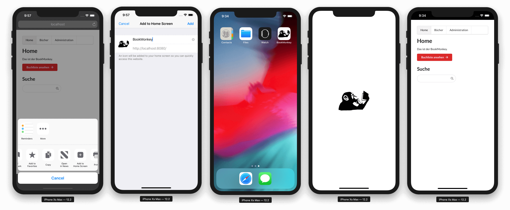
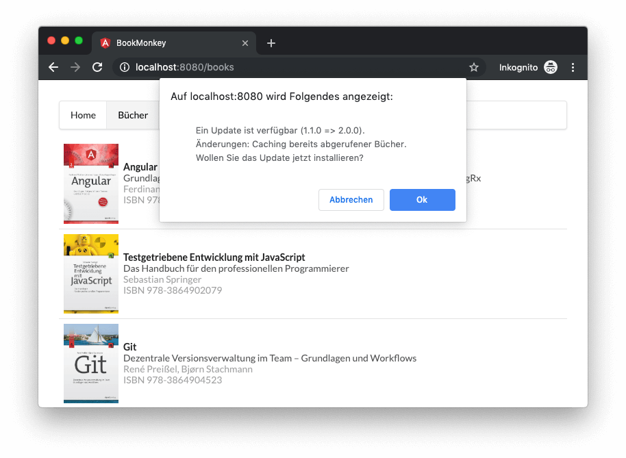
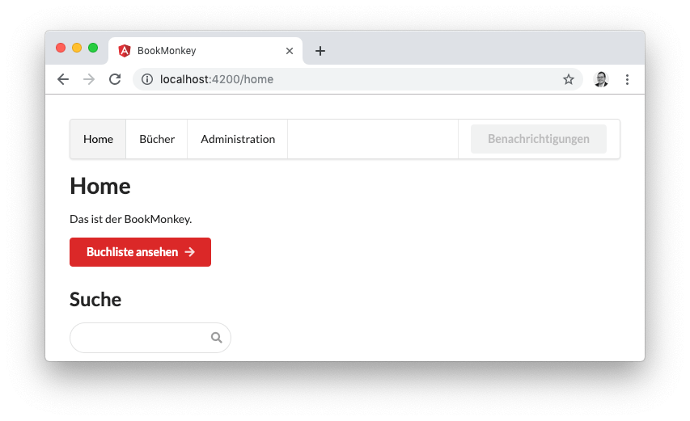
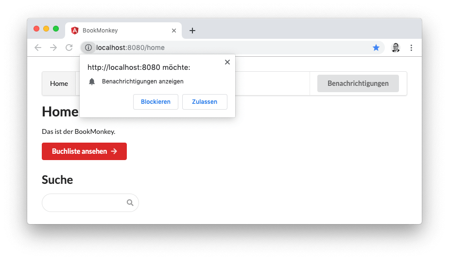
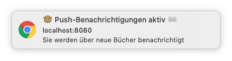
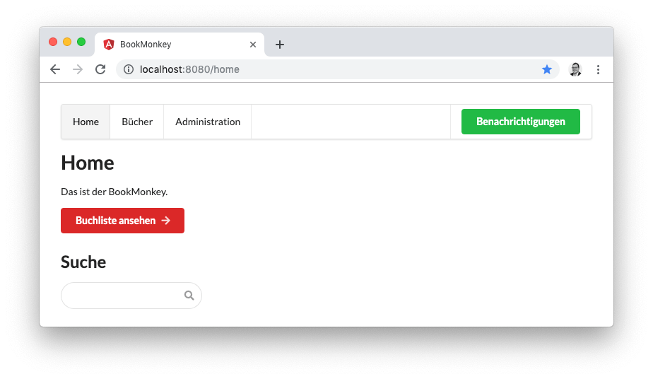
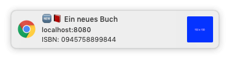
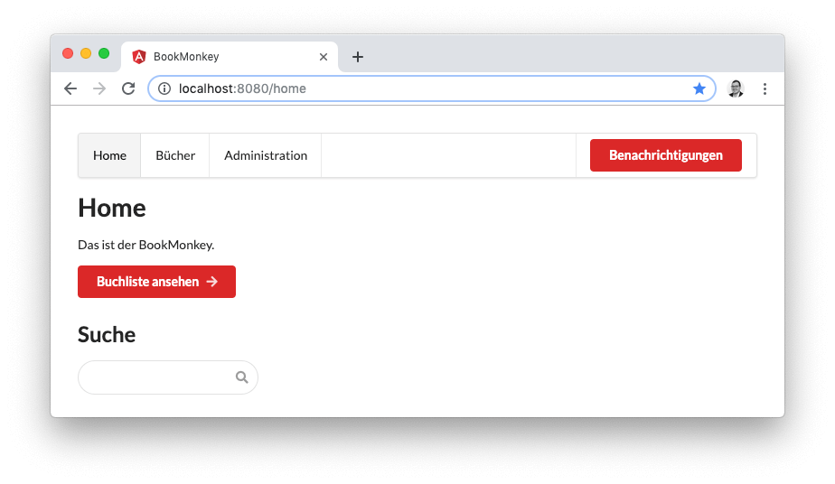

Immer häufiger stößt man im Webumfeld auf den Begriff der Progessive Web App – kurz: PWA. Doch was genau steckt dahinter und welche Vorteile hat eine PWA gegenüber einer herkömmlichen Webanwendung oder einer App?
Als _Progressive Web App_ bezeichnen wir eine Webanwendung, die beim Aufruf einer Website als App auf einem lokalen Gerät installiert werden kann – zum Beispiel auf dem Telefon oder Tablet.
Die PWA lässt sich wie jede andere App nutzen, inklusive Push-Benachrichtigungen!

<hr>

Inhalt:

* [Webanwendung vs. PWA vs. App](/blog/2019-07-progressive-web-app#webanwendung-vs-pwa-vs-app)
* [Add to Homescreen](/blog/2019-07-progressive-web-app#add-to-homescreen)
* [Offline-Funktionalität](/blog/2019-07-progressive-web-app#offline-funktionalit-t)
* [Push Notifications](/blog/2019-07-progressive-web-app#push-notifications)


## Webanwendung vs. PWA vs. App

Wir wollen zunächst den Begriff der PWA etwas konkreter einordnen. Dazu schauen wir uns den Unterschied einer PWA im Vergleich zu einer herkömmlichen Webanwendung und einer App an.
Mithilfe einer Webanwendung kann ein Nutzer über eine URL im Browser Informationen abrufen und verarbeiten. Eine App erfüllt einen ähnlichen Zweck, wird allerdings auf einem Gerät lokal installiert und benötigt in der Regel keinen Browser zur Informationsverarbeitung. Weiterhin kann eine App prinzipiell auch offline genutzt werden, und sie hat oft Zugriff auf native Funktionen des Geräts: Push Notifications und Zugriff auf das Dateisystem sowie Kamera und Sensorik. Eine PWA stellt nun eine Art Mix von beidem dar: Es handelt sich grundlegend auch um eine Webanwendung, sie wird allerdings durch den Nutzer heruntergeladen und auf dem lokalen Gerät gespeichert. Weiterhin sorgt eine PWA dafür, dass die wichtigsten Daten im Client gecacht werden. Somit bleiben Informationen, die die Anwendung liefert, stets abrufbar – auch wenn ggf. keine durchgängige Internetverbindung vorhanden ist. Außerdem kann eine PWA auch Push Notifications erhalten und anzeigen.

Die drei wichtigsten Charakteristiken einer PWA sind also folgende:
- "Add to Homescreen"-Funktionalität
- Offline-Fähigkeit
- Push Notifications

### Service Worker

Als Grundvoraussetzung, um eine PWA offlinefähig zu machen und Push-Benachrichtigungen zu versenden, werden die sogenannten *Service Worker* benötigt. Service Worker sind gewissermaßen kleine Helfer des Browsers, die bestimmte Aufgaben im Hintergrund übernehmen.
Hierzu zählen das Speichern und Abrufen der Daten auf einem Endgerät. Service Worker prüfen beispielsweise, ob eine Netzwerkverbindung besteht, und senden  – je nach Konfiguration – Daten aus dem Cache an die Anwendung, oder versuchen, die Daten online abzurufen.
Eine weitere Aufgabe ist das Empfangen von Push-Benachrichtigungen vom Server.

### Eine bestehende Angular-Anwendung in eine PWA verwandeln

Schauen wir uns das Ganze an einem Beispiel an.
Wie wollen das [Beispielprojekt BookMonkey](https://book-monkey3.angular-buch.com) aus dem Angular-Buch in eine PWA verwandeln. Somit können Nutzer die App auf ihrem Gerät installieren und erhalten stets Buchdaten, auch wenn gerade keine Netzwerkkonnektivität vorhanden ist. Zunächst klonen wir uns hierfür die bestehende Webanwendung in ein lokales Repository:

```bash
git clone git@github.com:book-monkey3/iteration-7-i18n.git BookMonkey-PWA
cd BookMonkey-PWA
```

Als Nächstes fügen wir das Paket `@angular/pwa` mithilfe von `ng add` zum Projekt hinzu.
Die dahinterliegenden Schematics nehmen uns bereits einen Großteil der Arbeit zum Erzeugen der PWA ab:

- Hinzufügen des Pakets `@angular/service-worker` zu unserem Projekt
- Aktivieren des Build Support für Service Worker in der Angular CLI
- Importieren und Registrieren des `ServiceWorkerModule` im `AppModule`
- Update der Datei `index.html` mit einem Link zum Web App Manifest (`manifest.json`) sowie Hinzufügen relevanter Meta-Tags
- Erzeugen und Verlinken von Icon-Dateien
- Erzeugen der Konfigurationsdatei `ngsw-config.json` für den Service Worker

```bash
ng add @angular/pwa --project BookMonkey
```

Soweit so gut – das wichtigste ist bereits erledigt. Wir können jetzt schon unsere Anwendung in Form einer PWA erzeugen und nutzen.
Wichtig ist, dass die Anwendung immer im Produktivmodus gebaut wird, denn der Service Worker ist im Entwicklungsmodus nicht aktiv.

```bash
ng build --prod
```

Nach dem Build der Anwendung wollen wir uns das Ergebnis im Browser ansehen. Dafür können wir das Paket `angular-http-server` nutzen, das einen einfachen Webserver bereitstellt.

> Der `angular-http-server` leitet im Gegensatz zum `http-server` alle Anfragen zu nicht existierenden Verzeichnissen oder Dateien an die Datei `index.html` weiter.
> Dies ist notwendig, da das Routing durch Angular und nicht durch den Webserver durchgeführt wird.

```bash
npm i angular-http-server --save-dev
npx angular-http-server --path=dist/BookMonkey
```

Um nun zu testen, ob wir tatsächlich eine PWA erhalten haben, rufen wir am besten die Google Chrome Developer Tools auf. Dort können wir im Tab _Network_ die Checkbox _Offline_ setzen.
Anschließend laden wir die Seite neu.
Wir sehen, dass trotz des Offline-Modus die Startseite unserer App angezeigt wird, da der Service Worker ein Caching erwirkt hat.
Navigieren wir allerdings zur Buchliste, so können keine Bücher angezeigt werden.


> Achtung: Die PWA verwendet Service Worker. Diese können ausschließlich über gesicherte Verbindungen mit HTTPS oder über eine `localhost`-Verbindung genutzt werden. Rufen Sie die App, die mittels `angular-http-server` ohne SSL ausgeliefert wird, also über ein anderes Gerät auf, so werden die Service Worker nicht wie gewünscht funktionieren.

## Add to Homescreen

Prinzipiell kann jede Website unter Android oder iOS zum Homescreen hinzugefügt werden.
Sie erhält dann ein eigenes App-Icon erhält und sieht zunächst schon wie eine native App aus.
Unter iOS wird hierfür der Safari-Browser benötigt.
Im Safari kann über den Button _Teilen_ (kleines Rechteck mit einem Pfeil nach oben) ein Menü geöffnet werden, in dem die Auswahl "Zum Home-Bildschirm" zu finden ist.
Nach Bestätigung des Dialogfelds wird eine Verknüfung auf dem Homescreen angelegt.
Aber: Haben wir hier noch keine speziellen Icons hinterlegt, wird ggf. nur eine Miniatur der Website als Icon angezeigt.

<!-- TODO: Prüfen, Screenshot:
- Unter Android erscheint die Add-to-Homescreen funktion beim Aufruf einer PWA als Dialog. -->

### Das Web App Manifest anpassen (`manifest.json`)

Das Web App Manifest ist eine JSON-Datei, die dem Browser mitteilt, wie sich die Anwendung verhalten soll, wenn Sie installiert wird. Hier wird beispielsweise eine Hintergrundfarbe für die Menüleiste auf den nativen Endgeräten hinterlegt, und es werden die Pfade zu hinterlegten Icons angegeben.

Wir wollen die Standard-Datei, die von den PWA Schematics generiert wurde, noch etwas anpassen. Um dies nicht händisch zu tun, verwenden wir am besten einen Generator wie den [Web App Manifest Generator](https://app-manifest.firebaseapp.com/).
Hierbei sollten wir bei der Einstellung _Display Mode_ die Auswahl _Standalone_ nutzen, da wir eine eigenständige App erhalten wollen, die nicht als Browser erkennbar ist.
Wollen wir das Standard-Icon ändern, laden wir hier einfach ein Bild hoch und lassen die zugehörigen Bilder erzeugen. Nach dem Entpacken der ZIP-Datei speichern wir die Icons in unserem Projekt unter `src/assets/icons` ab. Anschließend sollten wir noch einmal die Pfade in der Datei `manifest.json` prüfen.


### Anpassungen für iOS (`index.html`)

Wollen wir unsere PWA unter iOS installieren, sind noch einige Anpassungen an der Datei `index.html` notwendig.
iOS-Geräte benötigen spezielle `meta`- und `link`-Tags zur Identifizierung der zugehörigen Icons, denn sie extrahieren diese Informationen nicht aus dem Web-Manifest.

Um das Icon für den Homescreen zu definieren, müssen die folgenden Zeilen in die Datei `index.html` eingefügt werden:

```html
<head>
  ...
  <link rel="apple-touch-icon" href="assets/icons/icon-512x512.png">
  <link rel="apple-touch-icon" sizes="152x152" href="assets/icons/icon-152x152.png">
</head>
```

Wir geben den entsprechenden Pfad zum genutzten Icon an. Über das Attribut `sizes` können wir Icons mit bestimmten Größen hinterlegen. Weitere gängige Größen für iOS sind z. B. `180x180` und `167x167`.

Weiterhin können wir über die `link`-Tags für iOS ein Splashscreen-Bild hinterlegen. Dieses wird angezeigt, sobald wir die App vom Homescreen aus starten.
Auch hierfür existiert ein Generator, der uns die Bilder in den entsprechenden Größen erzeugt und und die generierten `link`-Tags anzeigt: [iOS Splash Screen Generator](https://appsco.pe/developer/splash-screens/).

Anschließend fügen wir die Tags ebenfalls in die `index.html` ein. Wir müssen an dieser Stelle noch den Pfad zu den Bildern so anpassen, dass er korrekt auf die tatsächlichen Dateien zeigt.
Die erste Zeile teilt iOS-Geräten mit, dass die Webanwendung als App genutzt werden kann. Nur wenn diese Zeile in der `index.html` angegeben wurde, liest das iOS-Gerät den `link`-Tag mit der Angabe zum Splashscreen aus.

```html
<head>
  ...
  <meta name="apple-mobile-web-app-capable" content="yes">
  ...
  <link href="assets/splashscreens/iphone5_splash.png" media="(device-width: 320px) and (device-height: 568px) and (-webkit-device-pixel-ratio: 2)" rel="apple-touch-startup-image" />
  <link href="assets/splashscreens/iphone6_splash.png" media="(device-width: 375px) and (device-height: 667px) and (-webkit-device-pixel-ratio: 2)" rel="apple-touch-startup-image" />
  <link href="assets/splashscreens/iphoneplus_splash.png" media="(device-width: 621px) and (device-height: 1104px) and (-webkit-device-pixel-ratio: 3)" rel="apple-touch-startup-image" />
  <link href="assets/splashscreens/iphonex_splash.png" media="(device-width: 375px) and (device-height: 812px) and (-webkit-device-pixel-ratio: 3)" rel="apple-touch-startup-image" />
  <link href="assets/splashscreens/iphonexr_splash.png" media="(device-width: 414px) and (device-height: 896px) and (-webkit-device-pixel-ratio: 2)" rel="apple-touch-startup-image" />
  <link href="assets/splashscreens/iphonexsmax_splash.png" media="(device-width: 414px) and (device-height: 896px) and (-webkit-device-pixel-ratio: 3)" rel="apple-touch-startup-image" />
  <link href="assets/splashscreens/ipad_splash.png" media="(device-width: 768px) and (device-height: 1024px) and (-webkit-device-pixel-ratio: 2)" rel="apple-touch-startup-image" />
  <link href="assets/splashscreens/ipadpro1_splash.png" media="(device-width: 834px) and (device-height: 1112px) and (-webkit-device-pixel-ratio: 2)" rel="apple-touch-startup-image" />
  <link href="assets/splashscreens/ipadpro3_splash.png" media="(device-width: 834px) and (device-height: 1194px) and (-webkit-device-pixel-ratio: 2)" rel="apple-touch-startup-image" />
  <link href="assets/splashscreens/ipadpro2_splash.png" media="(device-width: 1024px) and (device-height: 1366px) and (-webkit-device-pixel-ratio: 2)" rel="apple-touch-startup-image" />
</head>
```

Als Letztes haben wir noch die Möglichkeit, die Statusbar der App hinsichtlich ihrer Farbe anzupassen. Dazu führen wir das folgende Metatag zur `index.html` hinzu.

```html
<head>
  ...
  <meta name="apple-mobile-web-app-status-bar-style" content="black">
  ...
</head>
```

Wir können als Wert für `content` zwischen den folgenden Einstellungen wählen:

|                     | Text- und Iconfarbe | Hintergrundfarbe                        |
|---------------------|---------------------|-----------------------------------------|
| `default`           | Schwarz             | Weiß                                    |
| `white`             | Schwarz             | Weiß                                    |
| `black`             | Weiß                | Schwarz                                 |
| `black-translucent` | Weiß                | Hintergrundfarbe der App (`body`-Element) |

Wir schauen uns das Ergebnis nun im Safari-Browser unter iOS an. Nach dem Öffnen der Seite können wir diese über die Funktion "Add to Homescreen" auf dem Apple-Gerät speichern.
Wir sehen, dass die App die korrekten Icons nutzt und uns nach der Installation und dem Start zunächst kurz den Splashscreen zeigt, bevor die App vollflächig dargestellt wird. Die Statusbar ist in unserem Fall Schwarz, wie zuvor angegeben.



## Offline-Funktionalität

Die Anwendung verhält sich nun wie eine normale Webanwendung. Um mehr das Gefühl einer nativen App zu erzeugen, betrachten wir als Nächstes die Offline-Fähigkeit der App.

### Konfiguration für Angular Service Worker anpassen (`ngsw-config.json`)

Der Angular Service Worker besitzt die Konfigurationsdatei `ngsw-config.json`
.
Hier wird definiert, welche Ressourcen und Pfade gecacht werden sollen und welche Strategie hierfür verwendet wird.
Eine ausführliche Beschreibung der einzelnen Parameter finden Sie in der offiziellen Dokumentation auf [angular.io](https://angular.io/guide/service-worker-config).

Die beiden großen Blöcke der Konfiguration sind die `assetGroups` und die `dataGroup`. Im Array `assetGroups` ist die Konfiguration zu Ressourcen enthalten, die zur App selbst gehören. Hierzu zählen zum Beispiel statische Bilder, CSS-Stylesheets, Third-Party-Ressourcen, die von CDNs geladen werden etc.
Das Array `dataGroup`, beinhaltet Ressourcen, die nicht zur App selbst gehören, zum Beispiel API-Aufrufe und andere Daten-Abhängigkeiten.

Wir wollen bei unserer Beispielanwendung zunächst erwirken, dass die Antworten von der HTTP-API gecacht werden: die Liste der Bücher, bereits angesehene einzelne Bücher und auch die Suchresultate.
Diese Ergebnisse können dann also auch angezeigt werden, wenn keine Netzwerkverbindung besteht.
Dazu passen wir die Datei `ngsw-config.json` an und erweitern diese wie folgt:

> Achtung! Wenn Sie Änderungen am Quellcode durchführen, werden Ihnen ggf. beim Aktualisieren der Anwendung im Browser alte (gecachte) Daten angezeigt. Sie sollten deshalb während der Entwicklung stets einen neuen Incognito-Tab im Browser nutzen. Schließen Sie den Tab und laden die Anwendung neu, erhalten Sie eine "frische" Anwendung. Achten Sie auch darauf, dass in den Google Chrome Developer Tools die Option _Disable Cache_ deaktiviert ist.

```json
{
  "$schema": "./node_modules/@angular/service-worker/config/schema.json",
  "index": "/index.html",
  "assetGroups": [ /* ... */ ],
  "dataGroups": [
    {
      "name": "Books",
      "urls": [
        "/secure/books",
        "/secure/books/search/**",
        "/secure/book/**"
      ],
      "cacheConfig": {
        "strategy": "freshness",
        "maxSize": 50,
        "maxAge": "1d2h",
        "timeout": "3s"
      }
    }
  ]
}
```

Wir verwenden an dieser Stelle den Block `dataGroups`, da unsere Buchdatenbank keine statischen Daten enthält, die direkt zur App gehören.
Dem neuen Abschnitt in `dataGroups` geben wir die selbst festgelegte Bezeichnung `Books`. Wir definieren damit, dass alle Aufrufe unter `/secure/books` vom Service Worker behandelt werden sollen. Dasselbe gilt auch für alle anderen definierten Pfade zur HTTP-API.
Im letzten Schritt definieren wir das Verhalten des Caches. Wir wollen hier die Strategie `freshness` verwenden: Sie besagt, dass idealerweise die aktuellen Daten abgerufen werden, bevor sie aus dem Cache bezogen werden.
Erhalten wir jedoch ein Netzwerk-Timeout nach Ablauf der definierten Zeit im Parameter `timeout`, werden die zuletzt gecachten Daten ausgeliefert. Die Strategie eignet sich vor allem für dynamische Daten, die über eine API bezogen werden, und die möglichst immer im aktuellen Stand repräsentiert werden sollen.
Die Option `maxSize` definiert die maximale Anzahl von Einträgen im Cache. `maxAge` gibt die maximale Gültigkeit der Daten im Cache an, in unserem Fall sollen die Daten einen Tag und 2 Stunden gültig sein.

Eine zweite mögliche Strategie für den Cache ist die Einstellung `performance`. Diese liefert immer zunächst die Daten aus dem Cache, solange diese gültig sind.
Erst wenn der `timeout` abläuft, werden die Daten im Cache aktualisiert. Diese Strategie eignet sich für Daten, die nicht sehr oft geändert werden müssen oder bei denen eine hohe Aktualität keine große Relevanz hat.

Schauen wir uns nun wieder unsere Anwendung an und deaktivieren die Netzwerkverbindung nach dem erstmaligen Abrufen der Buchliste, so sehen wir, dass weiterhin Buchdaten angezeigt werden, wenn wir die Anwendung neu laden oder in ihr navigieren.

### Die PWA updaten

Ein Service Worker wird automatisch im Browser installiert und ist dort aktiv.
Stellt der Server eine neue Version zur Verfügung, so muss der Service Worker im Browser aktualisiert werden.
Solche Updates werden in Angular über den Service `SwUpdate` behandelt. Dieser liefert uns Informationen über ein verfügbares bzw. durchgeführtes Update, auf die wir reagieren können. In der Regel werden Service Worker im Hintergrund geupdatet und die Nutzer bekommen davon nichts mit.
Es kann jedoch hilfreich sein, dem Nutzer mitzuteilen, dass ein Update vorliegt, um beispielsweise über Neuerungen zu informieren.
Wir wollen genau diesen Fall implementieren.

Zunächst passen wir dafür die Datei `ngsw-config.json` an. Hier fügen wir den Abschnitt `appData` ein. Dieser kann Informationen wie eine Beschreibung, die Version und weitere Metadaten zur Anwendung enthalten. Wir wollen in diesem Abschnitt eine Versionsnummer sowie einen Changelog hinterlegen, den wir später bei einem Update den Nutzern anzeigen wollen.

> Achtung: Die Versionsnummer dient lediglich als Nutzerinformation. Hinter den Kulissen erfolgt jedoch ein Binärvergleich des erzeugten Service Workers aus der `ngsw-config.json`. Jede kleinste Änderung an der `ngsw-config.json` führt somit zu einem neuen Service Worker unabhängig von der von uns hinterlegten Versionsnummer.

```json
{
  "$schema": "./node_modules/@angular/service-worker/config/schema.json",
  "index": "/index.html",
  "appData": {
    "version": "1.1.0",
    "changelog": "aktuelle Version"
  },
  // ...
}
```

Anschließend bauen wir die Anwendung (`ng build --prod`) und rufen sie im Browser auf – bis hierhin ist alles wie gehabt.
Nun wollen wir, dass der Nutzer über Änderungen informiert wird.
Dafür nutzen wir den Service `SwUpdate`. Er stellt das Observable `available` zur Verfügung, das wir abonnieren können.
Sobald ein neuer Service Worker verfügbar ist, wird dieses Event ausgelöst.
Wir können nun einen Confirm-Dialog anzeigen und den Nutzer fragen, ob ein Update durchgeführt werden soll.
Das Event aus dem Observable liefert uns außerdem die komplette Konfiguration von `appData` aus der `ngsw-config.json` in der aktuellen Version sowie in der neuen Version des Service Workers.
Bestätigt der Nutzer nun den Dialog mit _OK_, erfolgt ein Neuladen der Seite, was ein Update des Service Workers zur Folge hat.

```ts
import { Component, OnInit } from '@angular/core';
import { SwUpdate } from '@angular/service-worker';

@Component({ /* ... */ })
export class AppComponent implements OnInit {

  constructor(private swUpdate: SwUpdate) {}

  ngOnInit() {
    if (this.swUpdate.isEnabled) {
      this.swUpdate.available.subscribe((evt) => {
        const updateApp = window.confirm(`
          Ein Update ist verfügbar (${evt.current.appData['version']} => ${evt.available.appData['version']}).
          Änderungen: ${evt.current.appData['changelog']}
          Wollen Sie das Update jetzt installieren?
        `);
        if (updateApp) { window.location.reload(); }
      });
    }
  }
}
```

Um nun tatsächlich einen neuen Service Worker zu erhalten, müssen wir noch Änderungen an der `ngsw-config.json` vornehmen, damit nach dem Binärvergleich eine neue Version des Service Workers erzeugt wird. Wir ändern hier lediglich die Versionsnummer sowie das Changelog.

> An dieser Stelle sei nochmals angemerkt, dass die Versionsnummer keine tatsächliche Version des Service Workers darstellt. Wir könnten hier auch eine niedrigere Versionsnummer angeben, und es würde trotzdem ein Update des Service Workers erfolgen.

```json
{
  // ...
  "appData": {
    "version": "2.0.0",
    "changelog": "Caching bereits abgerufener Bücher"
  },
  // ...
}
```

Erzeugen wir die Anwendung neu und starten wieder den Webserver, so sehen wir, dass kurz nach dem Laden der Seite ein Hinweis zum Update erscheint. Bestätigen wir mit _OK_, wird die Seite neu geladen und es wird fortan der neu erzeugte Service Worker verwendet.



## Push Notifications

Zum Abschluss wollen wir uns noch der dritten wichtigen Charakteristik von PWAs widmen: den Push Notifications.
Diese ermöglichen es uns, vom Server aus Benachrichtigungen an Clients zu senden, die zuvor den Benachrichtigungsdienst aktiviert haben.
Push Notifications werden ebenfalls mithilfe von Service Workern implementiert.

Die nachfolgende Abbildung stellt den Ablauf von Push-Benachrichtigungen schematisch dar. Im ersten Schritt abonnieren ein oder mehrere Clients die Benachrichtigungen (1).
Anschließend soll in unserem Fall das Anlegen eines neuen Buchs auf dem Server (2) dazu führen, dass alle Abonnenten darüber benachrichtigt werden (3). In Schritt 4 wollen wir reagieren, wenn die Benachrichtigung angeklickt wird und wollen das neu angelegte Buch öffnen (4).


Um Push-Benachrichtigungen vom Server an die Clients zu schicken, kommt die sogenannte [Push API](https://developer.mozilla.org/en-US/docs/Web/API/Push_API) zum Einsatz, die moderne Browser nativ unterstützen.
Die Technologie wird auch _WebPush_ genannt.

Wir legen als Erstes einen neuen Service an, der sich um die Push Notifications kümmern soll: `ng generate service web-notification`.
Das read-only Property `VAPID_PUBLIC_KEY` enthält den Public-Key der BookMonkey API. Dieser wird für die Kommunikation zwischen dem Service Worker und dem Server mit WebPush zwingend benötigt.

Angular stellt den Service `SwPush` zur Verfügung, der die native Funktionalität kapselt.
Über `isEnabled` greifen wir auf `SwPush` zu, und wir erhalten Aufschluss darüber, ob der verwendete Browser bzw. das genutzte Gerät grundsätzlich  Push Notifications unterstützt.
Die Methode `requestSubscription()` von `SwPush` fordert an, dass Push-Nachrichten im Browser aktiviert werden.
Dazu muss der Public-Key des Servers übermittelt werden.
Der Nutzer muss daraufhin im Browser bestätigen, dass die Anwendung Push-Nachrichten an das Gerät schicken darf.
Stimmt der Nutzer zu, wird die Methode `sendToServer()` mit dem zurückgelieferten Objekt vom Typ `PushSubscriptionJSON` aufgerufen.
Das Objekt enthält die notwendigen Abonnement-Daten, die der Server für die Speicherung und Adressierung der einzelnen Abonnenten benötigt.
Wir übermitteln das Objekt mit einem HTTP-POST-Request an den Server.

```ts
// ...
import { HttpClient } from '@angular/common/http';
import { SwPush } from '@angular/service-worker';

@Injectable({ /* ... */ })
export class WebNotificationService {
  readonly VAPID_PUBLIC_KEY = 'BGk2Rx3DEjXdRv9qP8aKrypFoNjISAZ54l-3V05xpPOV-5ZQJvVH9OB9Rz5Ug7H_qH6CEr40f4Pi3DpjzYLbfCA';
  private baseUrl = 'https://api3.angular-buch.com/notifications';

  constructor(
    private http: HttpClient,
    private swPush: SwPush
  ) { }

  get isEnabled() {
    return this.swPush.isEnabled;
  }

  subscribeToNotifications(): Promise<any> {
    return this.swPush.requestSubscription({
      serverPublicKey: this.VAPID_PUBLIC_KEY
    })
    .then(sub => this.sendToServer(sub))
    .catch(err => console.error('Could not subscribe to notifications', err));
  }

  private sendToServer(params: PushSubscriptionJSON) {
    this.http.post(this.baseUrl, params).subscribe();
  }
}
```

Im nächsten Schritt wollen wir den neuen Service einsetzen und navigieren dazu zurück in den Code der `app.component.ts`.
Wir legen das Property `permission` als Hilfe an, um den Nutzern später im Template den entsprechenden Status der Push Notifications anzuzeigen.
Über das globale Objekt `Notification.permission` erhalten wir vom Browser den Wert `default`, sofern noch keine Auswahl getroffen wurde, ob Benachrichtigungen durch den Nutzer genehmigt wurden.
Bestätigt ein Nutzer die Nachfrage, wird der Wert `granted` gesetzt. Bei Ablehnung erhalten wir den Wert `denied`.
Als initialen Wert verwenden wir `null` – derselbe Wert wird ebenso verwendet, wenn der Benachrichtigungsdienst nicht unterstützt wird.
Zum Abschluss benötigen wir noch eine Methode, mit der der initiale Request gestellt wird, die Push-Nachrichten zu aktivieren: `submitNotification()`. Die Methode soll beim Klick auf einen Button ausgeführt werden und nutzt den eben erstellen `WebNotificationService`.
Sobald der Nutzer eine Auswahl getroffen hat, wollen wir den Wert des Propertys `permission` updaten.

```ts
// ...
import { WebNotificationService } from './shared/web-notification.service';

@Component({/* ... */})
export class AppComponent implements OnInit {
  permission: NotificationPermission | null = null;

  constructor(
    private swUpdate: SwUpdate,
    private webNotificationService: WebNotificationService
  ) {}

  ngOnInit() {
    // ...
    this.permission = this.webNotificationService.isEnabled ? Notification.permission : null;
  }

  submitNotification() {
    this.webNotificationService.subscribeToNotifications()
      .then(() => this.permission = Notification.permission);
  }
}
```

Zum Schluss fehlen nur noch ein paar kleine Anpassungen am Template (`app.component.html`).
Hier wollen wir einen Menüpunkt mit einem Button im rechten Bereich der Menüleiste einfügen.
Der Button soll deaktiviert sein, sofern keine Push-Notifikations unterstützt werden (z. B. im Development-Modus von Angular oder wenn der genutzte Browser diese Funktion nicht unterstützt).
Wird die Funktion unterstützt, prüfen wir noch auf die drei Zustände `default`, `granted` und `denied`. Die [CSS-Klassen von Semantic UI](https://semantic-ui.com/elements/button.html) sorgen für das entsprechende Styling.
Die CSS-Klasse `mini` im übergeordneten `<div>` macht das Menü etwas kleiner, sodass es auch auf dem Smartphone gut aussieht.

```html
<div class="ui mini menu">
  <!-- ... -->
  <div class="right menu">
    <div class="item">
      <div class="ui button"
        (click)="submitNotification()"
        [ngClass]="{
          'disabled': !permission,
          'default':  permission === 'default',
          'positive': permission === 'granted',
          'negative': permission === 'denied'
        }"
      >🔔</div>
    </div>
  </div>
</div>
<router-outlet></router-outlet>
```

Geschafft! Schauen wir uns nun das Resultat im Development-Modus an, sehen wir, dass der Button ausgegraut und nicht klickbar ist, da hier die Notifications nicht unterstützt werden.



Bauen wir die Anwendung hingegen im Production-Modus und starten den `angular-http-server`, so ist der Button klickbar und ist zunächst im Zustand `default`.
Klicken wir den Button an, fragt uns der Browser, ob wir Push Notifications aktivieren wollen.



Wenn wir den Zugriff gewähren, wird der Button durch die CSS-Klasse `success` grün, und wir erhalten vom Server direkt eine erste Bestätigung, dass die Benachrichtigungen aktiviert wurden.





Der API-Server unterstützt bereits WebPush: Wird nun ein neues Buch zur API hinzugefügt, erhalten wir eine Push-Benachrichtigung! Sie können das Feature ausprobieren, indem Sie entweder über die App selbst ein Buch hinzufügen, oder indem Sie die [BookMonkey API](https://api3.angular-buch.com/swagger-ui/#/book/post_book) dafür nutzen.



Lehnen wir hingegen ab, Benachrichtigungen zu erhalten, so färbt sich der Button rot, und wir werden nicht über neue Bücher informiert.



Wir wollen zum Abschluss noch einen Schritt weiter gehen und darauf reagieren, dass ein Nutzer auf die angezeigte Benachrichtigung klickt.
Hierfür stellt der Service `SwPush` das Observable `notificationClicks` zur Verfügung.
Mit der Benachrichtigung wird im Property `data` eine URL angegeben, die zur Seite des neu angelegten Buchs führt.
Wir wollen diese URL nutzen und ein neues Browser-Fenster mit der angegebenen URL öffen.

> Achtung: An dieser Stelle müssen wir `window.open()` nutzen und nicht den Angular-Router, da die Methode `notificationClicks()` im Service Worker aufgerufen wird und die Benachrichtigung ggf. erst erscheint, wenn wir die App bereits geschlossen haben.

```ts
// ...
@Injectable({ /* ... */ })
export class WebNotificationService {
  // ...
  constructor(
    private http: HttpClient,
    private swPush: SwPush
  ) {
    this.swPush.notificationClicks.subscribe(event => {
      const url = event.notification.data.url;
      window.open(url, '_blank');
    });
  }
  // ...
}
```

Die Push Notifications aus dem Service Worker sind ein effektiver Weg, um die Aufmerksamkeit des Nutzers gezielt auf die Anwendung zu lenken.
Die Nachricht verhält sich wie eine native Benachrichtigung jeder anderen App.
Im Hintergrund wird die Technologie WebPush eingesetzt, die fest mit dem Angular-Service `SwPush` verdrahtet ist.
`SwPush` bietet also keine einfache Möglichkeit, eine Nachricht aus einer lokalen Quelle anzuzeigen.

### Ein Blick unter die Haube von Push Notifications

Haben wir alle Teile korrekt implementiert, kann der Client Push-Nachrichten vom Server empfangen.
Wir wiederholen kurz dem Ablauf:
Der Client macht sich zunächst beim Server bekannt, indem er ein Objekt vom Typ `PushSubscription` an den Server übermittelt.
In unserem Beispiel haben wir dazu die Service-Methode `sendToServer()` verwendet.
Der Server speichert dieses Objekt und verwendet es, um Nachrichten an den registrieren Service Worker zu übermitteln.
So wird es ermöglicht, dass auch Nachrichten empfangen werden können, wenn die Anwendung geschlossen ist.

Aber wie funktioniert der Rückkanal vom Server zum Client?
Dazu schauen wir uns das automatisch generierte Objekt vom Typ `PushSubscription` einmal genauer an:

```js
{
  "endpoint": "https://fcm.googleapis.com/fcm/send/erSmNAsF0ew:APA91bGfjlCRi8nIpG9fvxezt_2E0JcfJ0I_4gnm2M29JQ3kF3d_XxUqrlQatWNGotPtsW-M57vsLxhNz9vRz0IQr3KB50Dm2wjm7gAbVo1c00VpDv7-2JynXNGk1RqimZ-TfYzzAjdu",
  "expirationTime": null,
  "keys": { 
    "p256dh":"BO4BdhfvZ4bo3hh7NBJDb--OZWcQ37M0O8XZY6lJ67g3x7JvmzMJhz_w_EaEVKFLskkDccO3iKsXkxtlSromdzU",
    "auth":"IH-eOcRdlxZ8P8uLl-2e6g"
  }
}
```

Besonders interessant ist das Property `endpoint`: Der Browser übermittelt eine URL, über die der Server Nachrichten an den Client schicken kann.
Der Server sendet dazu lediglich einen HTTP-Request an diese URL.
Die Notwendigkeit der Verschlüsselung mit den VAPID-Keys wird hier noch einmal deutlicher.

Ebenso interessant ist, dass die Endpoint-URL aus dem Universum des Browserherstellers kommt.
Bitte behalten Sie diesen Punkt stets im Hinterkopf: Alle Push-Nachrichten werden immer durch einen fremden Server zum Client gebracht.


## Weiterführende Themen

Der fertige BookMonkey als PWA kann auch [auf GitHub](https://github.com/angular-buch/book-monkey3-pwa) abgerufen werden.
Eine Demo finden Sie unter https://bm3-pwa.angular-buch.com.

Dies war nur ein kleiner Einblick in Progressive Web Apps mit Angular. Wer noch mehr über PWAs mit Angular erfahren möchte, dem sei der Blogpost ["Build a production ready PWA with Angular and Firebase"](https://itnext.io/build-a-production-ready-pwa-with-angular-and-firebase-8f2a69824fcc) von Önder Ceylan empfohlen.

Viel Spaß beim Programmieren!


<small>**Titelbild:** Photo by rawpixel.com from Pexels, angepasst</small>


