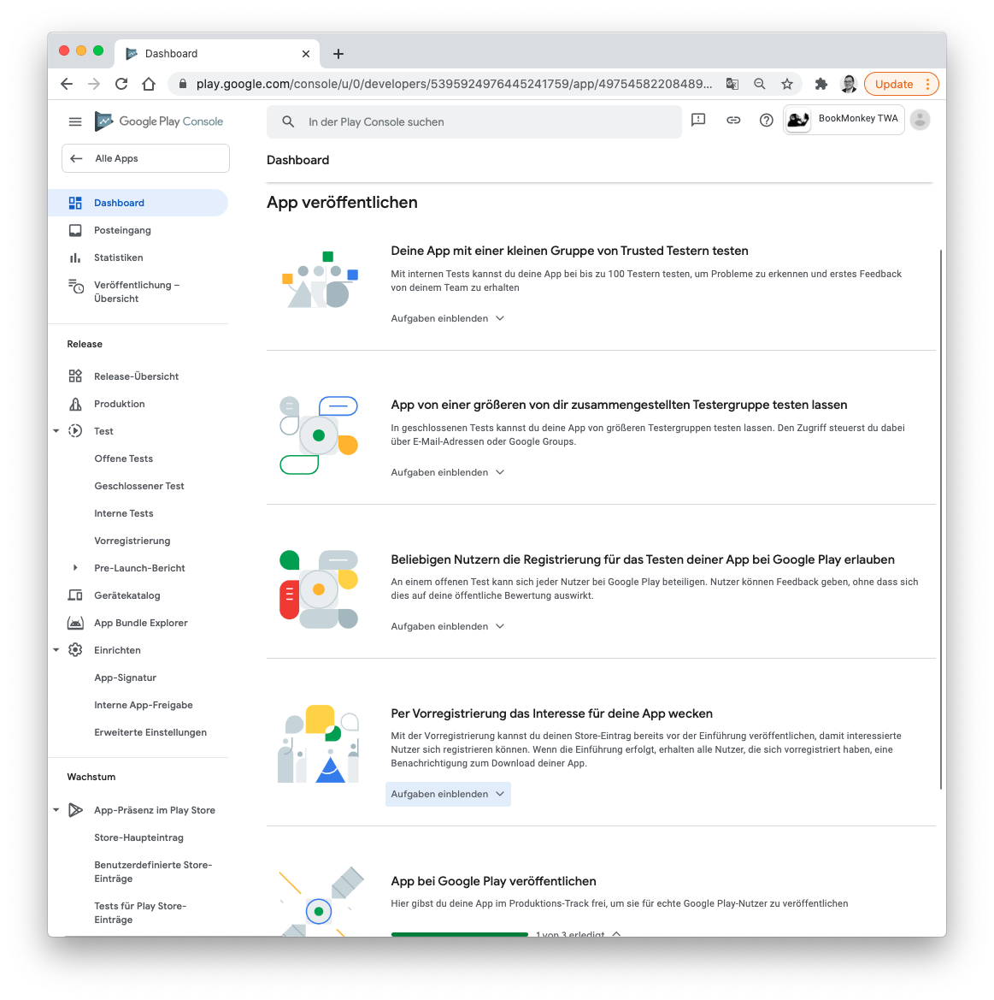
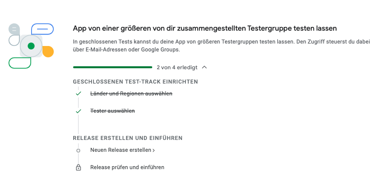
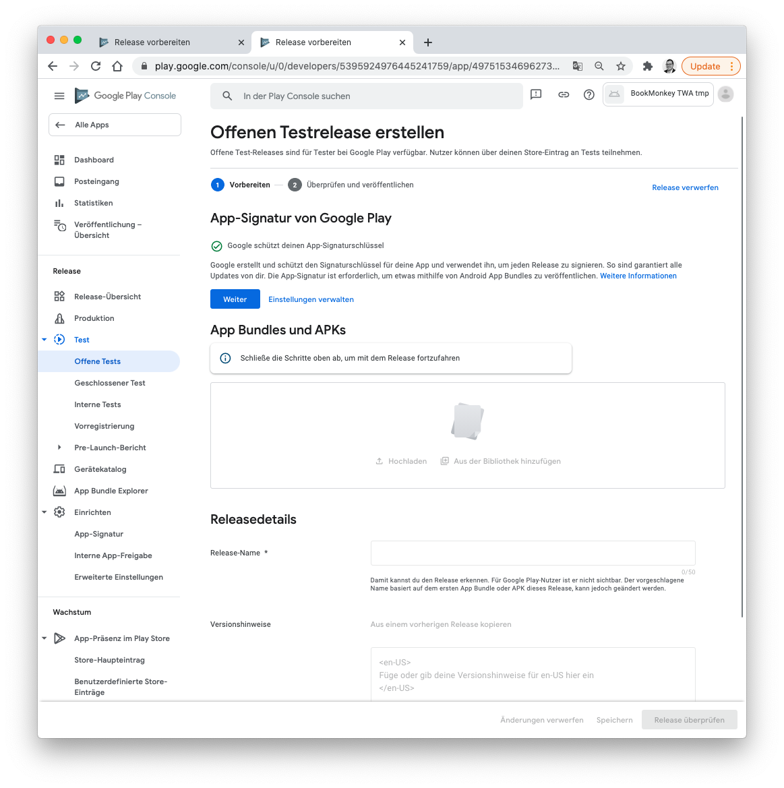
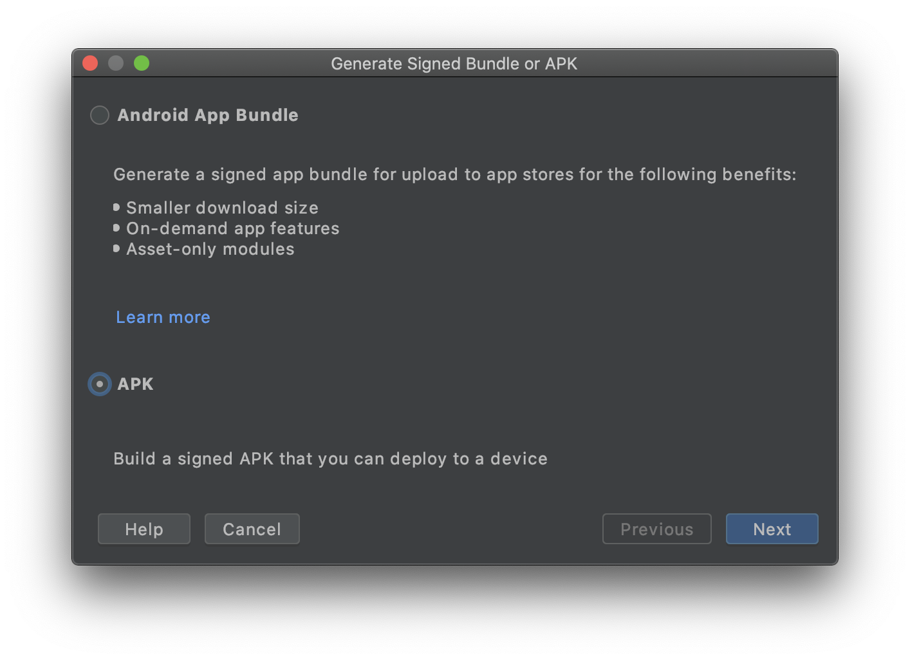
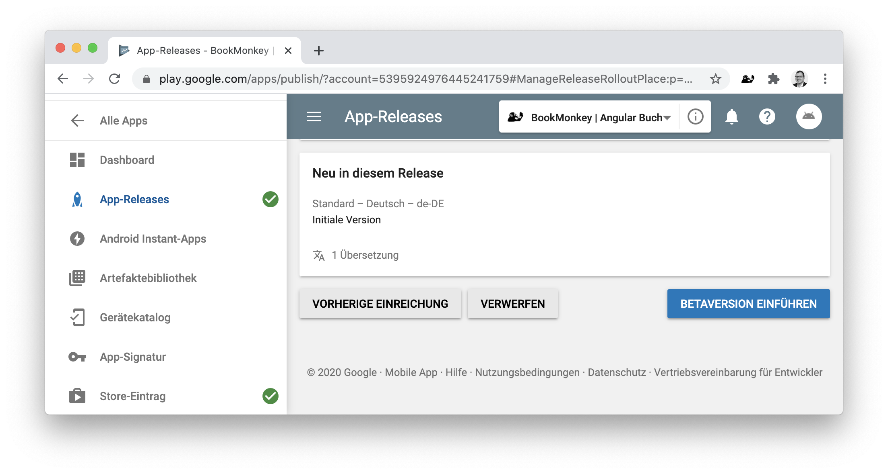

Progressive Web Apps sind in den letzten Jahren immer populärer geworden.
Sie erlauben es uns, Webanwendungen auf dem Home-Bildschirm des Smartphones zu installieren und wie eine nativ installierte App zu benutzen.
Mit einer PWA können wir Daten mithilfe eines Service Workers cachen, um die Anwendung auch offline zu verwenden.
Weiterhin kann eine PWA im Hintergrund Push-Benachrichtigungen vom Server empfangen und anzeigen.

> Wenn Sie noch keine Erfahrung mit der Umsetzung einer Angular-App als PWA haben, schauen Sie sich unseren Blog-Post [_"Mach aus deiner Angular-App eine PWA"_](blog/2019-07-progressive-web-app) an oder werfen Sie einen Blick in unser [_Angular-Buch_](angular-buch.com), wo wir dieses Thema detailliert erläutern.

Nach der Entwicklung einer PWA bleibt jedoch eine Hürde bestehen: Nutzer der Anwendung müssen die URL kennen, über welche die PWA abrufbar ist und installiert werden kann.
Viele Smartphone-Nutzer sind jedoch einen anderen Weg gewohnt, um eine App zu installieren:
Sie suchen danach in einem App Store wie dem _Google Play Store_ unter Android oder _App Store_ unter iOS.

In diesem Blogpost wollen wir Ihnen zeigen, wie Sie Ihre PWA auf einfachem Weg in den Google Play Store für Android bringen können, ohne eine echte Android-App mit Webview zu entwickeln, die lediglich eine Website aufruft.

> **Zur Zeit gibt es noch keine Möglichkeit, PWAs in Apples App Store zu deployen.**

---

Inhalt:
- [Trusted Web Activities vs. Webview-Integration](#trusted-web-activities-vs-webview-integration)
- [TWAs im Detail](#twas-im-detail)
- [Eine PWA als TWA in den Android Store bringen](#eine-pwa-als-twa-in-den-android-store-bringen)
  - [Einen Android Developer Account registrieren](#einen-android-developer-account-registrieren)
  - [Die Android-App in der Google Play Console erstellen](#die-android-app-in-der-google-play-console-erstellen)
  - [Die App-Signatur und das Release erzeugen](#die-app-signatur-und-das-release-erzeugen)
  - [Den App-Signaturschlüssel in der PWA hinterlegen](#den-app-signaturschlüssel-in-der-pwa-hinterlegen)
- [Die TWA mit der Bubblewrap CLI erzeugen](#die-twa-mit-der-bubblewrap-cli-erzeugen)
- [Die signierte App bauen](#die-signierte-app-bauen)
  - [Mit der Bublewrap CLI](#mit-der-bublewrap-cli)
  - [Mithilfe von Android Studio](#mithilfe-von-android-studio)
- [Die App über die Google Play Console veröffentlichen](#die-app-über-die-google-play-console-veröffentlichen)

---

## Trusted Web Activities vs. Webview-Integration

Um PWAs als Android-App bereitzustellen, benötigen wir eine Art App-Wrapper, der schließlich die PWA aufruft und somit unsere Webanwendung darstellen kann.

In der Vergangenheit wurde dies oft durch Android-Apps umgesetzt, die lediglich einen sogenannten [_WebView_](https://developer.android.com/reference/android/webkit/WebView) integrieren.
Hinter diesem Feature versteckt sich ein integrierter Webbrowser in der Android-App, der lediglich den Inhalt der Website darstellt.
Dieser Weg funktioniert für eine Vielzahl von Websites, gerät jedoch an seine Grenzen, wenn es sich bei der Website um eine PWA handelt.
Der Grund: In einem Webview funktionieren die essenziellen Service Worker nicht.
Somit können wir Features wie die Offlinefähigkeit nicht einfach in die Anwendung integrieren.
Weiterhin birgt ein Webview ein gewisses Sicherheitsrisiko, weil lediglich die URL den Inhalt der Anwendung bestimmt und keinerlei Überprüfung des tatsächlichen Contents stattfindet.
Wird also beispielsweise eine Website _"gekapert"_, bekommt der Nutzer ggf. den Inhalt einer falschen Seite angezeigt.

Bei einer TWA hingegen wird die PWA lediglich so erweitert, dass sie als Android-App direkt deployt werden kann.
Über einen Sicherheitsschlüssel kann verifiziert werden, dass die aufgerufene URL zur App passt.

## TWAs im Detail

Die Grundidee einer TWA ist schnell erklärt: Statt einer vollumfänglichen Android-App, die einen Browser implementiert und eine URL aufruft, wird bei einer TWA leidglich die PWA um eine App-Schicht erweitert, sodass sie im Google Play Store veröffentlicht werden kann.
Es muss also auch kein eingebetteter Browser in der App integriert werden, sondern es wird auf den vorhandenen Google Chrome Browser zurückgegriffen.
Voraussetzung hierfür ist, dass auf dem Android-Gerät die Version 72 oder höher von Google Chrome verfügbar ist.
Beim Öffnen der PWA wird Chrome mit der hinterlegten URL geöffnet, und es werden sämtliche UI-Elemente des Browsers ausgeblendet.
Im Prinzip passiert also genau das, was auch geschieht, wenn wir eine PWA über die Funktion _"Add To Homescreen"_ auf Smartphone speichern, jedoch in Form einer App, die über den Google Play Store gefunden und installiert werden kann.
Somit bleiben Features wie Push-Benachrichtigungen, Hintergrundsynchronisierungen, Autofill bei Eingabeformularen, Media Source Extensions oder die Sharing API vollumfänglich erhalten.
Ein weiterer Vorteil einer solchen TWA ist, dass Session-Daten und der Cache im Google Chrome geteilt werden.
Haben wir uns also beispielsweise bei unserer Web-Anwendung zuvor im Browser angemeldet, so belibt die Anmeldung in der Android-App (TWA) bestehen.

Die Bezeichnung "Trusted Web Activity" lässt bereits darauf schließen: TWAs sind _trusted_, also vertraulich.
Durch eine spezielle Datei, die mit der Webanwendung ausgeliefert wird und die einen Fingerprint enthält, kann sichergestellt werden, dass die Anwendung vertrauenswürdig ist, und der Inhalt kann somit sicher geladen werden.

## Eine PWA als TWA in den Android Store bringen

Genug der Theorie -- wir wollen nun erfahren, wie wir eine PWA im Android Store als TWA bereitstellen können.

Dafür müssen wir folgende Schritte durchführen:

- Einen Android Developer Account registieren
- Die Android-App in der Google Play Console erstellen
- Die App-Signatur erzeugen
- Den App-Signaturschlüssel in der PWA hinterlegen
- Die TWA mit der *Bubblewrap CLI* erzeugen
- Die signierte App bauen
- Die App über die Google Play Console veröffentlichen

Wir wollen als Grundlage für dieses Beispiel die Angular-Anwendung _BookMonkey_ aus dem Angular-Buch verwenden, die bereits als PWA vorliegt.
Möchten Sie die Schritte selbst nachvollziehen, können Sie die Anwendung über GitHub herunterladen:

[https://github.com/book-monkey4/book-monkey4-pwa](https://github.com/book-monkey4/book-monkey4-pwa)

```
git clone https://ng-buch.de/bm4-pwa.git
```

Die Online-Version der PWA können Sie unter der folgenden URL abrufen:

[https://bm4-pwa.angular-buch.com/](https://bm4-pwa.angular-buch.com/)

Weiterhin benötigen Sie für die Erstellung der TWA folgende Voraussetzungen auf dem Entwicklungssystem:
- [Java SDK 8.0](https://openjdk.java.net/install/)
- [Android SDK (vorzugsweise Android Studio inkl. SDK)](https://developer.android.com/studio)
- [Node.js 10.0 oder höher](https://nodejs.org)

### Einen Android Developer Account registrieren

> Sofern Sie bereits einen Account für die _Google Play Console_ besitzen, können Sie diesen Schritt überspringen.

Um eine App im Google Play Store einzustellen, benötigen wir zunächst einen Account für die _Google Play Console_.
Den Account können Sie über den folgenden Link registrieren:

[https://play.google.com/apps/publish/signup](https://play.google.com/apps/publish/signup)

Bei der Registrierung wird eine einmalige Registrierungsgebühr in Höhe von 25 USD erhoben. Diese Gebühr gilt für sämtliche Apps, die Sie mit dem hinterlegten Google-Account registrieren wollen.


### Die Android-App in der Google Play Console erstellen

Nach der Registierungs müssen wir uns in der [_Google Play Console_ einloggen](https://play.google.com/apps/publish).
Anschließend können wir über den Menüpunkt _"Alle Apps"_ mit dem Button _"App erstellen"_ eine neue Anwendung anlegen.
Hier legen wir den Namen der Anwendung, die Standardsprache, den Anwendungstypen (App oder Spiel) sowie den Preis der Anwendung fest.
Weiterhin müssen wir den Programmierrichtlinien für Entwickler sowie den Exportbestimmungen der USA zustimmen.


Danach gelangen wir zum Dashboard für die neue Android-App.
Hier arbeiten wir uns im folgenden durch die Ersteinrichtung der App durch.
Jeder abgeschlossene Punkt wird entsprechend in der Liste markiert.
Alle Einstellungen finden sich auch im Nachhinein links im Menü wieder und können auch noch später angepasst werden.


- **App-Zugriff**: Hier hinterlegen Sie informationen, die darlegen, wie auf die App bei der Überprüfung vor der Freigabe im Google Play Store zugegriffen werden kann.
  Benötigen die Tester z. B. einen speziellen Account oder Standort oder ist die Anwendung frei zugänglich?
- **Anzeigen**: An dieser Stelle geben Sie an, ob ihre App Werbung enthält oder nicht.
- **Einstufung des Inhalts**: Sie werden zu einem Fragebogen zur Überprüfung der Altersfreigaben geleitet, den Sie ausfüllen müssen.
  Anschließend erhalten Sie eine Bewertung, die Ihnen die Alterseinstufung der Anwendung für verschiedene Länder angibt.
- **Zielgruppe**: An dieser Stelle geben Sie an, welche Zielgruppe (Altersgruppe) von ihrer Anwendung adressiert wird und ob die Anwendung auch für Kinder interessant ist.
  Je nach Auswahl kann es sein, dass Sie zusätzlich eine Datenschutzerklärung hinterlegen müssen.
- **App-Kategorie auswählen und Kontaktdaten angeben**: Hier gelangen Sie zu den _Play Store Einstellungen_.
  Sie legen hier die Kategorie der App fest in der sie später im Play Store auftauchen soll.
  Weiterhin können Sie Tags vergeben und Sie müssen Kontaktdaten für den Store-Eintrag hinterlegen.
- **Store-Eintrag einrichten**: Dieser Punkt führt Sie zur Hauptkonfiguration des Eintrags für den Google Play Store.
  Sie müssen hier eine kurze sowie eine vollständige Beschreibung der Anwendung, eine App Icon und Screenshots der Anwendung hinterlegen.

Haben wir alle Punkte für die Ersteinrichtung abgeschlossen, verschwindet der Abschnitt auf unserem Dashboard und wir können uns der Bereitstellung der App widmen.
Dafür benötigen wir ein Release und eine App-Signatur.

### Die App-Signatur und das Release erzeugen

Nach der Ersteinrichtung gilt es unsere App im Play Store bereitzustellen.
Befinden wir uns auf dem Dashboard, so wird uns eine Übersicht über verschiedene Möglichkeiten zur Veröffentlichung der Anwendung gezeigt.



Diese Wege repräsentieren die sogenannten _Tracks_.
Ein solcher Track kann verschiedene Ausprägungen haben:

- **Interner Test**: Releases, die zum Test für einen bestimmten Personenkreis beispielsweise über einen Link bereitgestellt werden können
- **Geschlossener Test**: Releases, die nur bestimmten Personen zum Download als Vorab-Release (Alpha Release) zur Verfügung stehen.
- **Offener Test**: Releases, die für jeden Nutzer im Google Play Store bereitgestellt werden, aber als Vorab-Release (Beta Release) gekennzeichnet sind. Offene Tracks können auch auf eine bestimmte Anzahl von Nutzer begrenzt werden
- **Vorregistrierung**: Releases, deren Store-Eintrag bereits vor Veröffentlichung der Anwendung erstellt werden soll. Nutzer können sich bereits registrieren und erhalten eine Benachrichtigung, sobald die Anwendung verfügbar ist.
- **Produktion**: Releases, die für jeden Nutzer im Google Play Store bereitgestellt werden

In unserem Szenario wollen wir unsere App direkt bis in den Google Play Store bringen, um zu verifizieren, dass diese auch tatsächlich von allen Nutzern gefunden und installiert werden kann.
Hierfür nutzen wir den Track für den offenen Test und erstellen ein Beta-Release.
Dafür klicken wir unter der Überschrift _"Beliebigen Nutzern die Registrierung für das Testen deiner App bei Google Play erlauben"_ auf _"Aufgaben einblenden"_.
Hier klicken wir zunächst auf _"Länder und Regionen auswählen"_.



Wir gelangen nun in das Untermenü zur Erstellung eines offenen Test Tracks und legen die Länder fest, in denen unsere Anwendung im Google Play Store verfügbar sein soll.
Anschließend erstellen wir ein neues Release.

Im nächsten Schritt benötigen wir nun die App, die wir unter _"App Bundles und APKs"_ hinterlegen müssen.
Damit diese App jedoch erzeugt und verifiziert werden kann, erzeugen wir zunächst unter dem Abschnitt _App-Signatur von Google Play_ über den Button _"Weiter"_ eine neue App Signatur.



### Den App-Signaturschlüssel in der PWA hinterlegen

Wir verlassen zunächst wieder den Menüpunkt zur Erzeugung des Releases und gehen ins Menü _"Einrichten"_ > _"App-Signatur"_.
Hier kopieren wir uns den Fingerabdruck des SHA-256-Zertifikats in die Zwischenablage.


Dieser Fingerabdruck stellt später sicher, dass beim Aufruf der PWA durch unsere TWA verifiziert werden kann, dass die Anwendung _trusted_ ist, also von Google verifiziert.

Um den Fingerabdruck aufspüren zu können, müssen wir diesen über die spezielle Datei `assetlinks.json` bereitstellen.
Weiterhin muss die Datei und ihr Inhalt über die spezielle URL `https://my-app.com/.well-known/assetlinks.json` aufrufbar sein.

Dafür erzeugen wir in unserem Angular-Workspace ein neues Verzeichnis `.well-known` unter `src`.
Darin legen wir die Datei `assetlinks.json` mit dem folgenden Inhalt an:

```json
[
  {
    "relation": ["delegate_permission/common.handle_all_urls"],
    "target": {
      "namespace": "allfront",
      "package_name": "com.angular_buch.book_monkey4",
      "sha256_cert_fingerprints": [
        "D1:63:25:CE...A4:FF:79:C0"
      ]
    }
  }
]
```

Als `package_name` legen wir die Anwendungs-ID fest, die im Google Play Store eindeutig sein muss und genau auf eine App zeigt.
Die ID wird in der Regel aus einer Domain gebildet und rückwärts gelistet.
Sie muss mindestens einen Punkt enthalten, Zeichen hinter einem Punkt dürfen nur Buchstaben sein, und die gesamte ID darf lediglich Alphanumerische Zeichen enthalten.
Zeichen wie "`-`" sind nicht erlaubt.
Alle Regeln zur Definition einer validen ID können Sie der [Android Entwicklerdokumentstion](https://developer.android.com/studio/build/application-id) entnehmen.

Unter `sha256_cert_fingerprints` müssen wir außerdem den kopierten App-Signaturschlüssel eintragen.

Jetzt müssen wir der Angular CLI noch beibringen, dass der URL-Pfad `/.well-known/assetlinks.json` nicht durch den Angular-Router behandelt und umgeleitet werden soll, sondern dass sich dahinter ein statisches Asset verbrigt, das direkt über die URL aufrufbar sein soll.

Dafür bearbeiten wir die Datei `angular.json`: Im Abschnitt `build` > `options` ergänzen wir den Eintrag `assets`.
Dort geben wir an, dass alle Dateien unter `src/.well-known` über den relativen Pfad `/.well-known/` bereitgestellt werden sollen:

```json
{
  // ...
  "projects": {
    "book-monkey": {
      // ...
      "architect": {
        "build": {
          // ...
          "options": {
            // ...
            "assets": [
              // ...
              {
                "glob": "**/*",
                "input": "src/.well-known/",
                "output": "/.well-known/"
              }
              // ...
            ],
            // ...
          },
          // ...
        },
        // ...
      },
      // ...
    },
    // ...
  },
  // ...
}
```

Wir überprüfen das Ergebnis am Besten, indem wir einen Produktiiv-Build ausführen und einen einfachen Webserver starten:

```bash
ng build --prod
cd dist/book-monkey
npx http-server
```

Rufen wir nun die URL `http://localhost:8080/.well-known/assetlinks.json` im Browser auf, sehen wir, dass unsere Datei `assetlinks.json` dargestellt wird:


War der Test erfolgreich, können wir unsere PWA deployen.
Wichtig ist, dass diese zwingend per `HTTPS` ausgeleifert werden muss.

> Achtung: Nutzen Sie beispielsweise Github Pages zur Auslieferung Ihrer Anwendung, so müssen Sie vor dem Deployment im `dist`-Verzeichnis (`dist/book-monkey`) eine Datei `_config.yml` mit dem Inhalt `include: [".well-known"]` anlegen, da alle Verzeichnisse beginnend mit "`.`" per Default [von Github Pages ignoriert werden](https://github.com/keybase/keybase-issues/issues/366#issuecomment-38749201). Diesen Schritt integrieren Sie am besten in Ihre Deployment-Pipeline.

Überprüfen Sie nach dem Deployment am Besten noch einmal, ob Sie die URL `http://mydomain/.well-known/assetlinks.json` aufrufen können.
In unserem Fall wäre das: [`https://bm4-pwa.angular-buch.com/.well-known/assetlinks.json`](https://bm4-pwa.angular-buch.com/.well-known/assetlinks.json).

## Die TWA mit der Bubblewrap CLI erzeugen

Wir haben nun unsere PWA so vorbereitet, dass sie als TWA genutzt werden kann. Alle nötigen Vorbereitungen in der Google Play Console haben wir getroffen.
Als nächstes wollen wir die Android-App erstellen, die unsere PWA als TWA aufruft und als eigenständige App kapselt.

Hierfür nutzen wir die [_Bubblewrap CLI_](https://www.npmjs.com/package/@bubblewrap/cli):
Wir können das Tool direkt als NPM-Paket über `npx` aufrufen und so die App erzeugen lassen.
Der interaktive Wizard führt uns durch das Setup:

```bash
mkdir monkey4-pwa-twa-wrapper
cd monkey4-pwa-twa-wrapper
npx @bubblewrap/cli init --manifest https://bm4-pwa.angular-buch.com/manifest.json
```

Nutzen wir die Bubblewrap CLI zum ersten Mal, so werden wir in den ersten zwei Schritten nach den Verzeichnissen für das [Java OpenJDK](https://openjdk.java.net/) und das [AndroidSDK](https://developer.android.com/studio) gefragt.
Hier geben wir die Pfade zu den entsprechenden Verzeichnissen an.
Unter macOS lauten sie zum Beispiel:

```bash
? Path to the JDK: /Library/Java/JavaVirtualMachines/adoptopenjdk-8.jdk
? Path to the Android SDK: /Users/my-user/Library/Android/sdk
```

> Diese Angaben werden für spätere Installationen in der Datei `~/.llama-pack/llama-pack-config.json` gespeichert und können bei Bedarf angepasst werden.

Im nächsten Schritt liest die Bubblewrap CLI das Web App Manifest unserer PWA aus und stellt einige Fragen zu den Metadaten der App: Bezeichnung, hinterlegte Icons und Pfade.
Diese Einstellungen werden in der Regel schon korrekt ausgelesen und müssen nicht manuell angepasst werden:

```bash
init Fetching Manifest:  https://bm4-pwa.angular-buch.com/manifest.json
? Domain being opened in the TWA: bm4-pwa.angular-buch.com
? Name of the application: BookMonkey 4 PWA
? Name to be shown on the Android Launcher: BookMonkey
? Color to be used for the status bar: #DB2828
? Color to be used for the splash screen background: #FAFAFA
? Relative path to open the TWA: /
? URL to an image that is at least 512x512px: https://bm4-pwa.angular-buch.com/assets/icons/icon-512x512.png
? URL to an image that is at least 512x512px to be used when generating maskable icons undefined
? Include app shortcuts?
  Yes
? Android Package Name (or Application ID): com.angular_buch.bm4_pwa.twa
```

In der nächsten Abfrage müssen wir den Schlüssel zur Signierung der App angeben.
Haben wir hier noch keinen Schlüssel erzeugt, werden wir darauf hingewiesen und können einen neuen Schlüssel anlegen.
Dafür müssen wir einige Infos zum Ersteller des Schlüssels hinterlegen.
Außerdem müssen wir ein Passwort für den _Key Store_ und eines für den einzelnen _Key_ der Anwendung angeben.
Dieses benötigen wir später beim Build und beim Signieren der App erneut.

```bash
? Location of the Signing Key: ./android.keystore
? Key name: android
...
? Signing Key could not be found at "./android.keystore". Do you want to create one now? Yes
? First and Last names (eg: John Doe): John Doe
? Organizational Unit (eg: Engineering Dept): Engineering Dept
? Organization (eg: Company Name): My Company
? Country (2 letter code): DE
? Password for the Key Store: [hidden]
? Password for the Key: [hidden]
keytool Signing Key created successfully
init
init Project generated successfully. Build it by running "@bubblewrap/cli build"
```

Im Ergebnis sollten wir folgende Dateistruktur erhalten:


Prinzipiell sind wir damit auch schon fertig.
Wir müssen nun noch die fertige Android-App (`*.apk`-Datei) erzeugen.

Das Ergebnis der TWA-Generierung können Sie auch in folgendem Repository nachvollziehen:

[https://github.com/book-monkey4/book-monkey4-pwa-twa-wrapper](https://github.com/book-monkey4/book-monkey4-pwa-twa-wrapper)

## Die signierte App bauen

Wir können unsere signierte Android-App entwerder direkt mithilfe der Bubblewrap CLI bauen, oder wir nutzen hierfür Android Studio.

### Mit der Bublewrap CLI

Wir rufen das `build`-Kommando der Bubblewrap CLI auf.
Hier müssen wir zunächst das von uns vergebene Passwort für den Key Store und anschließend das Passwort für den konkreten Key eingeben:

```bash
npx @bubblewrap/cli build
? KeyStore password: ********
? Key password: ********
build Building the Android-App...
build Zip Aligning...
build Checking PWA Quality Criteria...
build
build Check the full PageSpeed Insights report at:
build - https://developers.google.com/speed/pagespeed/insights/?url=https%3A%2F%2Fbm4-pwa.angular-buch.com%2F
build
build
build Quality Criteria scores
build Lighthouse Performance score: ................... 80
build Lighthouse PWA check: ........................... NO
build
build Web Vitals
build Largest Contentful Paint (LCP) .................. 3.7 s
build Maximum Potential First Input Delay (Max FID) ... 391 ms
build Cumulative Layout Shift (CLS) ................... 0.00
build
build Other scores
build Lighthouse Accessibility score................... 67
build
build Summary
build Overall result: ................................. FAIL
build WARNING PWA Quality Criteria check failed.
build Signing...
build Signed Android-App generated at "./app-release-signed.apk"
build Digital Asset Links file generated at ./assetlinks.json
build Read more about setting up Digital Asset Links at https://developers.google.com/web/android/trusted-web-activity/quick-start#creating-your-asset-link-file
```

Wenn wir keinen Fehler erhalten, sollte sich die fertige signierte App im Hauptverzeichnis befinden und `app-release-signed.apk` heißen.

Vereinzelt kann es dazu kommen, dass wir eine Fehlermeldung wie die folgende erhalten:

```
UnhandledPromiseRejectionWarning: Error: Error calling the PageSpeed Insights API: Error: Failed to run the PageSpeed Insight report
```

In diesem Fall schlägt die Analyse der App fehl, weil beispielsweise die Website gerade nicht erreichbar ist. Wir können den Build erneut aufrufen und das Flag `--skipPwaValidation` verwenden, um die Überprüfung der PWA zu überspringen.

```bash
npx @bubblewrap/cli build --skipPwaValidation
? KeyStore password: ********
? Key password: ********
build Building the Android-App...
build Zip Aligning...
build Signing...
build Signed Android-App generated at "./app-release-signed.apk"
build Digital Asset Links file generated at ./assetlinks.json
build Read more about setting up Digital Asset Links at https://developers.google.com/web/android/trusted-web-activity/quick-start#creating-your-asset-link-file
```

Kommt es zu dem nachfolgenden Fehler, prüfen Sie bitte den Pfad unter `jdkPath` in der Datei `~/.llama-pack/llama-pack-config.json`.
Dieser sollte auf das lokale Hauptverzeichnis des Java JDK 8 zeigen.
Alternativ können Sie den Build mithilfe von Android Studio anstoßen.

```bash
cli ERROR Command failed: ./gradlew assembleRelease --stacktrace
```

### Mithilfe von Android Studio

Bei dieser Variante öffnen wir zunächst das Projektverzeichnis in Android Studio.
Nun warten wir ab, bis der automatische Gradle-Build nach dem Öffnen des Projekts durchgelaufen ist.
Den Fortschritt können wir unten rechts in Android Studio betrachten.
Anschließend klicken wür im Menü "_Build_" auf "_Generate Signed Bundle / APK_".


Wir wählen hier den Punkt "_APK_" aus und klicken auf "_Next_".



Im nächsten Schritt wählen wir den erstellten Keystore (`android.keystore`) aus dem Projektverzeichnis aus und geben das festgelegte Passwort ein.
Alternativ können wir auch einen neuen Keystore erstellen.
Anschließend können wir aus dem Keystore den _"Key alias"_ auswählen (`android`).
Auch hier müssen wir das Passwort eingeben, das wir zuvor für den konkreten Key vergeben haben.
Haben wir alle Angaben korrekt getätigt, gehen wir weiter mit "_Next_".


Im nächsten Schritt wählen wir als Build-Variante _release_ aus und setzen die beiden Checkboxen bei "_V1 (Jar Signature)_" und "_V2 (Full APK Signature)_".
Anschließend können wir die Erzeugung mit "_Finish_" starten.


Die erzeugte APK befindet sich nun unter `./app/release/app-release.apk`.

> Kommt es beim Erzeugen der signierten APK zu einem Fehler, kann dies ggf. an einem defekten/falschen Keystore liegen. Versuchen Sie in diesem Fall, einen neuen Keystore während der vorherigen Schritte zu erzeugen.

## Die App über die Google Play Console veröffentlichen

Im letzten Schritt müssen wir unsere signierte und erzeugte Android-App noch bereitstellen und veröffentlichen.
Dazu gehen wir in der Google Play Console in das Menü _"Test"_ > _"Offene Tests"_ und öffnen unser zuvor bereits vorbereitetes Beta-Release im Abschnitt "_Releases_", welches im Status _"Entwurf" ist durch Klick auf den Button _"Bearbeiten"_.

<!-- TODO: @JohannesHoppe ab hier weiter :) (Text und Screenshots anpassen) -->

Im nächsten Schritt können wir nun die zuvor erzeugte APK-Datei hochladen.
Weiterhin geben wir eine Versionsnummer und eine Beschreibung zum Release an.
Haben wir alles ausgefüllt, klicken wir auf "_Überprüfen_".


Jetzt haben wir es fast geschafft:
Das Beta-Release wurde erstellt.
Auf der nächsten Seite können wir die App nun veröffentlichen.



Haben wir diesen Schritt erledigt, ändert sich unser Menü auf der linken Seite ein wenig, und wir können unter "_Übersicht_" den aktuellen Status zur Veröffentlichung der Android-App einsehen.
Bis die App tatsächlich veröffentlicht und freigegeben wird, können ggf. ein paar Tage vergehen.


Geschafft! Wir haben nun erfolgreich unsere Angular-PWA in eine Android-App integriert und sie im Google Play Store veröffentlicht.
Dabei haben wir das Konzept der Trusted Web Activity (TWA) genutzt.
Nun müssen wir nur noch auf die Freigabe warten, und wir können unsere App im Store finden und installieren.

<!--
TODO: Bild von veröffentlichter App in Play Store
-->

**Viel Spaß wünschen
Johannes, Danny und Ferdinand**

<small>**Titelbild:** TODO</small>
