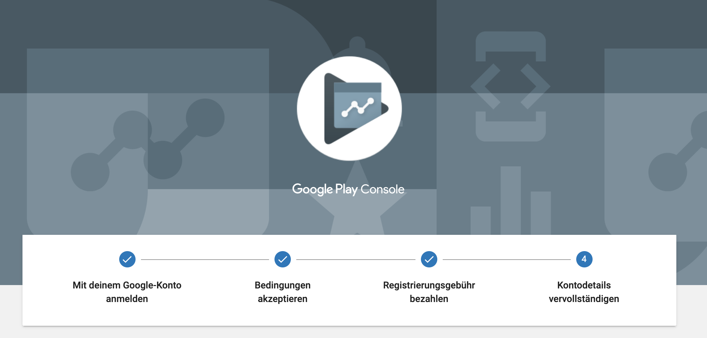
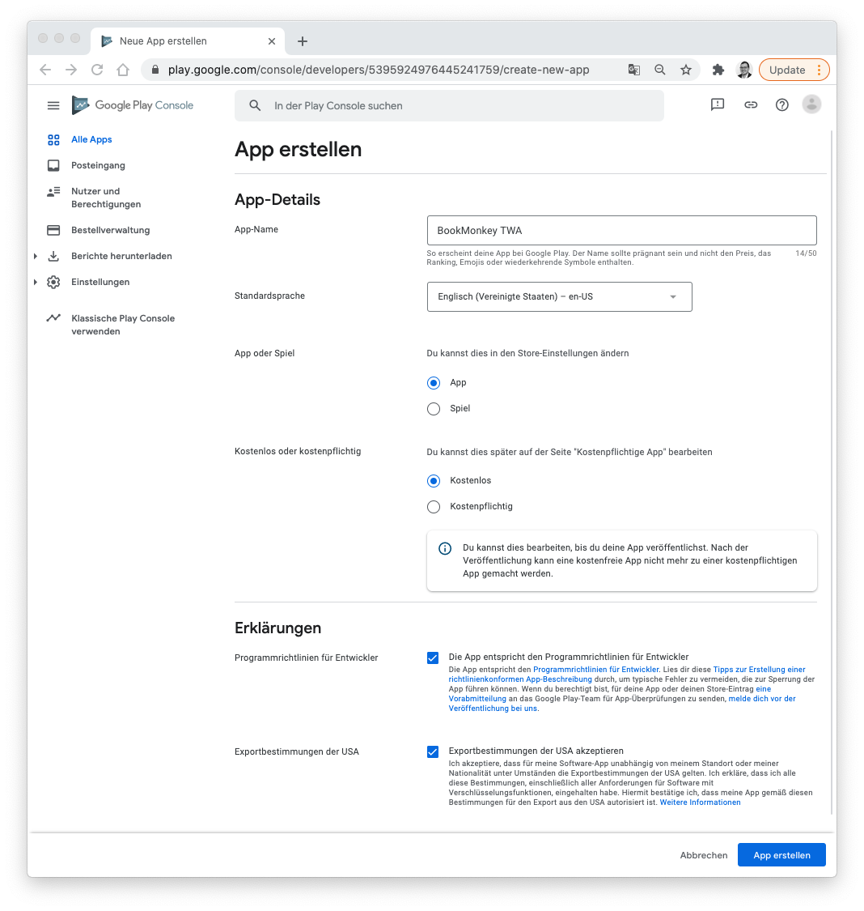
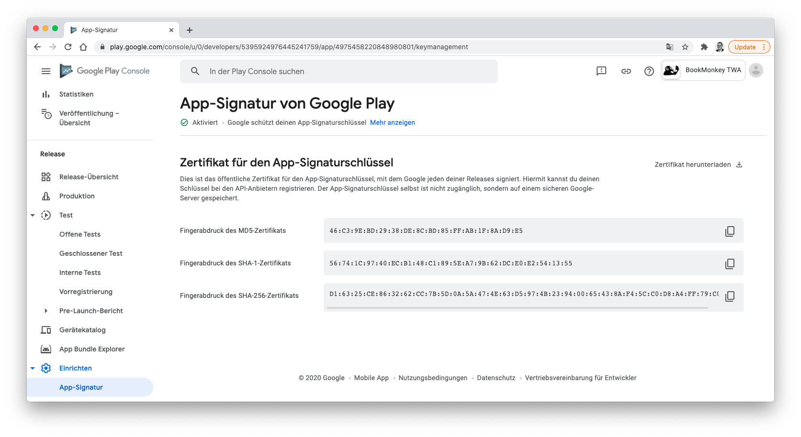
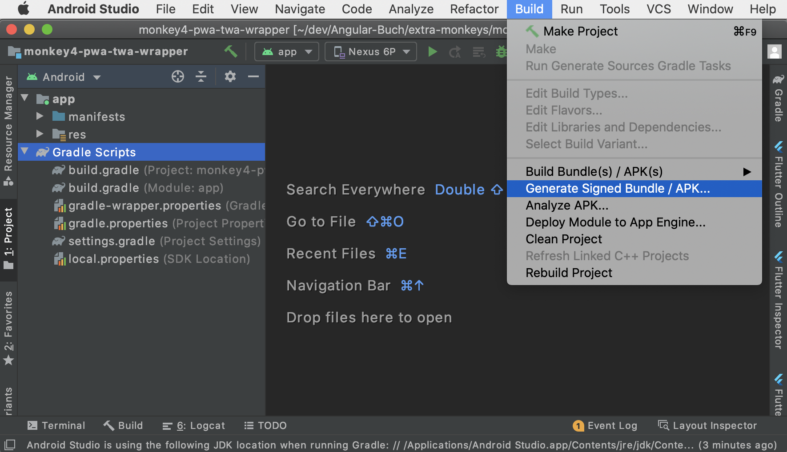

Progressive Web Apps sind in den letzten Jahren immer populärer geworden.
Sie erlauben es uns, Webanwendungen auf dem Home-Bildschirm des Smartphones zu installieren und wie eine nativ installierte App zu benutzen.
Mit einer PWA können wir Daten mithilfe eines Service Workers cachen, um die Anwendung auch offline zu verwenden.
Weiterhin kann eine PWA im Hintergrund Push-Benachrichtigungen vom Server empfangen und anzeigen.

> Wenn Sie noch keine Erfahrung mit der Umsetzung einer Angular-App als PWA haben, schauen Sie sich unseren Blog-Post [_"Mach aus deiner Angular-App eine PWA"_](blog/2019-07-progressive-web-app) an oder werfen Sie einen Blick in unser [_Angular-Buch_](angular-buch.com), wo wir dieses Thema detailliert erläutern.

Nach der Entwicklung einer PWA bleibt jedoch eine Hürde bestehen: Nutzer der Anwendung müssen die URL kennen, über welche die PWA abrufbar ist und installiert werden kann.
Viele Smartphone-Nutzer sind jedoch einen anderen Weg gewohnt, um eine App zu installieren:
Sie suchen danach in einem App Store wie dem _Google Play Store_ unter Android oder _App Store_ unter iOS.

In diesem Blogpost wollen wir Ihnen zeigen, wie Sie Ihre PWA auf einfachem Weg in den Google Play Store für Android bringen können, ohne eine echte Android-App mit Webview zu entwickeln, die lediglich eine Website aufruft.

> **Zur Zeit gibt es noch keine Möglichkeit, PWAs in Apples App Store zu deployen.**

---

Inhalt:
- [Trusted Web Activities vs. Webview-Integration](#trusted-web-activities-vs-webview-integration)
- [TWAs im Detail](#twas-im-detail)
- [Eine PWA als TWA in den Android Store bringen](#eine-pwa-als-twa-in-den-android-store-bringen)
  - [Einen Android Developer Account registrieren](#einen-android-developer-account-registrieren)
  - [Die Android-App in der Google Play Console erstellen](#die-android-app-in-der-google-play-console-erstellen)
  - [Die App-Signatur erzeugen](#die-app-signatur-erzeugen)
  - [Den App-Signaturschlüssel in der PWA hinterlegen](#den-app-signaturschlüssel-in-der-pwa-hinterlegen)
  - [Die TWA mit der Bubblewrap CLI erzeugen](#die-twa-mit-der-bubblewrap-cli-erzeugen)
  - [Die signierte App bauen](#die-signierte-app-bauen)
  - [Mit der Bublewrap CLI](#mit-der-bublewrap-cli)
  - [Mit Hilfe von Android Studio](#mit-hilfe-von-android-studio)
  - [Die App über die Google Play Console veröffentlichen](#die-app-über-die-google-play-console-veröffentlichen)

---

## Trusted Web Activities vs. Webview-Integration

Um PWAs als Android-App bereitzustellen, benötigen wir eine Art App-Wrapper, der schließlich die PWA aufruft und somit unsere Webanwendung darstellen kann.

In der Vergangenheit wurde dies oft durch Android-Apps umgesetzt, die lediglich einen sogenannten [_WebView_](https://developer.android.com/reference/android/webkit/WebView) integrieren.
Hinter diesem Feature versteckt sich ein integrierter Webbrowser in der Android-App, der lediglich den Inhalt der Website darstellt.
Dieser Weg funktioniert für eine Vielzahl von Websites, gerät jedoch an seine Grenzen, wenn es sich bei der Website um eine PWA handelt.
Der Grund: In einem Webview funktionieren die essenziellen Service Worker nicht.
Somit können wir Features wie die Offlinefähigkeit nicht einfach in die Anwendung integrieren.
Weiterhin birgt ein Webview ein gewisses Sicherheitsrisiko, weil lediglich die URL den Inhalt der Anwendung bestimmt und keinerlei Überprüfung des tatsächlichen Contents stattfindet.
Wird also beispielsweise eine Website _"gekapert"_, bekommt der Nutzer ggf. den Inhalt einer falschen Seite angezeigt.

Bei einer TWA hingegen wird die PWA lediglich so erweitert, dass sie als Android-App direkt deployt werden kann.
Über einen Sicherheitsschlüssel kann verifiziert werden, dass die aufgerufene URL zur App passt.

## TWAs im Detail

Die Grundidee einer TWA ist schnell erklärt: Statt einer vollumfänglichen Android-App, die einen Browser implementiert und eine URL aufruft, wird bei einer TWA leidglich die PWA um eine App-Schicht erweitert, sodass sie im Google Play Store veröffentlicht werden kann.
Es muss also auch kein eingebetteter Browser in der App integriert werden, sondern es wird auf den vorhandenen Google Chrome Browser zurückgegriffen.
Voraussetzung hierfür ist, dass auf dem Android-Gerät die Version 72 oder höher von Google Chrome verfügbar ist.
Beim Öffnen der PWA wird Chrome mit der hinterlegten URL geöffnet, und es werden sämtliche UI-Elemente des Browsers ausgeblendet.
Im Prinzip passiert also genau das, was auch geschieht, wenn wir eine PWA über die Funktion _"Add To Homescreen"_ auf Smartphone speichern, jedoch in Form einer App, die über den Google Play Store gefunden und installiert werden kann.
Somit bleiben Features wie Push-Benachrichtigungen, Hintergrundsynchronisierungen, Autofill bei Eingabeformularen, Media Source Extensions oder die Sharing API vollumfänglich erhalten.
Ein weiterer Vorteil einer solchen TWA ist, dass Session-Daten und der Cache im Google Chrome geteilt werden.
Haben wir uns also beispielsweise bei unserer Web-Anwendung zuvor im Browser angemeldet, so belibt die Anmeldung in der Android-App (TWA) bestehen.

Die Bezeichnung "Trusted Web Activity" lässt bereits darauf schließen: TWAs sind _trusted_, also vertraulich.
Durch eine spezielle Datei, die mit der Webanwendung ausgeliefert wird und die einen Fingerprint enthält, kann sichergestellt werden, dass die Anwendung vertrauenswürdig ist, und der Inhalt kann somit sicher geladen werden.

## Eine PWA als TWA in den Android Store bringen

Genug der Theorie -- wir wollen nun erfahren, wie wir eine PWA im Android Store als TWA bereitstellen können.

Dafür müssen wir folgende Schritte durchführen:

- Einen Android Developer Account registieren
- Die Android-App in der Google Play Console erstellen
- Die App-Signatur erzeugen
- Den App-Signaturschlüssel in der PWA hinterlegen
- Die TWA mit der *Bubblewrap CLI* erzeugen
- Die signierte App bauen
- Die App über die Google Play Console veröffentlichen

Wir wollen als Grundlage für dieses Beispiel die Angular-Anwendung _BookMonkey_ aus dem Angular-Buch verwenden, die bereits als PWA vorliegt.
Möchten Sie die Schritte selbst nachvollziehen, können Sie die Anwendung über GitHub herunterladen:

[https://github.com/book-monkey4/book-monkey4-pwa](https://github.com/book-monkey4/book-monkey4-pwa)

```
git clone https://ng-buch.de/bm4-pwa.git
```

Die Online-Version der PWA können Sie unter der folgenden URL abrufen:

[https://bm4-pwa.angular-buch.com/](https://bm4-pwa.angular-buch.com/)

Weiterhin benötigen Sie für die Erstellung der TWA folgende Voraussetzungen auf dem Entwicklungssystem:
- [Java SDK 8.0](https://openjdk.java.net/install/)
- [Android SDK (vorzugsweise Android Studio inkl. SDK)](https://developer.android.com/studio)
- [Node.js 10.0 oder höher](https://nodejs.org)

### Einen Android Developer Account registrieren

> Sofern Sie bereits einen Account für die _Google Play Console_ besitzen, können Sie diesen Schritt überspringen.

Um eine App im Google Play Store einzustellen, benötigen wir zunächst einen Account für die _Google Play Console_.
Den Account können Sie über den folgenden Link registrieren:

[https://play.google.com/apps/publish/signup](https://play.google.com/apps/publish/signup)

Bei der Registrierung wird eine einmalige Registrierungsgebühr in Höhe von 25 USD erhoben. Diese Gebühr gilt für sämtliche Apps, die Sie mit dem hinterlegten Google-Account registrieren wollen.



### Die Android-App in der Google Play Console erstellen

Nach der Registierungs müssen wir uns in der [_Google Play Console_ einloggen](https://play.google.com/apps/publish).
Anschließend können wir über den Menüpunkt _"Alle Apps"_ mit dem Button _"App erstellen"_ eine neue Anwendung anlegen.



Danach gelangen wir zur Detailkonfiguration für die neue Android-App.


Um nun eine Android-App zu veröffentlichen, müssen wir uns durch alle Schritte arbeiten, die links im Menü mit einem ✅-Icon gekennzeichnet sind.

Füllen Sie hierfür als Erstes alle obligatorischen Felder unter dem Menüpunkt _"Store-Eintrag"_ aus, und laden Sie die notwendigen Icons und Screenshots für die Anwendung hoch.
Diese können Sie im Nachhinein auch noch bearbeiten.
Wichtig ist zunächst, dass alle Pflichtfelder gefüllt sind.
Anschließend klicken Sie auf _"Entwurf speichern"_.

Als Nächstes arbeiten Sie sich durch den Menüpunkt _"Einstufung des Inhalts"_.
Hier müssen Sie einen Fragebogen zu den Inhalten Ihrer App ausfüllen.
Anhand der Fragen wird ermittelt, für welche Personenkreise und Altersgruppen die App freigegeben werden kann.

Haben Sie hier alle Angaben ausgefüllt und gespeichert, gehen Sie zum Schritt _"App-Inhalte"_.
Auch hier müssen Sie zunächst alle Schritte abarbeiten und beispielsweise einen Link zur Datenschutzerklärung angeben, Angaben dazu machen, ob die App Werbebanner enthält und die Zielgruppe definieren.

Bevor wir nun ein Release erstellen können, müssen wir noch den Menüpunkt _"Preisgestaltung und Vertrieb"_ abarbeiten.
Hier geben Sie an, ob es sich um eine kostenfreie oder kostenpflichtige App handeln soll und welchen Preis die App haben soll.
Sofern die App kostenflichtig ist, benötigen Sie noch ein Händlerkonto, das Sie direkt über diese Seite einrichten können.
Im unteren Teil der Seite müssen Sie schließlich noch defineiren, in welchen Ländern die App im Google Play Store verfügbar sein soll.
Hier müssen Sie mindestens ein Land auswählen.
Weiterhin müssen Sie am Ende der Seite noch den Richtlinien für Inhalte und den Exportbestimmungen der USA zustimmen.

Okay, wir sollten nun bei allen Menüpunkten bis auf _"App Releases"_ einen grünes Icon "✅" sehen.
Im nächsten Schritt benötigen wir eine App-Signatur, die wir über die Erzeugung eines ersten Releases erhalten.

### Die App-Signatur erzeugen

Klicken wir auf den Menüpunkt _"App-Signatur"_, sehen wir zunächst nur einen Hinweis, dass wir zunächst ein Release benötigen.
Um dieses anzulegen gehen wir auf das Menü _"App Releases"_.
Hier müssen wir zunächst einen neuen Track erstellen.
Tracks können verschiedene Ausprägungen haben:

- **Produktions-Track**: Releases die für jeden Nutzer im Google Play Store bereitgestellt werden
- **Offener Track**: Releases die für jeden Nutzer im Google Play Store bereitgestellt werden aber als Vorab-Release (Beta Release) gekennzeichnet sind. Offene Tracks können auch auf eine bestimmte Anzahl von Nutzer begrenzt werden.
- **Geschlossener Track**: Releases, die nur bestimmten Personen zum Download als Vorab-Release (Alpha Release) zur Verfügung stehen.
- **Interner Test-Track**: Releases, die zum Test für einen bestimmten Personenkreis besipielsweise über einen Link bereitgestellt werden können.

In unserem Szenario wollen wir unsere App direkt bis in den Google Play Store bringen, um zu verifizieren, dass diese auch tatsächlich von allen Nutzern gefunden und installiert werden können.
Hierfür nutzen wir den offenen Track und erstellen ein Beta-Release.
Dafür klicken wir im Abschnitt _"Offener Track"_ auf _"Verwalten"_.


Auf der nächsten Seite klicken wir auf _"Release Erstellen"_.
Anschließend gelangen wir in den Abschnitt zur Erzeugung des _"App-Signaturschlüssels"_.
Hier klicken wir auf _"Weiter"_ um den Schlüssel zu aktivieren.


Bevor wir nun unser Beta-Release veröffentlich müssen wir den erzuegten Schlüssel mit unserer PWA verknüpfen und die TWA erzeugen um sie anschließend in die Google Play Console zu laden.

### Den App-Signaturschlüssel in der PWA hinterlegen

Wir verlassen zunächst wieder den Menüpunkt zur Erzeugung des Releases und gehen ins Menü _"App-Signatur"_.
Hier kopieren wir uns den Fingerabdruck des SHA-256-Zertifikats in die Zwischenablage.



Dieser Fingerabdruck stellt später sicher, dass beim Aufruf der PWA durch unsere TWA verifiziert werden kann, dass die Anwendung _trusted_ - also verifiziert ist.

Um den Fingerabdruck aufspüren zu können, müssen wir diesen über die spezielle Datei `assetlinks.json` bereitstellen.
Weiterhin muss die Datei und ihr Inhalt über die spezielle URL `https://my-app.com/.well-known/assetlinks.json` aufrufbar sein.

Dafür erzeugen wir in unserem Angular-Workspace ein neues Verzeichnis `.well-known` unter `src`.
Darin legen wir die Datei `assetlinks.json` mit dem folgenden Inhalt an:

```json
[
  {
    "relation": ["delegate_permission/common.handle_all_urls"],
    "target": {
      "namespace": "allfront",
      "package_name": "com.angular_buch.book_monkey4",
      "sha256_cert_fingerprints": [
        "22:BD:55:D1...D1:79:D1:13"
      ]
    }
  }
]
```

Als `package_name` legen wir die Anwendungs-ID fest, die im Google Play Store eindeutig sein muss und genau auf eine App zeigt.
Die ID wird in der Regel aus einer Domain gebildet und rückwärts gelistet.
Sie muss mindestens einen Punkt enthalten, Zeichen hinter einem Punkt dürfen nur Buchstaben sein und die gesamte ID darf lediglich Alphanumerische Zeichen enthalten.
Zeichen wie "`-`" sind nicht erlaubt.
Alle Regeln zur Definition einer validen ID, können der [Android Entwicklerdokumentstion](https://developer.android.com/studio/build/application-id) entnommen werden.

Wie erkenntlich ist, müssen wir weiterhin den kopierten App-Signaturschlüssel unter `sha256_cert_fingerprints` eintragen.

> Achtung kopieren Sie den Fingerprint von der Google Play Console, wird ggf. der Präfix "`SHA256: `" mit kopiert. Dieser muss beim Einfügen weggelassen werden.

Jetzt müssen wir Angular noch beibringen, dass der relative URL-Pfad `/.well-known/assetlinks.json` nicht durch den Angular-Router behandelt und umgeleitet wird, sondern, dass sich dahinter ein statisches Asset verbrigt, welches direkt über die URL aufrufbar sein soll.

Dafür bearbeiten wir den Abschnitt `build` innerhalb des Projekt-Aschnitts unserer Datei `angular.json`.
Dort geben wir an, dass alle Dateien unter `src/.well-known` über den relativen Pfad `/.well-known/` bereitgestellt werden sollen:

```json
{
  // ...
  "projects": {
    "book-monkey": {
      // ...
      "architect": {
        "build": {
          // ...
          "options": {
            // ...
            "assets": [
              // ...
              {
                "glob": "**/*",
                "input": "src/.well-known/",
                "output": "/.well-known/"
              }
              // ...
            ],
            // ...
          },
          // ...
        },
        // ...
      },
      // ...
    },
    // ...
  },
  // ...
}       
```

Wir überprüfen das Ergebnis am besten indem wir einen Prod-Build ausführen und einen einfachen Webserver starten:

```bash
ng build --prod
cd dist/book-monkey
npx http-server
```

Rufen wir nun die URL `http://localhost:8080/.well-known/assetlinks.json` im Browser auf, sehen wir, dass unsere Datei `assetlinks.json` dargestellt wird:


War der Test erfolgreich, können wir unsere PWA deployen.
Wichtig ist, dass diese zwingend per _https_ asugeleifert werden muss.

> Achtung! Nutzen Sie beispielsweise Github Pages zur Auslieferung ihrer Anwendung, so müssen Sie vor dem Deployment im Dist-Verzeichnis (`dist/book-monkey`) eine Datei `_config.yml` mit dem Inhalt `include: [".well-known"]` anlegen, da alle Verzeichnisse beginnend "`.`" per Default [von Github Pages ignoriert werden](https://github.com/keybase/keybase-issues/issues/366#issuecomment-38749201). Diesen Schritt integrieren Sie am besten in ihre Deployment-Pipelin

Überprüfen Sie nach dem Deployment am besten noch einmal, ob Sie die URL `http://mydomain/.well-known/assetlinks.json` aufrufen können.
In unserem Fall wäre das: [`https://bm4-pwa.angular-buch.com/.well-known/assetlinks.json`](https://bm4-pwa.angular-buch.com/.well-known/assetlinks.json).

## Die TWA mit der Bubblewrap CLI erzeugen

Wir haben nun unsere PWA für den Konsum der TWA vorbereitet und alle nötigen Vorbereitungen in der Google Play Console getroffen.
Als nächstes wollen wir die Android-App erstellen, die unsere PWA in Form einer TWA aufruft und als eigenständige App kapselt.

Hierfür nutzen wir die [_Bubblewrap CLI_](https://www.npmjs.com/package/@bubblewrap/cli), die genau zu diesem Zweck geschaffen wurde.
Wir können diese direkt als NPM Paket über `npx` aufrufen und die Anwendung erzeugen lassen.
Anschließend führt uns der interaktive Wizard durch das Setup indem wir einge Fragen beantworten müssen, auf die wir anchfolgend weiter eingehen werden.

```bash
mkdir monkey4-pwa-twa-wrapper
cd monkey4-pwa-twa-wrapper
npx @bubblewrap/cli init --manifest https://bm4-pwa.angular-buch.com/manifest.json
```

Nutzen wir die Bubblewrap CLI das erste Mal, so werden wir in den ersten zwei Schritten nach den Verzeichnissen für das [Java OpenJDK](https://openjdk.java.net/) und das [AndroidSDK](https://developer.android.com/studio) gefragt.
Hier geben wir die Pfade zu den entsprechenden Verzeichnissen an:

```bash
? Path to the JDK: /Library/Java/JavaVirtualMachines/adoptopenjdk-8.jdk
? Path to the Android SDK: /Users/my-user/Library/Android/sdk
```

> Diese Angaben werden für spätere Installationen in der Datei `~/.llama-pack/llama-pack-config.json` gespeichert und können bei Bedarf angepasst werden.

Im nächsten Schritt liest die Bubblewrap CLI das Web App Manifest unserer PWA aus und stellt uns einige Fragen zur Bezeichnung der App, hinterlegten Icons und Pfaden.
Diese werden in der Regel schon korrekt ausgelesen und müssen von uns nicht weiter angepasst werden:

```bash
init Fetching Manifest:  https://bm4-pwa.angular-buch.com/manifest.json
? Domain being opened in the TWA: bm4-pwa.angular-buch.com
? Name of the application: BookMonkey 4 PWA
? Name to be shown on the Android Launcher: BookMonkey
? Color to be used for the status bar: #DB2828
? Color to be used for the splash screen background: #FAFAFA
? Relative path to open the TWA: /
? URL to an image that is at least 512x512px: https://bm4-pwa.angular-buch.com/assets/icons/icon-512x512.png
? URL to an image that is at least 512x512px to be used when generating maskable icons undefined
? Include app shortcuts?
  Yes
? Android Package Name (or Application ID): com.angular_buch.bm4_pwa.twa
```

Nun werden wir nach dem Pfad des Schlüssels zur Signierung der App gefragt.
Haben wir hier noch keinen erzeugt, werden wir darauf hingewiesen und können einen neuen Schlüssel anlegen.
Dafür müssen wir unseren Namen und Informationen zur Firma und Abteilung hinterlegen.
Weiterhin müssen wir einen Ländercode angeben (in unserem Fall "`DE`" für Deutschland).
Weiterhin müssen wir ein Passwort für den _Key Store_ und eines für den einzelnen _Key_ der Anwendung hinterlegen.
Dieses benötigen wir später beim Build und der Signierung der App erneut.

```bash
? Location of the Signing Key: ./android.keystore
? Key name: android
...
? Signing Key could not be found at "./android.keystore". Do you want to create one now? Yes
? First and Last names (eg: John Doe): John Doe
? Organizational Unit (eg: Engineering Dept): Engineering Dept
? Organization (eg: Company Name): My Company
? Country (2 letter code): DE
? Password for the Key Store: [hidden]
? Password for the Key: [hidden]
keytool Signing Key created successfully
init
init Project generated successfully. Build it by running "@bubblewrap/cli build"
```

Im Ergebnis sollten wir folgende Struktur erhalten:


Im Prinzip sind wir damit auch schon fertig.
Wir müssen nun noch die fertige Android-App (`*.apk`-Datei) erzeugen.

Das Ergebnis der TWA Generierung können Sie auch in folgendem Repository nachvollziehen:

[https://github.com/book-monkey4/book-monkey4-pwa-twa-wrapper](https://github.com/book-monkey4/book-monkey4-pwa-twa-wrapper)

## Die signierte App bauen

Wir können unsere signierte Android-App entwerder direkt mit Hilfe der Bubblewrap CLI bauen oder wir nutzen hierfür Android Studio.

### Mit der Bublewrap CLI

Nutzen wir die Bubblewrap CLI, so rufen wir das `build` Kommando auf.
Wir müssen nun zunächst das von uns vergebene Passwort für den Key Store und anschließend das Passwort für den konkreten Key eingeben:

```bash
npx @bubblewrap/cli build
? KeyStore password: ********
? Key password: ********
build Building the Android-App...
build Zip Aligning...
build Checking PWA Quality Criteria...
build 
build Check the full PageSpeed Insights report at:
build - https://developers.google.com/speed/pagespeed/insights/?url=https%3A%2F%2Fbm4-pwa.angular-buch.com%2F
build 
build 
build Quality Criteria scores
build Lighthouse Performance score: ................... 80
build Lighthouse PWA check: ........................... NO
build 
build Web Vitals
build Largest Contentful Paint (LCP) .................. 3.7 s
build Maximum Potential First Input Delay (Max FID) ... 391 ms
build Cumulative Layout Shift (CLS) ................... 0.00
build 
build Other scores
build Lighthouse Accessibility score................... 67
build 
build Summary
build Overall result: ................................. FAIL
build WARNING PWA Quality Criteria check failed.
build Signing...
build Signed Android-App generated at "./app-release-signed.apk"
build Digital Asset Links file generated at ./assetlinks.json
build Read more about setting up Digital Asset Links at https://developers.google.com/web/android/trusted-web-activity/quick-start#creating-your-asset-link-file
```

Wenn wir keinen Fehler erhalten, sollte sich die fertige signierte App im Hauptverzeichnis befinden und `app-release-signed.apk` heißen.

Vereinzelt kann es dazu kommen, dass wir eine Fehlermeldung wie die folgende erhalten:

```
UnhandledPromiseRejectionWarning: Error: Error calling the PageSpeed Insights API: Error: Failed to run the PageSpeed Insight report
```

In diesem Fall schlägt die Analyse der App fehl, weil beispielsweise die Website gerade nicht erreichbar ist. Wir können den Build erneut aufrufen und das Flag `--skipPwaValidation` einfügen.
In diesem Fall wird die Überprüfung der PWA vor Erzeugung der App als TWA übersprungen.

```bash
npx @bubblewrap/cli build --skipPwaValidation
? KeyStore password: ********
? Key password: ********
build Building the Android-App...
build Zip Aligning...
build Signing...
build Signed Android-App generated at "./app-release-signed.apk"
build Digital Asset Links file generated at ./assetlinks.json
build Read more about setting up Digital Asset Links at https://developers.google.com/web/android/trusted-web-activity/quick-start#creating-your-asset-link-file
```

Kommt es zu dem nachfolgenden Fehler, prüfen Sie bitte den Pfad unter `jdkPath` in der Datei `~/.llama-pack/llama-pack-config.json`.
Dieser sollte auf ihr Hauptverzeichnis vom Java JDK 8 zeigen.
Alternativ können Sie den Build mithilfe von Android Studio anstoßen.

```bash
cli ERROR Command failed: ./gradlew assembleRelease --stacktrace
```

### Mit Hilfe von Android Studio

Wir öffnen bei dieser Variante zunächst das Projektverzeichnis in Android Studio.
Nun warten wir zunächst ab, bis der automatische Gradle-Build nach dem Öffnen des Projektes durchgelaufen ist.
Den Fortschritt können wir unten rechts in Android Studio begutachten.
Anschließend klicken wür im Menü "_Build_" auf "_Generate Signed Bundle / APK_".



Wir wählen hier den Punkt "_APK_" aus und klicken auf "_Next_".


Im nächsten Schritt wählen wir den erstellten Keystore (`android.keystore`) aus dem Projektverzeichnis aus und geben das von uns festgelegte Passwort ein.
Alternativ können wir auch einen neuen Keystore erstellen.
Anschließend können wir aus dem Keystore den _"Key alias"_ auswählen (`android`).
Auch hier müssen wir das Passwort eingeben, welches wir für den konkreten Key vergeben hatten.
Haben wir alle Angaben korrekt getätigt, gehen wir weiter mit "_Next_".


Im nächsten Schritt wählen wir bei der Build Variante _release_ aus und setzen die beiden Checkboxen bei "_V1 (Jar Signature)_" und "_V2 (Full APK Signature)_".
Anschließend können wir die Erzeugung mit "_Finish_" starten.


Dier erzeugte APK befindet sich nun unter `./app/release/app-release.apk`.

> Kommt es beim Erzeugen der signierten APK zu einem Fehler, kann dies ggf. an einem defekten / falschen Keystore liegen. Versuchen Sie in diesem Fall einen neuen Keystore während der vorherigen Schritte zu erzeugen.

## Die App über die Google Play Console veröffentlichen

Im letzten Schritt müssen wir unsere signierte und erzeugte Android-App in Form einer TWA noch in der Google Play Console bereitstellen und veröffentlichen.
Dazu gehen wir in der Google Play Console in das Menü "_App-Releases_" und öffnen unser zuvor bereits vorbereitetes Beta-Release im Abschnitt "_Offener Track_".
Hier klicken wir nun auf "_Release Bearbeiten_".


Im nächsten Schritt können wir nun unsere erzeugte und signierte Android-App (APK) hochladen.
Weiterhin geben wir eine Versionsnummer und eine Beschreibung zum Release an.
Haben wir alles ausgefüllt, klicken wir auf "_überprüfen_".


Jetzt haben wir es fast geschafft.
Das Beta-Release wurde erstellt.
Auf den nächsten Seite können wir diese nun veröffentlichen.


Haben wir diesen Schritt erledigt, ändert sich unser Menü auf der linken Seite ein wenig und wir können unter "_Übersicht_" den aktuellen Status zur Veröffentlichung der Android-App einsehen.
Bis die App tatsächlich veröffentlicht und freigegeben wird, können ggf. ein paar Tage vergehen.


Geschafft! Wir haben nun erfolgreich unsere Angular PWA in einer Android-App in Form einer TWA integriert und diese im Google Play Store veröffentlicht.
Nun müssen wir nur noch auf die Freigabe warten und wir können unsere App im Store finden und installieren.

<!--
TODO: Bild von veröffentlichter App in Play Store
-->

**Viel Spaß wünschen
Johannes, Danny und Ferdinand**

<small>**Titelbild:** TODO</small>
