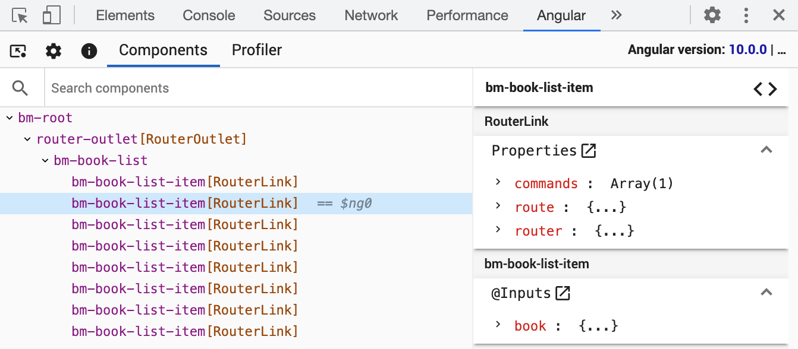
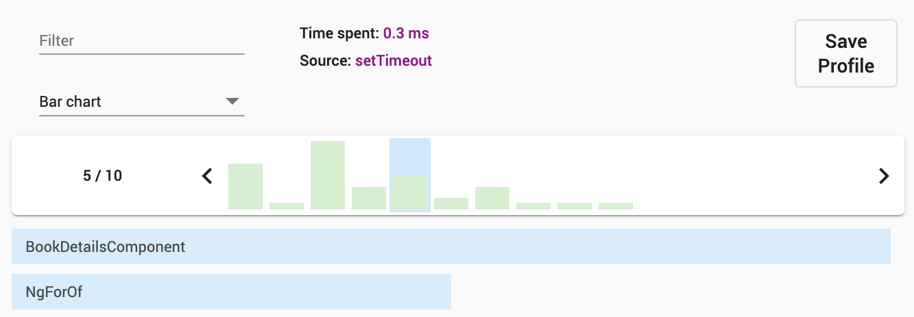

Am 12.05.2021 wurde die neue Major-Version **Angular 12.0** veröffentlicht – ein halbes Jahr nach dem [Release von Angular 11](/blog/2020-11-angular11).

In diesem Artikel stellen wir wieder die wichtigsten Neuerungen vor.
Die neue Version bringt einige wenige Breaking Changes mit sich, die aber wie üblich mit dem Befehl `ng update` automatisch migriert werden können.

Die offizielle Ankündigung zum neuen Release mit allen Features finden Sie im [Angular-Blog](https://blog.angular.io/angular-v12-is-now-available-32ed51fbfd49).

<!--
> **Die Update-Infos für neuere Versionen von Angular finden Sie in separaten Blogartikeln. Wenn Sie das Update durchführen möchten, lesen Sie bitte alle Artikel in der gegebenen Reihenfolge.**
> * [Angular XX ist da!](/blog/yyyy-mm-slug)
-->

## Update auf Angular 12

Um von einem Projekt mit Angular 11 auf die neue Major-Version 12 zu updaten, führen Sie in Ihrem Projekt den folgenden Befehl aus:

```bash
ng update @angular/cli @angular/core
```

Im *Angular Update Guide* unter [update.angular.io](https://update.angular.io/#11.0:12.0) können Sie alle Migrationsschritte im Detail nachvollziehen und die Migration vorbereiten.

## Production-Build by default

In einem neuen Projekt mit Angular 12 wird für den Befehl `ng build` nun automatisch ein Production-Build ausgeführt.
Zuvor musste der Produktivmodus mit der Option `--prod` immer explizit aktiviert werden.
Ist ein Build mit den Development-Einstellungen gewünscht, muss diese Konfiguration beim Build direkt angegeben werden.
Der Entwicklungswebserver mit `ng serve` verwendet weiterhin standardmäßig den Entwicklungsmodus

```bash
# Production Build
ng build

# Development Build
ng build --configuration=development

# Development Build
ng serve
```

Bei bestehenden Angular-Projekten sind von dieser Änderung nicht direkt betroffen. Es findet zunächst keine automatische Migration statt. Die Build-Konfigurationen in der Angular CLI bleiben wie zuvor konfiguriert.
Bei Bedarf können die Konfigurationen nach dem regulären Update ebenfalls migriert werden:

```bash
ng update @angular/cli --migrate-only production-by-default
```

## Strict Mode by default

In neuen Angular-Projekten ist ab sofort standardmäßig der Strict Mode aktiviert. Bestehende Projekte sind von dieser Änderung ebenso nicht direkt betroffen.

Zum Release von Angular 10 vor einem Jahr haben wir bereits einige Details zum Strict Mode [im Blog veröffentlicht](/blog/2020-06-angular10#setup-mit-strikten-compiler-optionen) veröffentlicht.
In der [Angular-Dokumentation](https://angular.io/guide/strict-mode) finden Sie außerdem eine ausführliche Beschreibung.
Unter Umständen erfordert der Strict Mode einige Anpassungen in Ihrem Code.
Wir empfehlen Ihnen, den Strict Mode zu aktivieren, um von der besseren Typisierung zu profitieren.

Für den BookMonkey ergeben sich einige Änderungen, die wir in Kürze in einem separaten Blogartikel zusammenfassen werden.


## Angular DevTools

Angular verfügt nun über eine offizielle Browser-Extension für Entwickler:innen: die **Angular DevTools**!
Die neuen Entwicklungswerkzeuge helfen beim Debuggen und Profilen von Angular-Anwendungen und ersetzen die ältere Extension [**Augury**](https://augury.rangle.io/).
Die DevTools sind in Zusammenarbeit mit dem langjährigen Partner rangle.io entstanden, aus dessen Feder auch Augury stammt.
Die Angular DevTools sind für alle Anwendungen ab Angular 9 geeignet, die die Ivy-Engine nutzen.
Lesen Sie mehr hierzu in der offiziellen [Angular Dokumentation auf angular.io](https://angular.io/guide/devtools).

**Die Angular Dev Tools sind als [Google Chrome Extension](https://chrome.google.com/webstore/detail/angular-devtools/ienfalfjdbdpebioblfackkekamfmbnh) verfügbar.**





## E2E-Testing mit Protractor

Zur Entwicklung von E2E-Tests wurde bisher in neuen Angular-Projekten stets das Tool *Protractor* mitgeliefert.
Seit der Einführung von Protractor 2013 haben sich jedoch andere Tools wie Cypress, TestCafe oder Playwright stark in der Community etabliert.
Seit Angular 12 setzen neue Angular-Projekte daher **nicht** mehr auf Protractor. Neue Anwendungen, die mit der Angular CLI v12 erzeugt werden, haben standardmäßig keinen `e2e`-Task mehr konfiguriert.
Damit haben Entwickler:innen ab sofort die freie Wahl eines Tools für E2E-Tests.
Der Support für Protractor wird voraussichtlich 2022 eingestellt. Wir empfehlen Ihnen daher, Protractor nach Möglichkeit nicht mehr zu verwenden.

Um zum Beispiel [Cypress](https://www.cypress.io/) für E2E-Tests zu nutzen, können Sie die offiziellen Schematics zur Einrichtung verwenden:

```ts
ng add @cypress/schematic
```


## Inline Critical CSS / Fonts CSS Inlining

Im neuen Major-Release wurde weiter an Performance-Optimierungen gearbeitet.
Dabei wurde unter anderem das ["Critical CSS Inlining"](https://angular.io/guide/workspace-config#styles-optimization-options) eingeführt.
Dieses Feature sorgt dafür, dass die wichtigsten CSS-Styles direkt als Teil der `index.html` geladen werden.
Damit wird die Zeit zum [_First Contentful Paint_](https://web.dev/first-contentful-paint) reduziert und die wahrgenommene Performance der Anwendung verbessert.

Eine weitere Optimierung gibt es für [blockierende Zugriffe auf Google Fonts](https://angular.io/guide/workspace-config#fonts-optimization-options):
Werden in der Anwendung Fonts aus dem Portfolio von Google Fonts verwendet, können diese zur Compile-Zeit automatisch heruntergeladen und direkt mit der Anwendung ausgeliefert werden.
Das verhindert, dass externe Zugriffe auf Fonts das Laden der Seite blockieren.
Um das Feature zu nutzen, muss eine Internetverbindung zu Google Fonts hergestellt werden.
Dies ist insbesondere beim Build in einer CI/CD-Pipeline zu beachten – ggf. müssen Sie hier entsprechende Proxy-Konfigurationen vornehmen.

Beide Features sind bei neuen Angular-Projekten standardmäßig aktiv, können aber bei Bedarf durch Konfigurationen in der `angular.json` deaktiviert werden.


## Nullish Coalescing in der Template Syntax

Mit Angular 12 wird die Template Syntax von Angular um einen Operator für *Nullish Coalescing* erweitert.
Damit lassen sich Prüfungen auf `null` und `undefined` stark vereinfachen.
Der Operator ist bereits aus TypeScript bekannt – darüber haben wir im [Blogpost zu Angular 9](https://angular-buch.com/blog/2020-02-angular9#nullish-coalescing-mit-typescript) berichtet.
Mit dem neuen Angular-Release ist die Syntax auch im Template verwendbar.

Mit Nullish Coalescing lässt sich ein Fallback definieren, falls der gegebene Ausdruck `null` oder `undefined` ist.
Üblicherweise müsste man eine solche Prüfung manuell formulieren.
Ein Beispiel: Der folgende Ausdruck soll eine Zahl ausgeben oder alternativ einen Fallback-Text liefern, falls keine Zahl gegeben ist:

```html
{{ yearsOfExperienceWithAngular !== null && yearsOfExperienceWithAngular !== undefined ? yearsOfExperienceWithAngular : 'Keine Angabe' }}
```

Mit Nullish Coalascing lässt sich der Ausdruck wie folgt vereinfachen:

```html
{{ yearsOfExperienceWithAngular ?? 'Keine Angabe' }}
```

Im Gegensatz zur Prüfung mit `||` ist mit Nullish Coalescing auch eine `0` ein valider Wert.


## Ivy Engine in Bibliotheken

Die Ivy-Rendering Engine, die bereits seit Angular 9 standardmäßig verwendet wird, wird nun auch in Library-Projekten stärker forciert.
Die veraltete *View Engine* wird mit kommenden Version 13 endgültig entfernt.
Autor:innen von Bibliotheken sollten ihre Releases also innerhalb der nächsten Monate auf Ivy umstellen.

Mehr Details zur Umstellung von Librarys und zu den Hintergründen finden Sie im [Blogpost "Upcoming improvements to Angular library distribution" auf angular.io](https://blog.angular.io/upcoming-improvements-to-angular-library-distribution-76c02f782aa4).
Diese Änderung ist für Sie vor allem interessant, wenn Sie Bibliotheken mit Angular-Bestandteilen auf NPM veröffentlichen.

## Deprecated: Support für den IE 11

Angular 12 wird die letzte Major-Version mit Support für den Internet Explorer 11 sein. Dadurch kann Angular von Altlasten bereinigt werden und in Zukunft auf modernere Web-APIs zurückzugreifen, die nur in aktuellen Browsern unterstützt werden.

Microsoft hat seit geraumer Zeit den Internet Explorer abgekündigt und dessen Weiterentwicklung zugunsten des neuen Browsers [Edge](https://www.microsoft.com/de-de/edge) eingestellt. Ab dem 15. Juni 2022 wird der Internet Explorer dann von Microsoft endgültig ["in Rente geschickt"](https://github.com/angular/angular/issues/41840). Wir begrüßen daher die Entscheidung des Angular-Teams sehr, die Unterstützung für den veralteten Internet Explorer ebenso einzustellen. Zuvor wurde die Entscheidung mit der Community über einen [RFC](https://github.com/angular/angular/issues/41840) diskutiert. 

## Weitere Neuigkeiten

Wir haben bis hierhin nur die wichtigsten Neuerungen aufgeführt. Eine ausführliche Aufstellung aller Änderungen finden Sie im [Changelog von Angular](https://github.com/angular/angular/blob/master/CHANGELOG.md).
Folgende Punkte sind zusätzlich erwähnenswert:

- **Webpack 5:** Unter der Haube verwendet Angular nun Webpack 5 als Build- und Bundling-Tool. Damit wird das neue Feature der [Module Federation](https://www.angulararchitects.io/en/aktuelles/the-microfrontend-revolution-part-2-module-federation-with-angular/) auch im Zusammenhang mit Angular unterstützt.
- **Validatoren `min`/`max`:** Verwendet man auf einem Input die Attribute `min` und `max` werden dadurch nun automatisch passende Validatoren aktiv. Bisher mussten diese Validatoren manuell auf das FormControl angewendet werden. Siehe [PR #39063](https://github.com/angular/angular/pull/39063)
- **`emitEvent` für Formulare:** Einige weitere Methoden auf FormControl, FormArray und FormGroup besitzen jetzt auch die Einstellung `emitEvent`. Damit kann konfiguriert werden, ob die Methode ein Event im Datenstrom `valueChanges` emittiert oder nicht. Neu ist diese Option zum Beispiel bei `FormArray.clear()`, `FormArray.removeAt()` oder `FormGroup.addControl()`. Siehe [PR #31031](https://github.com/angular/angular/pull/31031) 
- **Inline SASS/SCSS:** Es ist nun auch möglich, in den Inline-Styles eine Komponente SASS oder SCSS zu verwenden. Vorher konnte hier nur reines CSS notiert werden.
- **App-Initializer mit Observables:** Mit dem [`APP_INITIALIZER`](https://angular.io/api/core/APP_INITIALIZER) können Funktionen bereitgestellt werden, die beim Start der App ausgeführt werden. Bisher musste eine solche Funktion immer eine Promise zurückgeben. Nun ist es auch möglich, hier ein Observable zu returnen.
- **i18n Legacy Message IDs**: Seit Angular 11 wird für die autogenerierten IDs bei i18n ein neues Format genutzt. Mit dem neuen Release werden Migrationsskripte und eine [Anleitung zur Migration](https://angular.io/guide/migration-legacy-message-id) bereitgestellt, um das neue Format in der Anwendung zu nutzen.
- **Neue Optionen für `RouterLinkActive`**: Mit der Direktive `routerLinkActive` kann ein aktiver RouterLink automatisch mit einer CSS-Klasse versehen werden. Um den Aktivitätsstatus differenzierter zu bestimmen, wurden neue Optionen hinzugefügt. Siehe [PR #40303](https://github.com/angular/angular/pull/40303)

<hr>

Die Roadmap für die zukünftige Entwicklung von Angular wird regelmäßig in der Dokumentation veröffentlicht: [https://angular.io/guide/roadmap](https://angular.io/guide/roadmap).

Wir wünschen Ihnen viel Spaß mit Angular 12!
Haben Sie Fragen zur neuen Version, zum Update oder zu Angular? Schreiben Sie uns!

**Viel Spaß wünschen  
Danny, Ferdinand und Johannes**

<small>**Titelbild:** Antelope Island State Park, Utah, USA, April 2018</small>
