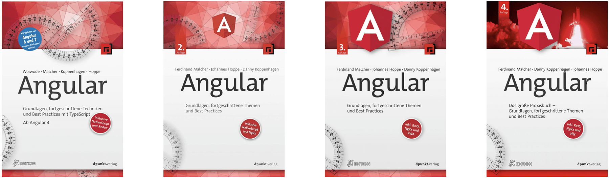

**Im Februar 2022 erscheint die vierte Auflage des deutschsprachigen Angular-Buchs! In diesem Artikel berichten wir über die Neuerungen im neuen Buch.**

Die Webplattform bewegt sich schnell, und so muss auch ein Framework wie Angular stets an neue Gegebenheiten angepasst werden und mit den Anforderungen wachsen.
In den sechs Jahren seit Veröffentlichung der ersten Auflage dieses Buchs haben sich viele Dinge geändert:
Es wurden Best Practices etabliert, neue Features eingeführt, und einige wenige Features wurden wieder entfernt.

Mit der neuen 4. Auflage haben wir die bislang größte und aufwendigste Überarbeitung gewagt:
Wir haben uns mehr als ein Jahr Zeit genommen, um das Konzept dieses Buchs zu überdenken und auch Ideen und Baustellen zu bearbeiten, auf die wir bei den früheren Auflagen nicht den Fokus gesetzt hatten.
Dabei haben wir mehr als 400 Tickets bearbeitet.

Alle Texte und Beispiele haben wir grundlegend überarbeitet und zum großen Teil neu verfasst.
Dabei haben wir uns auch nicht davor gescheut, ganze Abschnitte zu löschen oder unsere Ideen aus der Vergangenheit kritisch zu hinterfragen.

Es ist unser Ziel, einen umfassenden Einstieg in das Angular-Framework zu ermöglichen – und gleichzeitig ein **modernes und zeitloses Nachschlagewerk** zu schaffen.
Die Arbeit mit dem Buch dieser vierten Auflage lohnt sich daher auch für Leserinnen und Leser, die bereits eine der früheren Ausgaben besitzen.
Diesen "frischen Wind der Veränderung" haben wir auch auf dem Buchcover mit einem Motiv aus der Raumfahrt aufgegriffen.

Wir möchten Ihnen einen kurzen Überblick über die wichtigsten Neuerungen und Aktualisierungen der vierten Auflage geben.
Alle Inhalte haben wir auf die **Angular-Version 15** aktualisiert, sodass dieses Buch auch für die Arbeit mit den folgenden Versionen geeignet ist.

<!--<a class="btn btn-outline-primary cta__button index__cta mr-2 mb-2" role="button" target="_blank" href="https://angular-buch.com/assets/angular-buch.com_leseprobe_3.auflage.pdf">Kostenlose Leseprobe </a>-->
<a class="btn btn-primary cta__button mb-2" role="button" target="_blank" href="https://amzn.eu/d/8fgTIWL">4. Ausgabe jetzt vorbestellen</a>

## Neu in dieser Auflage

Wir haben das Buch neu strukturiert und das Beispielprojekt von Grund auf neu entwickelt.
Dabei haben wir die Schwerpunkte anders gesetzt und die Erkenntnisse aus unserer täglichen Arbeit mit Angular berücksichtigt.
Die Praxisteile sind nun leichtgewichtiger und behandeln ausschließlich die Umsetzung im Beispielprojekt.
Alle notwendigen Grundlagen werden jeweils in den umfassenden Theorieteilen behandelt.
Besonders wichtige Aspekte haben wir als Merksätze hervorgehoben.

Um die Navigation im Buch zu vereinfachen, haben wir die frühere Gruppierung in "Iterationen" entfernt.
Die Kapitel sind nun in einer **flacheren Struktur** organisiert.

Alle Inhalte und Beispiele sind auf dem **aktuellen Stand von Angular 15**.
Dabei behandeln wir auch umfassend die neuesten Themen aus der Angular-Welt:

* **Standalone Components** sind ein neuer Ansatz, um Komponenten, Pipes und Direktiven unabhängig von Angular-Modulen in der Anwendung zu verwenden. Wir betrachten dieses Konzept ausführlich in einem neuen Kapitel.
* Die Bausteine für die Formularverarbeitung mit *Reactive Forms* sind seit Angular 14 stark typisiert. Das Kapitel zu Reactive Forms behandelt diesen neueren Ansatz.
* Die neue **Funktion `inject()`** ist eine Alternative zur klassischen Constructor Injection, um Abhängigkeiten anzufordern. Sie kann in Zukunft ein elementarer Bestandteil der Arbeit mit Angular werden. Wir nutzen die Funktion an geeigneten Stellen, um die Verwendung zu vertiefen.
* **Interceptors, Guards und Resolvers** können als einfache Funktionen definiert werden. In früheren Versionen von Angular war dafür stets eine Klasse notwendig. Alle drei Bausteine werden nun ausführlich in der Theorie behandelt. Im Praxiskapitel zu den Guards implementieren wir auch einen funktionalen Guard, um einen Admin-Bereich abzusichern.
* Mit der **Directive Composition API** können Direktiven "von innen" auf ein Element angewendet werden. Auf dieses neue Konzept gehen wir im Kapitel zu Direktiven ausführlich ein.
* Viele weitere neue Features und Aspekte des Angular-Frameworks haben wir über das Buch hinweg berücksichtigt.

In JavaScript wurde ein neuer Weg zur **Initialisierung von Klassen-Propertys** eingeführt, der sich vom proprietären Verhalten der Programmiersprache TypeScript unterscheidet. Unter "Wissenswertes" haben wir dieses Thema im Detail betrachtet. Der gesamte Code in diesem Buch ist so zukunftssicher ausgelegt, dass er in beiden Varianten problemlos funktioniert.

Für das Beispielprojekt stellen wir erstmals ein **eigenes Stylesheet-Paket** bereit.
Zuvor hatten wir die Bibliothek *Semantic UI* genutzt, um die Anwendung zu gestalten.
Mit einem eigenen Stylesheet für unser Projekt verkürzen sich nun die HTML-Templates, und der Fokus liegt mehr auf der tatsächlichen Arbeit mit Angular.

Das Thema der **digitalen Barrierefreiheit** ist ein wichtiger Bestandteil dieser Auflage.
Neben einem neuen umfangreichen Kapitel zur Barrierefreiheit im Web haben wir auch das Beispielprojekt möglichst barrierearm umgesetzt.

**Angular-Module** sind ein wichtiger Baustein zur Strukturierung von Angular-Anwendungen. Anstatt das Thema erst zum Ende des Beispielprojekts zu behandeln, setzen wir nun schon frühzeitig im vierten Praxiskapitel darauf, die Anwendung in Module zu teilen.

Die **AsyncPipe** ist ein elementarer Bestandteil von Angular, um die Arbeit mit Observables und Datenströmen zu vereinfachen.
Obwohl wir Pipes erst in einem späteren Kapitel ausführlich behandeln, haben wir die AsyncPipe bereits im Kapitel zu RxJS aufgegriffen.
Im Beispielprojekt verwenden wir nun durchgehend die AsyncPipe, um Observables im Template aufzulösen. Damit orientieren wir uns an den etablierten Best Practices für Angular.

Die **Angular DevTools** sind ein umfangreiches Debugging-Werkzeug für Angular-Anwendungen. In einem neuen Powertipp gehen wir auf die Möglichkeiten dieser Browser-Extension ein.

Im Beispielprojekt setzen wir von vornherein auf das **Analysetool ESLint**, um einen einheitlichen Codestil zu ermöglichen und Best Practices technisch durchzusetzen.

Die Kapitel zur **Lokalisierung** und **Internationalisierung** haben wir thematisch getrennt und aus dem Beispielprojekt herausgelöst.
Am praktischen Beispiel erläutern wir dort nun auch die Möglichkeit, Übersetzungen zur Laufzeit der Anwendung zu laden.
Unsere Anwendung ist jetzt zunächst in englischer Sprache geschrieben und wird anschließend deutsch lokalisiert. In den früheren Ausgaben war die Reihenfolge umgekehrt.

Das Test-Framework Protractor wird nicht mehr weiterentwickelt. Im Kapitel zu Softwaretests setzen wir deshalb für die Oberflächentests nun auf das etablierte Framework **Cypress**. Außerdem erläutern wir die Möglichkeit, einzelne Komponenten mithilfe von Cypress zu testen (Cypress Component Test).

In Kapitel zum Framework NgRx gehen wir auf den Architekturansatz der **Facades** ein.
Außerdem betrachten wir das **Framework `@ngrx/component-store`**, mit dem wir den lokalen Zustand von Komponenten verwalten können.

Unter "Wissenswertes" geben wir einen kurzen Ausblick auf das populäre Build-Werkzeug **Nrwl Nx**, mit dem wir Monorepos effizient verwalten können.
Außerdem werfen wir einen Blick auf das Tool **Storybook**, um die Komponenten der Anwendung in einem Katalog darzustellen.

Wir haben umfangreiche Rückmeldungen von unseren Leserinnen und Lesern erhalten. Jede eingegangene Anmerkung haben wir ausführlich diskutiert und bestmöglich im Buch umgesetzt. Ein Fachbuch wie dieses lebt von dem **Feedback aus der Community**, und wir freuen uns, dass so viele Menschen ihre Anregungen zum Buch mitgeteilt haben.

Wir haben uns in dieser Auflage zum ersten Mal für eine **geschlechtsneutrale Ansprache** entschieden. Wir freuen uns, dass wir so zumindest einen kleinen Teil dazu beitragen können, unsere alltägliche Sprache inklusiver zu gestalten.

Zu guter Letzt haben wir über vielen Kapiteln **Zitate** von Persönlichkeiten aus der Angular-Community aufgeführt.
Die meisten dieser Stimmen haben wir direkt für dieses Buch erbeten.
Wir freuen uns sehr, dass so viele persönliche, interessante und humorvolle Worte diesem Buch eine einmalige Note geben.

<!--<a class="btn btn-outline-primary cta__button index__cta mr-2 mb-2" role="button" target="_blank" href="https://angular-buch.com/assets/angular-buch.com_leseprobe_3.auflage.pdf">Kostenlose Leseprobe </a>-->
<a class="btn btn-primary cta__button mb-2" role="button" target="_blank" href="https://amzn.eu/d/8fgTIWL">4. Ausgabe jetzt vorbestellen</a>
