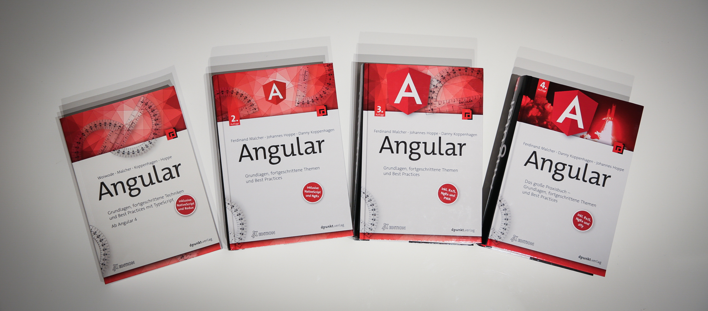

**Das neue deutschsprachige Angular-Buch ist da!**
Ab sofort ist die 4. Auflage des erfolgreichen Standardwerks im Handel verfügbar.

Auf **930 Seiten** präsentieren wir Ihnen einen praktischen Einstieg in das Webframework Angular.
Für die vierte Auflage haben wir das Buch vollständig überarbeitet:
Wir haben das Beispielprojekt, alle Texte und den Aufbau des Buchs kritisch hinterfragt und zum großen Teil neu erarbeitet.
Es war unser Ziel, ein zeitloses und umfangreiches Nachschlagewerk für den Entwicklungsalltag zu schaffen.

Alle Inhalte sind auf dem aktuellen Stand von Angular 15.
Neue Features wie Standalone Components, typisierte Reactive Forms, funktionale Guards und Interceptors und die Funktion `inject()` haben wir von Anfang an berücksichtigt.
Damit ist das Buch auch für die kommenden Versionen des Angular-Frameworks geeignet.

Im [Changelog zur vierten Auflage](/blog/2022-12-changelog-vierte-auflage) erhalten Sie einen Überblick über die Änderungen und Erweiterungen.
Durch die grundlegende Überarbeitung lohnt sich der Umstieg auf das neue Buch auch für Leserinnen und Leser der älteren Auflagen.

Das Buch ist zum Preis von 42,90 € in jeder Buchhandlung und im Online-Handel erhältlich.
Eine Übersicht haben wir unter **["Jetzt kaufen"](/kaufen)** zusammengestellt.

> **Das Buch ist auch als E-Book erhältlich. Sie können es in den Formaten PDF, ePub und Mobi sowie im Bundle (Print + E-Book) [direkt beim dpunkt.verlag](https://dpunkt.de/produkt/angular-6/) erwerben.**

  

    
  

  

    
  

## Das große Praxisbuch zu Angular!

Mit einem anspruchsvollen Beispielprojekt führen die Autoren Sie durch die Welt von Angular.
Entwickeln Sie Schritt für Schritt eine umfangreiche modulare Single-Page-Anwendung und üben Sie Angular im praktischen Einsatz.
Mit seinen umfangreichen Theorieteilen ist dieses Buch außerdem Ihr praktischer Begleiter im Entwicklungsalltag.
Die Autoren sind erfahrene Workshopleiter, Entwickler und internationale Konferenzsprecher.
In dieser vollständig überarbeiteten Auflage vermitteln sie die Best Practices aus ihrer täglichen Arbeit mit Angular.
Aufgrund ihres Engagements rund um das Buch und Angular wurden Ferdinand und Johannes als Google Developer Experts (GDE) ausgezeichnet.

### Aus dem Inhalt:

* Reaktive Programmierung mit RxJS
* State Management mit Redux und NgRx
* Testing mit Jasmine, Karma, Jest und Cypress
* Module und Standalone Components
* Routing und Guards
* HTTP und Interceptors
* Formularverarbeitung
* Dependency Injection und Services
* Barrierefreiheit (a11y)
* Internationalisierung (i18n)
* Progressive Web Apps (PWA)

Erste Kenntnisse in JavaScript und HTML sind von Vorteil, aber keine Voraussetzung.
Wer nicht mit TypeScript vertraut ist, findet im Buch eine fundierte Einführung.
Auf der Website zum Buch werden außerdem regelmäßig Aktualisierungen und Neuigkeiten rund um Angular veröffentlicht.

### Neu in dieser Auflage:

* durchgängig aktualisiert auf Angular 15 und neuere Versionen
* alle Inhalte vollständig überarbeitet und neu strukturiert
* mit den neuesten Themen aus der Angular-Welt:
  * Standalone Components
  * Reactive Forms mit Typisierung
  * funktionale Guards und Resolver
  * Dependency Injection mit der neuen Funnktion `inject()`

  

    
  

  

    
  

  

    
  

## Hintergrund

Die Welt der Webentwicklung bewegt sich schnell, und ein Framework wie Angular muss mit dem Puls der Zeit wachsen.
Seit dem Release der ersten Ausgabe unseres Buchs hat sich viel verändert.
In den letzten Ausgaben haben wir daher versucht, auf neue Features und neu etablierte Techniken zu reagieren und das Buch aktuell zu halten.
In unserem [Blog](/blog) haben wir außerdem kurzfristig über neue Features und Änderungen informiert.

Die 3. Auflage dieses Buchs erschien im Oktober 2020. Mit den neuesten Entwicklungen rund um Angular ist aber auch dieses etablierte Buch inzwischen in die Jahre gekommen.

Wir haben uns deshalb seit September 2021 mehr als ein Jahr Zeit genommen, um das Buch vollständig neu zu erarbeiten.
Ganz bewusst wollten wir das Buch nicht nur aktualisieren, sondern auch Baustellen bearbeiten, für die wir in den letzten Auflagen keine Zeit gefunden hatten.

Wir haben das Beispielprojekt von Grund auf neu entwickelt, haben die Inhalte und die Reihenfolge der Kapitel kritisch hinterfragt, haben ganze Kapitel neu verfasst und haben auch Texte entfernt, die nach unserer Einschätzung nicht mehr relevant waren.
Durch den stetigen Austausch bei unseren [Angular-Schulungen](https://angular.schule), in Kundenprojekten und mit der Community konnten wir die Schwerpunkte neu setzen und den didaktischen Aufbau des Buchs verfeinern.

Das Buch ist auf dem aktuellen Stand von Angular 15.
Wir konnten damit auch den neuen Ansatz der **Standalone Components** fundiert abdecken.
Da Angular-Module weiterhin relevant für die Entwicklung sind, haben wir beide Welten kombiniert.
Auch kleinere Neuerungen wie die Funktion `inject()` oder funktionale Guards und Interceptors werden ausführlich behandelt.

Weiterhin werden wir in unseren Blogartikeln über neue Features in Angular informieren.
Den Code zum Beispielprojekt aus dem Buch werden wir regelmäßig aktualisieren.
Sollten Breaking Changes auftreten, finden Sie die wichtigsten Infos dazu immer in unserem Blog.

Wir freuen uns, dass das neue Buch nach intensiver Arbeit nun im Handel erhältlich ist – und wir hoffen, dass es Ihr treuer Begleiter bei der täglichen Arbeit mit Angular wird!

Sollten Sie Feedback, Anmerkungen oder Fragen haben, zögern Sie nicht, uns zu schreiben!
Wir sind per Mail unter [team@angular-buch.com](mailto:team@angular-buch.com) oder [Twitter](https://twitter.com/angular_buch) für Sie da.

Mit besten Grüßen –
das Autorenteam 
**Ferdinand Malcher, Danny Koppenhagen und Johannes Hoppe**

  

    
  

<a class="btn btn-outline-primary cta__button index__cta mr-2 mb-2" role="button" target="_blank" href="https://angular-buch.com/assets/angular-buch-leseprobe-auflage4.pdf">Kostenlose Leseprobe </a>
<a class="btn btn-primary cta__button mb-2" role="button" target="_blank" href="/kaufen">4. Ausgabe jetzt bestellen</a>
