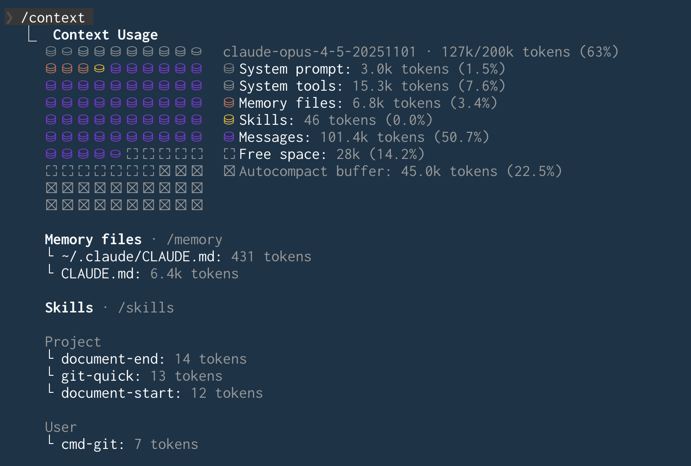

Softwareprojekte werden komplexer, und Anforderungen steigen.
Werkzeuge für AI (Artificial Intelligence) können uns bei der Entwicklung unterstützen und Entlastung schaffen: Sie helfen unter anderem beim Generieren von Code, erklären komplexe Zusammenhänge und schlagen Verbesserungen vor.
**In diesem Artikel zeigen wir dir, wie du mit den AI-Werkzeugen von Angular den bestmöglichen Code generierst.**

> **🇬🇧 This article is available in English language here: [Agentic Coding: AI Support for Angular](https://angular.schule/blog/2026-02-agentic-coding)**

## Inhalt

[[toc]]

## Was sind AI-Agenten?

**Agentic Coding** ist der nächste Schritt nach ChatGPT: Vergiss Copy-Paste aus dem Browser. AI-Agenten arbeiten direkt in deinem Projekt – sie lesen Code, schreiben Dateien, führen Tests aus und planen eigenständig nächste Schritte. Du gibst die Richtung vor, der Agent setzt um.

Den Weg in den Alltag fand AI durch browserbasierte Chats wie ChatGPT, Gemini oder Perplexity. Doch wer damit Software entwickelt, stößt schnell an Grenzen: Der Chat kennt das Projekt nicht, und Code muss manuell hin- und herkopiert werden. AI-Agenten lösen dieses Problem. Sie können prinzipiell alles tun, was wir am Computer auch tun könnten. Die Agenten laufen typischerweise in einer Sandbox und fragen bei kritischen Aktionen nach Bestätigung.


Angular bietet für die Arbeit mit solchen Agenten spezielle Unterstützung, damit wir optimale Ergebnisse erhalten und der generierte Code den aktuellen Best Practices entspricht.
Bevor wir ins Detail gehen, sollten wir aber besprechen, warum diese Unterstützung überhaupt notwendig ist.

## Herausforderung: veraltetes Wissen

Die technische Grundlage aller AI-Agenten ist ein LLM (Large Language Model).
Es basiert auf Trainingsdaten, die zu einem bestimmten Zeitpunkt erstellt wurden.
Da ein solches Training extrem ressourcenintensiv ist, wird es nicht permanent durchgeführt.
Es gibt also praktisch einen Stichtag, und selbst die besten Modelle können nur das "wissen", was bis zu diesem Datum existierte.

Problematisch wird das bei schnelllebigen Technologien wie Angular: Neue Features kommen hinzu und Best Practices ändern sich.
Aktuelle Neuerungen wie Signal Forms, die Resource API oder Angular Aria sind womöglich nicht in den Trainingsdaten vorhanden.
Ältere Konzepte wie das Modulsystem (`NgModule`) oder die Strukturdirektiven (`NgIf` und `NgFor`) sind dagegen dem Modell bestens bekannt.
Bedenkt man zudem, dass ältere Konzepte über Jahre hinweg mehr Dokumentation, Tutorials und Codebeispiele angesammelt haben, ist es statistisch wahrscheinlicher, dass das Modell diese vorschlägt.
Für die Wartung bestehender Legacy-Projekte ist dies ein Vorteil.
Wer aber eine moderne Anwendung mit aktuellen Best Practices anstrebt, erhält vom Modell mit höherer Wahrscheinlichkeit ältere Lösungsansätze.
Im ungünstigsten Fall vermischt das Modell alte und neue Konzepte oder **halluziniert**, d. h. es erzeugt plausibel klingende, aber faktisch falsche Aussagen.
Das Ergebnis ist inkonsistenter oder nicht funktionierender Code.

Die Lösung liegt darin, dem AI-Agenten den notwendigen Kontext bereitzustellen.
Angular bietet dafür zwei Werkzeuge:

- **Konfigurationsdateien** für Instruktionen und Beispiele
- **MCP-Server** für Angular-spezifische Informationen (und Tools)

## AI-Konfigurationsdateien

Zu Beginn ihrer Arbeit benötigen AI-Agenten möglichst viele gute Informationen.
Man spricht hier auch von Kontext.
Der Hersteller hat bereits grundlegende Regeln und Instruktionen bereitgestellt, den sogenannten **System Prompt**.
Doch das reicht in der Regel nicht aus: Der Agent hat noch keine Kenntnis über das spezifische Projekt, für das er Arbeit erledigen soll.

Hier kommen projektspezifische Konfigurationsdateien ins Spiel.
Die meisten AI-Agenten suchen nach solchen Dateien mit einem bestimmten Namen: Claude Code erwartet `.claude/CLAUDE.md`, Cursor verwendet `.cursorrules`, GitHub Copilot nutzt `.github/copilot-instructions.md` und so weiter.
Jeder Hersteller hat seinen eigenen Standard, doch der generische Dateiname `AGENTS.md` könnte sich als herstellerübergreifender Standard etablieren.
Diese Dateien enthalten eine Sammlung von Regeln und Best Practices für das jeweilige Projekt.
Man spricht hier von einem **Custom Prompt**: eine Datei mit projektspezifischen Anweisungen, die das Verhalten des AI-Agenten steuert und den System Prompt ergänzt.
Man könnte diese Eingaben auch vor jeder Konversation manuell eingeben, aber das wäre aufwendig, und man vergisst es schnell.

Da sich noch kein einheitlicher Standard für den Dateinamen etabliert hat, unterstützt die Angular CLI verschiedene Varianten.
Sie fragt beim Erzeugen einer Anwendung nach dem eingesetzten Agenten und generiert die passenden Dateien.
Wir können die Konfiguration auch direkt mit der Option `--ai-config` angeben:

```bash
ng new my-app --ai-config=agents
```

Haben wir uns zu Beginn gegen eine explizite Konfiguration entschieden oder wollen eine weitere ergänzen, so können wir nachträglich eine solche Konfiguration erzeugen:

```bash
ng g ai-config
```

Die Richtlinien umfassen Best Practices für TypeScript und Angular, Vorgaben für Komponenten, State Management, Templates und Services sowie Anforderungen an Barrierefreiheit.

Der Agent hat nun Instruktionen.
Doch ob er diese korrekt umsetzen kann, hängt von seinem Wissensstand ab.
Im Custom Prompt steht etwa, dass die neue Syntax für den Control Flow verwendet werden soll.
Aber woher soll das Modell wissen, wie diese funktioniert, wenn sie zum Zeitpunkt des Trainings noch nicht existierte?

Hier können wir teilweise nachhelfen: Die von Angular generierte Datei ist ein guter Startpunkt, aber wir können sie erweitern.
Nützlich sind konkrete Beispiele für neue Syntax, projektspezifische Konventionen oder Hinweise zu Fehlern, die der Agent wiederholt gemacht hat.
Für den Custom Prompt gilt: kurz und fokussiert halten.
Zu viele Instruktionen verwässern die Wirkung.
Der AI-Agent kann übrigens selbst beim Formulieren guter Instruktionen helfen.
Auch der MCP-Server, den wir später vorstellen, kann fehlende Informationen bereitstellen.

Allerdings gibt es eine Einschränkung: Jedes LLM kann nur eine begrenzte Menge an Text gleichzeitig verarbeiten.
Man spricht von einem Kontextfenster.
Der Custom Prompt liegt in diesem Fenster, und bei längeren Sessions können die Instruktionen in Vergessenheit geraten.

## Herausforderung: das Kontextfenster



Wird das Kontextfenster überschritten, "vergisst" der AI-Agent frühere Teile der Konversation.
Dieses Vergessen ist technisch notwendig, damit die Unterhaltung weitergehen kann.
Das häufigste Mittel besteht darin, die bisherige Konversation bestmöglich zusammenzufassen (engl. **Context Summarization**).
Das funktioniert manchmal hervorragend und manchmal leider überhaupt nicht.
Hat die Zusammenfassung wichtige Aspekte entfernt, führt dies zu inkonsistenten Antworten oder veralteten Codevorschlägen.

Damit verwandt ist der **Lost-in-the-Middle**-Effekt: Informationen, die in der Mitte eines sehr langen Kontexts stehen, werden vom Modell weniger stark berücksichtigt als Informationen am Anfang oder Ende.
Das kann dazu führen, dass initiale Instruktionen aus den Custom Prompts im Laufe der Konversation vernachlässigt werden und das Modell nur noch auf den ursprünglichen System Prompt zurückfällt.
Je länger die Session andauert, desto wahrscheinlicher werden solche Effekte.
Moderne AI-Agenten nutzen neben der Zusammenfassung weitere Strategien, z. B. gezielte Tool-Aufrufe oder Sub-Agenten mit eigenem Kontextfenster.
Eine besonders elegante Lösung bietet der MCP-Server der Angular CLI.

## Der MCP-Server von Angular

Das [MCP (Model Context Protocol)](https://modelcontextprotocol.io/) ist ein offener Standard, der Verbindungen zwischen AI-Anwendungen und externen Systemen ermöglicht.
MCP-Server können Ressourcen (Datenquellen), Tools (aufrufbare Funktionen) und Prompts (vordefinierte Anweisungen) bereitstellen.
Das Angular-Team ist auf diesem neuen Feld sehr aktiv und stellt über die Angular CLI einen integrierten MCP-Server bereit.

Warum hilft das?
MCP-Tools werden bei Bedarf frisch aufgerufen.
Die Informationen landen dann im Kontext. Gehen sie durch Zusammenfassung verloren, können sie jederzeit erneut abgerufen werden.
Zusätzlich pflegt das Angular-Team die Antworten und aktualisiert sie regelmäßig, sodass auch das Problem veralteten Wissens adressiert wird.
Der MCP-Server von Angular stellt verschiedene Tools bereit.

### Die Tools im Überblick

**Standard-Tools:**

- `get_best_practices`: liefert Coding-Richtlinien für moderne Angular-Entwicklung.
- `search_documentation`: durchsucht die offizielle Angular-Dokumentation versionsspezifisch basierend auf Stichwörtern.
- `find_examples`: liefert Codebeispiele für moderne Angular-Features aus einer kuratierten Datenbank.
- `ai_tutor`: startet einen interaktiven Angular-Kurs, der Schritt für Schritt durch das Framework führt.
- `list_projects`: identifiziert Anwendungen und Bibliotheken im Workspace.
- `onpush_zoneless_migration`: analysiert Code und liefert Anweisungen zur Migration auf OnPush-Change-Detection.

**Experimentelle Tools:**

- `modernize`: unterstützt Migrationen zu modernen Patterns, z. B. Signal Inputs (`@Input` &rarr; `input()`), moderne Outputs (`@Output` &rarr; `output()`), die Funktion `inject()`, Signal Querys (`ViewChild`/`ContentChild` &rarr; Signals), Built-in Control Flow (`*ngIf`/`*ngFor` &rarr; `@if`/`@for`) und Self-Closing Tags.
- `build`: führt einen einmaligen Build mit `ng build` durch.
- `devserver.start`, `devserver.stop`, `devserver.wait_for_build`: verwalten den Development Server.
- `e2e`: führt End-to-End-Tests aus.
- `test`: führt Unit-Tests aus.

Da das Angular-Team das Thema AI stark im Fokus hat, kommen wahrscheinlich regelmäßig weitere Tools hinzu.

### Den MCP-Server einrichten

Damit der AI-Agent den MCP-Server nutzen kann, müssen wir ihn einmalig konfigurieren.
Das Kommando `ng mcp` zeigt hierzu ein generisches Konfigurationsbeispiel:

```
$ ng mcp

To start using the Angular CLI MCP Server, add this
configuration to your host:

{
    "mcpServers": {
        "angular-cli": {
            "command": "npx",
            "args": ["-y", "@angular/cli", "mcp"]
        }
    }
}

Exact configuration may differ depending on the host.

For more information and documentation, visit:
https://angular.dev/ai/mcp
```

Das Flag `-y` beim `npx`-Befehl installiert die Angular CLI ohne Rückfrage, falls sie nicht vorhanden ist.
Der Befehl `ng mcp` gibt im Terminal nur eine Hilfestellung zur Einrichtung aus.
Die genaue Konfiguration unterscheidet sich je nach Agent. Typische Konfigurationsdateien sind `mcp.json` oder `settings.json`.
Die [Angular-Dokumentation](https://angular.dev/ai) enthält Anleitungen für verschiedene Agenten.

### Experimentelle Tools aktivieren

Die experimentellen Tools sind standardmäßig deaktiviert.
Um sie zu nutzen, müssen sie mit dem Flag `--experimental-tool` (kurz: `-E`) explizit aktiviert werden.
Die Standard-Tools bleiben dabei erhalten – die experimentellen Tools werden hinzugefügt, nicht ersetzt.

Einzelne Tools aktivieren:

```json
{
    "mcpServers": {
        "angular-cli": {
            "command": "npx",
            "args": ["-y", "@angular/cli", "mcp", "-E", "modernize", "-E", "test"]
        }
    }
}
```

Alle experimentellen Tools auf einmal aktivieren:

```json
{
    "mcpServers": {
        "angular-cli": {
            "command": "npx",
            "args": ["-y", "@angular/cli", "mcp", "-E", "all"]
        }
    }
}
```

Es gibt auch die Gruppe `devserver`, die nur die Devserver-Tools (`devserver.start`, `devserver.stop`, `devserver.wait_for_build`) aktiviert.

Zusätzlich stehen zwei weitere Optionen zur Verfügung:

- `--read-only`: aktiviert nur lesende Tools, die keine Dateien verändern.
- `--local-only`: aktiviert nur Tools, die keinen Internetzugang benötigen.

Sobald der MCP-Server konfiguriert ist, entscheidet der AI-Agent selbstständig, wann er welches Tool aufruft.
Der MCP-Server läuft dabei nicht permanent, sondern wird nur bei Bedarf gestartet und wieder beendet.
Die meisten Tools sind rein lesend: Sie liefern Informationen wie Dokumentation, Beispiele oder Best Practices, ohne Dateien zu verändern.
Einige Tools wie `modernize` können aber auch Generatoren der Angular CLI aufrufen und damit Code im Projekt verändern.
Falls du ein bestimmtes Tool nutzen möchtest, bitte den Agenten explizit darum, z. B. mit *"Nutze das Tool `search_documentation`, um nach Signal Forms zu suchen"*.

Wenn du neugierig geworden bist, kannst du den MCP-Server der Angular CLI selbst erforschen.
Mit dem Werkzeug [MCP Inspector](https://modelcontextprotocol.io/docs/tools/inspector) lassen sich alle verfügbaren Tools im Webbrowser anzeigen und testen:

```bash
npx @modelcontextprotocol/inspector "npx" --args "-y @angular/cli mcp"
```


## Empfehlungen für die Praxis

Der Umgang mit AI-Agenten hat eine Lernkurve.
Anfangs erfordert es Aufwand, gute Prompts zu formulieren, den richtigen Kontext bereitzustellen und das Setup zu pflegen.
Doch wer dieser Phase Zeit gibt, kann eine deutliche Entlastung im Arbeitsalltag erreichen.
Die folgenden Tipps für die tägliche Arbeit helfen, diese Lernkurve zu verkürzen:

- **Kontext bereitstellen:** Gib dem Agenten den Kontext, den er für die aktuelle Aufgabe braucht, und achte darauf, den Kontext nicht übermäßig mit irrelevanten Informationen zu fluten.
Verweise auf bestehende Dateien, Interfaces oder Konventionen in deinem Projekt.
Nutze den MCP-Server, um Angular-spezifische Best Practices abzufragen.
- **Iterativ arbeiten:** Erwarte nicht, dass das erste Ergebnis perfekt ist.
Zerlege komplexe Aufgaben in kleine Schritte und verfeinere das Ergebnis schrittweise.
Fordere den Agenten auf, die erstellte Software selbst zu überprüfen und Fehler zu finden.
Lass ihn prüfen, ob der Code dem Angular-Styleguide entspricht.
- **Einfachheit bevorzugen:** AI-Agenten produzieren bei klaren, einfachen Strukturen bessere Ergebnisse – genau wie Menschen auch.
Statt komplexe Architekturen zu entwerfen, nutze bewährte Abstraktionen wie die [Resource API](https://angular.dev/guide/signals/resource).
Einfacher Code ist leichter zu generieren, zu prüfen und zu warten.
- **Tests generieren lassen:** Lass dir Unit- und Integrationstests generieren, ggf. auch E2E-Tests.
Das Erstellen von `TestBed`-Konfigurationen und Mocks ist eine Stärke von AI-Agenten.
Du bekommst schnell Feedback, ob etwas funktioniert wie gedacht, und kannst zusammen mit dem Agenten an einer guten Lösung arbeiten.
- **Code Reviews beibehalten:** Generierter Code sollte denselben Review-Prozess durchlaufen wie manuell geschriebener Code.
Achte besonders auf moderne Angular-Patterns wie Signals und den neuen Control Flow.
- **Fehler erklären lassen:** Wenn ein Fehler auftritt, lass den Agenten die Fehlermeldung analysieren und Lösungsvorschläge machen.
Du sparst dir die Recherche und bekommst kontextbezogene Hilfe.
- **Kritisch prüfen:** AI-Modelle neigen nach unserer Erfahrung dazu, Abkürzungen zu nehmen.
Typische Beispiele sind der Typ `any` als faule Lösung statt korrekter Typisierung oder schwache Assertions wie `toBeTruthy()` statt `toEqual({ name: 'Test' })` oder `toBeGreaterThan(0)` statt `toBe(42)`.
Achte besonders darauf, dass die AI bei fehlschlagenden Tests nicht einfach den Test anpasst, statt das eigentliche Problem zu lösen.
Prüfe generierten Code daher immer kritisch und fordere strenge Typisierung ein.
- **Rezepte nutzen:** Im LLM sind unzählige Implementierungsmuster aus den Trainingsdaten gespeichert.
Beschreibe was du brauchst, und lass dir Lösungsvorschläge generieren.
Frage auch immer nach möglichen Alternativen, und lass dir Vor- und Nachteile auflisten.
- **Migrationen delegieren:** Bei Angular-Upgrades oder Migration zu neuen Patterns wie Standalone Components, Signals oder Control Flow kann der Agent viel Arbeit abnehmen.
Der MCP-Server stellt dafür eigene Tools bereit.
- **Pair Programming:** Nutze den Agenten als "Sparringspartner" für Architekturentscheidungen.
Lass dir verschiedene Lösungswege aufzeigen.
Der Agent hat kein Ego und erklärt geduldig.
- **CLIs statt Web nutzen:** AI-Agenten erhalten zunehmend Zugangssperren, weil sie Websites intensiv crawlen.
Nutze daher vorgesehene Schnittstellen: für GitHub die GitHub CLI (`gh`), für Azure DevOps die Azure CLI (`az devops`) oder bereitgestellte MCP-Server.
Kommandozeilentools bieten eine direktere Schnittstelle als Weboberflächen und verbrauchen weniger API-Kontingent, was Kosten spart.
- **Weitere MCP-Server:** Verbinde weitere MCP-Server mit deinem Agenten.
Viele Werkzeuge aus dem Entwicklungsalltag bieten passende Integrationen an.
Durch die Anbindung an deine Designsoftware, Ticketsysteme und weitere Plattformen kann der Agent direkt auf Dokumentation, Designs und Tickets zugreifen und diese Informationen in seine Arbeit einfließen lassen.

## Fazit

AI-Agenten sind mächtige Werkzeuge, die uns bei der Entwicklung mit Angular unterstützen.
Mit Konfigurationsdateien und dem MCP-Server der Angular CLI schließt du die Lücke zwischen veralteten Trainingsdaten und aktuellen Best Practices.
Doch AI ersetzt kein Fachwissen.
Wer die Konzepte von Angular nicht versteht, kann auch nicht beurteilen, ob der generierte Code korrekt ist.
Deshalb gilt: Nutze AI als Beschleuniger, aber investiere in dein eigenes Verständnis – zum Beispiel mit [unserem Buch](https://angular-buch.com/kaufen).

<hr>

<small>**Titelbild:** generiert mit Nano Banana Pro (Gemini 3)</small>
