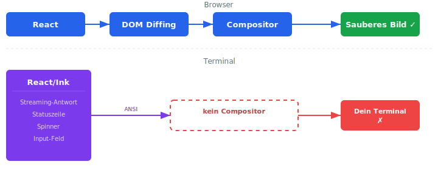

Claude Code hat einen berüchtigten Bug: Das Terminal scrollt unkontrolliert, flackert oder friert komplett ein.
Seit März 2025 sammeln sich die GitHub Issues mit tausenden Upvotes, und das Problem ist immer noch nicht behoben.
Es ist das meistgemeldete UX-Problem von Claude Code überhaupt, und eine direkte Lösung von Anthropic lässt immer noch auf sich warten.
**In diesem Artikel erkläre ich, warum der Bug existiert, warum die üblichen Workarounds nicht helfen und wie man ihn mit einem Open-Source-Tool endgültig löst.**

> **🇬🇧 This article is available in English language here: [Claude Code: How to Actually Fix the Endless Scrolling Problem](https://angular.schule/blog/2026-02-claude-code-scrolling)**

## Inhalt

[[toc]]

## Das Problem

Du arbeitest mit Claude Code und plötzlich passiert es: Das Terminal beginnt unkontrolliert zu scrollen.
Du siehst keinen Text mehr, nur noch ein Rauschen aus Zeilen.
Du greifst den Scrollbalken, bist ganz oben, versuchst manuell runterzuscrollen.
Manchmal klappt es, manchmal nicht.
Dann denkst du, es ist wieder stabil, und im selben Moment geht es schon wieder los.
Es macht dich komplett aggressiv, und du kommst in der Zeit zu nichts, weil du einfach nur noch sauer bist.

<video src="https://github.com/user-attachments/assets/647a822f-6247-458a-b861-0f203b310571" controls loop muted playsinline width="100%"></video>
<small><em>⚠️ Flackerndes Video. Flickern bei der Arbeit von Johannes, aufgenommen in iTerm2</em></small>

Dieses Problem ist nicht selten.
Es ist das **meistgemeldete und frustrierendste UX-Problem** von Claude Code.
Es betrifft macOS, Linux und Windows gleichermaßen.
Es passiert in iTerm2, Terminal.app, VS Code, Cursor, tmux, IntelliJ und Kitty.
Und es ist seit fast einem Jahr bekannt, ohne dass Anthropic eine wirkliche Lösung geliefert hat.

Auf GitHub gibt es dutzende Issues dazu, alle beschreiben dasselbe Symptom mit unterschiedlichen Namen:

- "Endless scrolling" ([#832](https://github.com/anthropics/claude-code/issues/832), [#2118](https://github.com/anthropics/claude-code/issues/2118))
- "Infinite scroll" ([#10008](https://github.com/anthropics/claude-code/issues/10008))
- "Terminal flickering" ([#769](https://github.com/anthropics/claude-code/issues/769), [#9893](https://github.com/anthropics/claude-code/issues/9893))
- "High speed scrolling" ([#1422](https://github.com/anthropics/claude-code/issues/1422), [#10835](https://github.com/anthropics/claude-code/issues/10835))
- "UI freeze" ([#7216](https://github.com/anthropics/claude-code/issues/7216))
- "Terminal flickering on Windows" ([#16939](https://github.com/anthropics/claude-code/issues/16939))
- "Terminal rendering breaks" ([#16578](https://github.com/anthropics/claude-code/issues/16578))
- "Scroll position lost" ([#18299](https://github.com/anthropics/claude-code/issues/18299))

In Issue [#9935](https://github.com/anthropics/claude-code/issues/9935) hat jemand gemessen: **4.000 bis 6.700 Scroll-Events pro Sekunde**.

<video src="https://github.com/user-attachments/assets/cf147ecb-d5e3-428d-a538-38c8cab7bef3" controls loop muted playsinline width="100%"></video>
<small><em>⚠️ Flackerndes Video. Quelle: <a href="https://github.com/anthropics/claude-code/issues/7216">GitHub Issue #7216</a> – massives Scrolling in Cursor</em></small>

Besonders schlimm wird es mit **parallelen Agenten**.
Wenn Claude Code mehrere Agenten gleichzeitig startet, liefert jeder von ihnen ständig Status-Updates zurück.
Der Bildschirm kommt überhaupt nicht mehr zur Ruhe, und die Claude-Session wird während der gesamten parallelen Ausführung unbenutzbar.
Mehrere Issues bestätigen dieses Muster: parallele Agenten überlasten die Rendering-Pipeline komplett ([#17547](https://github.com/anthropics/claude-code/issues/17547), [#16923](https://github.com/anthropics/claude-code/issues/16923), [#10008](https://github.com/anthropics/claude-code/issues/10008)).
Ein User, der 18 Agenten gleichzeitig laufen lässt, beschreibt es als "flicker-thrashing", sobald die Benachrichtigungen die Bildschirmhöhe überschreiten.

## Was ich zuerst versucht habe (und warum es nicht geholfen hat)

### Statuszeile deaktivieren

Mehrere Issues deuten darauf hin, dass die Statuszeile den Bug auslöst, wenn sie breiter als das Terminal ist.
In `~/.claude/settings.json` lässt sich die Statuszeile deaktivieren.
Ergebnis: Der Bug tritt seltener auf, aber nicht nie.
Die Statuszeile ist nur einer von mehreren Render-Pfaden, die das Problem verursachen.

### Terminal breiter machen

Wenn die Statuszeile nicht umbricht, sollte der Bug verschwinden.
In der Praxis flackert es auch bei 200 Spalten Breite, weil der Bug nicht nur von der Statuszeile kommt.

### iTerm2 updaten

iTerm2 unterstützt Synchronized Output (dazu gleich mehr).
Ein Update auf die aktuelle Version (3.6.6) bringt Verbesserungen, löst das Problem aber nicht, weil Claude Code selbst die Ursache ist.

### Nicht tippen während Claude denkt

Ein häufiger Trigger ist Tastatureingabe während der "Thinking"-Phase.
Sich zurückzuhalten hilft, aber wer will schon sein Verhalten an einen Bug anpassen?

## Welche Terminals sind betroffen?

<video src="https://github.com/user-attachments/assets/86040c0c-1388-4ced-9905-be8df81c9048" controls loop muted playsinline width="100%"></video>
<small><em>⚠️ Flackerndes Video. Quelle: <a href="https://github.com/anthropics/claude-code/issues/832">GitHub Issue #832</a> – Endless Scrolling auf Windows</em></small>

Die folgende Tabelle fasst die Berichte aus den verschiedenen GitHub Issues zusammen.
Die Angaben zur Häufigkeit des Auftretens sind teils messbar belegt, teils subjektiv von den betroffenen Usern beschrieben.

| Terminal | Endless Scrolling | Flickering | Anmerkung |
|----------|:-:|:-:|-----------|
| **VS Code (integriert)** | Ja | Heftig | Am schlimmsten betroffen, VSCode-Crashes möglich |
| **Cursor (integriert)** | Ja | Heftig | Gleicher xterm.js-Renderer wie VS Code |
| **macOS Terminal.app** | Ja | Spürbar | Kein Synchronized Output |
| **iTerm2** | Ja | Gelegentlich | Synchronized Output vorhanden, hilft aber nicht ausreichend |
| **tmux** | Ja | Massiv | 4.000–6.700 Scroll-Events/Sekunde gemessen |
| **Kitty** | Ja | Spürbar | Linux und macOS |
| **Windows CMD** | Ja | Heftig | Praktisch unbenutzbar |
| **PowerShell** | Ja | Heftig | Auch Windows Terminal betroffen |
| **IntelliJ IDEA** | Ja | Spürbar | Endlosschleife beim Minimieren |
| **Ghostty** | Nein | Nein | GPU-Rendering, DEC 2026 |
| **+ claude-chill** | Nein | Nein | Funktioniert mit jedem Terminal |

## Warum existiert dieser Bug?

> **Technischer Deep-Dive:** Dieser Abschnitt erklärt die Architektur hinter dem Bug. Wenn du nur die Lösung willst, springe direkt zu [Die Lösung: claude-chill](#die-lösung-claude-chill).

Claude Code ist eine React-Anwendung im Terminal.
Die Benutzeroberfläche wird mit [Ink](https://github.com/vadimdemedes/ink) gerendert, einer Library, die React-Komponenten in ANSI-Escape-Sequenzen übersetzt.
Statt HTML-Elemente im Browser zu erzeugen, schreibt Ink Steuerzeichen in den Terminal-Stream: Cursor positionieren, Farben setzen, Zeilen löschen, Text schreiben.

Das funktioniert bei einfachen Tools gut.
Bei Claude Code wird es zum Problem, weil mehrere Dinge gleichzeitig rendern:

1. **Streaming-Antworten** – jedes Token löst einen Render-Zyklus aus
2. **Statuszeile** – aktualisiert sich mehrmals pro Sekunde (Timer, Token-Counter)
3. **Spinner/Animationen** – eigener Render-Zyklus während "Thinking"
4. **Input-Feld** – rendert bei jedem Tastendruck

Jeder dieser Render-Pfade schreibt Escape-Sequenzen in den Terminal-Stream.
Wenn sich Spinner, Statuszeile und Streaming-Antwort überlappen, bekommt das Terminal widersprüchliche Cursor-Positionen.
Das Ergebnis: Zeilen werden an die falschen Stellen geschrieben, der Bildschirm ist korrumpiert, und jeder weitere Render verschlimmert das Chaos.



### Warum hilft Synchronized Output nicht?

Synchronized Output ([DEC mode 2026](https://gist.github.com/christianparpart/d8a62cc1ab659194337d73e399004036)) ist ein Protokoll, das dem Terminal sagt: "Puffere alles zwischen Start- und End-Sequenz und zeige es atomar an."
Claude Code sendet diese Sequenzen bereits (`\x1b[?2026h` und `\x1b[?2026l`).
Terminals wie iTerm2 und Ghostty unterstützen sie.

Ich nutze iTerm2 seit Jahren, und ich kann bestätigen: Synchronized Output löst das Problem nicht.
Synchronized Output schützt nur **einzelne** Updates.
Wenn hunderte unkoordinierte Updates pro Sekunde kommen, die sich gegenseitig überschreiben, ist jedes einzelne zwar atomar, aber das Gesamtbild ist trotzdem kaputt.
Es ist wie ein Filmprojektor, der saubere Einzelbilder zeigt, aber jedes Bild einen anderen Bildausschnitt hat.

### Warum funktioniert Ghostty trotzdem?

Ghostty-User melden keine Flicker-Probleme, obwohl das Argument oben auch für Ghostty gelten sollte.
Der wahrscheinliche Grund: Ghostty rendert **GPU-beschleunigt** und verarbeitet die Escape-Sequenzen schneller als CPU-basierte Terminals.
Meine Vermutung: Die Updates sind nicht wirklich weg, aber sie werden so schnell gezeichnet, dass das menschliche Auge kein Flackern wahrnimmt.
Das ist weniger "das Problem ist gelöst" und mehr "das Problem ist unsichtbar".
Wenn du Ghostty mal ausprobieren willst, nur zu (ich selbst habe es nicht getestet, ich mag mein iTerm2): Neben dem flackerfreien Rendering bietet es GPU-beschleunigtes Rendering via Metal (macOS) und OpenGL (Linux), native Ligatur-Unterstützung, das Kitty Graphics Protocol für Inline-Bilder im Terminal und über 100 eingebaute Themes. Schick ist es definitiv.

## Warum fixt Anthropic das nicht einfach?

Anthropic hat durchaus reagiert.
In Version 2.0.10 (Oktober 2025) wurde der Renderer komplett neu geschrieben, und Ende Januar 2026 wurde der neue "Differential Renderer" für alle User ausgerollt.
Chris Lloyd, Anthropic-Ingenieur und Autor der Terminal-Rendering-Patches, schrieb auf [Hacker News](https://news.ycombinator.com/item?id=46699072):

> "we shipped our differential renderer to everyone today. We rewrote our rendering system from scratch and only ~1/3 of sessions see at least a flicker."

Zusätzlich hat Anthropic Patches für Synchronized Output upstream eingereicht: Der Patch für VSCode (xterm.js [#5453](https://github.com/xtermjs/xterm.js/pull/5453)) wurde gemerged, und der Patch für tmux ([#4744](https://github.com/tmux/tmux/pull/4744)) wurde vom tmux-Maintainer übernommen und direkt in OpenBSD committed.
Das hat die Situation verbessert, aber nicht gelöst.

Das Kernproblem ist architektonisch: **React im Terminal ist ein Impedance Mismatch.** Zwei Systeme, die fundamental unterschiedlich arbeiten.
React geht davon aus, dass Rendering billig ist.
Im Browser stimmt das: DOM-Diffing ist schnell, der Browser-Compositor sorgt für flackerfreie Darstellung.
Im Terminal gibt es keinen Compositor.
Jeder Render ist ein Stream von Escape-Sequenzen, und das Terminal hat keine Möglichkeit, atomare Frame-Updates zu garantieren.

Anthropic müsste React/Ink komplett rauswerfen und direkt gegen den Terminal-Buffer rendern.
Das wäre ein massiver Umbau ihrer gesamten UI-Architektur.
Stattdessen setzen sie darauf, dass Terminals sich anpassen (DEC 2026, GPU-Rendering).
Ob diese Wette aufgeht, ist fraglich.
Nach tausenden Upvotes und fast einem Jahr ist der Bug jedenfalls immer noch da.

## Die Lösung: claude-chill

[claude-chill](https://github.com/davidbeesley/claude-chill) ist ein Open-Source PTY-Proxy von David Beesley.
Es setzt sich zwischen dein Terminal und Claude Code und macht genau das, was Claude Code selbst hätte tun sollen: **sauberes Differential Rendering.**

### Wie es funktioniert

1. claude-chill erstellt ein Pseudo-Terminal (PTY) und startet Claude Code darin
2. Alle Ausgaben von Claude Code werden durch einen VT100-Emulator im Speicher geleitet
3. Der aktuelle Bildschirmzustand wird mit dem vorherigen verglichen
4. Nur die tatsächlichen Änderungen (Diffs) werden an dein echtes Terminal weitergegeben
5. Die Diffs werden in Synchronized-Output-Blöcke gepackt

Statt tausender unkontrollierter Redraws pro Sekunde bekommt dein Terminal nur saubere, atomare Frame-Updates.
claude-chill ist der fehlende Compositor, den Claude Code nie eingebaut hat.


### Installation

claude-chill wird aus dem Quellcode kompiliert, da es keine vorgebauten Binaries gibt.
Dafür brauchst du den Rust-Compiler und seinen Paketmanager Cargo.
Falls du noch kein Rust installiert hast, ist das in einer Minute erledigt.

**Option 1: Homebrew (macOS/Linux)**

Wenn du Homebrew bereits nutzt, ist das der schnellste Weg:

```bash
brew install rust
```

**Option 2: Offizieller Rust-Installer (alle Plattformen)**

Der offizielle Weg über [rustup.rs](https://rustup.rs/) funktioniert auf macOS, Linux und Windows.
Das Skript installiert den Rust-Compiler (`rustc`), den Paketmanager (`cargo`) und den Toolchain-Manager (`rustup`):

```bash
curl --proto '=https' --tlsv1.2 -sSf https://sh.rustup.rs | sh
source ~/.cargo/env
```

Auf Windows statt `curl` den Installer von [rustup.rs](https://rustup.rs/) herunterladen und ausführen.

**Prüfen, ob Cargo verfügbar ist:**

```bash
cargo --version
```

Wenn eine Versionsnummer erscheint, kann es losgehen.

**claude-chill installieren:**

```bash
cargo install --git https://github.com/davidbeesley/claude-chill
```

Cargo lädt den Quellcode, kompiliert ihn und legt die fertige Binary unter `~/.cargo/bin/claude-chill` ab.
Der Kompiliervorgang dauert beim ersten Mal etwas, da alle Dependencies mitgebaut werden.

### Einrichtung

Damit du nicht jedes Mal `claude-chill claude` tippen musst, richte einen Alias ein.
Füge in die Konfigurationsdatei deiner Shell folgende Zeile ein (`~/.zshrc` für zsh, `~/.bashrc` für bash, bei anderen Shells die jeweilige Konfigurationsdatei):

```bash
alias claude='claude-chill claude --'
```

Das `--` am Ende ist wichtig.
Es signalisiert claude-chill, dass alle folgenden Argumente (wie `--resume`) an Claude Code durchgereicht werden sollen.

Danach musst du die Shell neu laden:

```bash
# zsh
exec zsh

# bash
exec bash
```

Unter Windows schließt du das Terminal einmal und öffnest es neu.

Ab jetzt startet `claude` automatisch über claude-chill. Du merkst keinen Unterschied, außer dass das Flackern weg ist.

### Ist claude-chill sicher?

Ich habe den gesamten Quellcode gelesen (ein kompaktes Rust-Projekt mit 12 Quelldateien).
Ergebnis: Der Code ist sauber (geprüft in Version 0.1.4, Commit [`2595cf7`](https://github.com/davidbeesley/claude-chill/tree/2595cf7f89e33381453cb4fba2b8bf8eb26921df)).
Kein Netzwerkzugriff, keine Dateisystem-Schreibzugriffe (außer optionalem Debug-Logging), kein Zugriff auf sensible Umgebungsvariablen.
Die Dependencies sind etablierte Rust-Crates: `nix` für POSIX-APIs, `vt100` als Terminal-Emulator, `termwiz` (vom WezTerm-Entwickler) als Escape-Sequence-Parser.
Der Code ist gut strukturiert, ausführlich getestet und hat eine explizite Allowlist/Blocklist für jede Terminal-Escape-Sequenz.

**Ein großes Dankeschön an [David Beesley](https://github.com/davidbeesley) für dieses Projekt!**

## Fazit

Der Endless-Scrolling-Bug in Claude Code ist ein architektonisches Problem: React/Ink im Terminal produziert mehr Updates, als das Terminal verarbeiten kann.
Anthropic hat den Renderer umgeschrieben, Patches für Terminals beigesteuert und empfiehlt Ghostty.
Das alles hat die Situation verbessert, aber nicht gelöst.

**claude-chill löst es.**
Es ist ein kleiner, sauberer PTY-Proxy, der die Rolle des fehlenden Compositors übernimmt.
Zwei Befehle, und der Bug ist Geschichte.

```bash
cargo install --git https://github.com/davidbeesley/claude-chill
echo "alias claude='claude-chill claude --'" >> ~/.zshrc
```

<hr>

**Weiterführende Links:**

- [claude-chill auf GitHub](https://github.com/davidbeesley/claude-chill)
- [Hacker News: Claude Chill](https://news.ycombinator.com/item?id=46699072)
- [Claude Code's Terminal Flickering: 700+ Upvotes, 9 Months, Still Broken (Dez. 2025)](https://namiru.ai/blog/claude-code-s-terminal-flickering-700-upvotes-9-months-still-broken)
- [The Signature Flicker (Peter Steinberger)](https://steipete.me/posts/2025/signature-flicker)
