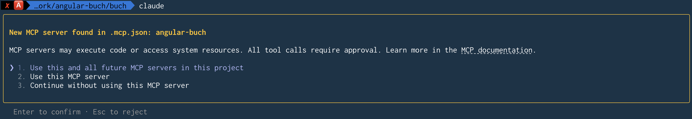

Es gab noch nie einen besseren Zeitpunkt, um Software zu entwickeln.
AI-Agenten wie Claude Code haben meinen Workflow grundlegend verändert – ich schreibe besseren Code in weniger Zeit.
**In diesem Artikel zeige ich dir, wie das funktioniert.
Ob du seit Jahren Angular entwickelst oder gerade erst anfängst: Die Einstiegshürde war noch nie so niedrig.**

## Inhalt

[[toc]]

## Was ist Claude Code?

Claude Code ist die CLI-Version von Claude, dem AI-Modell von Anthropic.
Der entscheidende Unterschied zum Browser-Chat: Claude Code arbeitet direkt in deinem Projekt.
Es liest deinen Code, versteht den Kontext und kann Änderungen selbst umsetzen.

Stell es dir so vor: Der Browser-Chat gibt dir nur Ratschläge.
Claude Code setzt sich aber an deinen Schreibtisch und erledigt die Arbeit. **Viel besser! 😎**

Konkret heißt das: Claude Code kann deine Dateien lesen und bearbeiten, Shell-Befehle ausführen, im Web nach Informationen suchen und sogar Bilder analysieren.
Der Agent entscheidet selbstständig, welche Schritte nötig sind, und arbeitet sie nacheinander ab – du siehst dabei immer, was gerade passiert.

Das klingt nach viel Macht, und genau deshalb ist ein Aspekt besonders wichtig: die Kontrolle.

Im Standardmodus fragt Claude Code vor jeder Dateiänderung und jedem Shell-Befehl nach Bestätigung.
Du siehst einen Diff und wählst mit den Pfeiltasten: einmalig erlauben, für die gesamte Session erlauben oder ablehnen.
In der Praxis drücke ich meistens einfach nur Enter – das bestätigt die vorausgewählte Option.

Wenn du dem Ergebnis vertraust – oder dich einfach mal vom Bildschirm abwenden willst, ohne jeden Schritt zu kontrollieren – dann wähle mit den Pfeiltasten die zweite Option: für die gesamte Session erlauben.
Und für die ganz Mutigen gibt es den **YOLO-Modus** (`--dangerously-skip-permissions`): Hier läuft alles ohne Rückfrage durch.
Das ist praktisch in isolierten Umgebungen (Container, VMs, CI) – ich persönlich habe ihn noch nie benutzt. Ist mir zu gefährlich.

## Warum ein Terminal?

Auf den ersten Blick wirkt die Entscheidung für ein Terminal-Interface anachronistisch.
Warum keine schicke GUI mit Buttons und Menüs?
Warum kein Plugin für VS Code mit integriertem Panel?

Die Antwort liegt in einer interessanten Designentscheidung: Das Terminal zwingt zu radikaler Einfachheit.
Wenn dein Interface nur aus Text besteht, musst du jede Funktionalität entweder automatisieren oder über Slash-Befehle und Tastenkürzel zugänglich machen.
Es gibt keine Ausweichmöglichkeit in Form von "hier noch ein Button, dort noch ein Dropdown".

Diese Einschränkung ist gleichzeitig eine Stärke.
Anthropic muss sich bei jeder Funktion fragen: Kann der Agent das selbst erkennen und erledigen?
Oder ist es so häufig gebraucht, dass es einen kurzen Befehl verdient?
Das Ergebnis ist ein Interface, das überraschend gut funktioniert – gerade weil es so reduziert ist.

Klingt vielversprechend? Dann lass uns mit der Installation beginnen.

## Installation

Die gute Nachricht: Die Installation dauert etwa eine Minute.
Es gibt keine besonderen Voraussetzungen – nur ein unterstütztes Betriebssystem (macOS 10.15+, Windows 10+, oder Ubuntu 20.04+).
Für die Angular-Entwicklung sollte [Node.js](https://nodejs.org/) bereits installiert sein.
Gut zu wissen: Claude Code schreibt gerne Shell-Skripte und nutzt für komplexere Aufgaben auch Python – stelle sicher, dass [Python](https://www.python.org/) installiert ist, wenn du das nutzen möchtest.

**macOS / Linux:**

```bash
curl -fsSL https://claude.ai/install.sh | bash
```

**Windows (PowerShell):**

```powershell
irm https://claude.ai/install.ps1 | iex
```

Nach der Installation startest du Claude Code einfach mit:

```bash
claude
```

Beim ersten Start wirst du aufgefordert, dich mit deinem Anthropic-Konto anzumelden.
Du benötigst ein Claude Pro-Abo (ca. 18 EUR/Monat) oder Max-Abo (ab 90 EUR/Monat für intensivere Nutzung).
Tipp: Wenn du jemanden kennst, der ein Max-Abo hat, kann diese Person dir mit `/passes` einen Einladungs-Code generieren – damit kannst du Claude Code eine Woche lang kostenlos testen.
Du kennst niemanden? Schreib uns an team@angular.schule – wir helfen gerne aus!

### Der erste Start

Wenn du `claude` zum ersten Mal ausführst, passiert Folgendes:

1. **Theme-Auswahl:** Dark Mode oder Light Mode?
2. **Login:** Ein Browser-Fenster öffnet sich zur Authentifizierung
3. **Fertig:** Du siehst den Claude Code Prompt und kannst loslegen

Falls bei der Installation etwas nicht klappt: Keine Sorge!
Du kannst buchstäblich Claude (im Browser unter claude.ai) fragen, wie du Claude Code installierst.
Mach einen Screenshot der Fehlermeldung und frag nach einer Lösung – das ist keine Ironie, sondern ein praktikabler Ansatz.

### Die ersten Gehversuche

Bevor du dich an komplexe Angular-Aufgaben wagst, empfehle ich, mit etwas Einfachem zu beginnen.
So bekommst du ein Gefühl für den Workflow:

```bash
cd ~/Documents
claude
```

Dann im Claude Code Prompt:

> Liste alle Dateien in diesem Ordner auf und erkläre kurz, was sie sind.

Claude Code wird die Dateien analysieren und dir eine Übersicht geben.
Dann probiere etwas Spannenderes:

> Erstelle mir eine HTML-Seite, die einen Taschenrechner simuliert.

> Ich habe hier ein TypeScript-Projekt. Erkläre mir die Architektur.

> Schreibe ein Shell-Skript, das alle node_modules-Ordner auf meinem Rechner findet und ihre Gesamtgröße anzeigt.

Du wirst merken: Das Ergebnis ist erstaunlich gut – und du hast keinen Code selbst geschrieben.
Sobald du dich mit der Interaktion vertraut gemacht hast, bist du bereit für den eigentlichen Workflow.

### Updates

Übrigens: Claude Code aktualisiert sich in der Regel automatisch.
Falls nicht, kannst du manuell mit `claude update` aktualisieren.
Und mit dem Befehl `/doctor` prüfst du, ob alles korrekt eingerichtet ist.

## Der Workflow

Jetzt wird es konkret: Wie sieht die tägliche Arbeit mit Claude Code aus?
Am besten zeigt das ein konkretes Beispiel:

```
Du: Erstelle einen BookService, der Bücher über HTTP lädt.
    Verwende die Resource API und typisiere alles strikt.

Claude Code: Ich werde zunächst die bestehende Projektstruktur analysieren...
             [Read] src/app/app.config.ts
             [Read] src/app/shared/book.ts

             Ich sehe, dass du bereits ein Book-Interface hast.
             Ich erstelle jetzt den Service:

             [Write] src/app/books/book.service.ts
             + import { Injectable, resource } from '@angular/core';
             + import { Book } from '../shared/book';
             + ...

             Soll ich die Änderung übernehmen? [Pfeiltasten + Enter]

Du: [Enter]

Claude Code: Datei erstellt. Soll ich auch Unit Tests generieren?

Du: Ja, mit Vitest.

Claude Code: [Write] src/app/books/book.service.spec.ts
             ...
```

Wie du siehst, ist der Dialog iterativ: Du gibst eine Aufgabe, Claude Code arbeitet, und du steuerst nach.

Für den Anfang brauchst du nur vier Slash-Befehle:

- **`/help`** – wenn du nicht weiterweißt
- **`/clear`** – frische Session starten
- **`/compact`** – Kontext komprimieren, wenn die Session lang wird
- **`/cost`** – was hat die Session bisher gekostet?

Den Rest (es gibt noch viele mehr) lernst du nebenbei kennen – oder du fragst Claude Code einfach danach.

Beim Arbeiten reicht es, `Strg+C` zum Abbrechen und `Strg+D` zum Beenden zu kennen.
Mit `@` startest du die Dateipfad-Autovervollständigung – praktisch, um schnell auf Dateien zu verweisen.

Der Workflow ist also schnell erlernt.
Doch die Qualität der Ergebnisse hängt von einem entscheidenden Faktor ab: dem Kontext.

## Kontext ist alles

Je mehr Claude Code über dein Projekt weiß, desto besseren Code liefert es.
Das klingt offensichtlich, ist aber der wichtigste Erfolgsfaktor beim Arbeiten mit AI-Agenten.

### Dateien referenzieren

Der einfachste Weg, Kontext zu geben, ist das Referenzieren von Dateien.
Du kannst sie direkt in deiner Anfrage erwähnen:

> Schau dir src/app/user/user.service.ts an und füge eine Methode zum Löschen von Benutzern hinzu. Orientiere dich am Stil der bestehenden Methoden.

Claude Code liest die Datei automatisch und versteht den bestehenden Code.
Du kannst auch mehrere Dateien referenzieren, um Vergleiche anzustellen oder Muster zu übertragen:

> Vergleiche src/app/old/legacy.service.ts mit src/app/new/modern.service.ts. Was sind die Hauptunterschiede? Migriere den Legacy-Service zum modernen Pattern.

### Bilder einbinden

Eine besonders praktische Funktion: Claude Code kann auch Bilder analysieren.
Ziehe einfach einen Screenshot oder ein Mockup per Drag & Drop ins Terminal und schreibe dazu:

> Setze dieses Design als Angular-Komponente um. Verwende Tailwind CSS für das Styling.

Das ist besonders nützlich, wenn du UI-Mockups in Komponenten umsetzen, Fehlermeldungen aus dem Browser analysieren oder Diagramme und Architekturbeschreibungen verstehen möchtest.

### Das Kontext-Fenster

Es gibt allerdings eine technische Einschränkung: Jedes AI-Modell hat ein begrenztes Kontext-Fenster.
Bei Claude sind das aktuell etwa 200.000 Tokens – eine Menge, aber bei langen Sessions kann es passieren, dass frühere Informationen "vergessen" werden.
Ein Kontext-Fenster von 1 Million Tokens ist bereits in der Beta-Phase – das wird dieses Problem deutlich entschärfen.

In der Statusleiste von Claude Code siehst du immer, wie voll dein Kontext-Fenster ist.
Wenn es eng wird, hast du zwei Möglichkeiten:
Mit `/compact` komprimierst du den bisherigen Verlauf durch eine Zusammenfassung.
Mit `/clear` startest du eine komplett frische Konversation – das ist sinnvoll, wenn du ohnehin zu einer neuen Aufgabe wechselst.

Doch Kontext muss nicht nur spontan gegeben werden.
Viel eleganter ist es, projektspezifische Regeln dauerhaft zu hinterlegen.

## Projekt-Konfiguration

Claude Code lässt sich projektspezifisch konfigurieren, sodass es von Anfang an weiß, wie dein Projekt strukturiert ist und welchen Konventionen es folgen soll.

Der einfachste Weg: Starte Claude Code in deinem Projekt und tippe `/init`.
Claude Code analysiert dann die Projektstruktur, erkennt das verwendete Framework, die Test-Konfiguration und die Coding-Konventionen – und generiert daraus eine passende `.claude/CLAUDE.md`.

Du kannst die Datei natürlich auch manuell anlegen oder die generierte Version anpassen.
Hier ein Beispiel, wie eine CLAUDE.md für ein Angular-Projekt aussehen kann:

```markdown
# Projektregeln für BookMonkey

## Architektur
- Standalone Components (keine NgModules)
- State Management mit Signals
- Services für Datenzugriff, Resource API für HTTP
- Strikte Trennung: Components haben keine HTTP-Logik

## Dateistruktur
- Feature-Ordner unter src/app/
- Shared-Code unter src/app/shared/
- Ein Feature = ein Ordner mit Component, Service, Tests

## Konventionen
- Dateinamen: kebab-case
- Komponenten-Selektoren: app-*
- Strikte Typisierung, kein `any`
- Interfaces statt Classes für DTOs

## Tests
- Unit Tests mit Vitest
- Jede public Methode braucht Tests
- Mocking mit vi.fn() und vi.spyOn()

## Angular-Version
- Angular 21
- Neue Control Flow Syntax (@if, @for)
- Signal Inputs und Outputs
```

Diese Datei wird automatisch bei jedem Start geladen, und Claude Code befolgt diese Regeln bei allen Aufgaben.

Es gibt übrigens mehrere Orte, an denen du solche Regeln hinterlegen kannst:

| Ort | Geltungsbereich |
|-----|-----------------|
| `~/.claude/CLAUDE.md` | Global für alle Projekte |
| `.claude/CLAUDE.md` | Für das aktuelle Projekt |
| `CLAUDE.md` (im Root) | Alternative für das Projekt |

Die Regeln werden kombiniert: Globale Regeln plus projektspezifische Regeln.

### Memory – langfristige Erinnerungen

Neben der CLAUDE.md gibt es noch eine weitere Möglichkeit, Wissen dauerhaft zu speichern: das Memory-Feature.
Sag einfach in natürlicher Sprache, was sich Claude merken soll:

> Merke dir: In diesem Projekt verwenden wir Vitest statt Karma. RxJS-Operatoren immer einzeln importieren, nie das komplette 'rxjs'-Paket.

Claude Code speichert diese Informationen in Markdown-Dateien, die bei jeder Session automatisch geladen werden.
Noch schneller geht es mit der `#`-Taste: Tippe `#` im Prompt, und du kannst direkt eine Erinnerung zur CLAUDE.md hinzufügen – ohne den Workflow zu unterbrechen.
Mit dem Befehl `/memory` kannst du alle gespeicherten Erinnerungen einsehen und bearbeiten.

## Git-Integration

Ein weiterer Bereich, in dem Claude Code glänzt, ist die Arbeit mit Git.
Du musst keine Commit-Messages mehr formulieren oder PR-Beschreibungen schreiben – Claude Code kann das für dich übernehmen.

### Commits erstellen

Gib einfach an, dass du einen Commit erstellen möchtest:

> Erstelle einen Commit für die aktuellen Änderungen.

Claude Code führt dann automatisch `git status` und `git diff` aus, analysiert alle Änderungen, schlägt eine passende Commit-Message vor und führt den Commit nach deiner Bestätigung aus.

### Pull Requests

Auch Pull Requests lassen sich so erstellen:

> Erstelle einen Pull Request für diesen Branch.

Claude Code generiert einen PR mit aussagekräftigem Titel, einer Zusammenfassung der Änderungen und einem Test-Plan.
Voraussetzung ist die GitHub CLI (`gh`), die installiert und authentifiziert sein muss.

### Code Reviews

Und wenn du wissen möchtest, ob deine Änderungen Probleme verursachen könnten:

> Analysiere die Änderungen im aktuellen Branch verglichen mit main. Gibt es potenzielle Probleme?

### Empfehlung: Attribution abschalten

Standardmäßig fügt Claude Code jedem Commit einen Trailer hinzu: `Co-Authored-By: Claude ...` und `🤖 Generated with Claude Code`.
Das verrät sofort, dass ein AI-Agent mitgearbeitet hat – und das ist aus meiner Sicht unnötig.

In der Datei `~/.claude/settings.json` (global) oder `.claude/settings.json` (pro Projekt) kannst du das abschalten:

```json
{
  "attribution": {
    "commit": "",
    "pr": ""
  }
}
```

Damit sehen deine Commits genauso aus wie jeder andere Commit auch.

## Angular MCP-Server

Eines der größten Probleme bei AI-Modellen ist veraltetes Trainingswissen.
Angular entwickelt sich schnell, und was vor einem Jahr Best Practice war, kann heute überholt sein.
Der MCP-Server (Model Context Protocol) der Angular CLI löst dieses Problem elegant.

MCP ermöglicht es Claude Code, auf aktuelle Angular-Dokumentation und Best Practices zuzugreifen – frisch und direkt von der Quelle.

### Einrichtung

Die Konfiguration erfolgt in der Datei `.mcp.json` im Projekt-Root:

```json
{
  "mcpServers": {
    "angular-cli": {
      "command": "npx",
      "args": ["-y", "@angular/cli", "mcp"]
    }
  }
}
```

### Verfügbare Werkzeuge

Mit dieser Konfiguration stehen Claude Code zusätzliche Werkzeuge zur Verfügung:

**Standard-Werkzeuge (immer aktiv):**

| Werkzeug | Beschreibung |
|----------|--------------|
| `get_best_practices` | Aktuelle Angular-Coding-Guidelines |
| `search_documentation` | Durchsucht die offizielle Angular-Doku |
| `find_examples` | Code-Beispiele für moderne Features |
| `list_projects` | Identifiziert Apps und Libraries im Workspace |

**Experimentelle Werkzeuge (müssen aktiviert werden):**

| Werkzeug | Beschreibung |
|----------|--------------|
| `modernize` | Migriert zu modernen Patterns |
| `test` | Führt Unit Tests aus |
| `build` | Baut das Projekt |

Die experimentellen Werkzeuge aktivierst du mit dem `--experimental-tool`-Flag in der `.mcp.json`:

```json
{
  "mcpServers": {
    "angular-cli": {
      "command": "npx",
      "args": ["-y", "@angular/cli", "mcp", "--experimental-tool", "all"]
    }
  }
}
```

Du kannst diese Werkzeuge explizit anfordern:

> Frage den Angular MCP-Server nach Best Practices für Signal Forms.

Claude Code ruft dann aktuelle Informationen ab, die möglicherweise neuer sind als sein Trainingswissen.
Mehr Details zum MCP-Server und warum er so wichtig ist, findest du in meinem Artikel [Agentic Coding: AI-Unterstützung für Angular](../2026-02-agentic-coding).

Genug Theorie – lass uns ein konkretes Projekt umsetzen.

## Dein erstes Angular-Projekt mit Claude Code

Wichtig: Der Angular MCP-Server sollte von Anfang an angebunden sein.
Nur so bekommt Claude Code Zugriff auf aktuelle Best Practices und generiert keinen veralteten Code.

Allerdings gibt es ein Henne-Ei-Problem: Die MCP-Konfiguration braucht ein Projektverzeichnis – das aber noch nicht existiert.
Die Lösung: Lass Claude Code zuerst das Projekt erstellen, starte dann neu, und arbeite ab da mit MCP-Anbindung weiter.

```bash
mkdir book-app && cd book-app
claude
```

Instruiere Claude Code, das Projekt zu erstellen und die MCP-Konfiguration anzulegen:

> Führe folgenden Befehl aus: ng new book-app --ai-config=claude --directory .
>
> Erstelle danach eine .mcp.json mit folgendem Inhalt:
> {
>     "mcpServers": {
>         "angular-cli": {
>             "command": "npx",
>             "args": ["-y", "@angular/cli", "mcp"]
>         }
>     }
> }

Das Flag `--ai-config=claude` generiert eine passende `CLAUDE.md` für das Projekt.
Die `.mcp.json` verbindet Claude Code mit dem Angular MCP-Server – allerdings erst beim nächsten Start.
Drücke `Strg+D` und starte mit `claude --resume`:



Jetzt kann es losgehen – mit MCP-Anbindung von Anfang an:

> Erstelle folgende Features für die App:
> - BookListComponent zeigt eine Liste von Büchern
> - Daten kommen über einen BookService von https://api.angular.schule/books
> - Verwende die Resource API und Signals
> - Routing: /books für die Liste, / für eine Startseite
> - Unit Tests für Service und Komponente
> - Starte den Dev-Server, wenn alles fertig ist

Du bestätigst jeden Schritt einzeln – oder erlaubst alles für die Session und lehnst dich zurück.
Am Ende hast du eine funktionsfähige Angular-App mit Routing, Service, Komponente, Tests und laufendem Dev-Server – aufgebaut mit aktuellen Best Practices, ohne eine Zeile Code selbst geschrieben zu haben.
Genau das ist der Punkt: Was früher ein halber Tag Setup war, erledigt Claude Code in einer Session.

## Praktische Beispiele

Nach dem Einstiegsprojekt fragst du dich vielleicht, welche anderen Aufgaben sich mit Claude Code lösen lassen.
Hier einige Beispiele aus dem Entwickleralltag.

### Build-Fehler beheben

Einer meiner häufigsten Anwendungsfälle: den Build-Fehler direkt an Claude Code weitergeben.

> Der Build schlägt fehl:
>
> Error: src/app/user/user.component.ts:15:5
> Property 'users' does not exist on type 'UserComponent'.
>
> Analysiere das Problem und behebe es.

Claude Code liest die betroffene Datei, versteht den umliegenden Code und schlägt eine Lösung vor.
Oft ist der Fix in Sekunden erledigt – inklusive Anpassung der Tests.

### Legacy-Code modernisieren

Du hast ein Projekt mit NgModules, altem `subscribe()`-Pattern und `ngOnInit` überall?
Gib Claude Code einen klaren Auftrag:

> Migriere src/app/legacy/ von NgModules zu Standalone Components. Ersetze die HTTP-Calls durch die Resource API. Behalte die bestehende Funktionalität bei und aktualisiere die Tests.

### Code Review + Fix in einem Schritt

Statt nur Probleme aufzulisten: Claude Code kann sie direkt beheben.

> Reviewe src/app/cart/ auf Performance-Probleme, Angular Best Practices und potenzielle Bugs. Behebe dann alles, was du findest.

Das Muster ist immer gleich: Beschreibe was du willst, Claude Code liefert.
Doch die Qualität hängt davon ab, wie du fragst.

## Tipps für effektives Arbeiten

Nach einiger Zeit mit Claude Code wirst du Muster erkennen, die zu besseren Ergebnissen führen.
Hier die wichtigsten Erkenntnisse aus meiner Praxis.

### Spezifisch sein und Kontext geben

Die goldene Regel: Je präziser deine Anfrage, desto besser das Ergebnis.
Referenziere bestehende Dateien, damit Claude Code den Stil deines Projekts übernimmt.

```
❌ "Erstelle einen Service"

✅ "Erstelle einen BookService mit CRUD-Methoden,
   der die Resource API verwendet und Bücher von
   /api/books lädt. Orientiere dich am Stil von
   src/app/core/api.service.ts."
```

### Iterativ statt perfektionistisch

Erwarte nicht, dass das erste Ergebnis perfekt ist.
Der Dialog ist interaktiv – und das ist eine Stärke:

```
Du: Erstelle eine Login-Komponente.
Claude: [erstellt Komponente]
Du: Füge Validierung hinzu.
Claude: [erweitert um Validierung]
Du: Die Fehlermeldungen auf Deutsch.
Claude: [passt Texte an]
```

Ein unterschätzter Trick: Lass Claude Code seine eigene Arbeit reviewen.
"Schau dir den Code nochmal an – folgt er den Angular Best Practices?" liefert oft überraschend gute Verbesserungen.

### Erst planen, dann umsetzen

Meine wichtigste Empfehlung: Lass Claude Code nicht sofort losschreiben.
Nutze stattdessen den **Plan Mode**.

Im Plan Mode arbeitet Claude Code im Read-Only-Modus.
Es liest deine Codebase, stellt Rückfragen, analysiert die Architektur – und erstellt dann einen strukturierten Umsetzungsplan.
Erst wenn du den Plan freigibst, wird eine einzige Zeile Code geschrieben.

Du aktivierst den Plan Mode mit `Shift+Tab` (zweimal drücken) oder dem Befehl `/plan`.
Wenn du den Plan abgesegnet hast, wechselst du mit `Shift+Tab` zurück in den normalen Modus und sagst: "Setze den Plan um."

Warum ist das so wichtig?
Claude Code hat ein begrenztes Kontext-Fenster.
Wenn du sofort mit der Umsetzung startest, verliert der Agent bei größeren Aufgaben schnell den Überblick.
Im Plan Mode strukturiert Claude seine Gedanken in einer Markdown-Datei, die auf der Festplatte liegt.
Selbst wenn du `/compact` ausführst oder der Kontext knapp wird – die Datei bleibt erhalten.
Falls Claude nach einem Compact den Faden verliert, reicht ein kurzes "Lies den aktuellen Plan nochmal ein" und er ist wieder auf Kurs.

Mein Workflow sieht deshalb so aus:
1. **Plan Mode an** (`Shift+Tab` 2x)
2. **Aufgabe beschreiben** – Thinking ist standardmäßig aktiv, d. h. Claude Code nimmt sich Denkzeit vor jeder Antwort. Mit `Tab` kann man es ausschalten, aber ich lasse es immer an. Achtung: Ohne Max-Abo ist das Budget schnell aufgebraucht.
3. **Plan reviewen** und bei Bedarf verfeinern
4. **Plan Mode aus** (`Shift+Tab`)
5. **"Setze den Plan um"** – Claude Code arbeitet den Plan ab

Mit diesen Tipps im Hinterkopf wirst du schnell produktiv.
Aber ich will ehrlich sein: Claude Code ist nicht perfekt.

## Wo Claude Code an Grenzen stößt

Kein Tool ist fehlerfrei, und Transparenz ist mir wichtiger als Hype.
Hier sind die Schwächen, die du kennen solltest:

- **Halluzinationen:** Claude Code erfindet manchmal APIs oder Funktionen, die es nicht gibt. Besonders bei seltenen Libraries passiert das. Prüfe immer, ob importierte Module existieren.

- **Veraltetes Wissen:** Das Trainings-Wissen hat ein Ablaufdatum. Ohne den Angular MCP-Server generiert Claude Code gerne Code mit veralteten Patterns – etwa `ngOnInit` statt Signal-basiertem Setup.

- **Große Refactorings:** Bei Änderungen über viele Dateien hinweg verliert Claude Code manchmal den Überblick. Teile komplexe Aufgaben lieber in kleinere Schritte auf.

- **Tests mit wenig Substanz:** Die generierten Tests sehen auf den ersten Blick gut aus, haben aber oft schwache Assertions. `expect(component).toBeTruthy()` testet genau nichts.

- **Übereifer:** Manchmal "verbessert" Claude Code Dinge, die du gar nicht ändern wolltest. Sei in deinen Anfragen spezifisch, was sich ändern soll – und was nicht.

Doch es gibt auch ernsthaftere Risiken:

- **Prompt Injections:** Claude Code liest Dateien, Webseiten und MCP-Antworten – und kann versteckte Anweisungen darin als legitime Befehle interpretieren. Ein HTML-Kommentar in einer README, eine manipulierte Dependency oder ein vergifteter MCP-Server reichen aus, damit der Agent ungewollt Code ausführt oder Daten exfiltriert. Das ist kein theoretisches Risiko: Sicherheitsforscher haben [acht verschiedene Wege gefunden, in Claude Code Befehle ohne Bestätigung auszuführen](https://flatt.tech/research/posts/pwning-claude-code-in-8-different-ways/) (inzwischen gepatcht). Auch [Homograph-Angriffe](https://x.com/sheeki03/status/2018382483465867444) – bei denen ein kyrillisches Zeichen einen Befehl optisch identisch, aber funktional anders macht – werden durch "Vibe Coding" gefährlicher, weil Befehle oft ungeprüft übernommen werden.

- **Datenverlust:** Eine falsch verstandene Anweisung kann Dateien löschen oder überschreiben. Im Dezember 2025 hat Googles AI-Coding-Tool Antigravity (mit Gemini 3 Pro) im autonomen Modus das [gesamte Laufwerk D: eines Entwicklers gelöscht](https://www.theregister.com/2025/12/01/google_antigravity_wipes_d_drive/). Das war nicht Claude Code – aber das Risiko ist grundsätzlich bei jedem AI-Agenten vorhanden, der Shell-Befehle ausführt.

Diese Schwächen und Risiken sind kein Grund, Claude Code nicht zu nutzen.
Aber sie sind ein Grund, den generierten Code immer zu reviewen.
Für die ernsthafteren Risiken gibt es allerdings eine elegante Lösung.

## Docker Sandbox

Wer auf Nummer sicher gehen will, startet Claude Code in einer Docker Sandbox.
Statt:

```bash
claude
```

einfach:

```bash
docker sandbox run claude .
```

Die [Docker AI Sandbox](https://docs.docker.com/ai/sandboxes/) isoliert Claude Code in einer microVM – das ist eine leichtgewichtige virtuelle Maschine, die stärker isoliert als ein normaler Docker-Container.
Während Container sich den Kernel mit dem Host teilen (und [ein Ausbruch daher möglich ist](https://northflank.com/blog/your-containers-arent-isolated-heres-why-thats-a-problem-micro-vms-vmms-and-container-isolation)), hat eine microVM ihren eigenen Kernel – ein AI-Agent kann also selbst mit Root-Rechten nicht aus der Sandbox ausbrechen.
Man muss sich in der Sandbox einmalig neu einloggen (oder einen API-Key als Umgebungsvariable übergeben), aber danach bleibt die Sandbox bestehen, bis man sie explizit löscht.

Das Beste: Man merkt kaum einen Unterschied zur normalen Arbeit.
Dein Projektverzeichnis wird bidirektional synchronisiert – kein Volume-Mount, sondern echtes Kopieren unter dem gleichen absoluten Pfad wie auf dem Host.
Docker liest deine Git-Identität (`user.name` und `user.email`) vom Host und injiziert sie in die Sandbox, sodass Commits korrekt zugeordnet werden.
Alles andere ist komplett isoliert: eigenes Dateisystem, eigenes Home (`/home/agent/`), eigener Docker-Daemon.
Wie die Architektur im Detail funktioniert, beschreibt Docker in der [Sandbox-Architektur-Dokumentation](https://docs.docker.com/ai/sandboxes/architecture/).
Wichtig zu wissen: Docker Desktop und damit die AI Sandbox ist [keine Open-Source-Software](https://docs.docker.com/subscription/desktop-license/), sondern ein Mix aus Open-Source-Komponenten und proprietärem Code. Nur die Docker Engine selbst ist vollständig Open Source. Die genaue Implementierung der Sandbox-Synchronisation ist daher nicht einsehbar. Man vertraut hier einer Black Box.

## Fazit

Claude Code hat meine tägliche Arbeit verändert.
Nicht weil es perfekt ist – das ist es nicht.
Sondern weil es die langweiligen Teile der Entwicklung übernimmt: Boilerplate, Tests, Konfiguration, Commit-Messages.
Das gibt mir mehr Zeit für die Dinge, die wirklich zählen: Architektur, Nutzererlebnis und kreative Problemlösung.

Dabei ist Angular nur der Anfang.
Claude Code kann genauso gut READMEs schreiben, Shell-Skripte erstellen, CSV-Dateien analysieren oder dir RxJS Observables erklären.
Es ist ein universelles Werkzeug – du bestimmst, wofür du es einsetzt.

Fang einfach an. Installiere Claude Code, öffne ein Projekt, tippe `/init` und gib eine erste Aufgabe.
Der Rest ergibt sich.

<hr>

<small>**Titelbild:** generiert mit Nano Banana Pro (Gemini 3)</small>
