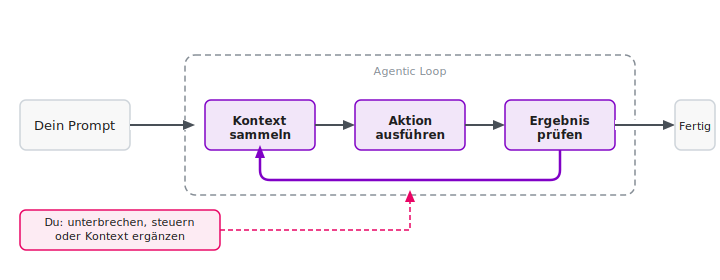
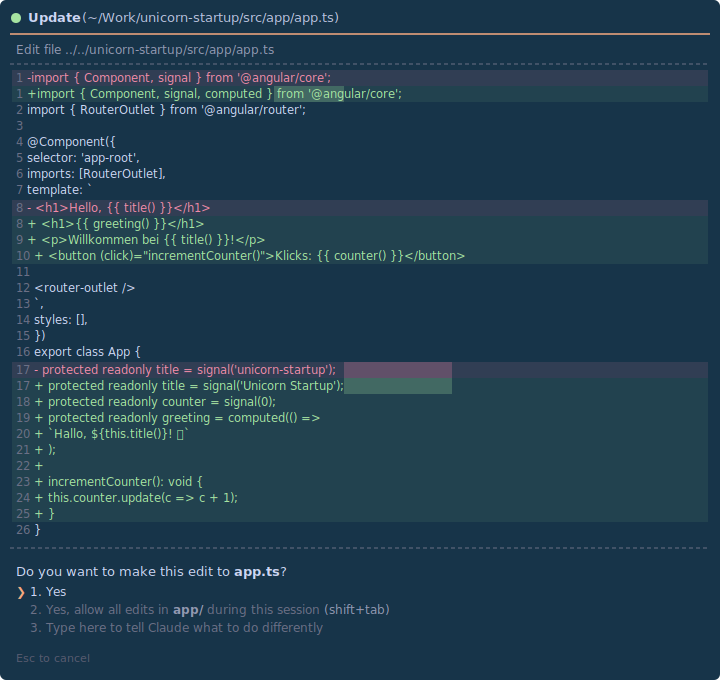
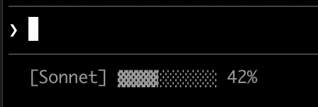
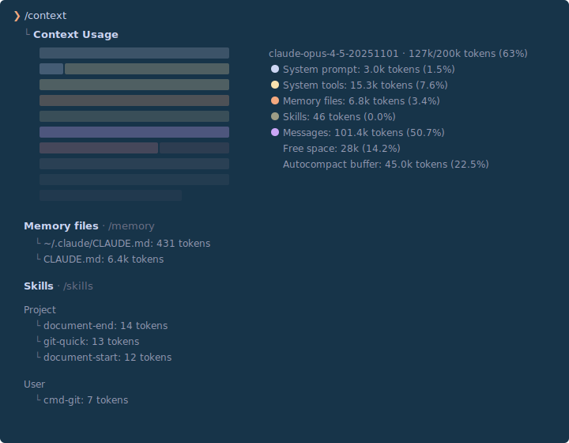
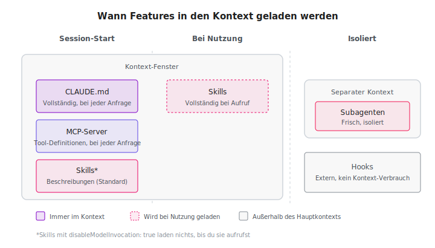
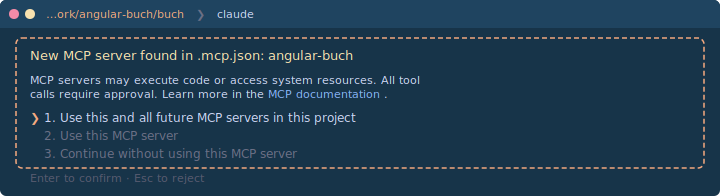

Es gab noch nie einen besseren Zeitpunkt, um Software zu entwickeln.
AI-Agenten wie Claude Code haben meinen Workflow grundlegend verändert – ich schreibe besseren Code in weniger Zeit.
**In diesem Artikel zeige ich dir, wie das funktioniert.
Ob du seit Jahren Angular entwickelst oder gerade erst anfängst: Die Einstiegshürde war noch nie so niedrig.**

Nach dem Lesen dieses Artikels weißt du, wie du Claude Code installierst, konfigurierst und für Angular-Projekte einsetzt – von der ersten Komponente bis zur CI-Pipeline.

## Inhalt

[[toc]]

## Was ist Claude Code?

Claude Code ist die CLI-Version von Claude, dem AI-Modell von Anthropic.
Der entscheidende Unterschied zum Browser-Chat: Claude Code arbeitet direkt in deinem Projekt.
Es liest deinen Code, versteht den Kontext und kann Änderungen selbst umsetzen.

Stell es dir so vor: Der Browser-Chat gibt dir nur Ratschläge.
Claude Code setzt sich aber an deinen Schreibtisch und erledigt die Arbeit. **Viel besser! 😎**

Konkret heißt das: Claude Code kann deine Dateien lesen und bearbeiten, Shell-Befehle ausführen, im Web nach Informationen suchen und sogar Bilder analysieren.
Der Agent entscheidet selbstständig, welche Schritte nötig sind, und arbeitet sie nacheinander ab – du siehst dabei immer, was gerade passiert.
Das klingt nach viel Macht – aber keine Sorge: Du behältst jederzeit die Kontrolle und kannst jeden Schritt bestätigen.



## Warum ein Terminal?

Auf den ersten Blick wirkt die Entscheidung für ein Terminal-Interface anachronistisch.
Warum keine schicke GUI mit Buttons und Menüs?
Warum kein Plugin für VS Code mit integriertem Panel?

Die Antwort liegt in einer interessanten Designentscheidung: Das Terminal zwingt zu radikaler Einfachheit.
Wenn dein Interface nur aus Text besteht, musst du jede Funktionalität entweder automatisieren oder über Slash-Befehle und Tastenkürzel zugänglich machen.
Es gibt keine Ausweichmöglichkeit in Form von "hier noch ein Button, dort noch ein Dropdown".

Diese Einschränkung ist gleichzeitig eine Stärke.
Anthropic muss sich bei jeder Funktion fragen: Kann der Agent das selbst erkennen und erledigen?
Oder ist es so häufig gebraucht, dass es einen kurzen Befehl verdient?
Das Ergebnis ist ein Interface, das überraschend gut funktioniert – gerade weil es so reduziert ist.

Klingt vielversprechend? Dann lass uns loslegen.

## Loslegen

### Installation

Die gute Nachricht: Die Installation dauert etwa eine Minute.
Claude Code selbst braucht nur ein unterstütztes Betriebssystem (macOS 10.15+, Windows 10+, oder Ubuntu 20.04+).
Für die Angular-Entwicklung sollte zusätzlich [Node.js](https://nodejs.org/) installiert sein.
Gut zu wissen: Claude Code schreibt gerne Shell-Skripte und nutzt für komplexere Aufgaben auch Python – stelle sicher, dass [Python](https://www.python.org/) installiert ist, wenn du das nutzen möchtest.

**macOS / Linux:**

```bash
curl -fsSL https://claude.ai/install.sh | bash
```

**Windows (PowerShell):**

```powershell
irm https://claude.ai/install.ps1 | iex
```

Nach der Installation startest du Claude Code einfach mit:

```bash
claude
```

Beim ersten Start wirst du aufgefordert, dich mit deinem Anthropic-Konto anzumelden.
Du benötigst ein Claude Pro-Abo (ca. 18 EUR/Monat) oder Max-Abo (ab 90 EUR/Monat für intensivere Nutzung).
Tipp: Wenn du jemanden kennst, der ein Max-Abo hat, kann diese Person dir mit `/passes` einen Einladungs-Code generieren – damit kannst du Claude Code eine Woche lang kostenlos testen.
Du kennst niemanden? Schreib uns an team@angular.schule – wir helfen gerne aus!

#### Der erste Start

Wenn du `claude` zum ersten Mal ausführst, passiert Folgendes:

1. **Theme-Auswahl:** Dark Mode oder Light Mode?
2. **Login:** Ein Browser-Fenster öffnet sich zur Authentifizierung
3. **Fertig:** Du siehst den Claude Code Prompt und kannst loslegen

Falls bei der Installation etwas nicht klappt: Keine Sorge!
Du kannst buchstäblich Claude (im Browser unter claude.ai) fragen, wie du Claude Code installierst.
Mach einen Screenshot der Fehlermeldung und frag nach einer Lösung – das ist keine Ironie, sondern ein praktikabler Ansatz.

#### Die ersten Gehversuche

Bevor du dich an komplexe Angular-Aufgaben wagst, empfehle ich, mit etwas Einfachem zu beginnen.
So bekommst du ein Gefühl für den Workflow:

```bash
cd ~/Documents
claude
```

Dann im Claude Code Prompt:

> Liste alle Dateien in diesem Ordner auf und erkläre kurz, was sie sind.

Claude Code wird die Dateien analysieren und dir eine Übersicht geben.
Dann probiere etwas Spannenderes:

> Erstelle mir eine HTML-Seite, die einen Taschenrechner simuliert.

> Ich habe hier ein TypeScript-Projekt. Erkläre mir die Architektur.

> Schreibe ein Shell-Skript, das alle node_modules-Ordner auf meinem Rechner findet und ihre Gesamtgröße anzeigt.

Du wirst merken: Das Ergebnis ist erstaunlich gut – und du hast keinen Code selbst geschrieben.
Sobald du dich mit der Interaktion vertraut gemacht hast, bist du bereit für den eigentlichen Workflow.

### Der Workflow – Ein Chat

Jetzt wird es konkret: Wie sieht die tägliche Arbeit mit Claude Code aus?
Am besten zeigt das ein Beispiel:

")

Wie du siehst, ist der Dialog iterativ: Du gibst eine Aufgabe, Claude Code arbeitet, und du steuerst nach.

#### Bestätigungen und Kontrolle

Im Standardmodus fragt Claude Code vor jeder Dateiänderung und jedem Shell-Befehl nach Bestätigung.
Du siehst einen Diff und wählst mit den Pfeiltasten: einmalig erlauben, für die gesamte Session erlauben oder ablehnen.
In der Praxis drücke ich meistens einfach nur Enter – das bestätigt die vorausgewählte Option.




Wenn du dem Ergebnis vertraust – oder dich einfach mal vom Bildschirm abwenden willst, ohne jeden Schritt zu kontrollieren – dann wähle mit den Pfeiltasten die zweite Option: für die gesamte Session erlauben.
Und für die ganz Mutigen gibt es den **YOLO-Modus** (`--dangerously-skip-permissions`): Hier läuft alles ohne Rückfrage durch.
Das ist praktisch in isolierten Umgebungen (Container, VMs, CI) – ich persönlich habe ihn noch nie benutzt. Ist mir zu gefährlich.

#### Die wichtigsten Befehle

Für den Anfang brauchst du nur vier Slash-Befehle:

- **`/help`** – wenn du nicht weiterweißt
- **`/clear`** – frische Session starten
- **`/compact`** – Kontext komprimieren, wenn die Session lang wird
- **`/cost`** – was hat die Session bisher gekostet?


Bei Problemen hilft **`/doctor`** – der Befehl prüft, ob alles korrekt eingerichtet ist.

Den Rest (es gibt noch viele mehr) lernst du nebenbei kennen – oder du fragst Claude Code einfach danach.
Updates passieren in der Regel automatisch. Falls nicht, hilft `claude update` auf der Kommandozeile.

Beim Arbeiten reicht es, `Ctrl+C` zum Abbrechen und `Ctrl+D` zum Beenden zu kennen.
Undo geht mit `Ctrl+_` (nicht `Ctrl+Z`!). Wer aus Gewohnheit `Ctrl+Z` drückt, suspendiert Claude Code – dann hilft `fg` in der Shell, um zurückzukehren.

Die Bedienung ist schnell verinnerlicht.
Doch die Qualität der Ergebnisse steht und fällt mit einem Faktor: dem Kontext.

### Kontext ist alles

Je mehr Claude Code über dein Projekt weiß, desto besseren Code liefert es.
Das klingt offensichtlich, ist aber der wichtigste Erfolgsfaktor beim Arbeiten mit AI-Agenten.

#### Dateien referenzieren

Der einfachste Weg, Kontext zu geben, ist das Referenzieren von Dateien.
Du kannst sie direkt in deiner Anfrage erwähnen:

> Schau dir src/app/user/user.service.ts an und füge eine Methode zum Löschen von Benutzern hinzu. Orientiere dich am Stil der bestehenden Methoden.

Claude Code liest die Datei automatisch und versteht den bestehenden Code.
Du kannst auch mehrere Dateien referenzieren, um Vergleiche anzustellen oder Muster zu übertragen:

> Vergleiche src/app/old/legacy.service.ts mit src/app/new/modern.service.ts. Was sind die Hauptunterschiede? Migriere den Legacy-Service zum modernen Pattern.

In den meisten Fällen findet Claude die relevanten Dateien selbstständig.
Mit `@` im Prompt kannst du die Dateipfad-Autovervollständigung nutzen, aber nötig ist das selten.

#### Bilder einbinden

Eine besonders praktische Funktion: Claude Code kann auch Bilder analysieren.
Ziehe einfach einen Screenshot oder ein Mockup per Drag & Drop ins Terminal und schreibe dazu:

> Setze dieses Design als Angular-Komponente um. Verwende Tailwind CSS für das Styling.

Das ist besonders nützlich, wenn du UI-Mockups in Komponenten umsetzen, Fehlermeldungen aus dem Browser analysieren oder Diagramme und Architekturbeschreibungen verstehen möchtest.

#### Das Kontext-Fenster

Es gibt allerdings eine technische Einschränkung: Jedes AI-Modell hat ein begrenztes Kontext-Fenster.
Bei Claude sind das aktuell etwa 200.000 Tokens – eine Menge, aber bei langen Sessions kann es passieren, dass frühere Informationen "vergessen" werden.
Was genau ein Kontext-Fenster ist und warum es so wichtig ist, erkläre ich im Detail im Artikel [Agentic Coding: AI-Unterstützung für Angular](../2026-02-agentic-coding#herausforderung-das-kontextfenster).
Ein Kontext-Fenster von 1 Million Tokens ist bereits in der Beta-Phase – das wird die Arbeit deutlich vereinfachen.

Wenn es knapp wird, zeigt Claude Code das in der Statusleiste an:




Mit `/context` siehst du genau, wie der verfügbare Platz aufgeteilt ist:




Wenn es eng wird, komprimiert Claude Code den bisherigen Verlauf automatisch durch eine Zusammenfassung (Auto-Compact) – das funktioniert mittlerweile recht zuverlässig.
Mit `/compact` kannst du das auch manuell auslösen und dabei angeben, was bei der Zusammenfassung nicht verloren gehen soll. Mit `/clear` startest du eine komplett frische Konversation – sinnvoll, wenn du ohnehin zu einer neuen Aufgabe wechselst.

Doch Kontext muss nicht nur spontan gegeben werden.
Viel eleganter ist es, projektspezifische Regeln dauerhaft zu hinterlegen.

### Projekt-Konfiguration

Claude Code lässt sich projektspezifisch konfigurieren, sodass es von Anfang an weiß, wie dein Projekt strukturiert ist und welchen Konventionen es folgen soll.

#### `CLAUDE.md` – Regeln für dein Projekt

Der einfachste Weg: Starte Claude Code in deinem Projekt und tippe `/init`.
Claude Code analysiert dann die Projektstruktur, erkennt das verwendete Framework, die Test-Konfiguration und die Coding-Konventionen – und generiert daraus eine passende `.claude/CLAUDE.md`.

Du kannst die Datei natürlich auch manuell anlegen oder die generierte Version anpassen.
Ein guter Ausgangspunkt sind die [Custom Prompts and System Instructions](https://angular.dev/ai/develop-with-ai) von Angular – ein umfangreiches Regelwerk, das Best Practices für TypeScript, Standalone Components, Signals, Accessibility und mehr abdeckt.

Hier ein stark gekürzter Auszug, um die Idee zu zeigen.
Tipp: Ich empfehle, die `CLAUDE.md` auf Englisch zu verfassen, weil Claude damit am besten arbeitet.
Wenn du sehen möchtest, welche Prompts und Regeln ich in meinen eigenen Projekten verwende, [schreib mir gerne](mailto:johannes.hoppe@haushoppe-its.de) – dieser Artikel ist schon lang genug.

```markdown
# Angular Best Practices (from angular.dev/ai/develop-with-ai)
- Always use standalone components over NgModules
- Use signals for state management
- Use `input()` and `output()` functions instead of decorators
- Set `changeDetection: ChangeDetectionStrategy.OnPush`
- Use native control flow (`@if`, `@for`) instead of `*ngIf`, `*ngFor`

# Project-specific rules
- Unit tests with Vitest (not Karma/Jasmine)
- Data access via services using the Resource API
- Feature folders under src/app/, shared code under src/app/shared/
- API base URL: https://api.example.com/v1
- All user-facing text must be i18n-ready
```

Neben den allgemeinen Angular-Regeln gehören also auch projektspezifische Informationen in die Datei: Test-Framework, API-Endpunkte, Ordnerstruktur, Konventionen des Teams.
In der Praxis sind `CLAUDE.md`-Dateien deutlich umfangreicher als dieses Beispiel.
Die Datei wird automatisch bei jedem Start geladen, und Claude Code befolgt diese Regeln bei allen Aufgaben.

Es gibt mehrere Orte, an denen du solche Regeln hinterlegen kannst:

| Ort | Geltungsbereich |
|-----|-----------------|
| `~/.claude/CLAUDE.md` | Global für alle Projekte |
| `CLAUDE.md` | Für einen beliebigen Ordner (oder `.claude/CLAUDE.md`) |
| `CLAUDE.local.md` | Persönlich, sollte in `.gitignore` stehen |

Claude Code durchsucht dabei die gesamte Verzeichnishierarchie:
Dateien in übergeordneten Ordnern werden beim Start geladen, Dateien in Unterordnern erst bei Bedarf.
So kannst du eine `CLAUDE.md` auch in einen Unterordner wie `src/` legen – sie wird geladen, sobald Claude dort Dateien liest.
Alle gefundenen Regeln werden kombiniert, wobei spezifischere Regeln Vorrang haben.

Du musst die `CLAUDE.md` nicht immer manuell bearbeiten.
Du kannst Claude auch direkt bitten, sich etwas zu merken – einfach in natürlicher Sprache:

> Merke dir: In diesem Projekt verwenden wir Vitest statt Karma.

Mit `/memory` kannst du alle gespeicherten Regeln einsehen und bearbeiten.



Regeln sind statisch – aber Angular entwickelt sich weiter. Für aktuelles Wissen braucht Claude Code mehr als Custom Prompts und Trainingsdaten.

### Angular MCP-Server

Eines der größten Probleme bei AI-Modellen ist veraltetes Trainingswissen.
Angular entwickelt sich schnell, und was vor einem Jahr Best Practice war, kann heute überholt sein.
Der MCP-Server (Model Context Protocol) der Angular CLI löst dieses Problem elegant.

MCP ermöglicht es Claude Code, auf aktuelle Angular-Dokumentation und Best Practices zuzugreifen – frisch und direkt von der Quelle.

#### Einrichtung

Die Konfiguration erfolgt in der Datei `.mcp.json` im Projekt-Root.
So muss die Datei aussehen – Claude kann sie natürlich auch direkt für dich erstellen:

```json
{
  "mcpServers": {
    "angular-cli": {
      "command": "npx",
      "args": ["-y", "@angular/cli", "mcp"]
    }
  }
}
```

#### Verfügbare Werkzeuge

Mit dieser Konfiguration stehen Claude Code zusätzliche Werkzeuge zur Verfügung:

**Standard-Werkzeuge (immer aktiv, unter anderem):**

| Werkzeug | Beschreibung |
|----------|--------------|
| `get_best_practices` | Aktuelle Angular-Coding-Guidelines |
| `search_documentation` | Durchsucht die offizielle Angular-Doku |
| `find_examples` | Code-Beispiele für moderne Features |
| `list_projects` | Identifiziert Apps und Libraries im Workspace |

**Experimentelle Werkzeuge (müssen aktiviert werden, unter anderem):**

| Werkzeug | Beschreibung |
|----------|--------------|
| `modernize` | Migriert zu modernen Patterns |
| `test` | Führt Unit Tests aus |
| `build` | Baut das Projekt |

Die experimentellen Werkzeuge aktivierst du mit dem `--experimental-tool`-Flag in der `.mcp.json`:

```json
{
  "mcpServers": {
    "angular-cli": {
      "command": "npx",
      "args": ["-y", "@angular/cli", "mcp", "--experimental-tool", "all"]
    }
  }
}
```

Du kannst diese Werkzeuge explizit anfordern:

> Frage den Angular MCP-Server nach Best Practices für Signal Forms.

Claude Code ruft dann aktuelle Informationen ab, die möglicherweise neuer sind als sein Trainingswissen.

> **Lesetipp:** Warum MCP für AI-gestützte Angular-Entwicklung so entscheidend ist und wie das Zusammenspiel von Agent und Tooling funktioniert, erkläre ich ausführlich in meinem Artikel [Agentic Coding: AI-Unterstützung für Angular](../2026-02-agentic-coding).

### Dein erstes Angular-Projekt mit Claude Code

Lass uns das Gelernte in einem konkreten Projekt zusammenführen.
Wichtig dabei: Der Angular MCP-Server sollte von Anfang an angebunden sein.
Nur so bekommt Claude Code Zugriff auf aktuelle Best Practices und generiert keinen veralteten Code.

Allerdings gibt es ein Henne-Ei-Problem: Die MCP-Konfiguration braucht ein Projektverzeichnis – das aber noch nicht existiert.
Die Lösung: Lass Claude Code zuerst das Projekt erstellen, starte dann neu, und arbeite ab da mit MCP-Anbindung weiter.

```bash
mkdir book-app && cd book-app
claude
```

Instruiere Claude Code, das Projekt zu erstellen und die MCP-Konfiguration anzulegen:

> Führe folgenden Befehl aus: ng new book-app --ai-config=claude --directory .
>
> Erstelle danach eine .mcp.json mit folgendem Inhalt:
> {
>     "mcpServers": {
>         "angular-cli": {
>             "command": "npx",
>             "args": ["-y", "@angular/cli", "mcp"]
>         }
>     }
> }

Das Flag `--ai-config=claude` generiert eine passende `CLAUDE.md` für das Projekt.
Die `.mcp.json` verbindet Claude Code mit dem Angular MCP-Server – allerdings erst beim nächsten Start.
Drücke `Ctrl+D` und starte mit `claude --resume`:




Jetzt kann es losgehen – mit MCP-Anbindung von Anfang an:

> Erstelle folgende Features für die App:
> - BookListComponent zeigt eine Liste von Büchern
> - Daten kommen über einen BookService von https://api.angular.schule/books
> - Verwende die Resource API und Signals
> - Routing: /books für die Liste, / für eine Startseite
> - Unit Tests für Service und Komponente
> - Starte den Dev-Server, wenn alles fertig ist

Du bestätigst jeden Schritt einzeln – oder erlaubst alles für die Session und lehnst dich zurück.
Am Ende hast du eine funktionsfähige Angular-App mit Routing, Service, Komponente, Tests und laufendem Dev-Server – aufgebaut mit aktuellen Best Practices, ohne eine Zeile Code selbst geschrieben zu haben.
Genau das ist der Punkt: Was früher ein halber Tag Setup war, erledigt Claude Code in einer Session.

### Praktische Beispiele

Die App steht. Im Alltag sind es aber oft andere Aufgaben, bei denen Claude Code seinen Wert zeigt.

#### Build-Fehler beheben

Einer meiner häufigsten Anwendungsfälle: den Build-Fehler direkt an Claude Code weitergeben.
Idealerweise hat Claude den Build selbst gestartet – dann sieht es das Problem und beginnt in der Regel sofort mit der Lösung.
Falls nicht, reicht ein kurzer Hinweis:

> Der Build schlägt fehl:
>
> Error: src/app/user/user.component.ts:15:5
> Property 'users' does not exist on type 'UserComponent'.
>
> Analysiere das Problem und behebe es.

Claude Code liest die betroffene Datei, versteht den umliegenden Code und schlägt eine Lösung vor.
Oft ist der Fix in Sekunden erledigt – inklusive Anpassung der Tests.

#### Legacy-Code modernisieren

Du hast ein Projekt mit NgModules, altem `subscribe()`-Pattern und `ngOnInit` überall?
Gib Claude Code einen klaren Auftrag:

> Migriere src/app/legacy/ von NgModules zu Standalone Components. Ersetze die HTTP-Calls durch die Resource API. Behalte die bestehende Funktionalität bei und aktualisiere die Tests.

#### Code Review + Fix in einem Schritt

Statt nur Probleme aufzulisten: Claude Code kann sie direkt beheben.

> Reviewe src/app/cart/ auf Performance-Probleme, Angular Best Practices und potenzielle Bugs. Behebe dann alles, was du findest.

Das Muster ist immer gleich: Beschreibe, was du willst – Claude Code liefert.

## Vertiefen

Soweit die Einrichtung. Ab hier geht es darum, das Beste aus Claude Code herauszuholen – und seine Grenzen zu kennen.

### Tipps für effektives Arbeiten

Nach einiger Zeit mit Claude Code wirst du Muster erkennen, die zu besseren Ergebnissen führen.
Hier die wichtigsten Erkenntnisse aus meiner Praxis.

#### Spezifisch sein

Die goldene Regel: Je präziser deine Anfrage, desto besser das Ergebnis.

```
❌ "Erstelle einen Service"

✅ "Erstelle einen BookService mit CRUD-Methoden,
   der die Resource API verwendet und Bücher von
   /api/books lädt. Orientiere dich am Stil von
   src/app/core/api.service.ts."
```

#### Iterativ statt perfektionistisch

Erwarte nicht, dass das erste Ergebnis perfekt ist.
Der Dialog ist interaktiv – und das ist eine Stärke:

```
Du: Erstelle eine Login-Komponente.
Claude: [erstellt Komponente]
Du: Füge Validierung hinzu.
Claude: [erweitert um Validierung]
Du: Die Fehlermeldungen auf Deutsch.
Claude: [passt Texte an]
```

Ein unterschätzter Trick: Lass Claude Code seine eigene Arbeit reviewen.
"Schau dir den Code nochmal an – folgt er den Angular Best Practices?" liefert oft überraschend gute Verbesserungen.

#### Erst planen, dann umsetzen

Meine wichtigste Empfehlung: Lass Claude Code nicht sofort losschreiben.
Nutze stattdessen den **Plan Mode**.

Im Plan Mode arbeitet Claude Code im Read-Only-Modus.
Es liest deine Codebase, stellt Rückfragen, analysiert die Architektur – und erstellt dann einen strukturierten Umsetzungsplan.
Erst wenn du den Plan freigibst, wird eine einzige Zeile Code geschrieben.

Du aktivierst den Plan Mode mit `Shift+Tab` (zweimal drücken) oder dem Befehl `/plan`.
Sobald der Plan steht, kannst du ihn bestätigen – erst dann beginnt Claude Code mit der Umsetzung.

Warum ist das so wichtig?
Wie [oben beschrieben](#das-kontext-fenster) ist das Kontext-Fenster begrenzt – bei größeren Aufgaben verliert der Agent ohne Plan schnell den Überblick.
Im Plan Mode strukturiert Claude seine "Gedanken" in einer Markdown-Datei, die auf der Festplatte liegt.
Selbst wenn du `/compact` ausführst oder der Kontext knapp wird – die Datei bleibt erhalten.
Falls Claude nach einem Compact den Faden verliert, reicht ein kurzes "Lies den aktuellen Plan nochmal ein" und er ist wieder auf Kurs.

Mein Workflow sieht deshalb so aus:
1. **Plan Mode an** (`Shift+Tab` 2x oder `/plan`)
2. **Aufgabe beschreiben**
3. **Plan reviewen** und bei Bedarf verfeinern
4. **Plan freigeben** – Claude Code setzt den Plan um

#### Thinking nutzen

Unabhängig vom Plan Mode gibt es noch eine weitere Stellschraube für die Qualität: Extended Thinking.
Dabei führt Claude Code vor jeder Antwort eine interne Reasoning-Schleife durch, in der es sich selbst promptet und das Problem "durchdenkt".
Es ist standardmäßig aktiv und lässt sich über `/config` ausschalten. Ich lasse es immer an.
Achtung: Ohne Max-Abo ist das Budget schnell aufgebraucht.

Plan Mode und Thinking verbessern die Ergebnisse. Aber Claude Code kann auch den Workflow drumherum vereinfachen – zum Beispiel bei Git.

#### Git-Integration

Du musst keine Commit-Messages mehr formulieren oder PR-Beschreibungen schreiben – Claude Code übernimmt das.

##### Commits erstellen

Gib einfach an, dass du einen Commit erstellen möchtest:

> Erstelle einen Commit für die aktuellen Änderungen.

Claude Code führt dann automatisch `git status` und `git diff` aus, analysiert alle Änderungen, schlägt eine passende Commit-Message vor und führt den Commit nach deiner Bestätigung aus.

##### Pull Requests

Auch Pull Requests lassen sich so erstellen:

> Erstelle einen Pull Request für diesen Branch.

Claude Code generiert einen PR mit aussagekräftigem Titel, einer Zusammenfassung der Änderungen und einem Test-Plan.
Voraussetzung ist die GitHub CLI (`gh`), die installiert und authentifiziert sein muss.

##### Code Reviews

Und wenn du wissen möchtest, ob deine Änderungen Probleme verursachen könnten:

> Analysiere die Änderungen im aktuellen Branch verglichen mit main. Gibt es potenzielle Probleme?

##### Empfehlung: Attribution abschalten

Standardmäßig fügt Claude Code jedem Commit einen Trailer hinzu: `Co-Authored-By: Claude ...` und `🤖 Generated with Claude Code`.
Das verrät sofort, dass ein AI-Agent mitgearbeitet hat – und das ist aus meiner Sicht unnötig.

In der Datei `~/.claude/settings.json` (global) oder `.claude/settings.json` (pro Projekt) kannst du das abschalten:

```json
{
  "attribution": {
    "commit": "",
    "pr": ""
  }
}
```

Damit sehen deine Commits genauso aus wie jeder andere Commit auch.

#### Plugins

Neben Git lässt sich Claude Code über ein [Plugin-System](https://code.claude.com/docs/en/discover-plugins) erweitern.
Im offiziellen Anthropic-Marketplace findest du fertige Plugins, die du direkt installieren kannst – ohne selbst etwas konfigurieren zu müssen.

Tippe `/plugin` und wechsle zum **Discover**-Tab, um die verfügbaren Plugins zu durchsuchen.
Die Installation geht direkt aus Claude Code:

```
/plugin install plugin-name@claude-plugins-official
```

Hier eine Auswahl nützlicher Plugins aus dem [offiziellen Marketplace](https://code.claude.com/docs/en/discover-plugins):

| Kategorie | Plugin | Beschreibung |
|-----------|--------|-------------|
| Git-Workflows | `commit-commands` | Commit, Push und PR-Erstellung als Slash-Befehle |
| Git-Workflows | `pr-review-toolkit` | Spezialisierte Agents für PR-Reviews |
| Integrationen | `github` | Direkte GitHub-Integration via MCP |
| Integrationen | `linear`, `asana`, `notion` | Projektmanagement-Tools anbinden |
| Integrationen | `figma` | Designs direkt in Claude Code laden |
| Integrationen | `sentry` | Fehlermonitoring einbinden |
| Code-Intelligenz | `typescript-lsp` | Typprüfung und Navigation für TypeScript |
| Autonomie | `ralph-loop` | Iterative Schleifen – Claude arbeitet autonom, bis die Aufgabe erledigt ist |

Nach der Installation stehen die Plugins sofort als Slash-Befehle zur Verfügung, z. B. `/commit-commands:commit`.
Gerade für den Einstieg ist das praktischer, als jeden Workflow in natürlicher Sprache zu formulieren.

##### Ralph Loop – autonome Iteration

Besonders hervorzuheben ist das `ralph-loop`-Plugin, benannt nach Ralph Wiggum aus den Simpsons – der Junge, der einfach weitermacht, egal was passiert.
Genau das ist das Prinzip: Claude Code arbeitet in einer Schleife an einer Aufgabe und gibt nicht auf, bis sie erledigt ist.
Nach jedem Durchlauf prüft ein Hook, ob ein definiertes Erfolgskriterium erfüllt wurde.
Falls nicht, wird der ursprüngliche Prompt erneut eingespeist – und Claude sieht die bisherigen Änderungen im Dateisystem und in der Git-History.


<small>Quelle: [langchain-ai/deepagents](https://github.com/langchain-ai/deepagents/blob/main/examples/ralph_mode/ralph_mode_diagram.png) (MIT-Lizenz)</small>

So lassen sich z. B. TDD-Zyklen, Refactorings oder Migrationen automatisieren.
Ein `--max-iterations`-Limit schützt dabei vor endlosen Schleifen und unkontrollierten Kosten.

Doch bei aller Begeisterung: Claude Code ist nicht perfekt.

### Wo Claude Code an Grenzen stößt

Kein Tool ist fehlerfrei, und Transparenz ist mir wichtiger als Hype.
Hier sind die Schwächen, die du kennen solltest:

- **Halluzinationen:** Claude Code erfindet manchmal APIs oder Funktionen, die es nicht gibt. Besonders bei seltenen Libraries passiert das. Prüfe alle Aussagen – und geh nicht davon aus, dass etwas wirklich nicht geht oder nicht vorhanden ist. Im Zweifel verlange eine Web-Recherche.

- **Veraltetes Wissen:** Das Trainings-Wissen hat ein Ablaufdatum. Dagegen hilft der [Angular MCP-Server](#angular-mcp-server).

- **Große Refactorings:** Bei Änderungen über viele Dateien hinweg verliert Claude Code manchmal den Überblick. Teile komplexe Aufgaben lieber in kleinere Schritte auf.

- **Tests mit wenig Substanz:** Die generierten Tests sehen auf den ersten Blick gut aus, haben aber oft schwache Assertions. `expect(component).toBeTruthy()` testet genau nichts.

- **Übereifer:** Manchmal "verbessert" Claude Code Dinge, die du gar nicht ändern wolltest. Sei in deinen Anfragen spezifisch, was sich ändern soll – und was nicht.

Doch es gibt auch ernsthaftere Risiken:

- **Prompt Injections:** Claude Code liest Dateien, Webseiten und MCP-Antworten – und kann versteckte Anweisungen darin als legitime Befehle interpretieren. Ein HTML-Kommentar in einer README, eine manipulierte Dependency oder ein vergifteter MCP-Server reichen aus, damit der Agent ungewollt Code ausführt oder Daten exfiltriert. Das ist kein theoretisches Risiko: Sicherheitsforscher haben [acht verschiedene Wege gefunden, in Claude Code Befehle ohne Bestätigung auszuführen](https://flatt.tech/research/posts/pwning-claude-code-in-8-different-ways/) (inzwischen gepatcht). Auch [Homograph-Angriffe](https://x.com/sheeki03/status/2018382483465867444) – bei denen ein kyrillisches Zeichen einen Befehl optisch identisch, aber funktional anders macht – werden durch "Vibe Coding" gefährlicher, weil Befehle oft ungeprüft übernommen werden.

- **Datenverlust:** Eine falsch verstandene Anweisung kann Dateien löschen oder überschreiben. Im Dezember 2025 hat Googles AI-Coding-Tool Antigravity (mit Gemini 3 Pro) im autonomen Modus das [gesamte Laufwerk D: eines Entwicklers gelöscht](https://www.theregister.com/2025/12/01/google_antigravity_wipes_d_drive/). Das war nicht Claude Code – aber das Risiko ist grundsätzlich bei jedem AI-Agenten vorhanden, der Shell-Befehle ausführt.

Keine dieser Schwächen ist ein Grund, Claude Code nicht zu nutzen – aber jede ist ein Grund, den generierten Code zu reviewen.
Gegen die ernsthafteren Risiken hilft eine isolierte Umgebung.

### Docker Sandbox

Wer auf Nummer sicher gehen will, startet Claude Code in einer [Docker Sandbox](https://docs.docker.com/ai/sandboxes/).
Du brauchst dafür Docker Desktop ab Version 4.58 und mindestens macOS 14 (Sonoma), Windows 10/11 oder Linux.
Statt:

```bash
claude
```

einfach folgendes eingeben:

```bash
docker sandbox run claude .
```

Die [Docker Sandbox](https://docs.docker.com/ai/sandboxes/) isoliert Claude Code in einer microVM – das ist eine leichtgewichtige virtuelle Maschine, die stärker isoliert als ein normaler Docker-Container.
Während Container sich den Kernel mit dem Host teilen (und [ein Ausbruch daher möglich ist](https://northflank.com/blog/your-containers-arent-isolated-heres-why-thats-a-problem-micro-vms-vmms-and-container-isolation)), hat eine microVM ihren eigenen Kernel – ein AI-Agent kann also selbst mit Root-Rechten nicht aus der Sandbox ausbrechen.
Du musst dich in der Sandbox einmalig neu einloggen (oder einen API-Key als Umgebungsvariable übergeben), aber danach bleibt die Sandbox bestehen, bis du sie explizit löschst.

Das Beste: Du merkst kaum einen Unterschied zur normalen Arbeit.
Dein Projektverzeichnis wird bidirektional synchronisiert unter dem gleichen absoluten Pfad wie auf dem Host.

> "This is file synchronization, not volume mounting. Files are copied between host and VM." ([Quelle](https://docs.docker.com/ai/sandboxes/architecture/))

Alles andere ist komplett isoliert: eigenes Dateisystem, eigenes Home (`/home/agent/`) und eine eigene Docker-Umgebung – der Agent kann darin Container starten, ohne deine Host-Container zu sehen.
Wie die Architektur im Detail funktioniert, beschreibt Docker in der [Sandbox-Architektur-Dokumentation](https://docs.docker.com/ai/sandboxes/architecture/).
Wichtig zu wissen: Docker Desktop und damit die AI Sandbox ist [keine Open-Source-Software](https://docs.docker.com/subscription/desktop-license/), sondern ein Mix aus Open-Source-Komponenten und proprietärem Code. Nur die Docker Engine selbst ist vollständig Open Source. Die genaue Implementierung der Sandbox-Synchronisation ist daher nicht einsehbar. Du vertraust hier einer Black Box.

Die Sandbox sichert die interaktive Nutzung ab. Doch Claude Code funktioniert auch ganz ohne Chat – vollständig automatisiert.

### Headless-Modus und CI

Claude Code lässt sich auch non-interaktiv nutzen – ohne Chat, ohne Bestätigungen.
Mit dem Flag `-p` (für "prompt") gibst du eine Aufgabe direkt auf der Kommandozeile mit:

```bash
claude -p "Analysiere src/app und liste alle Komponenten ohne Unit Tests auf."
```

Claude Code führt die Aufgabe aus und gibt das Ergebnis auf `stdout` aus – ideal für Shell-Skripte, Git Hooks oder CI/CD-Pipelines.
In Kombination mit `--dangerously-skip-permissions` und der Docker Sandbox lässt sich so ein vollständig autonomer Agent in einer isolierten Umgebung betreiben.

## Fazit

Claude Code hat meine tägliche Arbeit verändert.
Nicht weil es perfekt ist – das ist es nicht.
Sondern weil es die langweiligen Teile der Entwicklung übernimmt: Boilerplate, Tests, Konfiguration, Commit-Messages.
Das gibt mir mehr Zeit für die Dinge, die wirklich zählen: Architektur, Nutzererlebnis und kreative Problemlösung.

Dabei ist Angular nur der Anfang.
Claude Code kann genauso gut READMEs schreiben, Shell-Skripte erstellen, CSV-Dateien analysieren oder dir RxJS Observables erklären.
Es ist ein universelles Werkzeug – du bestimmst, wofür du es einsetzt.

Fang einfach an. Installiere Claude Code, öffne ein Projekt, tippe `/init` und gib eine erste Aufgabe.
Der Rest ergibt sich.

<hr>

<small>**Titelbild:** generiert mit Adobe Firefly 3</small>
