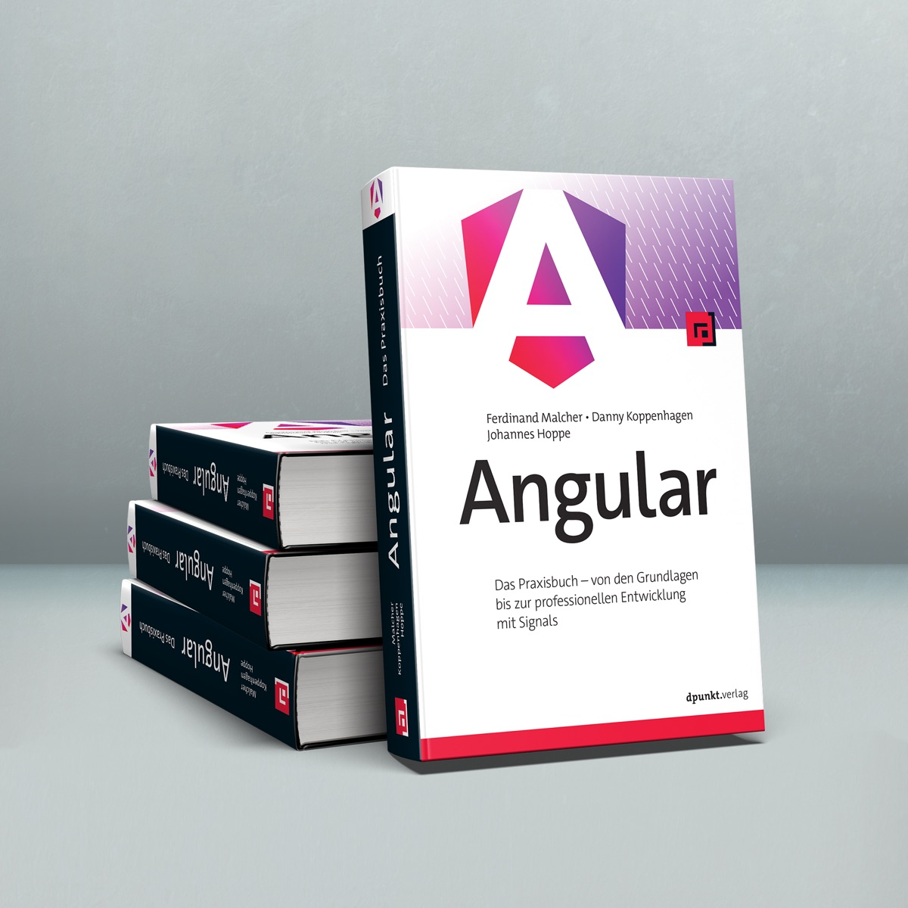
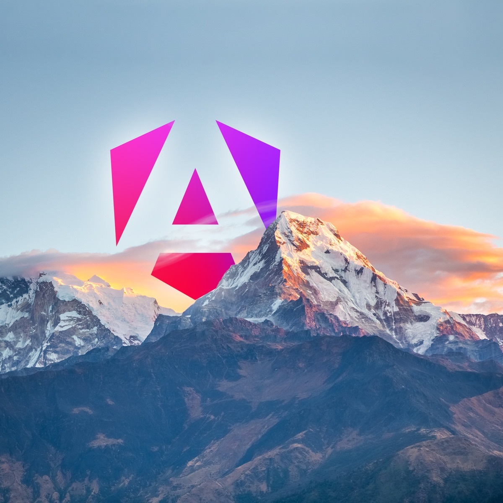
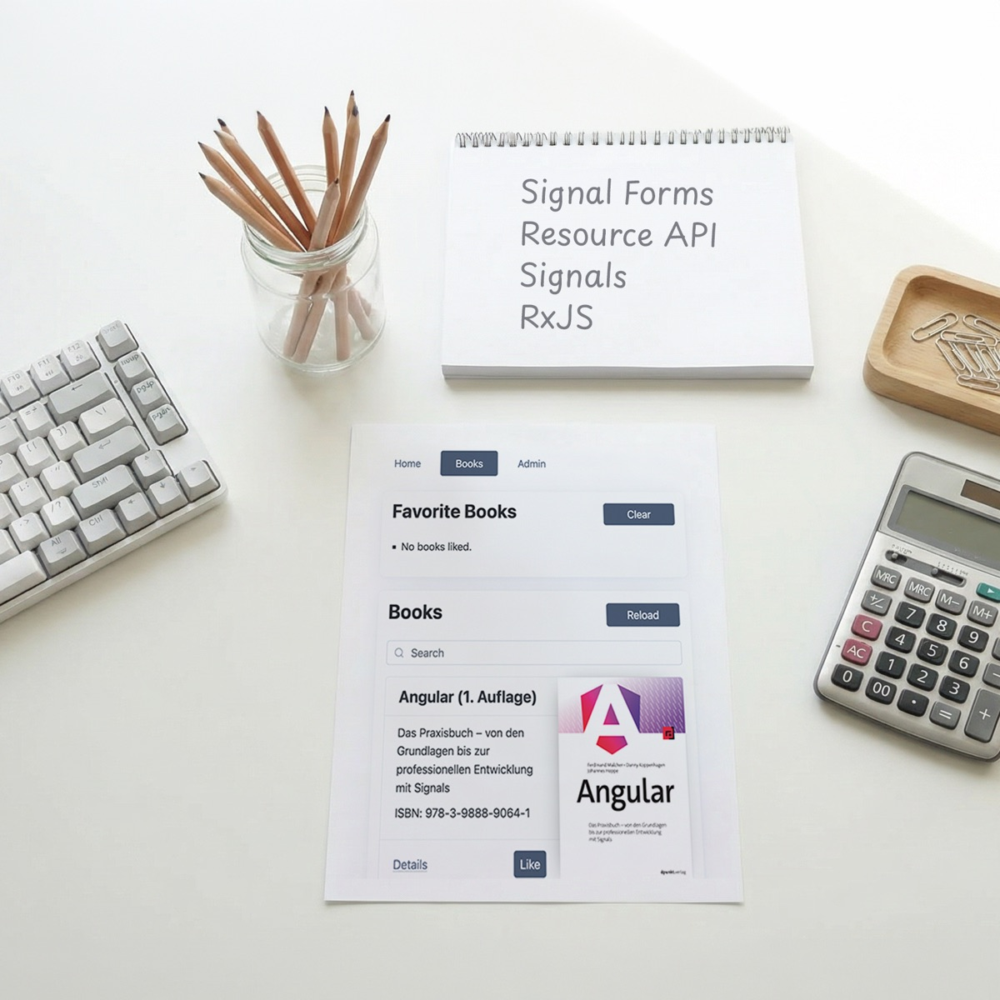
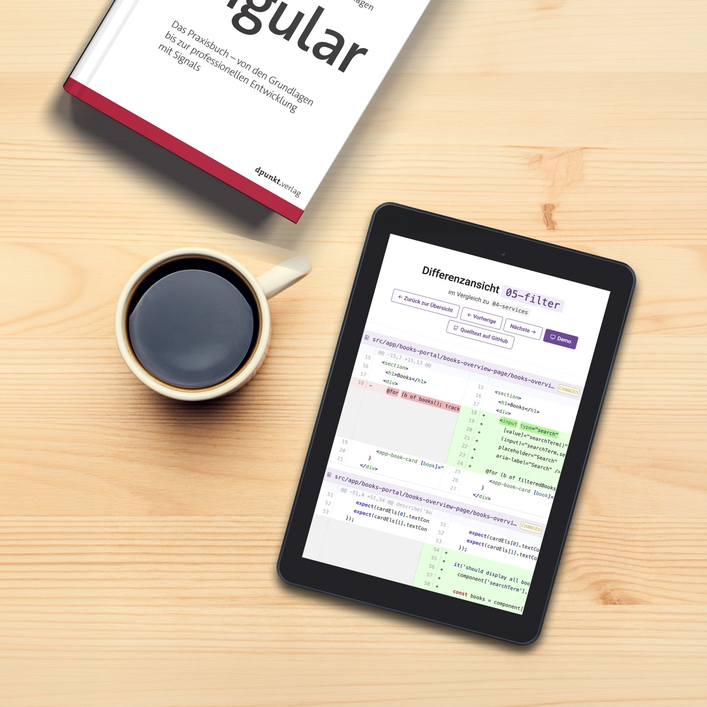

**Das neue deutschsprachige Angular-Buch ist da!**
Ab sofort ist die neue 1. Auflage des bewährten Standardwerks im Handel verfügbar.

Wir präsentieren dir einen praktischen Einstieg in das Webframework Angular.
Nach vier erfolgreichen Vorauflagen war es Zeit für einen echten Neuanfang: Wir haben das Buch nicht überarbeitet, sondern von der ersten bis zur letzten Seite neu geschrieben.
Beispielprojekt, Texte und Aufbau sind vollständig neu entstanden.
Es war unser Ziel, ein umfangreiches Nachschlagewerk zu schaffen, das dich auch über die kommenden Angular-Versionen hinweg zuverlässig begleitet.

Alle Inhalte sind auf dem aktuellen Stand von Angular 22.
Die neuesten Themen aus der Angular-Welt haben wir von Anfang an berücksichtigt: Reaktivität mit Signals, die Resource API, Signal Forms, Barrierefreiheit (a11y), KI-Unterstützung für Angular und Unit-Testing mit Vitest.
Damit ist das Buch auch für die kommenden Versionen des Angular-Frameworks geeignet.

Das Buch ist zum Preis von 39,90 € in jeder Buchhandlung und im Online-Handel erhältlich.
Eine Übersicht haben wir unter **["Jetzt kaufen"](/kaufen)** zusammengestellt.

> **Das Buch ist auch als E-Book erhältlich – in den Formaten PDF, ePub und Mobi sowie im Bundle (Print + E-Book). Alle Bezugsquellen findest du unter ["Jetzt kaufen"](/kaufen).**

## Das große Praxisbuch zu Angular!

Mit einem anspruchsvollen Beispielprojekt führen dich die Autoren durch die Welt von Angular.
Entwickle Schritt für Schritt eine umfangreiche Single-Page-Anwendung und übe Angular im praktischen Einsatz.
Mit seinen umfangreichen Theorieteilen ist dieses Buch außerdem dein praktischer Begleiter im Entwicklungsalltag.
Die Autoren sind erfahrene Workshopleiter, Entwickler und internationale Konferenzsprecher.
In diesem praxisorientierten Buch verpacken die drei Autoren ihr Wissen aus über zehn Jahren täglicher Arbeit mit Angular.
Aufgrund ihres Engagements rund um Angular wurden Ferdinand und Johannes als Google Developer Experts (GDE) ausgezeichnet.

### Aus dem Inhalt:

* Komponenten und Signals
* Template-Syntax, Bindings und Control Flow
* Angular CLI und Testing
* Services, Routing und Formularverarbeitung
* Direktiven und Pipes
* Reaktive Programmierung mit RxJS
* Lazy Loading
* Deployment und Best Practices
* Barrierefreiheit (a11y)

Erste Kenntnisse in JavaScript und HTML sind von Vorteil, aber keine Voraussetzung.
Wer nicht mit TypeScript vertraut ist, findet eine fundierte Einführung in unseren Online-Kapiteln.
Auf der Website zum Buch veröffentlichen wir außerdem regelmäßig Aktualisierungen und Neuigkeiten rund um Angular.

### Das erwartet dich:

* auf dem aktuellen Stand von Angular 22 und für kommende Versionen geeignet
* komplett neu geschrieben und neu strukturiert
* mit den neuesten Themen aus der Angular-Welt:
  * Reaktivität mit Signals
  * Resource API
  * Signal Forms
  * KI-Unterstützung für Angular
  * Unit-Testing mit Vitest

### Online verfügbar: das komplette Beispielprojekt zum Buch

Anhand eines durchgängigen Beispielprojekts führen wir dich schrittweise an die Entwicklung mit Angular heran.
Du erhältst den vollständigen Quelltext, Demos und eine Differenzansicht, mit der du die Entwicklung zwischen den Praxiskapiteln schnell nachvollziehen kannst.
Auf jeden Umsetzungsschritt folgen außerdem umfangreiche Unit- und Integrationstests.
Das [Beispielprojekt „BookManager"](https://bm1.angular-buch.com) läuft bereits auf Angular 22.

### Zusatzthemen als Online-Kapitel

Neben dem gedruckten Buch stellen wir ausgewählte Themen als Online-Kapitel bereit.
Hier vertiefen wir Inhalte, die den Rahmen des Buchs sprengen würden, und greifen weiterführende Konzepte auf.
Die Online-Kapitel werden regelmäßig aktualisiert und erweitert:

* [Einführung in TypeScript](/material/typescript)
* [Direktiven: Logik für DOM-Elemente](/material/directives)
* [Content Projection: Inhalte an Komponenten übergeben](/material/content-projection)
* [Interceptors: HTTP-Requests erfassen und transformieren](/material/interceptors)
* [Formulare mit Reactive Forms](/material/reactive-forms)
* [Formulare mit Template-Driven Forms](/material/template-forms)
* [Resolvers: Daten beim Routing vorladen](/material/resolvers)
* [Server-Side Rendering (SSR) mit Angular](/material/ssr)
* [Lokalisierung (l10n) und Internationalisierung (i18n) mit Angular](/material/i18n)
* und viele weitere folgen

## Hintergrund

Die Welt der Webentwicklung bewegt sich schnell, und ein Framework wie Angular wächst mit dem Puls der Zeit.
Seit dem Release der ersten Ausgabe unseres Buchs hat sich viel verändert.
In den letzten Auflagen haben wir versucht, auf neue Features und neu etablierte Techniken zu reagieren und das Buch aktuell zu halten.
In unserem [Blog](/blog) informieren wir außerdem kurzfristig über neue Features und Änderungen.

Die vierte Auflage dieses Buchs erschien im Februar 2023 und war auf dem Stand von Angular 15.
Seitdem hat sich Angular grundlegend gewandelt: Signals sind zum zentralen Reaktivitätsprimitiv geworden, die Resource API und Signal Forms haben die Arbeit mit Daten und Formularen neu definiert, und mit Vitest steht ein moderner Test-Runner bereit.

Wir haben uns deshalb die Zeit genommen, das Buch von Grund auf neu zu erarbeiten.
Ganz bewusst wollten wir das Buch nicht nur aktualisieren, sondern als neue 1. Auflage einen frischen Start wagen.
Wir haben das Beispielprojekt von Grund auf neu entwickelt, die Inhalte und die Reihenfolge der Kapitel kritisch hinterfragt, ganze Kapitel neu verfasst und auch Texte entfernt, die nach unserer Einschätzung nicht mehr relevant waren.
Durch den stetigen Austausch bei unseren [Angular-Schulungen](https://angular.schule), in Kundenprojekten und mit der Community konnten wir die Schwerpunkte neu setzen und den didaktischen Aufbau des Buchs verfeinern.

Das Buch ist auf dem aktuellen Stand von Angular 22.
Damit decken wir den signalbasierten, reaktiven Ansatz von Angular fundiert ab – von Komponenten mit Signals über die Resource API bis zu Signal Forms.
Auch die KI-Unterstützung für die Angular-Entwicklung und das Unit-Testing mit Vitest behandeln wir ausführlich.

Weiterhin werden wir in unseren Blogartikeln über neue Features in Angular informieren.
Den Code zum Beispielprojekt aus dem Buch werden wir regelmäßig aktualisieren.
Sollten Breaking Changes auftreten, findest du die wichtigsten Infos dazu immer in unserem Blog.

Wir freuen uns, dass das neue Buch nach intensiver Arbeit nun im Handel erhältlich ist – und wir hoffen, dass es dein treuer Begleiter bei der täglichen Arbeit mit Angular wird!

Solltest du Feedback, Anmerkungen oder Fragen haben, zögere nicht, uns zu schreiben!
Wir sind per Mail unter [team@angular-buch.com](mailto:team@angular-buch.com) für dich da.

Mit besten Grüßen –
das Autorenteam 
**Ferdinand Malcher, Danny Koppenhagen und Johannes Hoppe**

<a class="btn btn-outline-primary cta__button index__cta mr-2 mb-2" role="button" target="_blank" href="https://angular-buch.com/assets/angular-buch-leseprobe-auflage1.pdf">Kostenlose Leseprobe </a>
<a class="btn btn-primary cta__button mb-2" role="button" target="_blank" href="/kaufen">Jetzt bestellen</a>
