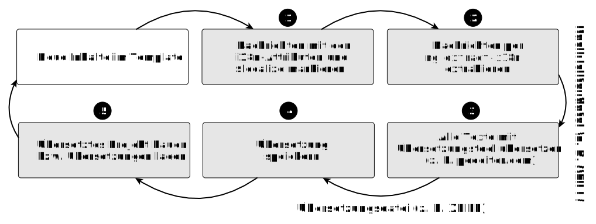

In diesem Artikel geht es darum, wie wir unsere Angular-Anwendung in mehreren Sprachvariationen bauen und ausliefern können.
Dabei betrachten wir zunächst die Lokalisierung (l10n) für ein einzelnes Locale und anschließend die vollständige Internationalisierung (i18n) mit dem Übersetzungstooling der Angular CLI.

Anwendungen im Internet werden von Menschen aus verschiedenen Sprachräumen genutzt.
Deshalb müssen wir die Software in mehreren Sprachen anbieten können -- und die Übersetzung der Texte möglichst zentral halten, damit Anpassungen schnell möglich sind und die Arbeit an Übersetzer ausgelagert werden kann.
Angular bringt dafür ein eigenes i18n-Tooling mit, das uns bei Extraktion, Übersetzung und Auslieferung unterstützt.

## Inhalt

[[toc]]


## Lokalisierung vs. Internationalisierung

Bevor wir loslegen, klären wir zwei zentrale Begriffe.

Unter **Lokalisierung** (kurz: **l10n**) versteht man die Anpassung einer Anwendung für einen spezifischen Sprachraum (*Locale*).
Dazu gehören:

- Darstellung von Datums- und Zeitformaten
- Formatierung von Zahlen
- Darstellung von Währungen
- Schreibrichtung

Das Wort *localization* besteht aus 10 Buchstaben zwischen dem ersten Buchstaben *l* und dem letzten Buchstaben *n* -- daher die Abkürzung l10n.
Zum Beispiel wird als Dezimaltrennzeichen im deutschsprachigen Raum ein Komma verwendet, im Englischen hingegen ein Punkt.

Unter **Internationalisierung** (kurz: **i18n**) versteht man die weitergehende Anpassung für mehrere Sprachen und Kulturen.
Das Wort *internationalization* besteht aus 18 Buchstaben zwischen *i* und *n*.
Hier geht es zusätzlich darum, die Texte der Anwendung in mehreren Sprachen vorzuhalten und bei Bedarf die richtige Sprache zu laden.
Prinzipiell kann man unter den Begriffen i18n und l10n viele Aufgaben zusammenfassen:
Neben Texten und Formaten gilt es auch, Währungen, Zeitzonen und Schreibrichtungen nicht zu vergessen.
Weiterhin werden unter anderem Farben und Bilder in verschiedenen Kulturkreisen unterschiedlich interpretiert.
Eines wird hier schnell klar: Eine Anwendung für mehrere Länder auszurichten, ist eine große Aufgabe.

Wir wollen in diesem Artikel zunächst betrachten, wie wir die Anwendung für einen spezifischen Sprachraum lokalisieren.
Danach lernen wir, wie mehrsprachige Anwendungen für mehrere Locales umgesetzt werden.


## Lokalisierung (l10n): Die Anwendung für ein Locale einrichten

Viele eingebaute Pipes von Angular benötigen Informationen zur Lokalisierung, um die Daten korrekt zu formatieren.
Ohne weitere Konfiguration ist automatisch das Locale `en-US` gesetzt, also US-amerikanisches Englisch.
Die DatePipe verwendet für die Datumsformatierung damit stets die englischen Formate, z. B. `July 15, 2022`.
Auch die DecimalPipe zur Zahlformatierung und die CurrencyPipe zur Anzeige von Währungen richten sich nach dem eingestellten Locale.

### Locale einstellen

Ist die Anwendung nur für einen Sprachraum bestimmt, z. B. nur innerhalb eines national agierenden Unternehmens, können wir die Sprache fest einstellen.
Wollen wir die deutsche Lokalisierung verwenden, können wir das Locale auf den Wert `de` stellen.

Die Einstellung hierfür verbirgt sich in dem InjectionToken `LOCALE_ID`.
Um das Token mit dem gewünschten Wert zu überschreiben, müssen wir einen Provider registrieren.
Zusätzlich muss eine konkrete Sprachdefinition geladen werden.
Nur so kann Angular wissen, welche spezifischen Regeln für das eingestellte Locale gelten.
In einer Standalone-Anwendung registrieren wir den Provider direkt in der `main.ts` bei `bootstrapApplication()`.
Die Sprachdefinition laden wir über einen globalen Import:

```typescript
import '@angular/common/locales/global/de';
import { bootstrapApplication } from '@angular/platform-browser';
import { LOCALE_ID } from '@angular/core';
import { App } from './app/app';
import { appConfig } from './app/app.config';

bootstrapApplication(App, {
  ...appConfig,
  providers: [
    ...(appConfig.providers || []),
    { provide: LOCALE_ID, useValue: 'de' }
  ]
});
```

Durch den Import von `@angular/common/locales/global/de` wird die deutsche Sprachdefinition global registriert.
Angular kennt damit automatisch die spezifischen Regeln für das Locale `de`.

Starten wir nun die Anwendung mit den Änderungen neu, können wir die Auswirkungen direkt erkennen:
Das Datum wird im deutschsprachigen Format ausgegeben, z. B. `15. Juli 2022`.

Das Locale und die Sprachdefinition bilden eine Einheit.
Mit der Einstellung `LOCALE_ID` legen wir fest, welche spezifischen Formatierungsoptionen wir für Datumsangaben, Zahlen- und Währungsformate wünschen.
In der Sprachdefinition sind alle Informationen vorhanden, die dafür notwendig sind.
So finden wir unter anderem in der deutschen Sprachdefinition die Namen für die Monate und Wochentage, das Komma als Dezimaltrennzeichen und den Euro als Währung.

### Mehrere Sprachdefinitionen laden

Das Token `LOCALE_ID` legt das aktive Locale fest und bestimmt damit die gerade anzuwendende Sprachdefinition.
Da die Dependency Injection von Angular hierarchisch organisiert ist, kann man bei Bedarf die `LOCALE_ID` auch mit unterschiedlichen Werten bereitstellen und so in definierten Teilen der Applikation unterschiedliche Lokalisierungen einsetzen.

Um die aktuell eingestellte Sprache zu prüfen, können wir das Token `LOCALE_ID` mit `inject()` injizieren und den Wert ausgeben:

```typescript
import { Component, inject, LOCALE_ID } from '@angular/core';

@Component({ /* ... */ })
export class MyComponent {
  locale = inject(LOCALE_ID);

  constructor() {
    // Ausgabe: "Current Locale: de"
    console.log('Current Locale:', this.locale);
  }
}
```

Sollen mehrere Sprachdefinitionen parallel verfügbar sein, können wir weitere globale Importe hinzufügen:

```typescript
import '@angular/common/locales/global/de';
import '@angular/common/locales/global/fr';
```

Außerdem können wir das Locale setzen, indem wir die Einstellungen der Angular CLI verwenden.
Das ist besonders dann interessant, wenn wir beim Build festlegen wollen, für welche Sprache die Anwendung erzeugt werden soll.
Die passenden Optionen stellen wir im nachfolgenden Abschnitt zur Internationalisierung genauer vor.
Wenn wir das Locale beim Build bestimmen, wird praktischerweise bereits die dazu passende Sprachdefinition automatisch geladen.
Ein manueller Aufruf von `registerLocaleData()` ist dann nicht mehr notwendig.

### Pipes mit einem spezifischen Locale nutzen

Einige der eingebauten Pipes besitzen ein optionales Argument, um ein spezifisches Locale zu setzen.
Geben wir ein Locale explizit an, wird es von der Pipe bei der Darstellung berücksichtigt, und das global eingestellte Locale wird ignoriert.
Damit die Formatierung funktioniert, muss das angegebene Locale bereits in der Anwendung bekannt gemacht worden sein, so wie wir es im vorhergehenden Abschnitt beschrieben haben.

```html
<p>{{ myDate | date: 'longDate':'+0200':'de' }}</p>
<!-- Ausgabe: 7. August 2023 -->
<p>{{ 13.674566 | number: '1.2-3':'de' }}</p>
<!-- Ausgabe: 13,675 -->
<p>{{ 2.456 | currency: 'EUR':'EUR':'1.2-2':'de' }}</p>
<!-- Ausgabe: 2,46 EUR -->
<p>{{ 0.77 | percent: '1.2-2':'de' }}</p>
<!-- Ausgabe: 77,00 % -->
```

### Format-Funktionen im TypeScript-Code

Wenn wir die Hilfsfunktionen zur Formatierung im TypeScript-Code nutzen, müssen wir immer auch ein Locale angeben.
Hier ist es empfehlenswert, direkt das global eingestellte Locale aus dem Token `LOCALE_ID` zu verwenden:

```typescript
import { Component, inject, LOCALE_ID } from '@angular/core';
import { formatDate, formatCurrency,
  formatPercent, formatNumber } from '@angular/common';

@Component({ /* ... */ })
export class MyComponent {
  #locale = inject(LOCALE_ID);
  myDate = new Date();

  constructor() {
    formatDate(this.myDate, 'longDate', this.#locale);
    formatNumber(13.674566, this.#locale, '1.2-3');
    formatCurrency(2.456, this.#locale, 'EUR', 'EUR');
    formatPercent(0.77, this.#locale);
  }
}
```


## Internationalisierung (i18n): Die Anwendung übersetzen

Im vorhergehenden Abschnitt zur Lokalisierung haben wir betrachtet, wie wir Formate für ein einzelnes Locale anpassen.
Nun geht es darum, die Anwendung mehrsprachig anzubieten.
Bei der Übersetzung von Texten hilft uns das i18n-Tooling der Angular CLI.

Dafür müssen wir zunächst alle Texte in der Anwendung markieren.
Sie können anschließend extrahiert und zentral übersetzt werden.
Danach können wir aus zwei Varianten wählen, *wann* die übersetzten Texte in die Anwendung eingebaut werden sollen: beim Build oder zur Laufzeit.

Wir wollen zunächst den Fokus darauf legen, die Übersetzungen zur Build-Zeit einzubauen.
Im letzten Teil schauen wir uns dann den zweiten Ansatz an:
Hier laden wir die Übersetzungen zur Laufzeit der Anwendung aus einer Datei herunter.

Als Alternative zu diesen Ansätzen haben sich mehrere Community-Projekte herausgebildet, mit denen wir die Übersetzungen zur Laufzeit laden und in die Anwendung integrieren können.
Wir betrachten in diesem Artikel jedoch nur das mitgelieferte Tooling von Angular.

### Der Übersetzungsprozess in Angular

Der grundlegende Prozess für die Übersetzung ist zunächst unabhängig davon, ob wir die Texte zur Build- oder Laufzeit laden möchten.
Folgende Schritte sind immer notwendig:

1. Nachrichten im Quellcode markieren
2. Nachrichten aus der Anwendung extrahieren
3. Nachrichten übersetzen
4. Übersetzung abspeichern
5. Das übersetzte Projekt bauen bzw. Übersetzungen laden



> **Hinweis:** Angular berücksichtigt bei der Internationalisierung bereits wichtige Aspekte der Barrierefreiheit.
> So werden zum Beispiel die aktuelle Sprache im Attribut `lang` und die Textflussrichtung im Attribut `dir` des `<html>`-Tags automatisch gesetzt.

### Projekt vorbereiten

Um die Angular-Features zur Internationalisierung zu nutzen, installieren wir das Paket `@angular/localize`:

```bash
ng add @angular/localize
```

Zusätzlich zur Installation wird das Paket in der Anwendung bekannt gemacht.
Nun können wir als Nächstes die Texte in der Anwendung für die Übersetzung markieren.

### Nachrichten im HTML mit dem i18n-Attribut markieren

Bei der Entwicklung haben wir alle Texte in den Templates auf Englisch definiert.
Die Anwendung lässt sich so auch ohne das i18n-Tooling kompilieren.
Um die fest eingebauten Texte zu übersetzen, verwenden wir das spezielle Attribut `i18n` auf den zugehörigen HTML-Elementen.
Es teilt dem Tooling mit, dass hier ein übersetzbarer Text zu finden ist.
Im nächsten Schritt werden wir ein Extraktionstool einsetzen, um die markierten Nachrichten in den Templates zu identifizieren und in eine neue Datei zu speichern.

Um der übersetzenden Person eine Hilfestellung zu leisten, können wir zusätzlich noch die Bedeutung (engl. *meaning*) und eine Beschreibung (engl. *description*) für die Nachricht hinterlegen.
Bedeutung und Beschreibung werden durch einen senkrechten Strich getrennt, der hier allerdings nichts mit den Pipes aus Angular zu tun hat.
Ohne dieses Zeichen repräsentiert der gesamte String die Beschreibung.
Beide Angaben sind optional.

```html
<h1 i18n="meaning|description">Hallo Welt!</h1>
<h1 i18n="description">Salut!</h1>
```

Steht kein DOM-Element zur Verfügung, so können wir die Markierung auch mit einem `<ng-container>` vornehmen:

```html
<ng-container i18n="meaning|description">
  Meine Nachricht
</ng-container>
```

In der `App`-Komponente setzen wir das Attribut `i18n` für alle Navigationslinks:

```html
<nav>
  <ul>
    <li>
      <a routerLink="/home" routerLinkActive="active"
        ariaCurrentWhenActive="page"
        i18n="nav home">Home</a>
    </li>
    <li>
      <a routerLink="/books" routerLinkActive="active"
        ariaCurrentWhenActive="page"
        i18n="nav books">Books</a>
    </li>
    <li>
      <a routerLink="/admin" routerLinkActive="active"
        ariaCurrentWhenActive="page"
        i18n="nav admin">Admin</a>
    </li>
  </ul>
</nav>
<!-- ... -->
```

Übersetzbare Inhalte kommen nicht nur im Text eines HTML-Dokuments vor, sondern auch in Attributen der Elemente können Nachrichten hinterlegt sein.
Um ein Attribut wie `title` oder `placeholder` zu markieren, schreiben wir entsprechend `i18n-title` bzw. `i18n-placeholder`.
Ein gutes Beispiel hierfür finden wir in der `BooksOverviewPage`:
Hier nutzen wir auf dem Suchfeld ein ARIA-Attribut, um eine Beschreibung zu setzen.
Wir benötigen hier also das zusätzliche Attribut `i18n-aria-label`.
An dieser Stelle sollten wir mithilfe der *meaning* darauf hinweisen, wofür diese Übersetzung genau dient.

```html
<input type="search"
  [value]="searchTerm()"
  (input)="searchTerm.set($event.target.value)"
  placeholder="Search"
  i18n-placeholder="search input placeholder"
  aria-label="Search"
  i18n-aria-label="search input ARIA label|input search">
<!-- ... -->
```

### Nachrichten im TypeScript-Code mit $localize markieren

Übersetzbare Texte können nicht nur im HTML-Template stehen, sondern auch der TypeScript-Code kann Strings beinhalten, die wir bei der Internationalisierung berücksichtigen müssen.
Hier kommt die Funktion `$localize` zum Einsatz.
Sie ist bereits global verfügbar und muss deshalb nicht im Code importiert werden.

`$localize` wird als *Tagged Template String* verwendet.
Dabei verwendet man einen Template-String mit Backticks, der mit dem Namen einer Funktion eingeleitet wird.
Diese Funktion wird aufgerufen, und der Template-String wird als Argument übergeben.
Auch hier können wir wieder *description* und *meaning* angeben, indem wir zwei Doppelpunkte vor dem Standardtext setzen.

```typescript
const hallo = $localize`:meaning|description:Hallo Welt`;
console.log(hallo); // Ausgabe: Hallo Welt
```

In unserem BookManager können wir `$localize` zum Beispiel in der `BookDetailsPage` nutzen.
Hier wollen wir die Bestätigungsmeldung übersetzen, die beim Löschen eines Buchs angezeigt wird:

```typescript
removeBook() {
  const confirmed = confirm(
    $localize`:confirm delete|delete confirmation:Delete book?`
  );
  if (confirmed) {
    this.#bookStore.remove(this.isbn()).subscribe(() => {
      this.#router.navigateByUrl('/books');
    });
  }
}
```

### Feste IDs vergeben

Wenn wir im nächsten Schritt das Extraktionstool der Angular CLI verwenden, finden wir in der erzeugten Datei zu jedem Eintrag eine automatisch generierte ID.
Solange sich das Element im Template nicht ändert, wird bei jeder Extraktion dieselbe ID generiert.
Die ID bleibt auch gleich, wenn wir das Element in eine andere Komponente verschieben oder an einer anderen Stelle platzieren.
Sie ändert sich hingegen, wenn wir den Text anpassen.
Bei einer Änderung wird allerdings eine gänzlich andere Nummer erzeugt.
Dies erhöht den Wartungsaufwand, da im Übersetzungsprogramm ein völlig neuer Eintrag erscheint und der alte entsprechend entfernt werden muss.
Auf der anderen Seite kann eine dynamische ID gerade dann hilfreich sein, wenn die Arbeit der Übersetzung von Dritten vorgenommen wird.
Diese können so leicht erkennen, dass sich etwas am Element geändert hat und somit eine erneute Übersetzung notwendig ist.

Um das Dilemma zu beheben, können wir eine feste ID vergeben.
Dazu setzen wir zwei `@`-Zeichen und notieren dahinter die eigene feste ID.
Dieser Weg funktioniert gleichermaßen im `i18n`-Attribut und bei der Verwendung von `$localize`.

Im BookManager sieht eine Vergabe von festen IDs in der `App`-Komponente wie folgt aus:

```html
<nav>
  <ul>
    <li>
      <a routerLink="/home" routerLinkActive="active"
        ariaCurrentWhenActive="page"
        i18n="nav home@@AppHome">Home</a>
    </li>
    <li>
      <a routerLink="/books" routerLinkActive="active"
        ariaCurrentWhenActive="page"
        i18n="nav books@@AppBooks">Books</a>
    </li>
    <li>
      <a routerLink="/admin" routerLinkActive="active"
        ariaCurrentWhenActive="page"
        i18n="nav admin@@AppAdmin">Admin</a>
    </li>
  </ul>
</nav>
<!-- ... -->
```

Das Attribut `i18n-aria-label` in der `BooksOverviewPage` kann so definiert werden:

```html
i18n-aria-label="search input ARIA label|input search@@BooksOverviewSearch"
```

Im TypeScript-Code für die `BookDetailsPage` können wir ebenso eine feste ID vergeben:

```typescript
const confirmed = confirm(
  $localize`:confirm delete|delete confirmation@@BookDetailsDeleteConfirm:Delete book?`
);
```

### Nachrichten extrahieren und übersetzen

Wenn alle Nachrichten markiert sind, können wir das eingebaute Extraktionstool der Angular CLI einsetzen, um die Nachrichten aus dem Code in einer Übersetzungsdatei zu sammeln.
Um alle Nachrichten im Standardformat zu extrahieren, führen wir den folgenden Befehl aus:

```bash
ng extract-i18n
```

Durch das Kommando wird eine Datei mit dem Namen `messages.xlf` generiert.
Der Befehl unterstützt auch andere Dateiformate.
Dazu verwenden wir die Option `--format=<format>`.
Die unterstützten Dateitypen und ihre Endungen sind in der folgenden Tabelle aufgelistet:

| Kürzel | Bezeichnung | Dateiendung | CLI-Option (`<format>`) |
|--------|-------------|-------------|------------------------|
| ARB | Application Resource Bundle | `.arb` | `arb` |
| JSON | JavaScript Object Notation | `.json` | `json` |
| XLIFF 1.2 | XML Localization Interchange File Format | `.xlf` | `xlf` |
| XLIFF 2 | XML Localization Interchange File Format | `.xlf` | `xlf2` |
| XMB | XML Message Bundle | `.xmb` | `xmb` |

Alle Dateiformate erfüllen grundsätzlich den gleichen Zweck: Die markierten Nachrichten werden zusammen mit den festgelegten Metadaten (*meaning* und *description*) strukturiert anhand einer ID gespeichert.
Hier gilt eine Ausnahme: Verwenden wir das JSON-Format, werden lediglich die generierte ID und der Text extrahiert.

Nun muss noch für alle Nachrichten ein Gegenstück in der gewünschten Zielsprache definiert werden.
Der Übersetzungsprozess kann unterschiedlich durchgeführt werden: Während in manchen Teams auf externe Dienstleister oder Community-Übersetzungen zurückgegriffen wird, pflegen andere die Übersetzungen selbst ein.
In jedem Fall erhalten wir aber als Resultat eine neue Datei in einem der unterstützten Formate.
Wir verwenden in diesem Abschnitt das Standardformat XLIFF.
Dieses Format wird von vielen bekannten Übersetzungstools wie [POEditor](https://poeditor.com/), [Poedit](https://poedit.net/) und [BabelEdit](https://www.codeandweb.com/babeledit) unterstützt.

Wir empfehlen, die übersetzte Datei mit einem aussagekräftigen Namen zu speichern, z. B. `messages.de.xlf` oder `messages.de.json`.
Danach existieren also zwei dieser Dateien: `messages.de.xlf` mit den deutschsprachigen Übersetzungen und `messages.xlf` mit den originalen englischen Texten.


## Übersetzung während des Build-Prozesses

Wir beginnen mit dem ersten der beiden Ansätze: Die Anwendung wird direkt beim Build in mehreren Sprachen erzeugt.
Das Ergebnis sind mehrere gebaute Varianten in jeweils einer Sprache.
Da keine Übersetzungen zur Laufzeit geladen werden müssen, ist die Anwendung sofort einsatzbereit.
Ein Nachteil ist jedoch, dass die Texte nach dem Build nicht mehr angepasst werden können -- sie sind fester Bestandteil des Quellcodes.

### Die App mit Übersetzungen bauen

Wir haben bereits alle Nachrichten markiert, extrahiert und übersetzt.
Die Datei mit den übersetzten Nachrichten liegt ebenfalls im Projekt -- und nun muss die Anwendung nur noch gebaut werden!

Der empfohlene Weg ist, dass die Anwendung für jedes Locale separat kompiliert wird.
Das Ergebnis ist eine kleine, schnelle und sofort einsatzbereite App mit einer einzigen eingebauten Sprache.
Die Startzeit wird nicht durch das dynamische Nachladen der Übersetzungen verlängert.

Zunächst müssen wir die bestehenden Konfigurationen der App finden, die sich in der Datei `angular.json` verstecken.
Direkt in der Konfiguration des Projekts können wir einen neuen Unterpunkt `i18n` hinzufügen.
Mit dem Eintrag `sourceLocale` können wir dort zunächst das Standard-Locale definieren -- also die Sprache, die unsere Anwendung trägt, wenn wir nicht explizit eine andere auswählen.
Im BookManager verwenden wir bisher per Default das Locale `en-US`, also sollten wir hier auch diesen Wert einsetzen.

```json
{
  // ...
  "projects": {
    "book-manager": {
      "i18n": {
        "sourceLocale": "en-US"
      }
      // ...
    }
  }
}
```

Durch diese Angabe wird das InjectionToken `LOCALE_ID` beim Build explizit auf den Wert `en-US` gesetzt.
Die passende Sprachdefinition wird durch diese Einstellung praktischerweise automatisch geladen, ein manueller Aufruf von `registerLocaleData()` ist nicht mehr notwendig.
Falls deine Anwendung also noch einen entsprechenden Provider oder den Aufruf von `registerLocaleData()` enthält, kannst du diese Zeilen nun entfernen.

Wollen wir weitere Sprachen anbieten, können wir diese mit dem Eintrag `locales` unter dem Abschnitt `i18n` definieren.
Wir geben dazu pro Locale die gewünschte Übersetzungsdatei an, die bei der Übersetzung erzeugt wurde.
Konkret verwenden wir die übersetzte Datei `messages.de.xlf`, die wir im Hauptverzeichnis des Projekts abgelegt haben.

```json
{
  // ...
  "projects": {
    "book-manager": {
      "i18n": {
        "sourceLocale": "en-US",
        "locales": {
          "de": "messages.de.xlf"
        }
      }
      // ...
    }
  }
}
```

Jetzt sind die Locales und deren Übersetzungsdateien zwar definiert, aber noch geschieht nichts Neues, wenn wir die Anwendung neu bauen bzw. starten.
Das liegt daran, dass wir die Übersetzungen erst aktivieren müssen.
Dazu fügen wir in den Optionen zum Projekt den Eintrag `localize` hinzu:

```json
{
  // ...
  "projects": {
    "book-manager": {
      "architect": {
        "build": {
          "options": {
            // ...
            "localize": true
          }
        }
      }
      // ...
    }
  }
}
```

Anschließend können wir einen Build mit den festgelegten Einstellungen starten:

```bash
ng build
```

Haben wir die Einstellung `localize` auf `true` gesetzt, werden nun alle verfügbaren Varianten der Anwendung gebaut.
Wir finden die gebauten Apps im Ordner `dist`:

```
dist/
  book-manager/
    browser/
      de/
      en-US/
```

Das momentane Ergebnis können wir überprüfen, indem wir mit einem einfachen Webserver die verschiedenen Varianten ausprobieren.
In diesem Beispiel verwenden wir das Paket `http-server`, mit dem wir einen lokalen Webserver starten können:

```bash
cd dist/book-manager/browser
npx http-server
```

Mit diesem Aufruf starten wir den Webserver direkt im Ordner `dist/book-manager/browser`, sodass alle erstellten Unterordner aufgerufen werden können.
Öffnen wir danach die URL `http://localhost:8080/de/` im Browser, sehen wir die deutschsprachige Variante der Anwendung.
Beim Build wurden bereits passend dazu die Basisadresse und die Sprache der Webseite angepasst:

```html
<!doctype html>
<html lang="de">
<head>
  <base href="/de/">
```

### Entwicklungsserver mit einzelnem Locale

Wir können jetzt mehrere übersetzte Varianten einer Anwendung erstellen.
Mit dieser Konfiguration stoßen wir allerdings auf ein Problem:
Wir erhalten eine Fehlermeldung, wenn wir den Entwicklungswebserver mit mehreren konfigurierten Locales und der aktivierten Option `localize` starten:

```
ng serve

An unhandled exception occurred: The development server
only supports localizing a single locale per build.
```

Die Fehlermeldung klärt uns über das Dilemma auf: Der Entwicklungswebserver ist nicht darauf ausgelegt, mehrere lokalisierte Varianten gleichzeitig zu bedienen.
Um das Problem zu lösen, betrachten wir die Option `localize` etwas näher, denn hier können wir verschiedene Werte angeben:

| Wert | Beschreibung |
|------|-------------|
| `"localize": true` | Es werden alle Sprachvarianten gebaut. |
| `"localize": false` | Es werden keine Sprachvarianten gebaut (Standard). |
| `"localize": ["de", "fr"]` | Es werden die im Array aufgelisteten Sprachvarianten gebaut. |

Wollen wir also nur die deutsche Variante der Anwendung ausprobieren, tragen wir für `localize` einen einzigen Wert ein:

```json
{
  // ...
  "projects": {
    "book-manager": {
      "architect": {
        "build": {
          "options": {
            // ...
            "localize": ["de"]
          }
        }
      }
      // ...
    }
  }
}
```

Anschließend können wir mit `ng serve` die Anwendung mit der jeweiligen Übersetzung starten.
Der Webserver funktioniert wieder und liefert die Anwendung wie gewohnt ohne ein Unterverzeichnis aus.

Es wäre allerdings sehr unvorteilhaft, wenn wir ständig die Konfigurationsdatei ändern müssten, um verschiedene Sprachen auszuprobieren.
Deshalb schauen wir uns im folgenden Abschnitt an, wie wir einzelne Konfigurationen für die jeweiligen Locales erstellen.

### Übersetzte Apps mit unterschiedlichen Konfigurationen bauen

Der Entwicklungswebserver unterstützt nur ein einziges Locale.
Das ist aber nicht weiter tragisch, denn sehr häufig wollen wir für eine Variante der Anwendung sowieso nicht nur das Locale und die Übersetzungsdatei austauschen, sondern weitere Einstellungen setzen.
Zum Beispiel wollen wir bei einer fortgeschrittenen App auch die statischen Assets austauschen und andere Umgebungseinstellungen setzen.
Um das zu realisieren, verwenden wir unterschiedliche Konfigurationen.

Jede Angular-Anwendung besitzt Standardeinstellungen, die in der Datei `angular.json` unter `options` definiert werden können.
Diese Einstellungen können über `configurations` differenziert angepasst werden.
So besitzt jede Anwendung die Konfiguration `production`, mit der verschiedene Optimierungen aktiviert werden.

Beim produktiven Build funktioniert für uns bereits alles wie erwartet:
Die Definition von `localize` in den `options` sorgt dafür, dass wir per Default mehrere Sprachversionen der Anwendung bauen.
Während der Entwicklung jedoch wird beim Start mit `ng serve` die Build-Konfiguration `development` geladen.
Genau an dieser Stelle können wir nun ansetzen und für den Entwicklungsserver ein explizites Locale festlegen.
Wir nutzen hier das Locale `en-US`.
Danach können wir die Anwendung wieder wie gewohnt mit `ng serve` starten.

```json
{
  // ...
  "projects": {
    "book-manager": {
      "architect": {
        "build": {
          "options": {
            // ...
            "localize": true
          },
          "configurations": {
            "production": {
              // ...
            },
            "development": {
              // ...
              "localize": ["en-US"]
            }
          }
        }
      }
      // ...
    }
  }
}
```

Zusätzlich wollen wir aber auch den Entwicklungsserver mit der Anwendung in deutscher Sprache starten können.
Zu diesem Zweck legen wir eine neue Konfiguration im Abschnitt `build` mit dem Namen `locale-de` an.
Hier setzen wir lediglich `localize` auf den Wert `de`.
Anschließend müssen wir festlegen, dass für den Entwicklungsserver diese neue Build-Konfiguration verwendet werden soll.
Dafür fügen wir im Abschnitt `serve` unter `configurations` einen neuen Block `development-de` ein.
Dort verweisen wir im `buildTarget` auf die Build-Konfigurationen für `development` und die zuvor hinzugefügte Konfiguration `locale-de`.
Die Reihenfolge ist hierbei entscheidend, da weiter rechts angegebene Optionen die vorherigen überschreiben.

```json
{
  // ...
  "projects": {
    "book-manager": {
      "architect": {
        "build": {
          // ...
          "configurations": {
            // ...
            "locale-de": {
              "localize": ["de"]
            }
          }
        },
        "serve": {
          // ...
          "configurations": {
            // ...
            "development-de": {
              "buildTarget": "book-manager:build:development,locale-de"
            }
          }
        },
      }
      // ...
    }
  }
}
```

Im Anschluss können wir beim Start des Entwicklungsservers die neue Konfiguration auswählen und sehen den BookManager in deutscher Sprache:

```bash
ng serve --configuration=development-de
```


## Übersetzung zur Laufzeit

Wir haben bis hierhin gelernt, wie wir die Anwendung für verschiedene Sprachen bauen können.
Die Texte werden beim Build fest in die Anwendung eingebaut und können nur verändert werden, indem die App erneut kompiliert wird.

Für mehr Flexibilität können wir einen alternativen Weg wählen:
Wir laden die Übersetzungen beim Start der Anwendung über einen HTTP-Aufruf.
So benötigen wir lediglich einen einzigen Build-Vorgang, denn die Texte werden zur Laufzeit in die Anwendung geladen.
Ein großer Vorteil hierbei ist, dass wir die Texte anpassen können, ohne einen erneuten Build-Prozess durchzuführen.

Die Übersetzungen werden geladen, bevor die Anwendung das Bootstrapping durchführt.
Beim Aufruf der Anwendung müssen wir also eine kurze Verzögerung in Kauf nehmen, die allerdings im Vergleich zum restlichen heruntergeladenen Code verkraftbar ist.
Ist die Sprache einmal gewählt, verhält sich die Anwendung genau so, als hätten wir sie mit dieser Sprache gebaut.

### Texte im JSON-Format extrahieren

Unabhängig davon, ob wir die Übersetzungen beim Build oder zur Laufzeit laden möchten: Die ersten Schritte sind für beide Ansätze identisch.
Wir markieren zunächst die zu übersetzenden Nachrichten im Template und in den TypeScript-Klassen.
Danach müssen wir die markierten Texte extrahieren.

Angular erwartet die Texte in Form von Schlüssel-Wert-Paaren in einem einfachen JavaScript-Objekt.
Deshalb ist es naheliegend, die Übersetzungen als JSON bereitzustellen.
Wir können die geladenen Texte dann sofort weiterverarbeiten, ohne das Format konvertieren zu müssen.

Beim Extrahieren wählen wir dazu das Format `json` aus.
Außerdem legen wir die erzeugte Datei im Verzeichnis `public` mit dem Namen `messages.de.json` ab.
Nur so ist es möglich, dass die Datei später zur Laufzeit mittels HTTP heruntergeladen werden kann.

```bash
ng extract-i18n --format=json --output-path=public --out-file=messages.de.json
```

Im Anschluss übersetzen wir die einzelnen Texte: Die Datei `messages.de.json` enthält danach alle deutschsprachigen Übersetzungen für die Anwendung.

### Anpassungen der Build-Konfiguration entfernen

Wir wollen die Übersetzungen nun nicht mehr beim Build berücksichtigen.
Deshalb müssen wir alle spezifischen Änderungen in der Datei `angular.json` rückgängig machen, die im vorherigen Abschnitt dort notwendig waren.
Das betrifft insbesondere die verschiedenen Abschnitte mit `localize` und die Konfiguration `development-de`.

### Übersetzungen zur Laufzeit laden

Das Laden der Übersetzungen muss noch vor dem Bootstrapping-Prozess passieren, also bevor die Anwendung überhaupt gestartet wird.
Deshalb müssen wir den Code in der Datei `main.ts` unterbringen, bevor wir `bootstrapApplication()` aufrufen.
Hier legen wir uns eine neue Funktion `setupLocale()` an.
Sie soll alle Schritte erledigen, die vor dem Start der Anwendung notwendig sind:

- Übersetzungen als JSON laden
- Übersetzungen in der Anwendung registrieren
- Locale setzen

Wir werden für diese Implementierung Promises nutzen, da wir mit den nativen Schnittstellen des Browsers arbeiten.
Wir markieren die Funktion deshalb als `async`, sodass wir darin das Schlüsselwort `await` zur Behandlung von Promises verwenden können.

Um die JSON-Datei herunterzuladen, müssen wir zur Laufzeit einen HTTP-Request starten.
Üblicherweise würden wir für diese Aufgabe den `HttpClient` von Angular verwenden.
Die Anwendung ist allerdings noch nicht gestartet, und die Dependency Injection funktioniert noch nicht.
Wir greifen daher auf die native Funktion `fetch()` zurück, mit der wir ebenso HTTP-Requests verarbeiten können.

An `fetch()` übergeben wir als URL den Pfad zur Datei `messages.de.json`.
Sie wird als statisches Asset mit ausgeliefert, da sie sich im Verzeichnis `public` befindet.
Der Aufruf liefert eine Promise zurück, die wir nun sehr elegant mit `await` auflösen können.
Es handelt sich um eine asynchrone Operation, sie sieht aber im Code synchron aus.

Nachdem die Response eingetroffen ist, verwenden wir die Methode `json()`, um die Antwort von JSON in ein echtes JavaScript-Objekt umzuwandeln.
Auch hier erhalten wir eine Promise, die wir mithilfe von `await` auflösen.

Unser Ziel ist es, die Übersetzungen an die Angular-Anwendung zu übermitteln.
Dazu stellt Angular die Funktion `loadTranslations()` bereit, die wir aus dem Paket `@angular/localize` importieren.
Sie erwartet als Argument ein JavaScript-Objekt mit allen Texten.
Wir rufen `loadTranslations()` auf, nachdem wir die Daten aus der JSON-Datei geladen haben, und übermitteln die übersetzten Texte.

```typescript
import { loadTranslations } from '@angular/localize';
import { bootstrapApplication } from '@angular/platform-browser';
import { App } from './app/app';
import { appConfig } from './app/app.config';

async function setupLocale() {
  const response = await fetch('messages.de.json');
  const result = await response.json();
  loadTranslations(result.translations);
}

setupLocale().then(() => {
  bootstrapApplication(App, appConfig);
});
```

Bisher hatten wir das Paket `@angular/localize` stets nur zur Build-Zeit genutzt.
Wenn wir nun allerdings die Funktion `loadTranslations()` verwenden, wird das Paket ein Teil des produktiven Quellcodes.
Wir sollten deshalb in der Datei `package.json` den Eintrag für `@angular/localize` aus dem Abschnitt `devDependencies` nach `dependencies` verschieben.
Wissen wir schon vorher, dass wir das Paket zur Laufzeit verwenden wollen, können wir bei der Installation die Option `--use-at-runtime` angeben.
Das Paket wird dann automatisch im Abschnitt `dependencies` eingetragen.

```bash
ng add @angular/localize --use-at-runtime
```

### Locale beim Bootstrapping setzen

Obwohl die Anwendung ursprünglich mit dem Standard-Locale `en-US` gebaut wurde, wird sie nun in deutscher Sprache angezeigt.
Noch vor dem Bootstrapping werden die deutschen Übersetzungen per HTTP geladen und an die Anwendung übermittelt.
Navigieren wir aber beispielsweise zur Buchdetailseite, sehen wir, dass die Formatierung für das Datum noch nicht dem deutschsprachigen Format entspricht.

Um dieses Problem zu beheben, müssen wir das passende Locale für unsere Sprache setzen.
Die Grundlagen hierfür haben wir bereits im Abschnitt zur Lokalisierung kennengelernt.
Nachdem die Übersetzungen geladen wurden, laden wir die deutsche Sprachdefinition über einen globalen Import, um das Locale in der Anwendung bekannt zu machen.

Außerdem müssen wir das InjectionToken `LOCALE_ID` setzen.
Die Providers können wir direkt beim Aufruf von `bootstrapApplication()` übergeben.
Hier notieren wir einen Provider, der das Token mit dem Wert `de` beschreibt.

```typescript
import '@angular/common/locales/global/de';
import { loadTranslations } from '@angular/localize';
import { bootstrapApplication } from '@angular/platform-browser';
import { LOCALE_ID } from '@angular/core';
import { App } from './app/app';
import { appConfig } from './app/app.config';

async function setupLocale() {
  const response = await fetch('messages.de.json');
  const result = await response.json();
  loadTranslations(result.translations);
}

setupLocale().then(() => {
  bootstrapApplication(App, {
    ...appConfig,
    providers: [
      ...(appConfig.providers || []),
      { provide: LOCALE_ID, useValue: 'de' }
    ]
  });
});
```

Nun wird neben den deutschsprachigen Texten auch die deutsche Lokalisierung verwendet.

### Die Sprache wechseln

Auf der aktuellen Grundlage können wir nun einen einfachen Sprachwechsel implementieren.
Dafür müssen wir die gewählte Sprache speichern und beim Start entscheiden, welche Sprachdatei geladen wird.
Zur Speicherung der Auswahl eignet sich zum Beispiel der LocalStorage des Browsers.

Damit die Sprache in der Oberfläche umgeschaltet werden kann, erstellen wir in der `App`-Komponente eine Methode `changeLocale()`:
Ihre Aufgabe ist es, die gewählte Sprache im Browser zu speichern und dann die Anwendung neuzuladen.
Das Neuladen ist notwendig, damit die Routine zum Laden der Übersetzungen in der Datei `main.ts` erneut ausgeführt wird.
Es ist nicht möglich, die Sprache in der laufenden Anwendung zu wechseln.

```typescript
@Component({ /* ... */ })
export class App {
  // ...
  changeLocale(targetLang: string) {
    localStorage.setItem('locale', targetLang);
    location.reload();
  }
}
```

Im Template der Komponente erzeugen wir zwei Buttons, um die Methode `changeLocale()` aufzurufen.
So ist es möglich, die Sprache zwischen Deutsch und Englisch zu wechseln.

```html
<nav>
  <!-- ... -->
  <div class="actions">
    <!-- ... -->
    <button (click)="changeLocale('de')">DE</button>
    <button (click)="changeLocale('en')">EN</button>
  </div>
</nav>
<!-- ... -->
```

Die gewählte Sprache wird nun im Browser gespeichert -- jetzt müssen wir diese Entscheidung beim Start der Anwendung in der Datei `main.ts` berücksichtigen!

Unsere Funktion `setupLocale()` soll dazu als Rückgabewert die gewählte Sprache liefern.
Diese Information können wir dann beim Bootstrapping verwenden, um den Provider für die `LOCALE_ID` zu setzen.
Falls nicht die deutsche Sprache gewählt wurde, starten wir die Anwendung ohne Übersetzungen, und sie wird in englischer Sprache angezeigt.
Andernfalls laden wir die Übersetzungen aus der Datei `messages.de.json` nach.

Der Aufruf von `setupLocale()` liefert nun den korrekten Wert für das Locale.
Wir können das Argument innerhalb von `then()` empfangen und daraus den Provider konstruieren.

```typescript
// ...
async function setupLocale() {
  if (localStorage.getItem('locale') !== 'de') {
    return 'en-US';
  }
  const response = await fetch('messages.de.json');
  const result = await response.json();
  loadTranslations(result.translations);
  return 'de';
}

setupLocale().then(localeValue => {
  bootstrapApplication(App, {
    ...appConfig,
    providers: [
      ...(appConfig.providers || []),
      { provide: LOCALE_ID, useValue: localeValue }
    ]
  });
});
```

Wir haben die Umsetzung sehr einfach gehalten und auf das Notwendigste begrenzt.
In einer produktiven Anwendung solltest du diesen Ansatz weiter ausbauen:
Zum Beispiel solltest du prüfen, ob die gewählte Sprache auch wirklich existiert.
Sollen mehrere Sprachen unterstützt werden, ist eine differenziertere Fallunterscheidung notwendig.
Außerdem kannst du die Sprachvoreinstellung des Browsers abfragen und verwenden, sofern keine andere Sprache gewählt wurde.

Wenn mehrere Sprachen unterstützt werden, kann es außerdem sinnvoll sein, nur die jeweils benötigte Sprachdefinition zu importieren.
Statt eines statischen Imports können wir deshalb auch ein dynamisches Import-Statement verwenden:

```typescript
async function setupLocale() {
  // ...
  await import('@angular/common/locales/global/de');
  return 'de';
}
```

Damit haben wir alle wesentlichen Varianten der Laufzeit-Übersetzung kennengelernt.
Zum Abschluss werfen wir noch einen Blick auf zwei weiterführende Themen: SSR und Deployment.


## i18n mit Server-Side Rendering (SSR)

Wenn wir unsere Anwendung mit Server-Side Rendering und `outputMode: "server"` betreiben (siehe unser [Material-Artikel zu SSR](/ssr)), kann Angular die Sprachweiterleitung automatisch übernehmen.
Der Server wertet den `Accept-Language`-Header des Browsers aus und leitet die Anfrage an die passende Sprachvariante weiter.
Eine manuelle Konfiguration im Webserver (z. B. Nginx oder Apache) ist dann nicht mehr notwendig.

## Deployment: Unterverzeichnisse mit `subPath` anpassen

Unabhängig davon, ob wir die Übersetzungen beim Build oder zur Laufzeit laden: Beim Deployment werden die lokalisierten Varianten standardmäßig in Unterverzeichnissen abgelegt, die dem Locale-Namen entsprechen (z. B. `/de/`, `/en-US/`).
Mit der Option `subPath` in der Locale-Konfiguration können wir den Namen des Unterverzeichnisses anpassen:

```json
"locales": {
  "de": {
    "translation": "messages.de.xlf",
    "subPath": "deutsch"
  }
}
```

In diesem Beispiel wird die deutsche Variante unter `/deutsch/` statt unter `/de/` ausgeliefert.


## Technische Einschränkungen

Bei beiden vorgestellten Ansätzen wurde eine technische Einschränkung deutlich:
Wir können nur jeweils eine einzelne Sprache laden.
Dazu können wir entweder eine speziell dafür gebaute Anwendung erzeugen, oder wir können die Sprache einmalig vor dem Start der App laden und festlegen.
Ein Wechsel zur Laufzeit ist mit den Bordmitteln von Angular nicht möglich -- zum Laden einer Sprache muss immer die App gewechselt bzw. die Seite neu geladen werden.
Dafür haben wir den Vorteil, dass wir keine Einbußen bei der Performance in Kauf nehmen müssen.
Zur Laufzeit ist die Sprache immer schon festgelegt, und es müssen keine zusätzlichen Ressourcen dafür beansprucht werden.

Wenn du die Anwendung beim Sprachwechsel auf keinen Fall neu laden willst, kannst du die mitgelieferten Ansätze von Angular nicht verwenden.
Wir empfehlen dann, auf eine externe Bibliothek zurückzugreifen, z. B. [Transloco](https://github.com/jsverse/transloco), [ngx-translate](https://github.com/ngx-translate/core) oder [Angular l10n](https://github.com/robisim74/angular-l10n).
Beachte bei solchen externen Lösungen allerdings immer, dass die Übersetzungen dynamisch zur Laufzeit mithilfe von Bindings ausgewertet werden.
Dieser Ansatz kann niemals so performant sein wie eine Anwendung, die gezielt für eine Sprache gebaut wurde bzw. bei der die Übersetzungen vor dem Start der Anwendung geladen wurden.
