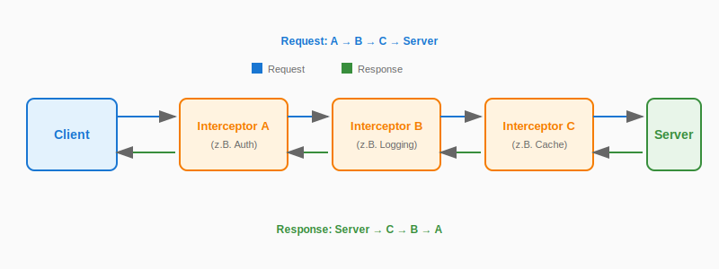

> **Hinweis:** Dieser Artikel ist ein Zusatzmaterial zum [Angular-Buch](https://angular-buch.com).
> Im Buch behandeln wir den **`HttpClient`** von Angular sowie die **Resource API** mit der **`httpResource()`**.
> Interceptors fungieren als übergreifende Middleware und sie erlauben es HTTP Calls zentral sowohl vor dem Aufruf als auch beim Empfang der Antwort zu modifizieren.

---

Der `HttpClient` bietet ein weiteres nützliches Feature für die Arbeit mit Serverschnittstellen: *Interceptors*.
Interceptors fungieren als Middleware für die gesamte HTTP-Kommunikation.
Das bedeutet, dass ein Interceptor für alle HTTP-Abfragen und -Antworten ausgeführt wird und damit an globaler Stelle Entscheidungen und Umwandlungen vornehmen kann.
Mithilfe von Interceptors kannst du zum Beispiel zusätzliche HTTP-Header setzen, Fehler abfangen oder Funktionen ausführen, ohne sie für jeden HTTP-Aufruf separat implementieren zu müssen.

Ein Interceptor wird global installiert und kann für jeden HTTP-Request und die Response entscheiden, ob und wie sie behandelt werden.
Diese Behandlung kann unter anderem sein:

- Sicherheitsfunktionen, z. B. Authentifizierung über ein Access Token, das mit jedem Request im Header übermittelt werden muss
- Hinzufügen zusätzlicher Headerfelder, z. B. für Caching
- Logging von Request und Response
- Anzeige von Zustandsinformationen zum Request (z. B., ob eine HTTP-Anfrage noch aktiv ist oder nicht)
- globales Abfangen und Behandeln von Fehlern bei einer HTTP-Anfrage, z. B. mit `catchError()`

## Funktionsweise der Interceptors

Bindest du einen Interceptor in die Anwendung ein, so wird er bei jedem HTTP-Request aktiv:
Der Request läuft zunächst durch den Interceptor und kann dort verändert werden.
Anschließend wird der Request über das Netzwerk zum Server übermittelt.
Die Antwort vom Server wird ebenfalls im Interceptor verarbeitet, bevor sie beim Aufrufenden eintrifft.

In einer Anwendung können mehrere Interceptors registriert werden.
Sie werden als Array hinterlegt, also mit einer definierten Reihenfolge.
Bei einem HTTP-Request werden die Interceptors von vorn nach hinten abgearbeitet, bei der HTTP-Response umgekehrt – von hinten nach vorn.



## Interceptors anlegen

Interceptors werden in der Regel als einfache Funktion implementiert.
Angular stellt dafür den Typ `HttpInterceptorFn` bereit.
Du erhältst den Request und eine Funktion vom Typ `HttpHandlerFn`, an die du den veränderten Request übergibst.
Wenn du Services anfordern möchtest, kannst du die Funktion `inject()` nutzen, da der Interceptor stets in einem Injection Context ausgeführt wird.

```typescript
import { HttpInterceptorFn } from '@angular/common/http';

export const myInterceptor: HttpInterceptorFn = (req, next) => {
  // Request verarbeiten oder verändern
  return next(req);
};
```

Um funktionale Interceptors zu registrieren, verwenden wir die Funktion `provideHttpClient()` zusammen mit `withInterceptors()`:

```typescript
import { provideHttpClient, withInterceptors } from '@angular/common/http';
import { myInterceptor } from './my-interceptor';

export const appConfig: ApplicationConfig = {
  providers: [
    provideHttpClient(
      withInterceptors([myInterceptor])
    )
  ]
};
```

## Den Request manipulieren

Die Interceptor-Funktion wird für jeden ausgehenden HTTP-Request ausgeführt.
Bevor du den Request auf die Reise schickst, kannst du den Inhalt manipulieren.
Zum Beispiel kannst du einen Interceptor entwickeln, der bestimmte Headerfelder in jeden Request einfügt.

Dafür musst du den originalen Request zunächst klonen.
Dieser Schritt ist wichtig, denn das Request-Objekt ist unveränderlich: Du kannst es nicht direkt manipulieren, sondern musst immer eine Kopie mit den Änderungen erzeugen.
Verwende dazu die Methode `clone()` und übergib direkt die gewünschten Änderungen:
Mit der Eigenschaft `setHeaders` kannst du neue HTTP-Headerfelder hinzufügen.
Zum Schluss rufst du `next()` auf und übermittelst den neuen, veränderten Request an den nächsten HTTP-Handler.

```typescript
import { HttpInterceptorFn } from '@angular/common/http';

export const authInterceptor: HttpInterceptorFn = (req, next) => {
  const modifiedReq = req.clone({
    setHeaders: {
      'Authorization': 'Bearer my-token',
      'X-Custom-Header': 'my-value'
    }
  });

  return next(modifiedReq);
};
```

## Die Response verarbeiten

Jeder Interceptor gibt ein Observable zurück: Es verarbeitet den Request und gibt die HTTP-Antworten aus, die vom Server eintreffen.
Du kannst dieses Observable nutzen, um mit den eintreffenden Daten zu arbeiten.
Zum Beispiel kannst du auf diese Weise Fehler abfangen, die Antworten loggen oder sogar den Inhalt manipulieren.

Um alle eingehenden Responses zu loggen, kannst du den Operator `tap()` verwenden.
Er lässt den Inhalt des Observables unverändert, und du kannst sowohl die erfolgreiche Serverantwort als auch fehlgeschlagene Requests auf der Konsole ausgeben.

```typescript
import { HttpInterceptorFn, HttpResponse } from '@angular/common/http';
import { tap } from 'rxjs';

export const loggingInterceptor: HttpInterceptorFn = (req, next) => {
  console.log('Request URL:', req.url);

  return next(req).pipe(
    tap({
      next: (event) => {
        if (event instanceof HttpResponse) {
          console.log('Response Status:', event.status);
        }
      },
      error: (error) => {
        console.error('Request failed:', error);
      }
    })
  );
};
```

> **Wichtig:** Das HTTP-Observable muss completen!
> Die HTTP-Kommunikation über die Interceptors wird mithilfe von Observables realisiert.
> Es ist wichtig, dass das Observable, das du aus dem Interceptor zurückgibst, immer completet wird.
> Ist der Datenstrom nie zu Ende, so wird auch der ursprüngliche Aufruf des `HttpClient` niemals beendet.

## Interceptors einbinden

Interceptors werden über die Dependency Injection von Angular als Providers bereitgestellt.
Damit der `HttpClient` weiß, welche Interceptors ausgeführt werden sollen, nutzt du die Funktion `provideHttpClient()` zusammen mit `withInterceptors()`.

```typescript
// app.config.ts
import { ApplicationConfig } from '@angular/core';
import { provideHttpClient, withInterceptors } from '@angular/common/http';
import { authInterceptor } from './auth.interceptor';
import { loggingInterceptor } from './logging.interceptor';

export const appConfig: ApplicationConfig = {
  providers: [
    provideHttpClient(
      withInterceptors([
        authInterceptor,
        loggingInterceptor
      ])
    )
  ]
};
```

Die Reihenfolge der Interceptors im Array bestimmt die Ausführungsreihenfolge:
Bei einem Request werden sie von vorn nach hinten abgearbeitet, bei der Response umgekehrt.

## Interceptors mit httpResource

Die Funktion `httpResource()` nutzt intern den `HttpClient`, um HTTP-Requests durchzuführen.
Das bedeutet, dass alle konfigurierten Interceptors automatisch auch für `httpResource()` angewendet werden.

```typescript
import { httpResource } from '@angular/common/http';

// Dieser Request durchläuft alle registrierten Interceptors
const booksResource = httpResource<Book[]>(() => '/api/books');
```

Wenn du also einen Auth-Interceptor konfiguriert hast, der ein Bearer-Token hinzufügt, wird dieses Token auch bei allen Requests über `httpResource()` automatisch mitgesendet.
Das gleiche gilt für Logging-Interceptors, Error-Handler und alle anderen Interceptors.

## OAuth 2 und OpenID Connect

Egal ob du eine unternehmensinterne oder eine öffentliche Webanwendung entwickelst, die im Internet erreichbar ist:
In vielen Fällen benötigt die Anwendung einen Login, um Authentifizierung und Autorisierung zu realisieren.

In der Regel wird dieser Vorgang durch den Austausch von Authentifizierungstokens realisiert.
Nach dem Login senden wir mit jedem Request an die Web-API ein Access Token, das die Berechtigung der nutzenden Person bestätigt.
Dies ist ein klassischer Anwendungsfall für einen Interceptor, denn er ermöglicht es, das Token automatisch mit jedem Request einzufügen.

Wir möchten dir an dieser Stelle dazu raten, eine Authentifizierungslösung nie selbst zu entwickeln.
Das Risiko, dabei einen Fehler zu machen, ist sehr hoch, und selbst wenn du Erfahrung in diesem Bereich hast, solltest du das Rad nicht neu erfinden.
Spezialisierte Anbieter bieten hier Lösungen, die seit Jahren etabliert sind und stets an die neuesten Sicherheitsanforderungen angepasst werden.
Greife deshalb bitte immer auf etablierte Lösungen und Identity Provider zurück.

Weit verbreitete Industriestandards zur Autorisierung sind *OAuth 2* und das darauf aufsetzende Authentifizierungsframework *OpenID Connect (OIDC)*.

- **OAuth 2** ist ein Standard zur Autorisierung von API-Zugriffen im Web.
- **OpenID Connect (OIDC)** ist eine Erweiterung von OAuth 2, die alle notwendigen Funktionen für Login und Single Sign-On (SSO) etabliert.

Die Datenflüsse in einer Anwendung mit OAuth 2 und OIDC können in verschiedenen *Flows* realisiert werden.

### Authorization Code Flow

Mit der Verbreitung von OAuth 2 und OIDC wurde kontinuierlich an noch sichereren Möglichkeiten der Authentifizierung gearbeitet.
Ein Ergebnis dieser Arbeit ist der nun empfohlene *Authorization Code Flow*.

Der Flow verwendet die Erweiterung *PKCE (Proof Key for Code Exchange)*, die sicherstellt, dass beim Austausch des Access Tokens keine sensiblen Informationen bei potenziellen Angriffen abgefangen werden können.
Dafür sendet der Client mit der Umleitung zum Authorization Server einen Hashwert mit.
Der Client generiert zunächst einen Zufallsstring (den sogenannten *Verifier*) und leitet daraus eine *Code Challenge* ab.
Diese Challenge wird dann im Request übertragen.

Nach dem erfolgreichen Login empfängt der Client lediglich einen *Authorization Code* vom Authorization Server.
Dieser Code ist noch kein gültiges Token, sondern muss zunächst „eingetauscht" werden:
Dafür sendet der Client den Authorization Code zusammen mit dem Verifier in einem asynchronen HTTP-Request (AJAX) an den Authorization Server.
Dieser kann jetzt prüfen, ob der Verifier zum zuvor ausgestellten Authorization Code passt.
Ist die Prüfung erfolgreich, stellt der Authorization Server schließlich an den Client das Access Token und das Identity Token aus.
Damit kann der Client nun den Resource Server abfragen, der wiederum prüft, ob das Access Token valide ist.

Durch den zusätzlichen Schritt und den flüchtigen Authorization Code kann sichergestellt werden, dass das Token während des Datenaustauschs nicht gestohlen werden kann, denn nur der Client kennt den verwendeten Verifier.

### OpenID Connect und Angular

Um den empfohlenen Authorization Code Flow fehlerfrei zu implementieren, ist es notwendig, die Spezifikationen sehr genau zu studieren.
Damit das Fehlerrisiko gering bleibt, solltest du eine etablierte Bibliothek verwenden, um die Datenflüsse für die Autorisierung und Authentifizierung korrekt abzubilden.
Für Angular möchten wir die beiden folgenden Bibliotheken empfehlen:

- [angular-auth-oidc-client](https://github.com/damienbod/angular-auth-oidc-client)
- [angular-oauth2-oidc](https://github.com/manfredsteyer/angular-oauth2-oidc)

Beide sind von der OpenID Foundation zertifiziert und bieten komfortable Schnittstellen, um die Flows von OAuth 2 und OIDC in eine Angular-Anwendung zu integrieren.

## Praxisbeispiel: API-Aufrufe mit Credentials anreichern

Um sicherzustellen, dass die nutzende Person berechtigt ist, Daten von der API zu lesen und später auch zu bearbeiten, soll eine Authentifizierung mit jedem Request erfolgen.
Wir wollen einen Interceptor implementieren, der ein Token an die Web-API übermittelt.

Die Authentifizierungsverfahren können dabei ganz unterschiedlich ausfallen, unter anderem:

- native HTTP-Authentifizierung (Basic/Digest)
- Verwendung von Cookies
- Token-basierte Authentifizierung (z. B. Bearer-Token mit JWT)
- OAuth 2/OpenID Connect (verwendet ebenso ein Bearer-Token)

Eines haben aber alle Methoden gemeinsam: Sie erfordern, dass spezielle Informationen in jedem HTTP-Request mitgeliefert werden, um sich gegenüber dem Backend auszuweisen.

### Service zur Authentifizierung

Um mit jedem Request über einen Interceptor entsprechende Informationen mitzusenden, benötigen wir zunächst eine zentrale Stelle in der Anwendung, die die Authentifizierung vollzieht und Informationen über den aktuellen Status ausgibt.

Hierfür wollen wir einen eigenen Service implementieren.
Dieser Ansatz ist vergleichbar mit etablierten Bibliotheken.
Sie stellen hierfür unter anderem folgende oder ähnliche Funktionen zur Verfügung:

- `isAuthenticated$`: ein Observable, das den aktuellen Status der Authentifizierung reaktiv ausgibt
- `isAuthenticated`: Boolean, das den Authentifizierungsstatus synchron bereitstellt
- `login()`: Methode zum Einloggen
- `logout()`: Methode zum Ausloggen

```typescript
// auth.service.ts
import { Injectable, signal } from '@angular/core';

@Injectable({ providedIn: 'root' })
export class AuthService {
  private _isAuthenticated = signal(true);

  readonly isAuthenticated = this._isAuthenticated.asReadonly();

  login() {
    this._isAuthenticated.set(true);
  }

  logout() {
    this._isAuthenticated.set(false);
  }
}
```

### Den Auth-Interceptor implementieren

Um in jede API-Anfrage einen Token zur Authentifizierung einzubauen, wollen wir einen Interceptor nutzen.
Das hat den Vorteil, dass wir nicht bei jedem einzelnen HTTP-Request einen entsprechenden Header mit dem Token setzen müssen.
Sobald der Interceptor aktiv ist, wird er auf alle HTTP-Requests angewendet.

```typescript
// auth.interceptor.ts
import { HttpInterceptorFn } from '@angular/common/http';
import { inject } from '@angular/core';
import { AuthService } from './auth.service';

export const authInterceptor: HttpInterceptorFn = (req, next) => {
  const authService = inject(AuthService);

  if (authService.isAuthenticated()) {
    const modifiedReq = req.clone({
      setHeaders: {
        'Authorization': 'Bearer 1234567890'
      }
    });
    return next(modifiedReq);
  }

  return next(req);
};
```

Zur Authentifizierung am Server wollen wir ein Bearer-Token einsetzen.
Ein solches Token muss üblicherweise zuvor von einem Authentifizierungsserver ausgestellt werden.
Die konkrete Implementierung hängt stark vom Projekt und von den zu nutzenden Endpunkten ab.
Uns geht es an dieser Stelle vor allem darum, zu zeigen, wie ein solches Token in den Request eingebaut werden kann.
Wir nutzen deshalb den statischen String `1234567890`, den wir als Bearer-Token senden.
Das bedeutet, dass das Token im Headerfeld `Authorization` mit dem Präfix `Bearer` übermittelt werden muss.

An dieser Stelle treffen wir eine Fallunterscheidung:
Liefert der `AuthService` im Property `isAuthenticated` den Wert `true`, wollen wir ein zusätzliches Headerfeld im Request setzen.
Wir verwenden die Methode `clone()` und setzen den Header `Authorization`.
Danach übergeben wir den Request an den Handler, damit er zum nächsten Interceptor bzw. zum Server gesendet wird.
Falls `isAuthenticated` den Wert `false` besitzt, reichen wir den originalen Request unverändert weiter.
Das Token wird also im Header übermittelt, falls eine Authentifizierung vorliegt.

### Den Interceptor registrieren

Bevor der Auth-Interceptor genutzt werden kann, muss er noch registriert werden:

```typescript
// app.config.ts
import { ApplicationConfig } from '@angular/core';
import { provideHttpClient, withInterceptors } from '@angular/common/http';
import { authInterceptor } from './shared/auth.interceptor';

export const appConfig: ApplicationConfig = {
  providers: [
    provideHttpClient(
      withInterceptors([authInterceptor])
    )
  ]
};
```

## Was haben wir gelernt?

- Interceptors modifizieren HTTP-Anfragen auf globaler Ebene und requestübergreifend.
- Mit Interceptors lassen sich auch die Antworten vom Server verarbeiten, bevor sie im Service eintreffen.
- Ein funktionaler Interceptor ist eine Funktion vom Typ `HttpInterceptorFn`, die den Request und eine Handler-Funktion erhält.
- Interceptors werden mit `provideHttpClient(withInterceptors([...]))` registriert.
- Mehrere Interceptors werden beim Request nach dem Muster A → B → C abgearbeitet. Bei der Serverantwort werden die Observables in umgekehrter Reihenfolge durchlaufen (C → B → A).
- Interceptors sollten nur genutzt werden, wenn du für *alle* Requests bestimmte Aktionen durchführen willst. Verwende Interceptors nicht, wenn du für einen *einzelnen* Request spezielle Header oder andere Optionen setzen möchtest.
- `httpResource()` nutzt intern den `HttpClient`, daher werden alle konfigurierten Interceptors automatisch auch für `httpResource()` angewendet.
