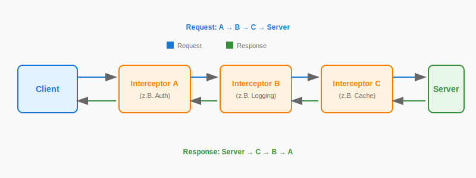

In diesem Artikel geht es um *Interceptors* in Angular. Damit lassen sich HTTP-Requests und -Responses zentral erfassen und transformieren.
So können wir zum Beispiel Authentifizierungs-Header automatisch setzen, Fehler global behandeln oder die HTTP-Kommunikation loggen, ohne jeden einzelnen Request manuell anpassen zu müssen.
Dabei betrachten wir zunächst die Funktionsweise und Implementierung von Interceptors, bevor wir am Beispiel einer Authentifizierung mit OAuth 2 und OpenID Connect ein praxisnahes Einsatzszenario umsetzen.

## Inhalt

[[toc]]

Interceptors fungieren als Middleware, also als Zwischenschicht, für die gesamte HTTP-Kommunikation.
Sie werden global installiert und für alle HTTP-Abfragen und -Antworten ausgeführt.
So lassen sich Requests und Responses an zentraler Stelle verarbeiten und verändern.
Typische Einsatzgebiete sind unter anderem:

- Sicherheitsfunktionen, z. B. Authentifizierung über ein Access Token, das mit jedem Request im Header übermittelt werden muss
- Hinzufügen zusätzlicher Headerfelder, z. B. für Caching
- Logging von Request und Response
- Anzeige von Zustandsinformationen zum Request (z. B., ob eine HTTP-Anfrage noch aktiv ist oder nicht)
- globales Erfassen und Behandeln von Fehlern bei einer HTTP-Anfrage, z. B. mit `catchError()`

## Funktionsweise der Interceptors

Binden wir einen Interceptor in die Anwendung ein, so wird er bei jedem HTTP-Request aktiv:
Der Request läuft zunächst durch den Interceptor und kann dort verändert werden.
Anschließend wird der Request über das Netzwerk zum Server übermittelt.
Die Antwort vom Server wird ebenfalls im Interceptor verarbeitet, bevor sie beim Aufrufenden eintrifft.

In einer Anwendung können mehrere Interceptors registriert werden.
Sie werden als Array hinterlegt, also mit einer definierten Reihenfolge.
Bei einem HTTP-Request werden die Interceptors in der angegebenen Reihenfolge abgearbeitet, bei der HTTP-Response in umgekehrter Reihenfolge.



## Interceptors entwickeln und einsetzen

Interceptors bestehen aus wenig Code, bieten aber viele Möglichkeiten.
Wir schauen uns an, wie wir Interceptors anlegen, den Request und die Response verarbeiten und die Interceptors in unsere Anwendung einbinden.
Außerdem klären wir, wie wir Interceptors gezielt steuern und welche Resource-APIs von Interceptors profitieren.

### Interceptors anlegen

Interceptors werden als einfache Funktion implementiert.
Angular stellt dafür den Typ `HttpInterceptorFn` bereit.
Wir erhalten den Request und eine Funktion vom Typ `HttpHandlerFn`, an die wir den veränderten Request übergeben.
Um auf Services zuzugreifen, können wir `inject()` nutzen, da der Interceptor in einem Injection Context ausgeführt wird.

```typescript
import { HttpInterceptorFn } from '@angular/common/http';

export const myInterceptor: HttpInterceptorFn = (req, next) => {
  // Request verarbeiten oder verändern
  return next(req);
};
```

Um Interceptors zu registrieren, verwenden wir die Funktion `provideHttpClient()` zusammen mit `withInterceptors()`:

```typescript
import { ApplicationConfig } from '@angular/core';
import { provideHttpClient, withInterceptors } from '@angular/common/http';
import { myInterceptor } from './my-interceptor';

export const appConfig: ApplicationConfig = {
  providers: [
    provideHttpClient(
      withInterceptors([myInterceptor])
    )
  ]
};
```

### Den Request manipulieren

Die Interceptor-Funktion wird für jeden ausgehenden HTTP-Request ausgeführt.
Bevor wir den Request auf die Reise schicken, können wir den Inhalt manipulieren.
Zum Beispiel können wir einen Interceptor entwickeln, der bestimmte Headerfelder in jeden Request einfügt.

Das Request-Objekt ist unveränderlich. Um es zu modifizieren, erzeugen wir mit `clone()` eine Kopie und übergeben die gewünschten Änderungen.
Mit `setHeaders` lassen sich z. B. neue Headerfelder hinzufügen.
Den veränderten Request übergeben wir dann mit `next()` an den nächsten Handler.

```typescript
import { HttpInterceptorFn } from '@angular/common/http';

export const authInterceptor: HttpInterceptorFn = (req, next) => {
  const modifiedReq = req.clone({
    setHeaders: {
      'Authorization': 'Bearer my-token',
      'X-Custom-Header': 'my-value'
    }
  });

  return next(modifiedReq);
};
```

### Die Response verarbeiten

Der HttpClient arbeitet intern mit Observables aus der Bibliothek RxJS.
Jeder Interceptor gibt ein Observable zurück: Es verarbeitet den Request und gibt die HTTP-Antworten aus, die vom Server eintreffen.
Wir können dieses Observable nutzen, um mit den eintreffenden Daten zu arbeiten.
Zum Beispiel können wir auf diese Weise Fehler behandeln, die Antworten loggen oder sogar den Inhalt manipulieren.

Um alle eingehenden Responses zu loggen, können wir den Operator `tap()` verwenden.
Er lässt den Inhalt des Observables unverändert, und wir können sowohl die erfolgreiche Serverantwort als auch fehlgeschlagene Requests auf der Konsole ausgeben.

```typescript
import { HttpInterceptorFn, HttpResponse } from '@angular/common/http';
import { tap } from 'rxjs';

export const loggingInterceptor: HttpInterceptorFn = (req, next) => {
  console.log('Request URL:', req.url);

  return next(req).pipe(
    tap({
      next: (event) => {
        if (event instanceof HttpResponse) {
          console.log('Response Status:', event.status);
        }
      },
      error: (error) => {
        console.error('Request failed:', error);
      }
    })
  );
};
```

> **Wichtig:** Das HTTP-Observable muss completen!
> Die HTTP-Kommunikation über die Interceptors wird mithilfe von Observables realisiert.
> Es ist wichtig, dass das Observable, das du aus dem Interceptor zurückgibst, immer completet wird.
> Ist der Datenstrom nie zu Ende, so wird auch der ursprüngliche Aufruf des HttpClient niemals beendet.

### Interceptors einbinden

Der Interceptor ist geschrieben, jetzt müssen wir ihn aber noch registrieren. Sonst passiert nichts.
Interceptors werden über die Dependency Injection von Angular registriert.
Wir registrieren sie mit `provideHttpClient()` und `withInterceptors()`.

```typescript
// app.config.ts
import { ApplicationConfig } from '@angular/core';
import { provideHttpClient, withInterceptors } from '@angular/common/http';
import { authInterceptor } from './auth.interceptor';
import { loggingInterceptor } from './logging.interceptor';

export const appConfig: ApplicationConfig = {
  providers: [
    provideHttpClient(
      withInterceptors([
        authInterceptor,
        loggingInterceptor
      ])
    )
  ]
};
```

Die Reihenfolge der Interceptors im Array bestimmt die Ausführungsreihenfolge:
Bei einem Request werden sie in der angegebenen Reihenfolge abgearbeitet, bei der Response in umgekehrter Reihenfolge.

### Interceptors gezielt steuern

In der Praxis kommunizieren Angular-Anwendungen häufig mit mehreren APIs gleichzeitig.
Ein Auth-Interceptor, der ein Bearer-Token an jeden Request anhängt, kann dann zum Problem werden — denn nicht jede API erwartet dasselbe Token oder überhaupt eine Authentifizierung.
Angular bietet unter anderem folgende Mechanismen, um Interceptors gezielt zu steuern.

#### 1. Prüfung im Interceptor selbst

Die einfachste Lösung ist eine Bedingung direkt im Interceptor.
Wir prüfen z. B. die URL des Requests und entscheiden anhand dessen, ob der Interceptor eingreifen soll.
Requests, die nicht zur eigenen API gehören, werden unverändert weitergeleitet:

```typescript
export const authInterceptor: HttpInterceptorFn = (req, next) => {
  if (!req.url.startsWith('/api/')) {
    return next(req);
  }
  // Token nur für eigene API anhängen
  // ...
};
```

#### 2. Prüfung mit `HttpContextToken`

Ein [`HttpContextToken`](https://angular.dev/api/common/http/HttpContextToken) ist ein typisierter Schlüssel, mit dem wir Metadaten an einen einzelnen HTTP-Request anhängen können.
Wir können damit beliebige Informationen bereitstellen, vor allem auch die Information, ob ein Interceptor eingreifen soll oder nicht.
Dazu definieren wir einen Token mit einem Standardwert.
In unserem Beispiel legt die Funktion `() => true` fest, dass der Interceptor per Default für alle Requests aktiv ist.
Im Interceptor prüfen wir den Token und greifen nur ein, wenn er auf `true` steht:

```typescript
import { HttpContextToken, HttpInterceptorFn } from '@angular/common/http';

export const NEEDS_AUTH = new HttpContextToken<boolean>(() => true);

export const authInterceptor: HttpInterceptorFn = (req, next) => {
  if (!req.context.get(NEEDS_AUTH)) {
    return next(req);
  }

  const modifiedReq = req.clone({
    setHeaders: { 'Authorization': 'Bearer my-token' }
  });
  return next(modifiedReq);
};
```

Einzelne Requests können sich von der Authentifizierung abmelden, indem sie den Token auf `false` setzen.
Anders als die übrigen Eigenschaften eines `HttpRequest` ist der `HttpContext` veränderlich (mutable) — ein Interceptor kann den Kontext also auch zur Laufzeit anpassen.
Mehr dazu in der Angular-Dokumentation unter [Request and response metadata](https://angular.dev/guide/http/interceptors#request-and-response-metadata).

```typescript
import { HttpContext } from '@angular/common/http';
import { NEEDS_AUTH } from './auth.interceptor';

// Dieser Request braucht keine Authentifizierung
http.get('/api/public/status', {
  context: new HttpContext().set(NEEDS_AUTH, false)
});
```

#### 3. Route-spezifische Interceptors

Es liegt nahe, `provideHttpClient()` einfach mehrfach auf Root-Ebene aufzurufen, um verschiedene Interceptor-Konfigurationen für verschiedene APIs zu definieren. Das funktioniert jedoch nicht wie erwartet: Ein zweiter Aufruf von `provideHttpClient()` überschreibt die Konfiguration des ersten.

Wir können uns aber zunutze machen, dass Routen in Angular eigene Providers haben können.
So können wir in einer Route mit eigenem `providers`-Array einen eigenen `provideHttpClient` mit zusätzlichen Interceptors registrieren.
Damit erhält dieser Bereich der Anwendung einen eigenen HttpClient mit einer unabhängigen Interceptor-Konfiguration.

```typescript
// admin.routes.ts
export const adminRoutes: Routes = [
  {
    path: '',
    component: AdminDashboard,
    providers: [
      provideHttpClient(
        withInterceptors([adminAuthInterceptor]),
        withRequestsMadeViaParent() // bei Bedarf
      )
    ]
  }
];
```

In diesem Beispiel durchlaufen Requests aus dem Admin-Bereich den `adminAuthInterceptor`.
Requests aus anderen Teilen der Anwendung sind davon nicht betroffen.
Die Option [`withRequestsMadeViaParent()`](https://angular.dev/api/common/http/withRequestsMadeViaParent) ist optional: Nur wenn wir sie angeben, durchlaufen die Requests anschließend auch die Interceptors der übergeordneten Ebene. Ohne diese Option arbeitet der HttpClient der Route vollständig unabhängig.
<!-- Reihenfolge: Child-Interceptors zuerst, dann Parent-Interceptors. Siehe Angular-Test: https://github.com/angular/angular/blob/main/packages/common/http/test/provider_spec.ts (Test: "should include interceptors from both parent and child contexts", assertiert 'child,parent') -->

#### 4. Wiederverwendbarer URL-Filter mit Factory-Funktion

Da ein Interceptor nur eine Funktion ist, haben wir volle Flexibilität bei der Gestaltung.
Wir können das Filtern auf eine URL auch als wiederverwendbare Factory-Funktion umsetzen.
In unserem Beispiel nennen wir sie `withUrlFilter()`: Sie nimmt ein URL-Präfix und einen beliebigen Interceptor entgegen und gibt einen neuen Interceptor zurück, der nur für passende URLs aktiv wird.
Das konkrete Filterkriterium kann je nach Anwendungsfall frei gestaltet werden — ob nach URL, HTTP-Methode oder anderen Eigenschaften des Requests.

```typescript
function withUrlFilter(
  urlPattern: string,
  interceptor: HttpInterceptorFn
): HttpInterceptorFn {
  return (req, next) => {
    if (!req.url.startsWith(urlPattern)) {
      return next(req);
    }
    return interceptor(req, next);
  };
}
```

Bei der Registrierung können wir so gezielt festlegen, welcher Interceptor für welche API zuständig ist:

```typescript
provideHttpClient(
  withInterceptors([
    withUrlFilter('/api/', authInterceptor),
    loggingInterceptor
  ])
)
```

### Interceptors mit den Resource-APIs

Angular bietet mit `resource()`, `rxResource()` und `httpResource()` verschiedene Signal-basierte APIs an, mit denen wir asynchron Daten von einem Server laden können.
Ob Interceptors dabei greifen, hängt von der darunterliegenden Technologie ab — nicht alle Resource-Varianten nutzen den HttpClient.

Die Funktion `httpResource()` nutzt intern den HttpClient, um HTTP-Requests durchzuführen.
Das bedeutet, dass alle konfigurierten Interceptors automatisch auch für `httpResource()` angewendet werden.
Die Funktionen `resource()` und `rxResource()` nutzen nicht zwingend den HttpClient — sie arbeiten mit Promises bzw. Observables und können auch andere Datenquellen wie z. B. die native Fetch API verwenden. Interceptors greifen hier also nicht automatisch.

| | `resource` | `rxResource` | `httpResource` |
|---|---|---|---|
| **Basiert auf** | Promise | Observable | HttpClient |
| **Interceptors** | ❌ | ❌ | ✅ |

Um bei `resource()` oder `rxResource()` von Interceptors zu profitieren, muss in der Ladelogik der HttpClient verwendet werden.

Wenn wir also einen Auth-Interceptor konfiguriert haben, der ein Bearer-Token hinzufügt, wird dieses Token bei `httpResource()` automatisch mitgesendet:

```typescript
import { httpResource } from '@angular/common/http';

// In einer Komponente oder einem Service:
const booksResource = httpResource<Book[]>(() => '/api/books');
```

Auch bei `rxResource()` greifen Interceptors, sofern der Service den HttpClient nutzt:

```typescript
import { rxResource } from '@angular/core/rxjs-interop';
import { inject } from '@angular/core';
import { HttpClient } from '@angular/common/http';

// In einer Komponente oder einem Service:
const http = inject(HttpClient);
const booksResource = rxResource({
  loader: () => http.get<Book[]>('/api/books')
});
```

Beachte, dass die Resource-APIs einen Injection Context benötigen. Der Aufruf darf also nicht an einer beliebigen Stelle im Code stehen, sondern muss z. B. in einer Komponente oder einem Service erfolgen. Alternativ kann mit `runInInjectionContext()` ein solcher Kontext manuell erzeugt werden.

## Praxisbeispiel: API-Aufrufe mit Credentials anreichern

Viele APIs erfordern eine Authentifizierung, um Daten lesen oder bearbeiten zu können.
Wir wollen exemplarisch einen Interceptor implementieren, der ein Token mit jedem Request an eine Web-API sendet.
Das Token ist dabei hart codiert, um die Implementierung zu vereinfachen.

Die Authentifizierungsverfahren können dabei ganz unterschiedlich ausfallen, unter anderem:

- native HTTP-Authentifizierung (Basic/Digest)
- Verwendung von Cookies
- Token-basierte Authentifizierung (z. B. Bearer-Token mit JWT)
- OAuth 2/OpenID Connect (verwendet ebenso ein Bearer-Token)

Eines haben aber alle Methoden gemeinsam: Sie erfordern, dass spezielle Informationen in jedem HTTP-Request mitgeliefert werden, um sich gegenüber dem Backend auszuweisen.

### Service zur Authentifizierung

Zunächst benötigen wir eine zentrale Stelle in der Anwendung, die die Authentifizierung verwaltet und den aktuellen Status bereitstellt.

Etablierte Bibliotheken stellen hierfür unter anderem folgende oder ähnliche Funktionen zur Verfügung:

- `isAuthenticated`: ein Signal, das den aktuellen Status der Authentifizierung reaktiv bereitstellt
- `login()`: Methode zum Einloggen
- `logout()`: Methode zum Ausloggen

Diesen Ansatz wollen wir mit einem eigenen Service nachbilden.

```typescript
// auth.service.ts
import { Injectable, signal } from '@angular/core';

@Injectable({ providedIn: 'root' })
export class AuthService {
  private _isAuthenticated = signal(true);

  readonly isAuthenticated = this._isAuthenticated.asReadonly();

  login() {
    this._isAuthenticated.set(true);
  }

  logout() {
    this._isAuthenticated.set(false);
  }
}
```

### Den Auth-Interceptor implementieren

Um in jede API-Anfrage einen Token zur Authentifizierung einzubauen, wollen wir einen Interceptor nutzen.
Das hat den Vorteil, dass wir nicht bei jedem einzelnen HTTP-Request einen entsprechenden Header mit dem Token setzen müssen.
Sobald der Interceptor aktiv ist, wird er auf alle HTTP-Requests angewendet.

Zur Authentifizierung am Server wollen wir ein Bearer-Token einsetzen.
Ein solches Token muss üblicherweise zuvor von einem Authentifizierungsserver ausgestellt werden.
Die konkrete Implementierung hängt stark vom Projekt und von den zu nutzenden Endpunkten ab.
Uns geht es an dieser Stelle vor allem darum, zu zeigen, wie ein solches Token in den Request eingebaut werden kann.
Wir nutzen deshalb den statischen String `1234567890`, den wir als Bearer-Token senden.
Das bedeutet, dass das Token im Headerfeld `Authorization` mit dem Präfix `Bearer` übermittelt werden muss.

```typescript
// auth.interceptor.ts
import { HttpInterceptorFn } from '@angular/common/http';
import { inject } from '@angular/core';
import { AuthService } from './auth.service';

export const authInterceptor: HttpInterceptorFn = (req, next) => {
  const authService = inject(AuthService);

  if (authService.isAuthenticated()) {
    const modifiedReq = req.clone({
      setHeaders: {
        'Authorization': 'Bearer 1234567890'
      }
    });
    return next(modifiedReq);
  }

  return next(req);
};
```

An dieser Stelle treffen wir eine Fallunterscheidung:
Liefert der AuthService im Property `isAuthenticated` den Wert `true`, wollen wir ein zusätzliches Headerfeld im Request setzen.
Wir verwenden die Methode `clone()` und setzen den Header `Authorization`.
Danach übergeben wir den Request an den Handler, damit er zum nächsten Interceptor bzw. zum Server gesendet wird.
Falls `isAuthenticated` den Wert `false` besitzt, reichen wir den originalen Request unverändert weiter.
Das Token wird also im Header übermittelt, falls eine Authentifizierung vorliegt.

### Den Interceptor registrieren

Bevor der Auth-Interceptor genutzt werden kann, muss er noch registriert werden:

```typescript
// app.config.ts
import { ApplicationConfig } from '@angular/core';
import { provideHttpClient, withInterceptors } from '@angular/common/http';
import { authInterceptor } from './shared/auth.interceptor';

export const appConfig: ApplicationConfig = {
  providers: [
    provideHttpClient(
      withInterceptors([authInterceptor])
    )
  ]
};
```

## OAuth 2 und OpenID Connect

Unser Praxisbeispiel zeigt das grundlegende Prinzip, wie ein Token mit jedem Request gesendet werden kann.
In einer echten Anwendung wird das Token jedoch nicht hart codiert, sondern dynamisch von einem Authorization Server bezogen und muss regelmäßig erneuert werden.

**Wir möchten dir an dieser Stelle dazu raten, eine Authentifizierungslösung nie selbst zu entwickeln.
Etablierte Anbieter und Identity Provider bieten Lösungen, die seit Jahren erprobt sind und stets an die neuesten Sicherheitsanforderungen angepasst werden.**

Egal ob wir eine unternehmensinterne oder eine öffentliche Webanwendung entwickeln, die im Internet erreichbar ist:
In vielen Fällen benötigt die Anwendung einen Login, um Authentifizierung und Autorisierung zu realisieren.
In der Regel wird dieser Vorgang durch den Austausch von Authentifizierungstokens umgesetzt.
Nach dem Login senden wir mit jedem Request an die Web-API ein Access Token, das die Berechtigung der nutzenden Person bestätigt.
Dies ist ein klassischer Anwendungsfall für einen Interceptor, denn er ermöglicht es, das Token automatisch mit jedem Request einzufügen.

Weit verbreitete Industriestandards zur Autorisierung sind *OAuth 2* und das darauf aufsetzende Authentifizierungsframework *OpenID Connect (OIDC)*.

- **OAuth 2** ist ein Standard zur Autorisierung von API-Zugriffen im Web.
- **OpenID Connect (OIDC)** ist eine Erweiterung von OAuth 2, die alle notwendigen Funktionen für Login und Single Sign-On (SSO) etabliert.

Die Datenflüsse in einer Anwendung mit OAuth 2 und OIDC können in verschiedenen *Flows* realisiert werden.

### Authorization Code Flow

Mit der Verbreitung von OAuth 2 und OIDC wurde kontinuierlich an noch sichereren Möglichkeiten der Authentifizierung gearbeitet.
Ein Ergebnis dieser Arbeit ist der nun empfohlene *Authorization Code Flow*.

Der Flow verwendet die Erweiterung *PKCE (Proof Key for Code Exchange)*, die sicherstellt, dass beim Austausch des Access Tokens keine sensiblen Informationen bei potenziellen Angriffen abgefangen werden können.
Dafür sendet der Client mit der Umleitung zum Authorization Server einen Hashwert mit.
Der Client generiert zunächst einen Zufallsstring (den sogenannten *Verifier*) und leitet daraus eine *Code Challenge* ab.
Diese Challenge wird dann im Request übertragen.

Nach dem erfolgreichen Login empfängt der Client lediglich einen *Authorization Code* vom Authorization Server.
Dieser Code ist noch kein gültiges Token, sondern muss zunächst „eingetauscht" werden:
Dafür sendet der Client den Authorization Code zusammen mit dem Verifier in einem HTTP-Request an den Authorization Server.
Dieser kann jetzt prüfen, ob der Verifier zum zuvor ausgestellten Authorization Code passt.
Ist die Prüfung erfolgreich, stellt der Authorization Server schließlich an den Client das Access Token und das Identity Token aus.
Damit kann der Client nun den Resource Server abfragen, der wiederum prüft, ob das Access Token valide ist.

Durch den zusätzlichen Schritt und den flüchtigen Authorization Code kann sichergestellt werden, dass das Token während des Datenaustauschs nicht gestohlen werden kann, denn nur der Client kennt den verwendeten Verifier.

### OpenID Connect und Angular

Um den empfohlenen Authorization Code Flow fehlerfrei zu implementieren, ist es notwendig, die Spezifikationen sehr genau zu studieren.
Damit das Fehlerrisiko gering bleibt, sollten wir eine etablierte Bibliothek verwenden, um die Datenflüsse für die Autorisierung und Authentifizierung korrekt abzubilden.
Für Angular möchten wir die beiden folgenden Bibliotheken empfehlen:

- [angular-auth-oidc-client](https://github.com/damienbod/angular-auth-oidc-client)
- [angular-oauth2-oidc](https://github.com/manfredsteyer/angular-oauth2-oidc)

Beide sind von der OpenID Foundation zertifiziert und bieten komfortable Schnittstellen, um die Flows von OAuth 2 und OIDC in eine Angular-Anwendung zu integrieren.

## Weitere Interceptors im Angular-Ökosystem

Viele Standardfälle müssen wir gar nicht selbst implementieren.
Zahlreiche Bibliotheken aus dem Angular-Ökosystem nutzen Interceptors als Integrationspunkt, um sich nahtlos in die HTTP-Kommunikation einer Anwendung einzuklinken.

### Authentifizierung

Für die Authentifizierung stellen zahlreiche Bibliotheken eigene Interceptors bereit, die den gesamten Token-Lifecycle verwalten: Login, Token-Erneuerung und das automatische Anhängen des Access Tokens an jeden Request.

- [angular-oauth2-oidc](https://github.com/manfredsteyer/angular-oauth2-oidc)
- [angular-auth-oidc-client](https://github.com/damienbod/angular-auth-oidc-client)
- [@azure/msal-angular](https://github.com/AzureAD/microsoft-authentication-library-for-js) (Azure AD / Entra ID)
- [@auth0/auth0-angular](https://github.com/auth0/auth0-angular)
- [keycloak-angular](https://github.com/mauriciovigolo/keycloak-angular)

### Ladeindikator

Einige Bibliotheken nutzen Interceptors, um bei laufenden HTTP-Requests automatisch einen Fortschrittsbalken oder Spinner anzuzeigen.
So erhalten wir ohne eigenen Code ein visuelles Feedback für alle HTTP-Anfragen.

- [ngx-progressbar](https://github.com/MurhafSousli/ngx-progressbar)
- [@ngx-loading-bar/http-client](https://github.com/aitboudad/ngx-loading-bar)
- [ng-http-loader](https://github.com/mpalourdio/ng-http-loader)

### Caching

Auch für das Caching von HTTP-Responses gibt es eine Lösung auf Basis von Interceptors.
Damit können wiederholte Requests direkt aus dem Cache ausgeliefert werden, ohne den Server erneut zu kontaktieren.

- [@ngneat/cashew](https://github.com/ngneat/cashew)

## Fazit

In diesem Artikel haben wir den gesamten Weg kennengelernt: von der Funktionsweise über die Implementierung und gezielte Steuerung bis hin zum Einsatz in der Praxis mit OAuth 2 und OpenID Connect.
Interceptors sind ein zentrales Werkzeug, um die HTTP-Kommunikation einer Angular-Anwendung zu steuern.
Statt in jedem Service einzeln Header zu setzen, Fehler zu behandeln oder Requests zu loggen, erledigt ein Interceptor diese Aufgaben an einer einzigen Stelle, für alle HTTP-Anfragen gleichermaßen.
Interceptors sind leichtgewichtig und lassen sich über `provideHttpClient(withInterceptors([...]))` flexibel zusammenstellen.
Da auch `httpResource()` intern den HttpClient verwendet, profitieren alle HTTP-Zugriffe automatisch von den konfigurierten Interceptors.
Mit `HttpContextToken` und `withRequestsMadeViaParent()` haben wir gesehen, wie sich Interceptors auch gezielt steuern lassen — und mit einer eigenen Factory-Funktion können wir das Filtern auf bestimmte URLs elegant und wiederverwendbar umsetzen.

Falls du noch keine Interceptors im Einsatz hast, probiere dieses Werkzeug doch einmal aus und verschlanke deinen Code damit.
**Wir wünschen viel Spaß beim Ausprobieren!**
