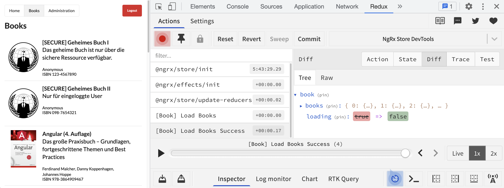
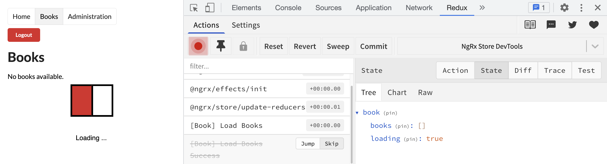

**Zusatzmaterial zum Buch *Angular: Das große Praxisbuch (1. Auflage)* von Ferdinand Malcher, Danny Koppenhagen und Johannes Hoppe.**

Dieser Artikel ist **Teil 2** einer dreiteiligen Serie zum Thema State Management mit NgRx.

- Teil 1: Wie kommen wir zu zentralem State Management? → [zum Artikel](/material/ngrx-intro)
- Teil 2: Global Store mit NgRx (dieser Artikel)
- Teil 3: SignalStore → [zum Artikel](/material/ngrx-signal-store)

[[toc]]

Im ersten Teil haben wir uns Schritt für Schritt ein eigenes Modell für zentrales State Management erarbeitet und dabei die Grundprinzipien von Redux kennengelernt. Jetzt setzen wir diese Ideen mit dem Framework NgRx in die Praxis um.

## NgRx: Reactive State for Angular

Das Framework *Reactive State for Angular (NgRx)* ist eine der populärsten Implementierungen für State Management mit Angular. Durch die gezielte Ausrichtung auf Angular fügt sich der Code gut in die Strukturen und Lebenszyklen einer Angular-Anwendung ein. NgRx setzt stark auf die Möglichkeiten der reaktiven Programmierung mit RxJS, ist also an vielen Stellen von Observables und Datenströmen geprägt. Über `selectSignal()` integriert es sich außerdem nahtlos in die signal-basierte Welt von modernem Angular. Die große Community und eine Reihe von verwandten Projekten machen NgRx zum wohl bekanntesten Werkzeug für Zustandsverwaltung mit Angular.

Wir wollen in diesem Abschnitt die Struktur und die Bausteine in der Welt von NgRx genauer besprechen. Außerdem wollen wir im BookManager einen Aspekt mithilfe von NgRx umsetzen, um so alle Bausteine auch praktisch zu üben.

### Projekt vorbereiten

Als Grundlage für diesen praktischen Teil verwenden wir das Beispielprojekt BookManager aus dem Buch. Wir bauen auf der Variante mit Standalone Components auf, wie sie die aktuelle Angular-Version vorgibt. Wer mitentwickeln möchte, kann das bestehende BookManager-Projekt verwenden.

### Store einrichten

Im Projektverzeichnis müssen wir zunächst alle Abhängigkeiten installieren, die wir für die Arbeit mit NgRx benötigen. NgRx verfügt über eigene Schematics zur Einrichtung in einem bestehenden Angular-Projekt. Die folgenden Befehle integrieren einen vorbereiteten Store in die bestehende Anwendung:

```bash
ng add @ngrx/store
ng add @ngrx/store-devtools
ng add @ngrx/effects
```

Später wollen wir einen zusätzlichen Baustein kennenlernen, der im originalen Redux nicht vorgesehen ist und der spezifisch für NgRx ist: Effects auf Basis von `@ngrx/effects`. Deshalb haben wir das notwendige Paket in diesem Schritt gleich mit eingefügt. Die Store DevTools sind hilfreich zum Debugging der Anwendung – wir gehen später im Abschnitt zu den Redux DevTools genauer darauf ein, um den Lesefluss in diesem Kapitel nicht zu unterbrechen.

Der Befehl `ng add` trägt die passenden `provide…`-Funktionen automatisch in die Datei `app.config.ts` ein.

### Schematics nutzen

Um nach der Einrichtung die Bausteine von NgRx mithilfe der Angular CLI anzulegen, können wir das Paket `@ngrx/schematics` nutzen. Es erweitert die Fähigkeiten der Angular CLI, sodass wir unsere Actions, Reducers und Effects bequem mithilfe von `ng generate` anlegen können. Auch diese Abhängigkeit wird mittels `ng add` installiert.

```bash
ng add @ngrx/schematics
```

Die Schematics von NgRx werden durch diesen Aufruf automatisch im Projekt registriert. Jeder Aufruf von `ng generate` durchsucht dann auch die Skripte in diesem Paket. So können wir bequem einen Befehl wie `ng generate action` verwenden, ohne die Zielkollektion explizit angeben zu müssen. Die Collection wird mit einem Eintrag in der Datei `angular.json` festgelegt, den wir jederzeit wieder löschen oder ändern können, falls wir die Skripte von NgRx nicht mehr nutzen möchten.

### Grundstruktur

Die ausgeführten Befehle haben bereits alles Nötige eingerichtet, sodass wir sofort mit der Implementierung beginnen können. Vorher wollen wir jedoch einen Blick auf die Einrichtung des Stores werfen.

In einer Standalone-Anwendung registrieren wir den Store über die Funktion `provideStore()` in der Datei `app.config.ts`. Sie bringt den Kern des NgRx-Stores in die Anwendung. Übergeben wir kein Argument, so startet der Store mit einem leeren State-Objekt – die einzelnen Features fügen ihre Zustände später selbst hinzu. Zusätzlich richten wir mit `provideEffects()` die Infrastruktur für Effects ein und binden mit `provideStoreDevtools()` die Store DevTools ein:

```ts
// app.config.ts
import { ApplicationConfig, isDevMode } from '@angular/core';
import { provideHttpClient, withFetch } from '@angular/common/http';
import { provideStore } from '@ngrx/store';
import { provideEffects } from '@ngrx/effects';
import { provideStoreDevtools } from '@ngrx/store-devtools';

export const appConfig: ApplicationConfig = {
  providers: [
    // ...
    provideHttpClient(withFetch()),
    provideStore(),
    provideEffects(),
    provideStoreDevtools({ maxAge: 25, logOnly: !isDevMode() })
  ]
};
```

Wir holen die Buchliste später per HTTP von einer echten API. Damit der `HttpClient` zur Verfügung steht, registrieren wir ihn hier gleich mit `provideHttpClient(withFetch())`.

Mit dieser Konfiguration ist der Store zwar schon aktiv, aber wir haben noch nicht festgelegt, wie das zentrale State-Objekt strukturiert sein soll. Da wir auch mit NgRx modular entwickeln, definieren wir die State-Struktur nicht zentral, sondern lagern alle neuen Bausteine in eigene Dateien aus und registrieren sie pro Feature.

### Feature anlegen

Unsere Anwendung ist bereits in Features strukturiert, die einzelne Bereiche kapseln und in der Regel per Lazy Loading geladen werden. Diese Einteilung findet sich auch wieder, wenn es um die Einrichtung des Stores für NgRx geht. Jedes Feature erhält einen eigenen Satz an Actions, Reducers und Effects, die auch nur für genau dieses Feature und den zugehörigen State zuständig sind. So verhindern wir eine monolithische Struktur, in der verschiedene Zuständigkeiten ungewollt vermischt werden. Um NgRx für ein bestehendes Feature aufzusetzen, verwenden wir den folgenden Befehl:

```bash
ng g feature books/store/book --api
```

Dieser Aufruf legt das Feature `book` im Ordner `src/app/books/store` an. Wir haben hier bewusst den Unterordner `store` gewählt, um alle Bestandteile von NgRx sauber in einem gemeinsamen Unterordner zu gruppieren. Wichtig ist, dass der Feature-Name `book` hier im Singular angegeben wird, denn die CLI fügt beim Anlegen automatisch ein Plural-s für einige Bausteine hinzu. Mit der Option `--api` generieren wir außerdem das nötige Grundgerüst, um Daten zu behandeln, die von einer API abgerufen werden. Wie sich das auswirkt, werden wir gleich noch betrachten.

Die Dateistruktur in der Anwendung sieht nun wie folgt aus:

```
src/
└── app/
    ├── books/
    │   ├── store/
    │   │   ├── book.actions.ts
    │   │   ├── book.reducer.ts
    │   │   ├── book.selectors.ts
    │   │   ├── book.effects.ts
    │   │   └── ...
    │   ├── books.routes.ts
    │   └── ...
    ├── app.config.ts
    └── ...
```

Den Feature-State und die Effects registrieren wir dort, wo wir auch das Feature selbst bereitstellen – typischerweise im `providers`-Array der zugehörigen Route. Dazu nutzen wir `provideState()` für den Reducer und `provideEffects()` für die Effects-Klasse. Das leere `provideEffects()` aus der `app.config.ts` richtet nur die Effects-Infrastruktur ein; die eigentlichen Effects-Klassen registrieren wir pro Feature:

```ts
// books/books.routes.ts
import { Routes } from '@angular/router';
import { provideState } from '@ngrx/store';
import { provideEffects } from '@ngrx/effects';

import * as fromBook from './store/book.reducer';
import { BookEffects } from './store/book.effects';

export const booksRoutes: Routes = [
  {
    path: '',
    providers: [
      provideState(fromBook.bookFeatureKey, fromBook.reducer),
      provideEffects(BookEffects)
    ],
    // ... untergeordnete Routen
  }
];
```

Dieser Aufruf von `provideState()` ist essenziell, denn er definiert die Struktur des globalen State-Objekts. Die Konstante `fromBook.bookFeatureKey` aus der Datei `book.reducer.ts` enthält den String `book`. Damit legen wir fest, unter welchem Namen die Zustände dieses Features im globalen State-Objekt zu finden sein werden. Das zentrale State-Objekt wird also durch diesen Aufruf von `provideState()` automatisch erweitert, und die Reducers aus dem Feature werden in die Anwendung integriert. Diese dynamische Erweiterung ist nötig, damit ein Feature auch mithilfe von Lazy Loading asynchron zur Laufzeit nachgeladen werden kann. Der Feature-Key `book` verweist auf den Teilbaum im State-Objekt, in den der Feature-State eingebaut wird.

### Struktur des Feature-States definieren

Nun folgt der erste inhaltliche Schritt auf dem Weg zum State Management: Wir müssen die Struktur des Feature-States für das Feature `book` definieren. Dazu befindet sich in der Datei `books/store/book.reducer.ts` ein Interface mit dem Namen `State`. Dieser Feature-State ist der erste Zweig des zentralen Objekt-Baums.

Im Interface `State` legen wir fest, welche Zustände und Daten wir speichern möchten. Es soll zunächst nur darum gehen, die Buchliste vom Server abzurufen, im Store zu speichern und schließlich darzustellen. Wir benötigen also eine Liste von Büchern und integrieren außerdem einen Ladeindikator sowie ein Feld für eventuelle Fehlermeldungen.

Direkt darunter befindet sich die Variable `initialState`. Damit das System weiß, welche Zustände direkt nach dem Start herrschen, müssen wir hier einen initialen Zustand definieren. Für unsere Anwendung ist die Buchliste beim Start leer, der Ladeindikator steht auf `false`, und es liegt zunächst kein Fehler vor:

```ts
// books/store/book.reducer.ts
export const bookFeatureKey = 'book';

export interface State {
  books: Book[];
  loading: boolean;
  error: string | null;
}

export const initialState: State = {
  books: [],
  loading: false,
  error: null
};
```

Damit haben wir die Struktur unseres Feature-States definiert. Die restlichen Inhalte der Datei ignorieren wir zunächst, darum kümmern wir uns im übernächsten Schritt. Unser *gesamter* State der Anwendung hat jetzt den folgenden Aufbau:

```ts
{
  book: {
    books: [],
    loading: false,
    error: null
  }
}
```

Der Name `book` wird durch den Feature-Key definiert, den wir an den Aufruf von `provideState()` übergeben haben.

### Actions: Kommunikation mit dem Store

Alle relevanten Ereignisse in der Anwendung werden durch Actions repräsentiert, die in den Store gesendet werden. Das umfasst Aktionen, die direkt in der Oberfläche ausgeführt werden, und auch technische Ereignisse wie Antworten von der HTTP-Schnittstelle.

Dabei beschreiben Actions idealerweise eine abstrakte Sicht auf das Geschehen. Actions sollten keine technischen Kommandos für das System darstellen, sondern die dahinterliegende Intention beschreiben. Für unser Beispiel raten wir etwa von der Action `Show Loading Spinner` ab, denn sie beschreibt ein technisches Implementierungsdetail und kein fachliches Ereignis.

Actions bilden die Grundlage für die Kommunikation mit dem Store und können Änderungen am Anwendungszustand auslösen. Dieses Konzept entspricht den Nachrichten, die wir im einführenden Beispiel an den Service gesendet haben. Die folgende Auflistung zeigt einige Beispiele für Actions, die in einer Anwendung vorkommen könnten:

- Load Books
- Load Books Success
- Load Books Failure
- Session Expired
- Router Navigation
- Window Resize
- User Login
- User Login Success
- User Login Failure
- Add item to cart
- Remove item from cart
- Create book
- Update book
- Set language
- Increment counter

Technisch ist eine solche Action immer ein Objekt mit einer bestimmten vorgegebenen Struktur. Verpflichtend ist die Eigenschaft `type`, die den Namen der Nachricht angibt und die Nachricht unverwechselbar macht. Jeder Type muss eindeutig sein und darf immer nur einmal vergeben werden! Zusätzlich können weitere optionale Eigenschaften definiert werden, um Daten in der Action zu transportieren: der sogenannte Payload, der im folgenden Beispiel `data` genannt wird.

```ts
{
  type: 'Load Books Success',
  data: { /* ... */ }
}
```

Um eine starke Typisierung zu ermöglichen und Tippfehler zu vermeiden, notieren wir die Objekte jedoch nicht direkt im Code. Stattdessen nutzen wir einen sogenannten *Action Creator* – eine Funktion, die das Objekt mit der richtigen Struktur erzeugt.

Dafür stellt NgRx die Funktion `createAction()` zur Verfügung. Als erstes Argument geben wir hier immer den Namen der Action an. Dieser `type` muss in der gesamten Anwendung eindeutig sein. Um die Nachvollziehbarkeit zu erhöhen und mögliche Kollisionen zu verhindern, notieren wir üblicherweise die Quelle der Action in eckigen Klammern im Namen. Damit erzeugen wir eine Art Namespace für den Action-Typ – es handelt sich dabei aber nur um eine Konvention.

```ts
import { createAction } from '@ngrx/store';

export const loadBooks = createAction(
  '[Book] Load Books'
);
```

Diese Action besitzt noch keinen Payload. Wollen wir weitere Daten in der Action verpacken, können wir die Struktur des Payloads im zweiten Argument von `createAction()` festlegen:

```ts
import { createAction, props } from '@ngrx/store';

export const loadBooksSuccess = createAction(
  '[Book] Load Books Success',
  props<{ data: Book[] }>()
);
```

Der generische Typparameter der Funktion `props()` gibt an, welche zusätzlichen Eigenschaften die Action enthalten soll. Wir haben hier den generischen Namen `data` gewählt, die Payload-Properties können wir allerdings nach Belieben benennen. Das erzeugte Action-Objekt hat den folgenden Aufbau:

```ts
{
  type: '[Book] Load Books Success';
  data: Book[];
}
```

Zur Abfrage einer HTTP-Schnittstelle benötigen wir normalerweise drei zusammengehörige Actions, die diesem Muster folgen:

- `Load XXX`: Daten anfragen
- `Load XXX Success`: Daten sind erfolgreich vom Server eingetroffen.
- `Load XXX Failure`: Das Laden der Daten ist fehlgeschlagen.

Die Actions werden in einer oder mehreren Dateien gesammelt. Beim Anlegen des Features mit `ng generate feature` wurde eine solche Datei bereits erstellt: `books/store/book.actions.ts`. Da wir das Feature mit der Option `--api` angelegt haben, sind in dieser Datei bereits die ersten drei Actions vorbereitet. Wir können dieses Grundgerüst nutzen und die Signaturen der Actions für unseren Anwendungsfall anpassen.

Die Success-Action erhält als Payload eine Buchliste `Book[]`, die Failure-Action transportiert einen Fehler vom Typ `string`. (In der Praxis ist es sinnvoll, hier ein eigenes Fehlerobjekt zu verwenden, das mehr Informationen beinhaltet als nur den Fehlertext.) Die Action `loadBooks` benötigt keine weiteren Daten, denn die Intention wird schon durch den Action-Typ vollständig ausgedrückt.

```ts
// books/store/book.actions.ts
import { createAction, props } from '@ngrx/store';

import { Book } from '../../shared/book';

export const loadBooks = createAction(
  '[Book] Load Books'
);

export const loadBooksSuccess = createAction(
  '[Book] Load Books Success',
  props<{ data: Book[] }>()
);

export const loadBooksFailure = createAction(
  '[Book] Load Books Failure',
  props<{ error: string }>()
);
```

### Dispatch: Actions in den Store senden

Um mit dem Store zu kommunizieren und Zustandsänderungen anzustoßen, müssen die Actions von den Komponenten in den Store gesendet werden. Den Store fordern wir dazu mit der Funktion `inject()` in der Komponente an.

Der Store verfügt über eine Methode `dispatch()`, mit der wir eine Action in den Store dispatchen können. Beim Aufruf der `BooksOverview` soll das Laden der Buchliste angestoßen werden. Deshalb lösen wir dort gleich im Konstruktor die Action `loadBooks` aus.

Wichtig ist, dass das exportierte `loadBooks` aus der Datei `book.actions.ts` selbst noch keine Action ist, sondern ein Action Creator, der ein Action-Objekt erzeugen kann. Dazu müssen wir die Funktion aufrufen. Hat die Action einen Payload, so übergeben wir ihn als Argument an den Action Creator:

```ts
const myAction = loadBooks();
const mySuccessAction = loadBooksSuccess({ data: [/* ... */] });
```

Wir müssen die Funktion `loadBooks` also aufrufen, um ein Action-Objekt zu erhalten, das wir dispatchen können:

```ts
// books/books-overview/books-overview.ts
import { Component, inject } from '@angular/core';
import { Store } from '@ngrx/store';

import { loadBooks } from '../store/book.actions';

@Component({ /* ... */ })
export class BooksOverview {
  private store = inject(Store);

  constructor() {
    this.store.dispatch(loadBooks());
  }
}
```

Wenn wir bereits die Redux DevTools installiert haben, können wir nun überprüfen, ob die ausgelöste Action tatsächlich im Store eingetroffen ist. Wir betrachten die DevTools separat im Abschnitt zu den Redux DevTools weiter unten.

### Reducers: den State aktualisieren

Nachdem wir die erste Action in den Store dispatcht haben, ist es nun an der Zeit, einen Reducer zu entwickeln, um den State zu verändern. Ein Reducer im Kontext von Redux ist eine Funktion mit zwei Eingabewerten: dem aktuellen Zustand und der neu eintreffenden Action. Die Aufgabe des Reducers ist es, anhand der Action und des Zustands einen neuen Zustand zu berechnen und zurückzugeben:

```ts
function reducer(state: State, action: Action): State {}
```

Ein Reducer ist dabei immer für einen Teilbaum des States zuständig. Das Feature `book` besitzt einen eigenen Reducer, der ausschließlich diesen State verarbeitet. Ein solcher Feature-State wird auch *Slice* genannt. Wir verwenden die beiden Begriffe synonym.

In unserem einführenden Beispiel haben wir zur Unterscheidung der Nachrichten ein *switch/case*-Statement verwendet. Traditionell wird in Redux auch genau dieser Ansatz genutzt. Der Einsatz von *switch/case* ist jedoch etwas gewöhnungsbedürftig, und auch die Menge an erforderlichem Code ist recht hoch. Daher stellt NgRx die Funktion `createReducer()` zur Verfügung, um Reducers sehr kompakt und typsicher zu implementieren. Die grundsätzliche Idee ist jedoch dieselbe: Der Reducer unterscheidet nach dem Action-Typ und nimmt für verschiedene Actions verschiedene Anpassungen am State vor. Wir entwickeln also für jede Action eine kleine Reducer-Funktion.

Die wichtigste Eigenschaft der Reducer-Funktionen ist ihre "Reinheit": Reducers sind Pure Functions. Dieses Konzept ist von drei wesentlichen Einschränkungen geprägt:

- **deterministisch:** Die Funktion liefert für gleiche Eingabewerte stets die gleiche Ausgabe. Es dürfen also keine Werte verarbeitet werden, die nicht zweifelsfrei aus den Eingaben ableitbar sind, z. B. Zufallswerte oder die Uhrzeit.
- **keine äußeren Zustände:** Es werden nur die Daten verarbeitet, die als Argumente an die Funktion übergeben werden (also hier: State und Action). Es darf nicht auf andere Variablen zugegriffen werden, die außerhalb der Funktion liegen. Eine Ausnahme bilden ausgelagerte Hilfsfunktionen, die allerdings dieselben Anforderungen an eine Pure Function erfüllen müssen.
- **keine Seiteneffekte:** Die Funktion darf keine Aktionen ausführen, die einen Effekt außerhalb ihres Gültigkeitsbereichs haben. HTTP-Requests, Logging, Authentifizierung oder das Dispatchen von Actions sind also in den Reducers *nicht* erlaubt. Zu Seiteneffekten zählt auch, das State-Objekt direkt zu manipulieren!

Die Einhaltung dieser Einschränkungen ist besonders wichtig, um eine hohe Stabilität des Systems sicherzustellen. Nur wenn wir den strikten Regeln von Redux folgen, kann der Anwendungszustand zuverlässig kontrolliert werden.

Ein Reducer darf deshalb ausschließlich den aktuellen State und die eintreffende Action verarbeiten. Alle notwendigen Informationen, um den neuen State zu erzeugen, müssen in State oder Action vorliegen. Außerdem muss der Reducer bei Änderungen stets eine *Kopie* des States zurückgeben, die die gewünschten Änderungen beinhaltet. Es dürfen niemals Änderungen direkt auf dem Objekt ausgeführt werden. Diese Eigenschaft der Immutability haben wir bereits in der Einleitung besprochen. Wir setzen mit NgRx in der Regel nicht auf "echte Unveränderlichkeit", sondern wenden Disziplin an und behandeln die Objekte lediglich als unveränderlich – auch wenn sie prinzipiell veränderlich sind. Während der Entwicklung sind außerdem sogenannte [Runtime Checks](https://ngrx.io/guide/store/configuration/runtime-checks) aktiv, die den State auf Unveränderlichkeit und Serialisierbarkeit prüfen. Jede versehentliche Änderung am State führt dann direkt zu einer Exception.

Um das State-Objekt vor der Verwendung und Änderung zu klonen, können wir den Spread-Operator einsetzen. Wir beachten dabei, dass dieses Werkzeug stets nur eine flache Kopie (Shallow Copy) erzeugt. Wollen wir Änderungen an tiefer verzweigten Teilen des States vornehmen, müssen wir explizit eine tiefe Kopie (Deep Copy) des Objekts erzeugen.

> **Hinweis:** Ein verschachteltes Objekt können wir mit dem Spread-Operator klonen, indem wir jeden Zweig des Objekts einzeln kopieren. Wird das zu komplex, empfiehlt sich ein Hilfsmittel wie die native Funktion `structuredClone()`. Wir haben die verschiedenen Möglichkeiten in einem Blogartikel zusammengefasst: [10 useful operations for pure & immutable data structures](https://angular.schule/blog/2018-03-pure-immutable-operations).

Wir wollen nun auch für den BookManager passende Reducers entwickeln. Dazu überlegen wir zunächst, welche Zustandsänderungen von den Actions ausgelöst werden:

- `loadBooks`: Ladeindikator auf `true` setzen
- `loadBooksSuccess`: Buchliste einfügen und Ladeindikator auf `false` setzen
- `loadBooksFailure`: Ladeindikator auf `false` setzen

Die Implementierung bringen wir in der Datei `books/store/book.reducer.ts` unter, in der das Grundgerüst der Reducer-Funktion bereits vorbereitet ist. Statt *switch/case* wird hier die Funktion `createReducer()` genutzt. Für jede Fallunterscheidung existiert ein Block, der in ein `on()` gekapselt ist. Als erstes Argument geben wir hier immer die Action an, die behandelt werden soll. Im zweiten Argument ist die Reducer-Funktion notiert, die schließlich anhand der eingehenden Action den neuen State generiert. Für die einzelnen Reducer-Funktionen geben wir stets ein neues State-Objekt zurück und definieren den Rückgabetyp immer explizit mit `State`. Ob wir dafür die ausführliche Form mit `return` oder die kompakte Pfeilschreibweise (`(state): State => ({ ... })`) wählen, ist eine Frage des Stils – in der lauffähigen Beispiel-App verwenden wir die kompakte Variante.

```ts
// books/store/book.reducer.ts
export const reducer = createReducer(
  initialState,

  on(BookActions.loadBooks, (state): State => {
    return { ...state, loading: true, error: null };
  }),

  on(BookActions.loadBooksSuccess, (state, action): State => {
    return {
      ...state,
      books: action.data,
      loading: false
    };
  }),

  on(BookActions.loadBooksFailure, (state, action): State => {
    return { ...state, loading: false, error: action.error };
  })
);
```

> **Reducers für mehrere Actions:** Übrigens wird jeder Reducer immer für jede Action durchlaufen. Das bedeutet, dass wir in einem Reducer auch auf mehrere Actions oder sogar auf Actions aus einem anderen Bereich der Anwendung reagieren können. Dazu geben wir im `on()` mehrere Actions nacheinander als einzelne Argumente an. Es gibt jedoch keine direkte Möglichkeit, in einem Reducer auf einen anderen Slice des States zuzugreifen.

Haben wir die Implementierung abgeschlossen, so können wir die State-Änderung in den Redux DevTools nachvollziehen. Für die dispatchte Action `loadBooks` ändert sich das `loading`-Flag im State von `false` auf `true`.

Die Action `loadBooksSuccess` wird aktuell niemals ausgelöst; das lösen wir im übernächsten Schritt mit einem Effect. Wir haben trotzdem bereits definiert, was in diesem Fall mit dem State passieren soll. Dasselbe gilt für `loadBooksFailure`.

Für alle unbekannten Actions liefert der Reducer automatisch den aktuellen State unverändert zurück. Wenn es also für eine Action keinen passenden Reducer gibt, führt das nicht zu einem Fehler. Die Bestandteile der Architektur sind so stark entkoppelt, dass wir sie unabhängig voneinander entwickeln können.

### Selektoren: Daten aus dem State lesen

Fassen wir kurz zusammen, wie weit wir bisher gekommen sind: Wir haben Action Creators definiert und die Action `loadBooks` von der `BooksOverview` aus in den Store dispatcht. Dort reagiert der Reducer auf die Actions und erzeugt einen neuen State mit der passenden Änderung: Das `loading`-Flag wird auf `true` gesetzt.

Um den Kreislauf des Datenflusses zu schließen, wollen wir die Daten aus dem State nun auslesen und in der Komponente darstellen. Der Store gibt dabei stets den vollständigen State aus. Um einzelne Teile daraus zu lesen, benötigen wir eine Projektion. In der Praxis werden diese Lesezugriffe schnell komplexer: Mitunter wollen wir Daten nicht nur einfach auslesen, sondern Projektionen über verschiedene Teile des States ausführen. Stellen wir uns vor, wir besitzen eine Liste von Autoren und Autorinnen und eine Liste von Büchern – wollen aber nun nur die Bücher ausgeben, die von einer bestimmten Person verfasst wurden. Dazu ist zusätzliche Logik nötig, die nicht in die Komponenten gehört. Stattdessen lagern wir diese Logik in separate Funktionen aus, die unabhängig von den Komponenten sind. Wir können eine solche Funktion mit einer Datenbankabfrage vergleichen: Die Query wird einmal definiert und kann beliebig komplex sein. Verschiedene Teile der Anwendung können diese Query nutzen und die Daten genau im benötigten Format erhalten. Die Funktionen zur Abfrage von Daten aus dem Store werden *Selektoren* genannt.

Selektoren bringen wir ebenfalls in eigenen Dateien unter, die unabhängig von den Komponenten sind. Dazu wurde bereits die Datei `books/store/book.selectors.ts` erstellt. Zur Definition von Selektoren bringt NgRx eigene Hilfsfunktionen mit: `createFeatureSelector()` und `createSelector()`. Sie sorgen unter anderem dafür, dass die selektierten Daten korrekt typisiert sind, auch wenn der State zur Laufzeit dynamisch erweitert wird.

In einem solchen Selektor versteckt sich außerdem ein wichtiges Konzept, das sich *Memoization* nennt. Damit aufwendige Projektionen nicht bei jeder State-Änderung neu ausgeführt werden, speichert jeder Selektor seine zuletzt verarbeiteten Eingabewerte. Haben sich diese Werte nicht geändert, so wird auch die Projektion nicht neu ausgeführt, sondern das zuletzt berechnete Ergebnis wird erneut ausgegeben. Das Prinzip der Memoization ist in die Selektoren bereits eingebaut, wenn wir die mitgelieferten Funktionen verwenden. Damit das allerdings funktioniert, müssen wir Selektoren als Pure Functions definieren: Sie dürfen nur die Werte verarbeiten, die sie als Argumente erhalten, und es dürfen keine Seiteneffekte ausgeführt werden.

Ausgehend davon, dass der Store immer den gesamten State liefert, müssen wir zunächst einen bestimmten Feature-State aus dem großen Objekt selektieren. Dazu nutzen wir die Funktion `createFeatureSelector()`. Sie erstellt einen Selektor, der ein Feature anhand seines Namens auswählt. Dabei verwenden wir den Feature-Key, den wir bereits bei `provideState()` genutzt haben. Damit diese Selektion typsicher funktioniert, geben wir außerdem das Interface für den Feature-State an. Um den State-Slice für das Feature `book` auszuwählen, benötigen wir also den folgenden Feature-Selektor, der bereits automatisch vorbereitet wurde:

```ts
// books/store/book.selectors.ts
import { createFeatureSelector, createSelector } from '@ngrx/store';
import * as fromBook from './book.reducer';

export const selectBookState = createFeatureSelector<fromBook.State>(
  fromBook.bookFeatureKey
);
```

Anschließend können wir weitere Selektoren mithilfe der Funktion `createSelector()` bauen. Diese Funktion erhält als Argumente mehrere andere Selektoren. Das Kernstück des Selektors ist schließlich die Projektionsfunktion, die im letzten Argument übergeben wird. Sie erhält die Daten von allen zuvor angegebenen Selektoren als Argumente und liefert den daraus berechneten Wert zurück:

```ts
export const selectMyData = createSelector(
  selectBookState,
  selectAdminState,
  selectUserState,
  (bookState, adminState, userState) => {
    // Berechnung ...
    return output;
  }
);
```

Wir können auf diese Weise ein komplexes Gerüst von Selektoren definieren. Die Selektoren bauen aufeinander auf und kombinieren die Daten aus dem State so, wie sie in den Komponenten benötigt werden. Jeder einzelne Selektor nutzt die Memoization, um die berechneten Werte zu cachen. Die Berechnung in der Projektionsfunktion wird nur neu ausgeführt, wenn sich einer der Eingabewerte tatsächlich ändert. So sind auch komplexe Projektionen in großen Anwendungen ohne Nachteile in der Performance möglich.

Für den BookManager wollen wir zwei einfache Selektoren entwickeln, die uns Zugriff auf das `loading`-Flag und auf die Buchliste geben:

```ts
// books/store/book.selectors.ts
export const selectBooksLoading = createSelector(
  selectBookState,
  state => state.loading
);

export const selectAllBooks = createSelector(
  selectBookState,
  state => state.books
);
```

Diese Selektoren lesen wir nun in der `BooksOverview` aus. Der Store stellt dafür die Methode `selectSignal()` bereit: Sie erwartet einen Selektor und liefert ein **Signal** des ausgewählten State-Slice zurück. Im Gegensatz zur Methode `select()`, die ein Observable liefert, erhalten wir mit `selectSignal()` direkt ein Signal – das passt nahtlos in die signal-basierte Welt von modernem Angular und wir benötigen im Template keine `AsyncPipe`.

Das resultierende Signal aktualisiert sich nur dann, wenn sich der selektierte Wert tatsächlich verändert hat. Obwohl der Store bei *jeder* Änderung den gesamten State neu erzeugt, gibt unser `loading`-Signal also nur dann einen neuen Wert aus, wenn sich das `loading`-Flag wirklich geändert hat. Die folgende Abbildung veranschaulicht das:

 verwenden")

Wir legen die Signale direkt als Properties in der Komponentenklasse ab. Wenn wir unsere Anwendung sauber strukturieren, sollten die Komponenten immer so aussehen und keine zusätzliche Logik für die Datenaufbereitung beinhalten. Da wir die Buchliste nun aus dem Store beziehen, benötigen wir den `BookStore` in der Komponente nicht mehr – die HTTP-Kommunikation findet jetzt ausschließlich im Effect statt.

```ts
// books/books-overview/books-overview.ts
import { Component, inject } from '@angular/core';
import { Store } from '@ngrx/store';

import { loadBooks } from '../store/book.actions';
import { selectAllBooks, selectBooksLoading } from '../store/book.selectors';

@Component({ /* ... */ })
export class BooksOverview {
  private store = inject(Store);

  books = this.store.selectSignal(selectAllBooks);
  loading = this.store.selectSignal(selectBooksLoading);

  constructor() {
    this.store.dispatch(loadBooks());
  }
}
```

Im Template der Komponente lesen wir die Signale aus, indem wir sie wie eine Funktion aufrufen (`books()`). Für die Buchliste nutzen wir den nativen Control Flow mit `@for`, für den Ladeindikator `@if`. Unser globales Stylesheet bietet dafür die passende CSS-Klasse `loader` an.

```html
<!-- books/books-overview/books-overview.html -->
<h2>Bücher ({{ books().length }})</h2>
<ul>
  @for (book of books(); track book.isbn) {
    <li>{{ book.title }}</li>
  }
</ul>

@if (loading()) {
  <p class="loader">Lädt …</p>
}
```

Wenn wir die Anwendung nun aufrufen, sehen wir den Ladeindikator. Die Komponente ist nun deutlich loser gekoppelt als vorher, denn sie braucht keine eigene spezifische Logik mehr, um den Indikator anzuzeigen oder Bücher zu laden. Sie bezieht lediglich Daten als Signale aus dem Store und löst Actions aus.

### Effects: Seiteneffekte ausführen

Wir haben nun alle Bausteine von Redux betrachtet und den Weg der Daten von der Action bis zum Selektor verfolgt. Jeder Baustein hat klare Zuständigkeiten, und es gibt strikte Regeln dazu, welche Aufgaben in welchen Teil der Anwendung gehören.

Was unserer Anwendung allerdings bis hierhin noch fehlt, ist die Kommunikation mit der Außenwelt: Wird die Action `loadBooks` ausgelöst, so soll die Buchliste per HTTP vom Server geladen werden. Bei genauer Betrachtung fällt jedoch auf, dass Reducers und Selektoren nicht die richtigen Orte für diese Aufgabe sind: Beide sind durch Pure Functions definiert, die keine Seiteneffekte ausführen dürfen.

Die grundsätzliche Aufgabe lässt sich wie folgt zusammenfassen: Wir wollen auf die Action `loadBooks` reagieren und einen HTTP-Request auslösen, um die Buchliste vom Server zu laden. Ist die HTTP-Antwort eingetroffen, so soll die Buchliste mit einer Action `loadBooksSuccess` in den Store gesendet werden. Schlägt die HTTP-Kommunikation fehl, so soll die Action `loadBooksFailure` ausgelöst werden.

Um diese Aufgabe anzugehen, bietet NgRx ein ausgereiftes Modell zur Ausführung von Seiteneffekten: Mit `@ngrx/effects` können wir asynchrone Ereignisse und andere Seiteneffekte in der Anwendung koordinieren. In einem Effect ist "alles" erlaubt: HTTP-Kommunikation, Logging, Authentifizierung, LocalStorage, Routing, Anzeige von Meldungen usw. Effects sind kein Bestandteil der eigentlichen Redux-Architektur, sondern agieren außerhalb des Stores.

Mit Effects kommen wir in den Genuss des vollen Erlebnisses von reaktiver Programmierung. Ein Effect ist ein reaktiver Datenstrom, der

- auf Actions und andere Ereignisse reagiert,
- Seiteneffekte ausführen kann und
- neue Actions generiert.

Technisch ist ein Effect also immer ein `Observable<Action>`. Alle so erzeugten Actions werden automatisch in den Store dispatcht – darum kümmert sich das Framework. Effects bringen wir in einer eigenen Klasse unter, die wie ein Service aufgebaut ist: Sie trägt den Decorator `@Injectable()` und fordert ihre Abhängigkeiten mit `inject()` an. Damit die Effects funktionieren, müssen wir die Klasse explizit registrieren – das haben wir bereits mit `provideEffects(BookEffects)` im `providers`-Array der Route erledigt. Der folgende Datenfluss entsteht dadurch:


Die Klasse `BookEffects` befindet sich in der Datei `books/store/book.effects.ts`. Ein Effect wird als ein Property in dieser Klasse definiert. Der Name des Properties spielt keine Rolle, sollte aber passend zur Aufgabe benannt werden. Das Ziel ist es, hier ein Observable zu entwickeln, das Actions ausgibt. Jeden Effect kapseln wir mit der Funktion `createEffect()`, sodass er automatisch in den Lebenszyklus von NgRx integriert wird. Ein erster Effect zum Laden von Daten wurde bereits automatisch generiert, weil wir beim Anlegen die Einstellung `--api` verwendet haben. Dieses Grundgerüst wollen wir vervollständigen, um die Buchliste per HTTP zu laden.

In die Klasse holen wir mit `inject()` zwei Abhängigkeiten: den `BookStore`, der die HTTP-Kommunikation kapselt, und den Service `Actions`. Über `Actions` erhalten wir ein Observable, das alle Actions liefert, die in der Anwendung auftreten. Dieser Datenstrom ist meist die Grundlage für unsere Effects. (Ein Effect muss nicht auf Actions basieren. Einige Beispiele für solche Effects haben wir in einem Blogartikel zusammengefasst: [5 useful NgRx effects that don't rely on actions](https://angular.schule/blog/2018-06-5-useful-effects-without-actions).)

Den Datenzugriff kapseln wir wie im Buch in einem Service `BookStore`. Er nutzt den `HttpClient`, um mit der API zu kommunizieren. Damit die Demo ohne eigenes Backend läuft, sprechen wir eine öffentlich gehostete Instanz der BookManager-API unter `https://api1.angular-buch.com` an. Der Service gibt bewusst `Observable`s zurück, denn unsere Effects arbeiten direkt mit Observables:

```ts
// shared/book-store.ts
import { inject, Service } from '@angular/core';
import { HttpClient } from '@angular/common/http';
import { Observable } from 'rxjs';

import { Book } from './book';

@Service()
export class BookStore {
  #http = inject(HttpClient);
  #apiUrl = 'https://api1.angular-buch.com';

  getAll(): Observable<Book[]> {
    return this.#http.get<Book[]>(`${this.#apiUrl}/books`);
  }

  create(book: Book): Observable<Book> {
    return this.#http.post<Book>(`${this.#apiUrl}/books`, book);
  }

  remove(isbn: string): Observable<void> {
    return this.#http.delete<void>(`${this.#apiUrl}/books/${isbn}`);
  }
}
```

Der Effect `loadBooks$` soll auf die Action `loadBooks` reagieren, den passenden HTTP-Request auslösen und Actions zurück in den Store leiten (Success und Failure). Wir zeigen zunächst den vollständigen Code und gehen die Implementierung anschließend Schritt für Schritt durch:

```ts
// books/store/book.effects.ts
import { inject, Injectable } from '@angular/core';
import { Actions, createEffect, ofType } from '@ngrx/effects';
import { catchError, map, switchMap } from 'rxjs/operators';
import { of } from 'rxjs';

import * as BookActions from './book.actions';
import { BookStore } from '../../shared/book-store';
import { toMessage } from '../../shared/error-message';

@Injectable()
export class BookEffects {
  private actions$ = inject(Actions);
  private bookStore = inject(BookStore);

  loadBooks$ = createEffect(() =>
    this.actions$.pipe(
      ofType(BookActions.loadBooks),
      switchMap(() =>
        this.bookStore.getAll().pipe(
          map(data => BookActions.loadBooksSuccess({ data })),
          catchError((error: unknown) =>
            of(BookActions.loadBooksFailure({ error: toMessage(error) })))
        )
      )
    )
  );
}
```

Der Datenfluss beginnt beim Strom aller Actions aus der gesamten Anwendung: `this.actions$`. Wir interessieren uns hier allerdings nur für Actions mit dem bestimmten Typ `loadBooks`. Um den Datenstrom zu filtern, eignet sich der Operator `filter()`. Das führt allerdings zu sehr technischem Code, erschwert die korrekte Typisierung und sagt wenig über die tatsächliche Semantik aus. NgRx bringt deshalb einen eigenen Operator mit, mit dem wir den Datenstrom nach dem Action-Typ filtern können: `ofType()`. Als Argument übergeben wir hier einen Action Creator. Anschließend liegt ein Datenstrom vor, der nur Actions vom Typ `loadBooks` ausgibt.

Für jede dieser Actions wollen wir nun einen HTTP-Request ausführen und die Ergebnisse verarbeiten. Damit betreten wir erneut das Terrain der Higher-Order Observables. Wir müssen uns sorgfältig für einen der vier Flattening-Operatoren entscheiden. Unsere Wahl fällt hier auf `switchMap()`: Wird die Buchliste noch geladen und währenddessen erneut angefragt, soll nur die zuletzt gesendete Anfrage bearbeitet werden. Wir sollten allerdings nicht immer `switchMap()` in unseren Effects verwenden, sondern sorgfältig abwägen, welcher Flattening-Operator am besten zum jeweiligen Problem passt.

Mithilfe von `switchMap()` lösen wir den HTTP-Request aus, indem wir den `BookStore` mit der Methode `getAll()` einsetzen, die ein Observable zurückgibt. Unser Effect ist nun ein Observable, das ein Array von Büchern liefert. Damit die Buchliste im Store verarbeitet werden kann, müssen wir sie in eine Action verpacken. Wir nutzen dazu den Operator `map()` und wandeln damit die Buchliste um in eine Action `loadBooksSuccess`, die die Liste enthält.

Ähnlich gehen wir für den Fehlerfall vor: Hier nutzen wir den Operator `catchError()`, um einen Fehler in der Ausführung abzufangen. Wir werfen den Fehler allerdings an der Stelle nicht weiter, sondern kapseln ihn in eine Action `loadBooksFailure`, die wir als reguläres Element des Datenstroms weitergeben. Der Fehler im `catchError()` ist als `unknown` typisiert – an dieser Stelle kann schließlich alles Mögliche ankommen (ein `Error`, bei einem HTTP-Fehler eine `HttpErrorResponse`, im Extremfall ein String). Statt blind auf eine Eigenschaft wie `message` zuzugreifen, prüfen wir die Form des Fehlers in einer kleinen Hilfsfunktion `toMessage()`. Unsere API liefert ihre Fehlermeldungen als `{ error: string }` (z. B. HTTP 409 bei einer doppelten ISBN), verpackt in einer `HttpErrorResponse` – diesen Fall behandeln wir gezielt:

```ts
// shared/error-message.ts
import { HttpErrorResponse } from '@angular/common/http';

export function toMessage(error: unknown): string {
  if (error instanceof HttpErrorResponse) {
    return error.error?.error ?? error.message;
  }
  return error instanceof Error ? error.message : 'Ein unbekannter Fehler ist aufgetreten.';
}
```

Auf diese Weise erzeugen wir einen Datenstrom, der nacheinander verschiedene Actions ausgeben kann. Die Funktion `createEffect()` sorgt dafür, dass dieser Datenstrom automatisch abonniert wird. Die resultierenden Actions werden in den Store dispatcht und durchlaufen dort die Reducers. In einem Effect sollten wir also niemals selbst die Methode `store.dispatch()` aufrufen.

Bei der Fehlerbehandlung ist es wichtig, den Fehler so dicht wie möglich dort abzufangen, wo er entsteht. Wir setzen `catchError()` deshalb nicht im Hauptdatenstrom ein, sondern hängen `map()` und `catchError()` direkt an den Serviceaufruf an. Das `switchMap()` verarbeitet also ein Observable, das in jedem Fall eine Action liefert – so wird der Hauptdatenstrom nicht durch Fehler gefährdet. Wird ein Effect durch einen Fehler im Hauptdatenstrom gestört, so wird das zugrunde liegende Observable beendet, und der Effect kann danach nicht mehr auf weitere Actions reagieren.

Probieren wir die Anwendung nun aus und beobachten wir auch die Actions in den Redux DevTools! Nachdem die Buchliste geladen wurde, wird `loadBooksSuccess` dispatcht, und der Reducer fügt die Buchliste in den State ein. Die Selektoren in der Komponente reagieren darauf, und die Bücher werden dargestellt.

Wir sollten beachten, dass wir mit einem ungünstig programmierten Effect schnell eine Endlosschleife erzeugen können, die den Browser "zum Glühen" bringt, wenn parallel `ng serve` läuft und die Anwendung sofort aktualisiert. Der folgende Effect empfängt alle Actions und leitet sie direkt in den Store zurück – es entsteht eine Endlosschleife:

```ts
loopOfDeath$ = createEffect(() => this.actions$);
```

Wir können einen Effect übrigens so konfigurieren, dass er die ausgegebenen Elemente des Datenstroms nicht als Actions dispatcht. Das ist immer dann nützlich, wenn ein Effect lediglich Seiteneffekte ausführt, aber keine weiteren Aktionen zur Folge hat. Denken wir z. B. daran, dass wir nach dem erfolgreichen Anlegen eines Buchs zur Detailseite navigieren möchten – nach diesem Schritt sollen keine weiteren Actions getriggert werden. Dazu setzen wir im zweiten Argument von `createEffect()` die Einstellung `{ dispatch: false }`:

```ts
navigate$ = createEffect(
  () => this.actions$.pipe(/* ... */),
  { dispatch: false }
);
```

Ein Tipp aus der Praxis: Wir können diese Einstellung während der Entwicklung nutzen, um einen *Loop of Death* zu verhindern. So lässt sich ein komplexer Effect in Ruhe debuggen, ohne dass die Actions in den Store geleitet werden. Erst wenn die Implementierung fertig ist, aktivieren wir den Effect, indem wir das `{ dispatch: false }` wieder entfernen.

#### Funktionale Effects

Ein Effect muss nicht zwingend als Property einer Klasse definiert werden. NgRx unterstützt auch *funktionale Effects*: Hier definieren wir den Effect als exportierte Konstante und holen `Actions` sowie alle benötigten Services über Default-Parameter mit `inject()`. Über die Option `{ functional: true }` aktivieren wir diese Schreibweise:

```ts
// books/store/book.effects.ts
import { inject } from '@angular/core';
import { Actions, createEffect, ofType } from '@ngrx/effects';
import { catchError, map, switchMap } from 'rxjs/operators';
import { of } from 'rxjs';

import * as BookActions from './book.actions';
import { BookStore } from '../../shared/book-store';
import { toMessage } from '../../shared/error-message';

export const loadBooks$ = createEffect(
  (actions$ = inject(Actions), bookStore = inject(BookStore)) => {
    return actions$.pipe(
      ofType(BookActions.loadBooks),
      switchMap(() =>
        bookStore.getAll().pipe(
          map(data => BookActions.loadBooksSuccess({ data })),
          catchError((error: unknown) =>
            of(BookActions.loadBooksFailure({ error: toMessage(error) })))
        )
      )
    );
  },
  { functional: true }
);
```

Funktionale Effects sammeln wir üblicherweise in einer Datei und registrieren sie als Ganzes über einen Namespace-Import:

```ts
import * as bookEffects from './store/book.effects';
// ...
provideEffects(bookEffects)
```

Beide Varianten – klassenbasiert mit `inject()` und funktional – sind gleichwertig. Welche wir wählen, ist vor allem eine Frage des Stils.

### Bücher anlegen und löschen

Bisher haben wir die Buchliste nur geladen. Eine echte Anwendung muss Daten auch verändern. Im Global Store durchläuft jede Mutation denselben Weg wie das Laden: Eine Komponente dispatcht eine Action, ein Effect erledigt den HTTP-Request, eine Erfolgs-Action landet im Reducer, und der Reducer passt den State an.

**Actions.** Für Anlegen und Löschen definieren wir jeweils ein Trio aus Auslöser-, Erfolgs- und Fehler-Action:

```ts
// books/store/book.actions.ts
export const createBook = createAction('[Book] Create Book', props<{ book: Book }>());
export const createBookSuccess = createAction('[Book] Create Book Success', props<{ book: Book }>());
export const createBookFailure = createAction('[Book] Create Book Failure', props<{ error: string }>());

export const deleteBook = createAction('[Book] Delete Book', props<{ isbn: string }>());
export const deleteBookSuccess = createAction('[Book] Delete Book Success', props<{ isbn: string }>());
export const deleteBookFailure = createAction('[Book] Delete Book Failure', props<{ error: string }>());
```

Schon an dieser Liste zeigt sich der Preis des Patterns: Zwei Operationen ergeben sechs zusätzliche Actions. (Kompakter notieren lässt sich das mit `createActionGroup()`, siehe Abschnitt "Wie geht's weiter?".)

**Effects.** Jede Mutation löst einen HTTP-Request aus. Ein wichtiger Unterschied zum Laden betrifft den Flattening-Operator: Beim Laden ist `switchMap()` richtig (eine neue Anfrage macht die alte überflüssig). Bei **schreibenden** Operationen wollen wir laufende Requests aber *nicht* abbrechen – sonst ginge womöglich ein Speichervorgang verloren. Hier ist `concatMap()` die sichere Wahl. Der `BookStore` bietet dazu die Methoden `create()` und `remove()` an:

```ts
// books/store/book.effects.ts (Ergänzung in der Klasse BookEffects)
import { concatMap } from 'rxjs/operators';

createBook$ = createEffect(() =>
  this.actions$.pipe(
    ofType(BookActions.createBook),
    concatMap(({ book }) =>
      this.bookStore.create(book).pipe(
        map(created => BookActions.createBookSuccess({ book: created })),
        catchError((error: unknown) =>
          of(BookActions.createBookFailure({ error: toMessage(error) })))
      )
    )
  )
);

deleteBook$ = createEffect(() =>
  this.actions$.pipe(
    ofType(BookActions.deleteBook),
    concatMap(({ isbn }) =>
      this.bookStore.remove(isbn).pipe(
        map(() => BookActions.deleteBookSuccess({ isbn })),
        catchError((error: unknown) =>
          of(BookActions.deleteBookFailure({ error: toMessage(error) })))
      )
    )
  )
);
```

**Reducer.** Im Reducer passen wir den State immutabel an: anhängen mit dem Spread-Operator, entfernen mit `filter()`. Beim Auslösen eines Schreibvorgangs setzen wir – wie schon beim Laden – eine alte Fehlermeldung zurück. Auf die beiden Fehlerfälle reagieren wir mit *einem* `on()` gleichzeitig (das ist möglich, weil ein Reducer für jede Action durchlaufen wird):

```ts
// books/store/book.reducer.ts (Ergänzung in createReducer)

// Beim Auslösen eines Schreibvorgangs eine alte Fehlermeldung zurücksetzen:
on(
  BookActions.createBook,
  BookActions.deleteBook,
  (state): State => ({ ...state, error: null })
),

on(BookActions.createBookSuccess, (state, action): State => ({
  ...state,
  books: [...state.books, action.book]
})),

on(BookActions.deleteBookSuccess, (state, action): State => ({
  ...state,
  books: state.books.filter(b => b.isbn !== action.isbn)
})),

on(
  BookActions.createBookFailure,
  BookActions.deleteBookFailure,
  (state, action): State => ({ ...state, error: action.error })
)
```

**Selektor.** Für die Fehleranzeige ergänzen wir einen Selektor `selectBooksError` und lesen ihn – wie schon `books` und `loading` – per `selectSignal()`. Aktionen lösen wir aus, indem wir die Action Creators dispatchen:

```ts
// books/store/book.selectors.ts
export const selectBooksError = createSelector(
  selectBookState,
  state => state.error
);
```

Damit Nutzerinnen und Nutzer eine Fehlermeldung auch aktiv wegklicken können, ergänzen wir eine schlanke `clearError`-Action und behandeln sie im Reducer:

```ts
// books/store/book.actions.ts
export const clearError = createAction('[Book] Clear Error');

// books/store/book.reducer.ts (Ergänzung in createReducer)
on(BookActions.clearError, (state): State => ({ ...state, error: null }))
```

**Smarte und präsentationale Komponente.** Wir teilen die Oberfläche in zwei Komponenten auf: eine smarte Komponente `BooksOverview`, die den Store kennt und Actions dispatcht, und eine präsentationale Komponente `BookCard`, die nur ein einzelnes Buch darstellt und über Outputs meldet, was Nutzerinnen und Nutzer tun möchten. Diese Trennung hält die Darstellung frei von NgRx und macht die Karte beliebig wiederverwendbar.

Die smarte Komponente `BooksOverview` bezieht alle benötigten Daten als Signale aus dem Store und stößt im Konstruktor das Laden an. Die Eingabefelder des Anlege-Formulars reichen wir bewusst ohne `FormsModule` als lokale Template-Referenzen (`#isbnEl`) direkt an die Methode weiter, die nach dem Dispatch die Felder leert – so bleibt der Fokus auf NgRx. Da die API ein vollständiges Buch erwartet, füllen wir die übrigen Felder beim Anlegen mit sinnvollen Defaults:

```ts
// books/books-overview/books-overview.ts
import { ChangeDetectionStrategy, Component, inject } from '@angular/core';
import { Store } from '@ngrx/store';

import * as BookActions from '../store/book.actions';
import { selectAllBooks, selectBooksError, selectBooksLoading } from '../store/book.selectors';
import { Book } from '../../shared/book';
import { BookCard } from '../book-card/book-card';

@Component({
  selector: 'app-books-overview',
  imports: [BookCard],
  templateUrl: './books-overview.html',
  styleUrl: './books-overview.css',
  changeDetection: ChangeDetectionStrategy.OnPush
})
export class BooksOverview {
  private store = inject(Store);

  books = this.store.selectSignal(selectAllBooks);
  loading = this.store.selectSignal(selectBooksLoading);
  error = this.store.selectSignal(selectBooksError);

  constructor() {
    this.store.dispatch(BookActions.loadBooks());
  }

  addBook(isbn: HTMLInputElement, title: HTMLInputElement): void {
    if (!isbn.value || !title.value) {
      return;
    }
    this.store.dispatch(BookActions.createBook({ book: this.#newBook(isbn.value, title.value) }));
    isbn.value = '';
    title.value = '';
  }

  deleteBook(isbn: string): void {
    this.store.dispatch(BookActions.deleteBook({ isbn }));
  }

  clearError(): void {
    this.store.dispatch(BookActions.clearError());
  }

  // Ein vollständiges Buch mit sinnvollen Defaults, damit die echte API den POST annimmt.
  #newBook(isbn: string, title: string): Book {
    return {
      isbn,
      title,
      authors: ['Unbekannt'],
      description: 'Über die Demo angelegt.',
      imageUrl: 'https://cdn.ng-buch.de/cover-placeholder.png',
      createdAt: new Date().toISOString()
    };
  }
}
```

Die präsentationale Komponente `BookCard` kennt den Store nicht. Sie erhält ihr Buch über ein erforderliches Input-Signal `input.required<Book>()` und meldet Ereignisse über die Outputs `like` und `remove` nach außen:

```ts
// books/book-card/book-card.ts
import { ChangeDetectionStrategy, Component, input, output } from '@angular/core';
import { Book } from '../../shared/book';

@Component({
  selector: 'app-book-card',
  templateUrl: './book-card.html',
  styleUrl: './book-card.css',
  changeDetection: ChangeDetectionStrategy.OnPush
})
export class BookCard {
  readonly book = input.required<Book>();
  readonly like = output<Book>();
  readonly remove = output<string>();

  likeBook(): void {
    this.like.emit(this.book());
  }

  removeBook(): void {
    this.remove.emit(this.book().isbn);
  }
}
```

Im Template der Karte stellen wir die Daten des Buchs dar und bieten zwei Buttons an, die die Outputs auslösen:

```html
<!-- books/book-card/book-card.html -->
@let b = book();

<article class="book-card">
  
  <div class="book-card__body">
    <h3>{{ b.title }}</h3>
    @if (b.subtitle) {
      <p class="book-card__subtitle">{{ b.subtitle }}</p>
    }
    <p class="book-card__authors">{{ b.authors.join(', ') }}</p>
    <p class="book-card__isbn">ISBN {{ b.isbn }}</p>
  </div>
  <footer class="book-card__footer">
    <button type="button" (click)="likeBook()">★ Favorit</button>
    <button type="button" (click)="removeBook()">Löschen</button>
  </footer>
</article>
```

Im Template der `BooksOverview` zeigen wir die Fehlermeldung (mit einem Button zum Wegklicken), bieten ein kleines Formular zum Anlegen und rendern für jedes Buch eine `BookCard`. Die Outputs der Karte verbinden wir mit den Methoden der smarten Komponente:

```html
<!-- books/books-overview/books-overview.html (Ausschnitt) -->
@if (loading()) {
  <p class="loader">Lädt …</p>
}

@if (error(); as error) {
  <p class="error">
    {{ error }}
    <button type="button" (click)="clearError()">OK</button>
  </p>
}

<div class="add-form">
  <input #isbnEl aria-label="ISBN" placeholder="ISBN" />
  <input #titleEl aria-label="Titel" placeholder="Titel" />
  <button type="button" (click)="addBook(isbnEl, titleEl)">Anlegen</button>
</div>

<div class="book-grid">
  @for (book of books(); track book.isbn) {
    <app-book-card [book]="book" (like)="likeBook($event)" (remove)="deleteBook($event)" />
  }
</div>
```

Den `like`-Output verdrahten wir hier mit einer Methode `likeBook()` der smarten Komponente. Was dahinter passiert, sehen wir gleich im Abschnitt zu den Favoriten – denn dieser Zustand kommt ganz ohne Effect aus.

Damit haben wir ein vollständiges CRUD-Feature für Anlegen und Löschen. Für zwei Operationen waren sechs Actions, zwei Effects und zwei Erfolgs-Reducer nötig – genau diese Menge an Bausteinen zieht der SignalStore in [Teil 3](/material/ngrx-signal-store) auf wenige Methoden in einer einzigen Datei zusammen.

> **Tipp:** Die wiederkehrenden Array-Operationen im Reducer (`[...state.books, …]`, `filter()`) übernimmt das Paket `@ngrx/entity` mit fertigen Adaptern (`addOne`, `removeOne`) – siehe den Abschnitt "Entity Management" weiter unten.

### Favoriten: Client-State ohne Seiteneffekt

Nicht jeder Zustand muss über das Netzwerk wandern. Im BookManager können Nutzerinnen und Nutzer Bücher als Favoriten markieren. Diese Markierung lebt nur im Browser – wir schicken sie nicht an den Server. In der Welt von NgRx ist das ein lehrreicher Kontrast: Das Laden, Anlegen und Löschen sind **Server-State** und laufen über Effects. Die Favoriten sind dagegen reiner **Client-State** und kommen ganz ohne Effect aus. Wir dispatchen eine Action, der Reducer passt den State an – fertig.

**Actions.** Wir brauchen kein Trio aus Auslöser, Erfolg und Fehler, denn es gibt keinen asynchronen Vorgang, der fehlschlagen könnte. Eine Action zum Hinzufügen und eine zum Leeren genügen:

```ts
// books/store/book.actions.ts
export const likeBook = createAction('[Book] Like Book', props<{ book: Book }>());
export const clearLikedBooks = createAction('[Book] Clear Liked Books');
```

**State und Reducer.** Wir erweitern den Feature-State um einen Slice `likedBooks: Book[]`, der initial leer ist:

```ts
// books/store/book.reducer.ts
export interface State {
  books: Book[];
  loading: boolean;
  error: string | null;
  likedBooks: Book[];
}

export const initialState: State = {
  books: [],
  loading: false,
  error: null,
  likedBooks: []
};
```

Im Reducer fügen wir ein Buch hinzu, sofern es nicht schon in der Liste steht. Die Deduplizierung anhand der ISBN ist hier nicht nur fachlich sinnvoll, sondern auch ein schönes Beispiel für eine Pure Function: Ist das Buch bereits ein Favorit, geben wir den **unveränderten** State zurück (dieselbe Referenz). So entsteht kein neuer State und nachgelagerte Selektoren bzw. die Oberfläche aktualisieren sich nicht unnötig. Das Leeren setzt die Liste auf ein leeres Array:

```ts
// books/store/book.reducer.ts (Ergänzung in createReducer)
on(BookActions.likeBook, (state, action): State =>
  state.likedBooks.some(b => b.isbn === action.book.isbn)
    ? state
    : { ...state, likedBooks: [...state.likedBooks, action.book] }
),
on(BookActions.clearLikedBooks, (state): State => ({ ...state, likedBooks: [] }))
```

Es ist bemerkenswert, was hier **nicht** steht: Es gibt keinen Effect. Während `loadBooks`, `createBook` und `deleteBook` jeweils einen Effect benötigen, um mit dem `BookStore` zu sprechen, wandert die Favoriten-Action direkt vom Dispatch in den Reducer. Genau hier liegt die Grenze zwischen Server-State und Client-State: Ein Effect ist nur dann nötig, wenn ein Seiteneffekt auszuführen ist.

**Selektor.** Zum Auslesen ergänzen wir einen Selektor `selectLikedBooks`:

```ts
// books/store/book.selectors.ts
export const selectLikedBooks = createSelector(
  selectBookState,
  state => state.likedBooks
);
```

**Komponente.** In der `BooksOverview` lesen wir die Favoriten als Signal und dispatchen die beiden neuen Actions. Die zugehörigen Methoden ergänzen wir in der Klasse:

```ts
// books/books-overview/books-overview.ts (Ergänzung)
likedBooks = this.store.selectSignal(selectLikedBooks);

likeBook(book: Book): void {
  this.store.dispatch(BookActions.likeBook({ book }));
}

clearLikedBooks(): void {
  this.store.dispatch(BookActions.clearLikedBooks());
}
```

Im Template ergänzen wir eine Favoriten-Sektion oberhalb der Buchliste:

```html
<!-- books/books-overview/books-overview.html (Ausschnitt) -->
<section class="favorites">
  <h2>Favoriten ({{ likedBooks().length }})</h2>
  <button type="button" (click)="clearLikedBooks()">Leeren</button>
  <ul>
    @for (book of likedBooks(); track book.isbn) {
      <li>{{ book.title }}</li>
    } @empty {
      <li>Noch keine Favoriten.</li>
    }
  </ul>
</section>
```

Markiert nun jemand über die `BookCard` ein Buch als Favorit, so feuert deren `like`-Output, die `BooksOverview` dispatcht `likeBook`, und der Reducer pflegt die Liste – ohne dass ein einziger HTTP-Request entsteht.

### Geschafft!

Sobald der Effect aktiv ist, wird unsere Anwendung die Bücher über HTTP laden und die Liste mittels `loadBooksSuccess` an den Reducer übergeben. Dieser berechnet einen neuen Zustand mit den geladenen Büchern. Abschließend aktualisiert ein Selektor die Oberfläche, und die neuen Bücher werden angezeigt.

Und damit haben wir die Rundreise durch alle Bausteine von Redux und NgRx geschafft. Mithilfe eines zentralen Stores haben wir die Zustände der Anwendung zentralisiert und so die Buchliste vom Server abgerufen. Die Komponenten beinhalten mit dieser Architektur nur noch wenig Logik – alles Nötige passiert im Store.

Vielleicht haben wir nun das Gefühl, dass wir für eine kleine Aufgabe unnötig viel Code erzeugt haben. Betrachtet man das vorliegende Beispiel isoliert, so ist diese Empfindung richtig: Für kleine Anwendungen ist der Einsatz von Redux und dem Global Store nicht zwingend sinnvoll. Steigt allerdings die Komplexität des Projekts, so kann ein zentrales State Management mit klaren Regeln und einer durchdachten Architektur eine sinnvolle Investition sein. Wir sollten also für jedes Projekt sorgfältig prüfen, ob sich der Einsatz wirklich lohnt. Eine leichtgewichtige Alternative für viele Fälle stellen wir in [Teil 3 dieser Serie](/material/ngrx-signal-store) mit dem SignalStore vor.

## Debugging mit den Redux DevTools

Wir möchten zum Abschluss des Praxisteils ein wichtiges Hilfsmittel zeigen, das beim Debugging von Anwendungen mit NgRx hilfreich ist: die *Redux DevTools*.

Ein besonderer Vorteil der Redux-Architektur ist das sogenannte *Time Travel Debugging*. Da stets durch eintreffende Actions ein neuer State im Store erzeugt wird, ist es möglich, die Historie der Ereignisse und Zustände nachzuvollziehen. Die Redux DevTools unterstützen uns dabei mit einer grafischen Oberfläche, über die wir alle Actions und Zustandsänderungen kontrollieren und debuggen können.

### Die DevTools installieren

Die Redux DevTools sind eine Erweiterung für Google Chrome. Um sie zu verwenden, besuchen wir den Webstore und installieren die [Extension im Browser](https://chrome.google.com/webstore/detail/redux-devtools/lmhkpmbekcpmknklioeibfkpmmfibljd).


### Die DevTools in der Anwendung registrieren

Um Informationen aus unserem Store mit dem Entwicklungswerkzeug zu teilen, müssen wir in der Anwendung die passende Schnittstelle schaffen. Dazu bringt NgRx das Paket `@ngrx/store-devtools` mit, das diese Schnittstelle zur Kommunikation implementiert.

Der einfachste Weg zur Einrichtung ist es, das Paket mithilfe von `ng add` in das Projekt einzufügen. Als wir im Praxisteil die Pakete für NgRx installiert haben, haben wir diesen Schritt bereits erledigt.

```bash
ng add @ngrx/store-devtools
```

Damit werden die benötigten Abhängigkeiten installiert, und der Aufruf `provideStoreDevtools()` wird in die `app.config.ts` der Anwendung eingetragen (siehe Abschnitt "Grundstruktur").

### Die DevTools nutzen

Die *Redux DevTools* integrieren sich in die Chrome DevTools, und wir finden nach der Installation hier einen neuen Reiter *Redux*.



In der Abbildung sind fünf Actions in der Historie auf der linken Seite zu sehen. Die ersten drei Einträge mit dem Präfix `@ngrx` stammen vom System und werden automatisch bei der Initialisierung dispatcht. Danach folgen zwei Aktionen, die wir selbst in der Anwendung ausgelöst haben. Anhand dieser Liste kann genau nachvollzogen werden, was bisher geschehen ist: Es wurde die Aufforderung zum Abrufen der Buchliste in den Store geschickt, und die Liste kam schließlich vom Server zurück.

Wählen wir eine Action aus, werden auf der rechten Seite die Änderungen zum vorhergehenden Zustand visualisiert. Nachdem die Buchliste geladen wurde, wurde das `loading`-Flag von `true` auf `false` geändert und die Buchliste wurde in das Property `books` eingefügt. Mit den Reitern *Action* und *State* können wir das Action-Objekt und den State betrachten, wie er nach der Verarbeitung dieser Action aussah.

Mit der Historie der Actions können wir außerdem das Time Travel Debugging durchführen. Dazu besitzt jeder Eintrag in der Liste zwei Buttons: *Jump* und *Skip*. Damit können wir einzelne Actions überspringen oder den Zustand zu einem bestimmten Zeitpunkt rekonstruieren. Die Anwendung reagiert live auf die Zustandsänderungen, sodass wir das Ergebnis direkt im Browser betrachten können. Am unteren Rand befindet sich außerdem ein Slider, mit dem wir schrittweise durch die Zustände der Anwendung navigieren können.

In der folgenden Abbildung wurde die Action `[Book] Load Books Success` mit der Schaltfläche *Skip* übersprungen. Nun ist links in der Anwendung der Ladeindikator zu sehen.



Weitere interessante Features verstecken sich hinter den Buttons am unteren Rand: Damit können wir unter anderem alle Actions und Zustände als JSON-Datei exportieren und später wieder importieren. Ein solcher Export kann z. B. an ein anderes Teammitglied übermittelt werden, das damit den gleichen Anwendungsstatus erzeugen kann wie wir.

Mit diesem Debugging-Werkzeug haben wir also an einem Ort einen zentralen Überblick über alle Ereignisse der Anwendung. Wir können den Zustand des Systems überwachen und so auch Fehler bei der Entwicklung einfacher aufspüren.

## Redux und NgRx: Wie geht's weiter?

Wir haben in diesem Kapitel die Grundlagen der Redux-Architektur und des Frameworks NgRx kennengelernt. Tatsächlich geht die Reise aber noch viel weiter! Wir möchten in diesem Abschnitt einen Ausblick geben, welche Tools und Konzepte uns dabei noch begegnen werden.

### Actions gruppieren mit `createActionGroup()`

Wir haben die Funktion `createAction()` kennengelernt, um einzelne Actions zu erstellen. Zum Laden der Buchliste haben wir auf diese Weise drei einzelne Actions definiert. Dafür war viel repetitiver Code notwendig: Wir mussten den Variablennamen definieren, das Präfix `[Book]` setzen und den Type der Action als String angeben.

Um die Erzeugung der Actions zu vereinfachen, bietet NgRx die Funktion `createActionGroup()`. Damit können wir eine Gruppe von Actions mit einem gemeinsamen Präfix anlegen. Die drei Actions aus dem vorherigen Beispiel lassen sich also wie folgt definieren:

```ts
// books/store/book.actions.ts
import { createActionGroup, emptyProps, props } from '@ngrx/store';

export const BookActions = createActionGroup({
  source: 'Book',
  events: {
    'Load Books': emptyProps(),
    'Load Books Success': props<{ data: Book[] }>(),
    'Load Books Failure': props<{ error: string }>()
  }
});
```

Die Besonderheit an diesem Ansatz ist, dass wir die Variablennamen nicht mehr von Hand notieren müssen. Wir können die Actions z. B. als `BookActions.loadBooks()` verwenden – der Name des Properties wird automatisch aus dem Action Type ermittelt. Auf diese Weise sparen wir uns viel Tipparbeit.

Um die Actions zu verwenden, importieren wir nun immer das gesamte Objekt `BookActions`, nicht die einzelnen Actions. In den Komponenten, Reducers und Effects sind also auch Anpassungen nötig, um diesen Ansatz zu nutzen.

### Reducer und Selektoren bündeln mit `createFeature()`

Bisher haben wir den Feature-Key, das State-Interface, den Reducer und die Selektoren von Hand notiert und über mehrere Dateien verteilt. NgRx bietet mit `createFeature()` eine kompaktere Variante: Wir übergeben einen Feature-Namen und den Reducer, und NgRx erzeugt daraus automatisch den Feature-Selektor sowie je einen Selektor pro State-Property.

```ts
// books/store/book.reducer.ts
export const bookFeature = createFeature({
  name: 'book',
  reducer: createReducer(
    initialState,
    on(BookActions.loadBooks, (state): State => ({ ...state, loading: true, error: null })),
    on(BookActions.loadBooksSuccess, (state, { data }): State => ({ ...state, books: data, loading: false })),
    on(BookActions.loadBooksFailure, (state, { error }): State => ({ ...state, loading: false, error }))
  )
});

export const {
  name,            // Feature-Name
  reducer,         // Feature-Reducer
  selectBookState, // Feature-Selektor
  selectBooks,     // Selektor für das Property "books"
  selectLoading    // Selektor für das Property "loading"
} = bookFeature;
```

Die generierten Selektoren `selectBooks` und `selectLoading` ersetzen unsere von Hand geschriebenen Selektoren. Eine eigene Datei `book.selectors.ts` benötigen wir damit nur noch für komplexere, abgeleitete Selektoren. Registrieren können wir das Feature direkt als Objekt: `provideState(bookFeature)`.

### Routing

Der Anwendungszustand setzt sich nicht nur aus geladenen Daten und Einstellungen zusammen – die aktuell geladene Route und ihre Parameter gehören ebenfalls in den State. Beachten wir dies nicht, so sehen wir gegebenenfalls zum richtigen State die falsche Komponente auf der Oberfläche. Deshalb sollten Informationen zum Routing auch im NgRx-Store abgelegt werden. Den passenden Adapter zwischen Router und Store erhalten wir mit dem Paket `@ngrx/router-store`:

```bash
ng add @ngrx/router-store
```

Das Paket verfügt über eigene Actions und Reducers und kommuniziert direkt mit dem Router. Dadurch werden alle Aktivitäten des Routers mit Actions abgebildet. Es werden unter anderem die folgenden Actions ausgelöst:

- `routerRequestAction`
- `routerNavigationAction`
- `routerNavigatedAction`

Die passenden Reducers fügen anschließend die Routeninformationen in den State ein, sodass wir z. B. die Routenparameter in den Komponenten, Reducers und Effects auslesen können.

### Entity Management

Verwalten wir Entitäten in unserem State (z. B. Bücher), so müssen wir in den Reducers für jede Entität wiederkehrende Routinen implementieren: Wir müssen eine Liste in den State schreiben und die Liste pflegen, indem wir Objekte einfügen, aktualisieren oder löschen. Bei der Suche nach einem bestimmten Objekt müssen wir stets durch die Liste laufen und dabei z. B. `Array.find()` verwenden.

Diese wiederkehrenden Aufgaben sind für fast alle Entitäten notwendig und verleiten zu redundantem Code. Um diese Zugriffe auf den State zu vereinfachen, existiert das Paket `@ngrx/entity`:

```bash
ng add @ngrx/entity
```

Anstatt die Entitäten selbst im State zu deklarieren, können wir die vorgegebene Struktur des Entity-Adapters nutzen. Jedes State-Interface, in dem Entitäten verwaltet werden, muss dazu das Interface `EntityState` erweitern:

```ts
import { EntityState } from '@ngrx/entity';

export interface State extends EntityState<Book> {
  loading: boolean
}
```

Der `EntityState` gibt eine Datenstruktur vor, in der die Entitäten in einem Objekt abgelegt werden; als Schlüssel werden die IDs der Entitäten verwendet. Ein Objekt vereinfacht die Suche nach einer Entität mit einer bestimmten ID. Die geordnete Reihenfolge einer Liste geht allerdings bei einem Objekt verloren. Deshalb werden zusätzlich die IDs in einem Array im State abgelegt, um daraus die Reihenfolge jederzeit ablesen zu können.

Durch den `EntityState` wird die folgende Struktur vorgegeben. Der Typ `Dictionary` stammt von NgRx und beschreibt das Objekt, in dem die Entitäten gespeichert sind.

```ts
interface EntityState<T> {
  ids: string[] | number[];
  entities: Dictionary<T>;
}
```

Damit wir die Daten in dieser Struktur nicht eigenhändig pflegen müssen, stellt das Paket einen Adapter zur Verfügung, den wir zusätzlich initialisieren müssen. Der Adapter nutzt automatisch das Property `id` als Primärschlüssel der Entität. Ist die ID allerdings in einem anderen Property enthalten, z. B. bei einem Buch die ISBN, so müssen wir eine Funktion `selectId` angeben, die die richtige ID auswählt.

```ts
import { createEntityAdapter } from '@ngrx/entity';

export const adapter = createEntityAdapter<Book>({
  selectId: book => book.isbn // wenn ID nicht "id" ist
});
```

Mithilfe des Adapters können wir zunächst den initialen Zustand erzeugen. Beinhaltet unser State noch weitere Eigenschaften, so geben wir als Argument ein Objekt an:

```ts
export const initialState: State =
  adapter.getInitialState({
    loading: false
  });
```

Die Mächtigkeit von `@ngrx/entity` entfaltet sich schließlich, wenn es um die Implementierung der Reducers geht. Dazu stellt der Adapter eine Reihe von Methoden zur Verfügung, mit denen wir die Kollektion von Entitäten im State verwalten können:

| Methode | Beschreibung |
| --- | --- |
| `addOne` | eine Entität hinzufügen |
| `addMany` | mehrere Entitäten hinzufügen |
| `setAll` | Kollektion vollständig ersetzen |
| `setOne` | eine Entität hinzufügen oder ersetzen |
| `setMany` | mehrere Entitäten hinzufügen oder ersetzen |
| `removeOne` | eine Entität aus der Kollektion entfernen |
| `removeMany` | mehrere Entitäten aus der Kollektion entfernen (nach ID oder Prädikatsfunktion) |
| `removeAll` | Kollektion leeren |
| `updateOne` | eine Entität aktualisieren |
| `updateMany` | mehrere Entitäten aktualisieren |
| `upsertOne` | eine Entität hinzufügen oder aktualisieren (mit partiellen Änderungen) |
| `upsertMany` | mehrere Entitäten hinzufügen oder aktualisieren |
| `map` | Kollektion aktualisieren mithilfe einer Projektionsfunktion |

Alle Funktionen erhalten den aktuellen State und die zu verarbeitenden Werte als Argument und erzeugen einen neuen State. Wir können den so erzeugten State also direkt aus dem Reducer zurückgeben oder verwenden, um einen komplexeren State mit weiteren Änderungen zu erzeugen:

```ts
export const reducer = createReducer(
  initialState,

  on(BookActions.createBookSuccess, (state, action) => {
    return adapter.addOne(action.book, state);
  }),

  on(BookActions.loadBooksSuccess, (state, action) => {
    return {
      ...adapter.setAll(action.data, state),
      loading: false
    };
  })
);
```

Der EntityAdapter stellt außerdem eine Reihe von Selektoren zur Verfügung, die wir nutzen können, um die Kollektion auszulesen. Die Selektoren werden mithilfe von `adapter.getSelectors()` erzeugt, müssen dann allerdings noch in einzelne Selektoren verpackt werden, die den jeweiligen Feature-State als Grundlage nutzen:

```ts
const { selectAll, selectEntities,
  selectIds, selectTotal } = adapter.getSelectors();

export const selectAllBooks = createSelector(
  selectBookState, selectAll
);

export const selectBookEntities = createSelector(
  selectBookState, selectEntities
);
```

Auf diese Weise können wir die Verwaltung von Entitäten im State sehr effizient durchführen.

### Testing

Alle auf Grundlage von NgRx entwickelten Bausteine sollten auch getestet werden. Dafür möchten wir in diesem Abschnitt einige Hinweise geben. Grundsätzlich werden bei der Initialisierung mit den Schematics von NgRx bereits Grundgerüste für die Unit-Tests angelegt – wir können also direkt loslegen.

> **Hinweis:** Die folgenden Listings zeigen die grundsätzlichen Testtechniken. Die lauffähige Beispiel-App im Ordner `demo/` enthält vollständige, mit **Vitest** umgesetzte Tests für Service, Reducer, Selektoren, Effects und Komponente. Die `hot`/`cold`-Marbles und `spyOn()` aus den folgenden Beispielen setzen ein Jasmine-Setup voraus; in einem Vitest-Projekt würde man stattdessen `vi.spyOn()` und z. B. das Paket `vitest-marbles` verwenden. Die Beispiel-App selbst vergleicht die Datenströme bewusst direkt (ohne Marbles).

In mehreren Tests benötigen wir Beispielbücher. Dafür definieren wir eine kleine Hilfsfunktion `b()`, die ein vollständiges `Book`-Objekt mit Beispieldaten erzeugt:

```ts
import { Book } from '../shared/book';

const b = (isbn: string, title = `Titel ${isbn}`): Book => ({
  isbn,
  title,
  authors: ['Autor'],
  description: 'Beschreibung',
  imageUrl: 'https://example.com/cover.png',
  createdAt: '2026-01-01T00:00:00.000Z'
});
```

#### Actions

Die Action Creators beinhalten keine spezifische Logik, die getestet werden muss. In manchen Blogartikeln wird vorgeschlagen, die korrekte Zusammensetzung der Objekte zu prüfen, damit eine Action stets den richtigen `type` besitzt. Wir sind der Meinung, dass solche trivialen Tests keinen Mehrwert liefern und deshalb nicht notwendig sind.

#### Service

Unser Datenservice `BookStore` kapselt die HTTP-Kommunikation. Damit im Test keine echten Requests an die API gehen, ersetzen wir den `HttpClient` durch das Test-Backend von Angular. Wir registrieren dazu `provideHttpClient()` zusammen mit `provideHttpClientTesting()` und steuern die Requests über den `HttpTestingController`. So prüfen wir, dass die richtige URL mit der richtigen HTTP-Methode aufgerufen wird, und liefern die Antwort mit `flush()` selbst aus:

```ts
// shared/book-store.spec.ts
import { TestBed } from '@angular/core/testing';
import { provideHttpClient } from '@angular/common/http';
import { HttpTestingController, provideHttpClientTesting } from '@angular/common/http/testing';

import { BookStore } from './book-store';
import { Book } from './book';

const API = 'https://api1.angular-buch.com';

describe('BookStore (HTTP)', () => {
  let store: BookStore;
  let httpMock: HttpTestingController;

  beforeEach(() => {
    TestBed.configureTestingModule({
      providers: [provideHttpClient(), provideHttpClientTesting()]
    });
    store = TestBed.inject(BookStore);
    httpMock = TestBed.inject(HttpTestingController);
  });

  afterEach(() => httpMock.verify());

  it('getAll lädt die Bücher per GET', () => {
    const books = [b('1'), b('2')];
    let result: Book[] | undefined;
    store.getAll().subscribe(r => (result = r));

    const req = httpMock.expectOne(`${API}/books`);
    expect(req.request.method).toBe('GET');
    req.flush(books);

    expect(result).toEqual(books);
  });

  it('create reicht einen Fehler bei doppelter ISBN (HTTP 409) durch', () => {
    let failed = false;
    store.create(b('1')).subscribe({ error: () => (failed = true) });

    httpMock
      .expectOne(`${API}/books`)
      .flush({ error: 'ISBN already exists' }, { status: 409, statusText: 'Conflict' });

    expect(failed).toBe(true);
  });
});
```

Der Aufruf `httpMock.verify()` im `afterEach()` stellt sicher, dass keine unerwarteten Requests offengeblieben sind.

#### Reducers

Ein Reducer ist eine Pure Function, liefert also für die gleiche Eingabe immer die gleiche klar vorhersehbare Ausgabe. Diese Eigenschaft kommt uns beim Testing zugute, denn wir können Reducers isoliert testen, ohne dass Angular dafür benötigt wird. Dazu rufen wir die Reducer-Funktion mit einem Startzustand und einer Action auf und prüfen den erzeugten neuen Zustand. Als Startzustand bietet sich der exportierte `initialState` an, den wir bei Bedarf mit dem Spread-Operator anpassen:

```ts
// books/store/book.reducer.spec.ts
import { initialState, reducer, State } from './book.reducer';
import * as BookActions from './book.actions';

describe('Book Reducer', () => {
  it('loadBooks setzt loading=true und error=null', () => {
    const state = reducer({ ...initialState, error: 'alt' }, BookActions.loadBooks());
    expect(state.loading).toBe(true);
    expect(state.error).toBeNull();
  });

  it('createBookSuccess hängt ein Buch immutabel an', () => {
    const start: State = { ...initialState, books: [b('1')] };
    const state = reducer(start, BookActions.createBookSuccess({ book: b('2') }));
    expect(state.books.map(x => x.isbn)).toEqual(['1', '2']);
    expect(start.books.length).toBe(1); // Original unverändert
  });

  it('likeBook dedupliziert anhand der ISBN', () => {
    const start: State = { ...initialState, likedBooks: [b('1')] };
    const state = reducer(start, BookActions.likeBook({ book: b('1') }));
    expect(state.likedBooks.length).toBe(1);
    expect(state).toBe(start); // unverändert, keine neue Referenz
  });
});
```

Besonders schön zeigt sich hier die Reinheit der Funktion: Der Test zu `createBookSuccess` prüft, dass das ursprüngliche State-Objekt unverändert bleibt, und der Test zu `likeBook` stellt sicher, dass der Reducer bei einem bereits vorhandenen Favoriten *dieselbe* Referenz zurückgibt.

#### Selektoren

Zum Testen von Selektoren gibt es verschiedene Herangehensweisen. Auch wenn ein Selektor mithilfe von `createSelector()` erstellt wurde, so ist er weiterhin nur eine Funktion, die den State als Argument erhält und Berechnungen über die Daten ausführt. Wir können also auch Selektoren isoliert testen, ohne dass wir einen Store oder das Angular-Framework benötigen. Dazu erstellen wir im Test ein State-Objekt, das alle benötigten Daten enthält. Wir wenden den Selektor darauf an und prüfen das Ergebnis. Wichtig ist, dass wir in diesem Stub stets die Struktur des Root-States abbilden, denn der ist ja auch der Ausgangspunkt eines jeden Selektors.

Die Hilfsfunktion `b()` haben wir uns weiter oben definiert. Wichtig ist, dass wir im Stub stets die Struktur des Root-States abbilden – der Feature-State liegt unter dem Feature-Key `book`:

```ts
// books/store/book.selectors.spec.ts
import { selectAllBooks, selectLikedBooks } from './book.selectors';
import { bookFeatureKey, State } from './book.reducer';

describe('Book Selectors', () => {
  const bookState: State = {
    books: [b('1'), b('2')],
    loading: true,
    error: 'x',
    likedBooks: [b('1')]
  };
  const rootState: Record<string, State> = { [bookFeatureKey]: bookState };

  it('selectAllBooks liefert die Buchliste', () => {
    expect(selectAllBooks(rootState).map(x => x.isbn)).toEqual(['1', '2']);
  });

  it('selectLikedBooks liefert die Favoriten', () => {
    expect(selectLikedBooks(rootState).map(x => x.isbn)).toEqual(['1']);
  });
});
```

Bei komplexeren Selektoren, die mehrere andere Selektoren als Grundlage verwenden, liegt die kritische Logik in der Projektionsfunktion, die im letzten Argument von `createSelector()` angegeben wird. Es ist deshalb in den meisten Fällen ausreichend, nur diese Projektion zu testen. Zugriff auf die Funktion erhalten wir mit `selector.projector`. Dann übergeben wir nur den Feature-State (nicht den Root-State):

```ts
// books/store/book.selectors.spec.ts
describe('Book Selectors', () => {
  it('selectAllBooks projiziert den Feature-State', () => {
    const bookState: State = {
      books: [b('1'), b('2')],
      loading: false,
      error: null,
      likedBooks: []
    };

    const result = selectAllBooks.projector(bookState);
    expect(result.map(x => x.isbn)).toEqual(['1', '2']);
  });
});
```

#### Effects

Effects sind nur schwierig isoliert zu testen, denn sie greifen auf verschiedene Abhängigkeiten aus der Anwendung zu. Dazu ist nicht nur das Paket `@ngrx/effects` nötig, sondern auch alle verwendeten HTTP-Services. Außerdem muss das Observable `actions$: Actions` mit einem Strom von Actions versorgt werden, und wir wollen keinen vollständigen Store aufsetzen.

NgRx bietet dafür die Funktion `provideMockActions()`, die einen gemockten Strom von Actions bereitstellt. Tests für klassenbasierte Effects definieren wir mithilfe von `TestBed`, sodass wir die Dependency Injection von Angular nutzen können. Den Datenservice `BookStore` ersetzen wir durch einen Stub, damit keine echten HTTP-Requests ausgeführt werden. Eine kleine `setup()`-Funktion kapselt das wiederkehrende Konfigurieren des `TestBed`:

```ts
// books/store/book.effects.spec.ts
import { TestBed } from '@angular/core/testing';
import { Observable, of, throwError } from 'rxjs';
import { Action } from '@ngrx/store';
import { provideMockActions } from '@ngrx/effects/testing';

import { BookEffects } from './book.effects';
import { BookStore } from '../../shared/book-store';
import * as BookActions from './book.actions';

describe('BookEffects', () => {
  let actions$: Observable<Action>;

  function setup(mock: Partial<BookStore>): BookEffects {
    TestBed.configureTestingModule({
      providers: [
        BookEffects,
        provideMockActions(() => actions$),
        { provide: BookStore, useValue: mock }
      ]
    });
    return TestBed.inject(BookEffects);
  }
});
```

Für die konkreten Tests stellen wir ein Observable von Actions bereit, abonnieren das vom Effect ausgegebene Observable und vergleichen die erzeugte Action. Den Stub für den `BookStore` reichen wir gezielt pro Test in `setup()` hinein – einmal mit einer erfolgreichen Antwort, einmal mit einem Fehler:

```ts
// books/store/book.effects.spec.ts
it('loadBooks$ feuert loadBooksSuccess mit den geladenen Büchern', () => {
  const books = [b('1'), b('2')];
  const effects = setup({ getAll: () => of(books) });
  actions$ = of(BookActions.loadBooks());

  let result: Action | undefined;
  effects.loadBooks$.subscribe(action => (result = action));
  expect(result).toEqual(BookActions.loadBooksSuccess({ data: books }));
});

it('createBook$ feuert createBookFailure bei einem Fehler', () => {
  const effects = setup({ create: () => throwError(() => new Error('Doppelte ISBN')) });
  actions$ = of(BookActions.createBook({ book: b('3') }));

  let result: Action | undefined;
  effects.createBook$.subscribe(action => (result = action));
  expect(result).toEqual(BookActions.createBookFailure({ error: 'Doppelte ISBN' }));
});
```

> **Funktionale Effects testen:** Funktionale Effects lassen sich noch einfacher prüfen, denn wir können sie direkt als Funktion aufrufen und die benötigten Abhängigkeiten als Argumente übergeben – ganz ohne `TestBed` und `provideMockActions()`. Wir übergeben einfach ein Observable mit den Eingangs-Actions und einen Mock-Service.

Der Aufbau lässt sich auch vereinfachen, wenn wir nur die Datenströme miteinander vergleichen. Dazu eignet sich das Konzept des *Marble Testing*: Anstatt ein Observable wie üblich zu erzeugen und dann darauf zu subscriben, notieren wir den geplanten Datenstrom als Marble-Diagramm direkt im Test und definieren damit die Eingabe und die erwartete Ausgabe. Die technische Grundlage bietet im Jasmine-Umfeld das Paket [jasmine-marbles](https://www.npmjs.com/package/jasmine-marbles); in einem Vitest-Projekt gibt es mit `vitest-marbles` ein passendes Gegenstück. Das folgende Listing zeigt die Technik exemplarisch mit `jasmine-marbles`. Das Projekt stellt auch den Matcher `toBeObservable()` zur Verfügung, mit dem wir in der Expectation direkt gegen das erzeugte Observable prüfen können:

```ts
// books/store/book.effects.spec.ts (Marble-Variante, hier mit jasmine-marbles)
import { hot, cold } from 'jasmine-marbles';

describe('BookEffects', () => {
  let actions$: Observable<Action>;
  let effects: BookEffects;

  beforeEach(() => { /* TestBed mit BookStore-Stub einrichten */ });

  it('feuert loadBooksSuccess für loadBooks', () => {
    const books = [b('1'), b('2'), b('3')];
    const bs = TestBed.inject(BookStore);
    spyOn(bs, 'getAll').and.callFake(() => of(books));

    actions$ = hot('--a', { a: BookActions.loadBooks() });
    const expected = cold('--b', { b: BookActions.loadBooksSuccess({ data: books }) });

    expect(effects.loadBooks$).toBeObservable(expected);
    expect(bs.getAll).toHaveBeenCalled();
  });
});
```

#### Store

Komponenten und Effects greifen häufig auf den Store zu. Unter anderem werden Actions in den Store gesendet (dispatcht), und der aktuelle Zustand wird mithilfe von Selektoren ermittelt. Wenn wir für solche Komponenten oder Effects einen Unit-Test definieren wollen, benötigen wir einen Ersatz für den echten Store. NgRx bietet uns hierfür die Funktion `provideMockStore()` an: Wir können damit einen gemockten Store registrieren, der einen von uns definierten Zustand besitzt. Dieser Zustand bleibt so lange unverändert, bis wir mittels `store.setState()` einen anderen Zustand setzen.

Als Beispiel wollen wir den bekannten Effect zum Laden der Bücher so erweitern, dass er nur dann Bücher lädt, wenn die Buchliste im State noch leer ist. Hat das Array bereits Einträge, soll nichts passieren.

Es ist für dieses Szenario notwendig, dass wir den bestehenden State im Effect berücksichtigen. Dies können wir mit dem Operator `concatLatestFrom()` realisieren: Wir übergeben ein anderes Observable als Argument, und der Operator reichert den Hauptdatenstrom mit dem jeweils letzten Element aus diesem Observable an. Das bedeutet also, dass uns in den Effects neben dem Payload aus den Actions auch zusätzlich Daten aus dem Store zur Verfügung stehen. Wir verwenden hier direkt unseren Selektor `selectAllBooks`, um die aktuelle Buchliste aus dem Store zu erhalten. Anhand der Buchliste können wir dann mit dem Operator `filter()` entscheiden, ob die Bücher neu heruntergeladen werden sollen oder nicht. In Effects arbeiten wir im Observable-Kontext – deshalb nutzen wir hier `store.select()` (liefert ein Observable) und nicht `selectSignal()`.

> **Hinweis:** Seit NgRx 18 importieren wir den Operator `concatLatestFrom()` aus dem Paket `@ngrx/operators`. Zuvor war er Teil von `@ngrx/effects` (dort seit NgRx 17 als veraltet markiert).

```ts
// books/store/book.effects.ts
import { inject, Injectable } from '@angular/core';
import { Actions, createEffect, ofType } from '@ngrx/effects';
import { concatLatestFrom } from '@ngrx/operators';
import { Store } from '@ngrx/store';
import { catchError, filter, map, switchMap } from 'rxjs/operators';
import { of } from 'rxjs';

@Injectable()
export class BookEffects {
  private actions$ = inject(Actions);
  private bookStore = inject(BookStore);
  private store = inject(Store);

  loadBooks$ = createEffect(() => {
    return this.actions$.pipe(
      ofType(BookActions.loadBooks),
      concatLatestFrom(() => this.store.select(selectAllBooks)),
      filter(([action, books]) => !books.length),
      switchMap(() =>
        this.bookStore.getAll().pipe(
          map(data => BookActions.loadBooksSuccess({ data })),
          catchError((error: unknown) =>
            of(BookActions.loadBooksFailure({ error: toMessage(error) })))
        )
      )
    );
  });
}
```

Für diesen Effect sollten wir sicherstellen, dass bei einem leeren Array auch tatsächlich die Action `loadBooksSuccess` gefeuert wird – und dass dies bei einem gefüllten Array eben gerade nicht passiert. Mittels `provideMockStore()` stellen wir vor jeder Spezifikation zunächst den "vorgetäuschten" Store bereit. Für die zweite Spezifikation ändern wir den State anschließend noch einmal mittels `store.setState()` ab:

```ts
// books/store/book.effects.spec.ts
import { provideMockStore, MockStore } from '@ngrx/store/testing';
import { bookFeatureKey, initialState } from './book.reducer';

describe('BookEffects', () => {
  let actions$: Observable<Action>;
  let effects: BookEffects;

  beforeEach(() => {
    TestBed.configureTestingModule({
      providers: [
        BookEffects,
        provideMockActions(() => actions$),
        provideMockStore({
          initialState: { [bookFeatureKey]: initialState }
        }),
        {
          provide: BookStore,
          useValue: { getAll: () => of([]) }
        }
      ]
    });

    effects = TestBed.inject(BookEffects);
  });

  it('feuert loadBooksSuccess für loadBooks, wenn der Store leer ist', () => {
    actions$ = hot('--a', { a: BookActions.loadBooks() });
    const expected = cold('--b', { b: BookActions.loadBooksSuccess({ data: [] }) });

    expect(effects.loadBooks$).toBeObservable(expected);
  });

  it('tut nichts, wenn der Store bereits gefüllt ist', () => {
    const store = TestBed.inject(MockStore);
    store.setState({
      [bookFeatureKey]: { ...initialState, books: [b('1')] }
    });

    actions$ = hot('--a', { a: BookActions.loadBooks() });
    const expected = cold('---');

    expect(effects.loadBooks$).toBeObservable(expected);
  });
});
```

Ebenso können wir mit dem `MockStore` die Rückgabewerte von Selektoren überschreiben. Unser letztes Beispiel zum Thema zeigt, wie wir sicherstellen können, dass die `BooksOverview` tatsächlich den Ladeindikator anzeigt, wenn im State das Loading-Flag entsprechend gesetzt ist. Es ist dabei nicht notwendig, den State im `MockStore` zu setzen, da wir auf diesen nicht direkt zugreifen. Die Komponente bezieht ihre Daten über die Selektoren, die wir entsprechend "ausmocken". Zusätzlich können wir mit `vi.spyOn(store, 'dispatch')` prüfen, welche Actions die Komponente dispatcht:

```ts
// books/books-overview/books-overview.spec.ts
import { MockStore, provideMockStore } from '@ngrx/store/testing';

describe('BooksOverview', () => {
  async function setup(loading = false) {
    await TestBed.configureTestingModule({
      imports: [BooksOverview],
      providers: [
        provideMockStore({
          selectors: [
            { selector: selectAllBooks, value: [] },
            { selector: selectLikedBooks, value: [] },
            { selector: selectBooksLoading, value: loading },
            { selector: selectBooksError, value: null }
          ]
        })
      ]
    }).compileComponents();

    const store = TestBed.inject(MockStore);
    const dispatch = vi.spyOn(store, 'dispatch');
    const fixture = TestBed.createComponent(BooksOverview);
    await fixture.whenStable();
    return { fixture, dispatch, el: fixture.nativeElement as HTMLElement };
  }

  it('dispatcht loadBooks beim Erzeugen', async () => {
    const { dispatch } = await setup();
    expect(dispatch).toHaveBeenCalledWith(BookActions.loadBooks());
  });

  it('zeigt den Ladeindikator', async () => {
    const { el } = await setup(true);
    expect(el.querySelector('.loader')).toBeTruthy();
  });
});
```

Wie wir sehen, stellt NgRx einige Hilfen und Konzepte bereit, um die einzelnen Bausteine effektiv zu testen. Vor allem die Funktionen `provideMockActions()` und `provideMockStore()` erleichtern uns das Testing für komplexe Szenarien in NgRx.

### Hilfsmittel für Komponenten: `@ngrx/component`

Das Paket `@ngrx/component` stellt eine Sammlung von Helfern zur Verfügung, um mit reaktiven Datenströmen in Komponenten zu arbeiten – vor allem die Let-Direktive `ngrxLet` und die Pipe `ngrxPush`. Sie lösen Observables im Template auf, ohne auf Zone.js angewiesen zu sein, und können so in einer *zoneless* Umgebung als Alternative zur `AsyncPipe` dienen.

> **Hinweis:** Das Paket `@ngrx/component` befindet sich laut offizieller Dokumentation im *Maintenance-Modus*; es erhält nur noch kritische Bugfixes. In modernem Angular lesen wir Store-Daten ohnehin meist als Signal (`selectSignal()`) und stellen sie mit dem nativen Control Flow (`@if`, `@for`) dar. Damit entfallen die meisten Probleme, die `@ngrx/component` ursprünglich gelöst hat, und wir benötigen das Paket nur noch selten.

### Facades: Zustandsverwaltung abstrahieren

Um den Anwendungszustand mit NgRx zu verwalten, kommunizieren die Komponenten mit dem zentralen Store: Sie senden Actions in das System und lesen Daten als Signale aus. Dafür müssen wir die Klasse `Store` als direkte Abhängigkeit in den Komponenten verwenden. Außerdem müssen wir die Actions und Selektoren importieren.

Damit sind die Komponenten stets abhängig von den Bausteinen des Frameworks NgRx. Das erschwert insbesondere das Testing und die Wiederverwendbarkeit. Außerdem müssen wir uns für das State Management auf eine spezifische Lösung festlegen. Jeglicher State wird global im Store abgelegt, und ein Mischbetrieb mit anderen Ansätzen führt potenziell zu unsauberem Code in der Komponente.

Um diese Unschönheiten zu lösen, können wir eine *Facade* verwenden: Dafür erstellen wir einen Service, der eine Schnittstelle zwischen der Komponente und dem Store bildet. Die Komponente kommuniziert über Methoden und Properties mit der Facade. Das Framework NgRx bleibt dabei verborgen, und wir halten die Komponente frei von frameworkspezifischem Code.


Zur Implementierung nutzen wir einen einfachen Service, der mit dem Store kommuniziert. Als öffentliche Schnittstelle bieten wir gut lesbare Methoden und Properties an.

```ts
@Injectable()
export class BooksFacade {
  private store = inject(Store);

  books = this.store.selectSignal(selectAllBooks);

  loadBooks() {
    this.store.dispatch(loadBooks());
  }
}
```

In der Komponente nutzen wir die Facade, um die Daten aus den Properties zu lesen und Aktionen mithilfe der angebotenen Methoden auszulösen.

```ts
@Component({ /* ... */ })
export class BooksOverview {
  private booksFacade = inject(BooksFacade);

  books = this.booksFacade.books;

  constructor() {
    this.booksFacade.loadBooks();
  }
}
```

Im Unit-Test können wir einen solchen Service leicht durch einen Stub ersetzen. Die Properties und Methoden können dabei in einem einfachen Objekt nachgebildet werden, ohne die Schnittstelle des Stores ausmocken zu müssen.

```ts
import { signal } from '@angular/core';

const booksFacadeStub = {
  books: signal([]),
  loadBooks: () => {}
};
```

Ein weiterer großer Vorteil dieser Idee liegt darin, dass wir die Implementierung für das State Management jederzeit austauschen oder variieren können. So ist es zum Beispiel möglich, bestimmte Teile des States rein lokal in der Facade zu verarbeiten und gar nicht an den zentralen NgRx Store zu übermitteln. Einen Ansatz für die Verwaltung von lokalem State bietet das Projekt `@ngrx/component-store`. Mit dem signal-basierten SignalStore stellen wir in [Teil 3 dieser Serie](/material/ngrx-signal-store) eine moderne Alternative dafür vor.

Für eine Facade empfehlen wir übrigens, sie dort zu registrieren, wo wir auch den Feature-State bereitstellen – also im selben `providers`-Array wie `provideState()`. Auf diese Weise ist garantiert, dass der Feature-State korrekt registriert ist, wenn wir die Facade verwenden.

## Fazit

Mithilfe von Redux und dem NgRx Global Store können wir die Zustandsverwaltung in der Anwendung zentralisieren. Redux setzt auf ein unveränderliches Zustandsobjekt, das mithilfe von Pure Functions im Store verwaltet wird. Alle Ereignisse der Anwendung werden durch Actions signalisiert, die Änderungen am Zustand auslösen können. Dabei erzeugen die Reducers einen neuen Zustand, den wir über Selektoren – als Observable oder als Signal – auslesen. Jeder Baustein von NgRx hat eine klar definierte Aufgabe, was eine konsistente Struktur in das Projekt bringt. Die Teile der Architektur sind stark entkoppelt, sodass wir sie unabhängig voneinander entwickeln und warten können.

Mit Redux lassen sich komplexe Strukturen in Projekten harmonisieren. Das bedeutet allerdings nicht, dass Redux für jede Anwendung die passende Architektur ist. Wir sollten deshalb für jedes Projekt zunächst bewerten, ob sich der Einsatz wirklich lohnt. Die Thematik ist nicht trivial – um eine solche zentrale Zustandsverwaltung sicher und effektiv einzusetzen, braucht es Zeit und Übung. Die [offizielle Dokumentation von NgRx](https://ngrx.io/) ist ein guter Ausgangspunkt, um alle Funktionen und Konzepte weiter zu studieren.

Für viele Anwendungen ist der Global Store aber zu schwergewichtig. NgRx bietet mit dem **SignalStore** eine leichtgewichtige, signal-basierte Alternative, die wir uns im nächsten Teil ansehen.

---

**Zurück zu Teil 1:** [Wie kommen wir zu zentralem State Management?](/material/ngrx-intro) · **Weiter zu Teil 3:** [SignalStore](/material/ngrx-signal-store)
