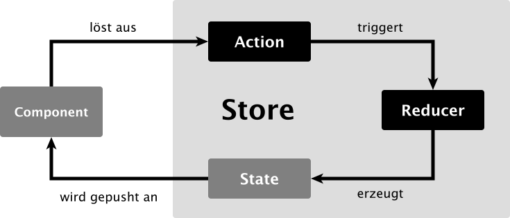

**Zusatzmaterial zum Buch *Angular: Das große Praxisbuch (4. Auflage)* von Ferdinand Malcher, Danny Koppenhagen und Johannes Hoppe.**

Dieser Artikel ist **Teil 1** einer dreiteiligen Serie zum Thema State Management mit NgRx.

- Teil 1: Wie kommen wir zu zentralem State Management? (dieser Artikel)
- Teil 2: Global Store mit NgRx → [zum Artikel](/material/ngrx-global-store)
- Teil 3: SignalStore → [zum Artikel](/material/ngrx-signal-store)

[[toc]]

> NgRx provides robust state management for small and large projects. It enforces proper separation of concerns. Using it from the start reduces the risk of spaghetti when the project evolves.
>
> – Minko Gechev, Mitglied des Angular-Teams

Wir haben unsere Anwendung bisher stets komponentenzentriert und serviceorientiert aufgebaut: Die Komponenten unserer Anwendung kommunizieren auf klar definierten Wegen über Property Bindings und Event Bindings. Um Daten zu erhalten und zu senden, nutzen die Komponenten verschiedene Services, in denen die HTTP-Kommunikation gekapselt ist oder über die wir Daten austauschen können.

Diese Herangehensweise funktioniert im Prinzip sehr gut, und wir haben so eine vollständige Anwendung entwickeln können. Unsere Beispielanwendung ist allerdings vergleichsweise klein und übersichtlich – in der Praxis werden die Anwendungen wesentlich größer: Viele Komponenten greifen dann gleichzeitig auf geteilte Daten zu und nutzen dieselben Services. Auch die Performance spielt eine immer größere Rolle, je komplexer die Anwendung wird. Wir erreichen mit der bisher vorgestellten Herangehensweise schnell einen Punkt, an dem wir den Überblick über die Kommunikationswege verlieren. Es kommt immer häufiger zu unerklärlichen Konstellationen, da man nicht mehr nachvollziehen kann, welche Komponente andere Komponenten oder Services aufruft und in welcher Reihenfolge dies geschieht. Gleichzeitig führen die vielen Kommunikationswege zu entsprechend vielen Änderungen an den Daten, die von der Change Detection erkannt und verarbeitet werden müssen. Kurzum: Die Anwendung wird zunehmend schwerfälliger.

Mit wachsender Größe der Anwendung ergeben sich immer wieder folgende Fragen:

- Wie können wir Daten cachen und wiederverwenden, die über HTTP abgerufen wurden?
- Wie machen wir Daten für mehrere Komponenten gleichzeitig verfügbar?
- Wie reagieren wir an verschiedenen Stellen auf Ereignisse, die in der Anwendung auftreten?
- Wie verwalten wir die Daten, die über die gesamte Anwendung verteilt sind?

Eine häufige Lösung für all diese Herausforderungen ist die *Zentralisierung*. Liegen die Daten an einem zentralen Ort in der Anwendung vor, so können sie von überall aus genutzt und verändert werden. Diesen Schritt geht man häufig ganz selbstverständlich, indem man etwa an einer geeigneten Stelle (z. B. im `BookStoreService`) einen Cache einbaut. Doch die Idee der Zentralisierung kann man noch viel weiter treiben: Bislang waren Komponenten die "Hüterinnen" der Daten. Jede Komponente hatte ihren eigenen Zustand und bildete eine abgeschottete Einheit zu den anderen Komponenten. Diese Idee wollen wir nun auf den Kopf stellen. Die Komponenten sollen dazu ihre bisherige Kontrolle über die Daten und die Koordination der Prozesse an eine zentrale Stelle abgeben. Die Aufgabe der Komponenten ist es dann nur noch, Daten für die Anzeige zu lesen, neue Daten zu erfassen und Events an die zentrale Stelle zu senden. Diese Art der Zentralisierung ist ein entscheidender Unterschied zum bisherigen Vorgehen, wo alle Zustände über den gesamten Komponentenbaum hinweg verteilt waren.

Wir wollen in diesem Kapitel besprechen, wie eine solche zentrale Zustandsverwaltung (engl. *State Management*) realisiert werden kann. Dabei lernen wir das Architekturmuster *Redux* kennen und nutzen das populäre Framework *Reactive Extensions for Angular (NgRx)*, um den Anwendungszustand zu verwalten und unsere Prozesse zu koordinieren.

## Ein Modell für zentrales State Management

Um uns der Idee des zentralen State Managements von Redux zu nähern, wollen wir zunächst ein eigenes Modell ohne den Einsatz eines Frameworks entwickeln. Wir beginnen mit einem einfachen Beispiel, verfeinern die Implementierung schrittweise und nähern uns so der finalen Lösung an.

### Objekt in einem Service

Um alle Daten und Zustände zu zentralisieren, legen wir in einem zentralen Service ein Zustandsobjekt ab. Wir definieren die Struktur dieses Objekts mit einem Interface, um von einer starken Typisierung zu profitieren. Als möglichst einfaches Beispiel dient uns eine Zahl, die man mithilfe einer Methode hochzählen kann. Dieser *State* kann natürlich noch weitere Eigenschaften besitzen; wir haben dies mit dem Property `anotherProperty` angedeutet.

```ts
export interface MyState {
  counter: number;
  anotherProperty: string;
}

@Injectable({ providedIn: 'root' })
export class StateService {
  state: MyState = {
    counter: 0,
    anotherProperty: 'foobar'
  };

  incrementCounter() {
    this.state.counter++;
  }
}
```

Unser Service hält ein Objekt mit einem initialen Zustand, das über die Methode `incrementCounter()` manipuliert werden kann. Alle Komponenten können diesen Service anfordern und die Daten aus dem Objekt nutzen und verändern. Die Change Detection von Angular hilft uns dabei, automatisch bei Änderungen die Views der Komponenten zu aktualisieren.

```ts
@Component({ /* ... */ })
export class MyComponent {
  constructor(public service: StateService) {}
}
```

Den injizierten `StateService` können wir dann im Template nutzen, um die Daten anzuzeigen und die Methode `incrementCounter()` auszulösen:

> **Hinweis:** Services sollten nicht direkt im Template verwendet werden, um die Abhängigkeiten auf eine konkrete Implementierung zu verringern. Deshalb werden injizierte Services in der Regel `private` gesetzt. Um das vorliegende Beispiel einfach zu halten, verzichten wir hier allerdings darauf.

```html
<div class="counter">
  {{ service.state.counter }}
</div>
<button (click)="service.incrementCounter()">
  Increment
</button>
```

Wir haben in einem ersten Schritt unseren Zustand zentralisiert. Der Mehrwert zu einer isolierten Lösung besteht darin, dass alle Komponenten denselben Datensatz verwenden und anzeigen. Der Ort der Datenhaltung ist klar definiert, und es gibt keine Datensilos bei den einzelnen Komponenten.

### Subject in einem Service

Wir haben den Anwendungszustand an einer zentralen Stelle untergebracht, allerdings hat die Lösung einen Nachteil. Mit der aktuellen Architektur können wir nur über Umwege programmatisch auf Änderungen an den Daten reagieren. Eine Änderung am State wird zwar jederzeit korrekt angezeigt, aber dies basiert allein auf den Mechanismen der Change Detection. Wollen wir hingegen zusätzlich eine Routine anstoßen, sobald sich Daten ändern, haben wir aktuell keine direkte Möglichkeit dazu.

Um das zu verbessern, ergänzen wir den Service mit einem Subject. Das Subject ist ein Baustein, mit dem wir ein Event an mehrere Subscriber verteilen können. Ein Subject implementiert hierfür sowohl alle Methoden eines Observers (Daten senden) als auch die eines Observables (Daten empfangen). Wenn der Zustand geändert wird, soll das Subject diese Neuigkeit mit einem Event bekannt machen, sodass die Komponenten darauf reagieren können.

Für unser Beispiel eignet sich ein `BehaviorSubject`. Seine wichtigste Eigenschaft besteht darin, dass es den jeweils letzten Zustand speichert. Jeder neue Subscriber erhält die aktuellen Daten, ohne dass ein neues Event ausgelöst werden muss. Interessierte Komponenten können den Datenstrom also jederzeit abonnieren und auf die Ereignisse reagieren. Das `BehaviorSubject` muss mit einem Startwert initialisiert werden, der über den Konstruktor übergeben wird.

Wir setzen im Service zunächst die Eigenschaft `state` auf privat, sodass man nun gezwungen ist, das Observable `state$` zu verwenden, anstatt direkt auf das Objekt zuzugreifen. Wird `incrementCounter()` aufgerufen und der State aktualisiert, so lösen wir das `BehaviorSubject` mit dem aktuellen State-Objekt aus. So werden alle Subscriber über den neuen Zustand informiert.

```ts
@Injectable({ providedIn: 'root' })
export class StateService {
  private state: MyState = { /* ... */ };

  state$ = new BehaviorSubject<MyState>(this.state);

  incrementCounter() {
    this.state.counter++;
    this.state$.next(this.state);
  }
}
```

Unsere Komponenten können nun die Informationen aus dem Subject beziehen. Der Operator `map()` hilft uns, schon in der Komponentenklasse die richtigen Daten aus dem State-Objekt zu selektieren. So erhalten wir z. B. ein Observable, das nur den fortlaufenden Counter-Wert ausgibt.

```ts
@Component({ /* ... */ })
export class MyComponent {
  counter$ = this.service.state$.pipe(
    map(state => state.counter)
  );

  // ...
}
```

Im Template nutzen wir schließlich die AsyncPipe, um das Observable zu abonnieren.

```html
<div class="counter">
  {{ counter$ | async }}
</div>

<button (click)="service.incrementCounter()">
  Increment
</button>
```

Dieser Ansatz bietet einen Mehrwert zum vorherigen Beispiel: Die Komponenten teilen sich nicht nur die Daten, sie können auch reaktiv Änderungen entgegennehmen. Zusätzlich sind wir in der Lage, bei Bedarf die Strategie der Change Detection für die Komponente zu ändern und so in einem komplexeren Szenario gegebenenfalls die Performance zu optimieren.

### Unveränderlichkeit

Unser Beispiel hat sich gut entwickelt, hat aber noch ein grundlegendes Designproblem. Wir halten unsere Daten in einem zentralen Objekt, das mit wachsender Größe der Anwendung ebenfalls größer wird. Alle Änderungen werden *direkt* an diesem Objekt durchgeführt, und wir geben es lediglich als Referenzparameter (*Call by Reference*) an die aufrufende Funktion weiter. Wir stellen uns nun vor, das Objekt hätte viele weitere Eigenschaften und eine verschachtelte Datenstruktur. Die Ereignisse zum Ändern der Daten können weiterhin aus diversen Gründen ausgelöst werden. Wie können wir nun effizient herausfinden, ob das Objekt bzw. ein Teil der verschachtelten Datenstruktur verändert wurde? Die Antwort lautet: Wir können dies nicht ohne zusätzlichen Aufwand realisieren. Um eine Änderung festzustellen, ist es notwendig, das Objekt mit einer zuvor erstellten Kopie zu vergleichen. Da wir mit Referenzen arbeiten, müssen wir jede Eigenschaft der verschachtelten Datenstruktur mit dem Gegenstück aus der Kopie vergleichen.

Das wollen wir ändern, indem wir das Objekt *unveränderlich* (engl. *immutable*) machen. Zur Erstellung von unveränderlichen Objekten gibt es verschiedene Bibliotheken, darunter das Projekt [Immutable.js](https://immutable-js.github.io/immutable-js/) oder die leichtgewichtige Bibliothek [Immer](https://github.com/immerjs/immer). Für ein simples Szenario genügt auch die native JavaScript-Methode `Object.freeze()`. Damit können wir ein Objekt "einfrieren" und direkte Änderungen an den Daten verhindern.

Dadurch ändert sich ein grundlegender Aspekt: Da Änderungen nicht mehr direkt am bisherigen Objekt möglich sind, werden wir gezwungen, das Objekt auszutauschen. Wir erzeugen hierfür bei jeder Änderung eine Kopie des vorherigen Objekts mit einer Ausnahme: dem zu ändernden Wert. Eine Änderung festzustellen ist nun sehr einfach: Wir müssen lediglich Referenzen vergleichen. Das ist kein Problem, da wir durch die Unveränderlichkeit sicher sein können, dass keine Änderung durch direkte Manipulation des Objekts möglich sein kann. Versehentliche Änderungen sind damit ebenfalls ausgeschlossen.

Für die meisten Anwendungsfälle benötigen wir allerdings gar keine echte Unveränderlichkeit! Es reicht im Prinzip schon aus, nur so zu tun, als wäre das Objekt unveränderlich, und dies konsequent beim Programmieren einzuhalten. Wir können hierfür den Spread-Operator nutzen und damit alle Eigenschaften kopieren. Den Spread-Operator und die Rest-Syntax erklären wir ausführlich im Artikel [Einführung in TypeScript](/material/typescript).

Im folgenden Listing demonstrieren wir die Verwendung. Die Methode `incrementCounter()` nutzt den Spread-Operator, um eine Kopie des vorherigen Objekts und damit eine neue Referenz zu erzeugen. Im selben Schritt schreiben wir den neuen Wert des Zählers in die Eigenschaft `counter`.

```ts
@Injectable({ providedIn: 'root' })
export class StateService {
  // ...

  incrementCounter() {
    this.state = {
      ...this.state,
      counter: this.state.counter + 1
    };

    this.state$.next(this.state);
  }
}
```

Wir haben durch die "Pseudo-Immutability" den Weg geebnet, um die Strategie für die Change Detection zu optimieren: Wenn ein Objekt bei einer Änderung stets eine neue Referenz erhält, so können wir in den Kindkomponenten die Strategie `OnPush` einsetzen. Dies kann die Performance der Anwendung entscheidend verbessern.

Wir müssen beachten, dass der Spread-Operator stets nur eine flache Kopie (Shallow Copy) eines Objekts erstellt. Ist ein Objekt oder Array verschachtelt, so müssen wir bei Änderungen auch immer das direkt betroffene Objekt kopieren.

### Nachrichten

Wir wollen einen Schritt weiter gehen und das System noch mehr entkoppeln. So wie der Service aktuell implementiert ist, muss für jede Aktion auch eine Methode existieren, die von der Komponente aufgerufen wird, z. B. `incrementCounter()`. Idealerweise kennen die Komponenten allerdings gar keine Details über die konkrete Implementierung der Zustandsverwaltung. Koppeln wir die Bausteine zu eng aneinander, so wird es mit wachsender Größe der Anwendung immer aufwendiger, grundlegende Änderungen oder Umstrukturierungen durchzuführen.

Anstatt also für jede Aktion eine Methode anzulegen, wollen wir eine Reihe von Nachrichten vereinbaren, mit denen die Anwendung Ereignisse signalisieren kann. Welche Routinen als Reaktion auf eine Nachricht anzustoßen sind, das entscheidet allein die Zustandsverwaltung. Die Komponenten teilen lediglich mit, was in der Anwendung passiert.

Der relevante Unterschied zu einem Methodenaufruf ist die Entkopplung: Dem System steht es frei, auf eine Nachricht zu reagieren oder sie zu ignorieren. Existiert für eine bestimmte Nachricht noch keine Logik, so tritt kein Fehler auf, sondern die Nachricht wird schlichtweg nicht behandelt. Ebenso können mehrere Teile der Anwendung gleichzeitig auf Nachrichten reagieren oder auch zeitversetzt die Nachricht verarbeiten. Zeichnet man die Nachrichten auf, so bleibt durch die Historie der Nachrichten stets ersichtlich, was in welcher Reihenfolge passiert ist.

Für das Zählerbeispiel können wir beispielsweise die Nachrichten `INCREMENT`, `DECREMENT` und `RESET` vereinbaren, die von den Komponenten zum Service geschickt werden können. Die Methode `dispatch()` werden wir im nächsten Abschnitt noch genauer betrachten. Für den Moment vereinbaren wir, dass sie eine Nachricht entgegennimmt und für die gewünschte Zustandsänderung sorgt.

```ts
@Component({ /* ... */ })
export class MyComponent {
  constructor(private service: StateService) {}

  increment() {
    this.service.dispatch('INCREMENT');
  }
}
```

Wenn wir diese Architektur genauer betrachten, fällt auf, dass wir Lesen und Schreiben für unser Zustandsobjekt vollständig voneinander getrennt haben: Empfangen wir die Daten, wissen wir nicht, woher die Zustandsänderungen stammen. Beim Auslösen der Nachrichten wissen wir nicht, ob und wie der Zustand geändert wird und wer über die Änderungen informiert wird. Die Verantwortung wurde komplett an die zentrale Zustandsverwaltung übertragen, und wir haben das System stark entkoppelt.

### Berechnung des Zustands auslagern

Mit der Idee von Nachrichten zum Datenaustausch und zur (Pseudo-)Unveränderlichkeit im Hinterkopf wollen wir die Verwaltung des Zustands erneut überdenken. Bisher haben wir das State-Objekt direkt als Property im Service gepflegt und bei Änderungen über das Subject ausgegeben. Der Service hat dabei zwei Verantwortlichkeiten: den zentralen State zu halten und alle Änderungen zu berechnen.

Für unser kurzes Beispiel mit einem Counter ist dies kein Problem, denn wir haben nur wenige Zeilen Code. Wenn allerdings unsere Anwendung und damit die Zustandsverwaltung komplexer wird, so wächst auch der zentrale Service mit jedem Feature immer weiter an. Bald entsteht ein "Gottobjekt" (engl. *God Object*), und das müssen wir verhindern.

Die Lösung des Problems ist, die Berechnung des Zustands in eine weitere unabhängige Funktion auszulagern. Wenn wir die Funktion richtig planen, so können wir die Berechnung bei zunehmender Komplexität auch in viele unabhängige Funktionen aufteilen. Weiterhin sollten diese ausgelagerten Funktionen keinen eigenen Zustand besitzen (engl. *stateless*), sodass sie bei gleichen Eingangswerten stets die gleichen Ausgangswerte erzeugen. Dadurch werden die Funktionen einfacher testbar.

Über die gesamte Laufzeit der Anwendung betrachtet basiert unser Service auf einem Strom von Nachrichten, die jeweils Zustandsänderungen auslösen können. Wir besitzen die Grundlage für ein reaktives System, nun müssen wir uns diese Eigenschaft nur noch mithilfe unserer ausgelagerten Funktionen zunutze machen. Dazu entwickeln wir zunächst die Funktion, die für jede eintreffende Nachricht entscheidet, ob und wie der Zustand verändert werden soll.

Den Datenfluss können wir dabei ganz einfach halten: Die Funktion erhält als Argumente den aktuell herrschenden Zustand und die eintreffende Nachricht. Die Fallunterscheidung anhand der Nachricht können wir mit einer *switch/case*-Anweisung realisieren.

```ts
function calculateState(state: MyState, message: string): MyState {
  switch (message) {
    case 'INCREMENT': {
      return {
        ...state,
        counter: state.counter + 1
      };
    }

    case 'DECREMENT': {
      return {
        ...state,
        counter: state.counter - 1
      };
    }

    case 'RESET': {
      return { ...state, counter: 0 };
    }

    default: return state;
  }
}
```

Der Zustand wird also durch jede eintreffende Nachricht berechnet. Wenn Änderungen durchgeführt werden sollen, so gibt die Funktion ein neues Objekt zurück, denn wir wollen den Zustand ja unveränderlich behandeln. Trifft eine unbekannte Nachricht ein, so ist keine Änderung notwendig. Wir müssen in diesem Fall das vorherige State-Objekt unverändert zurückgeben. Unser zentraler Service kann also mithilfe der neuen Funktion wie folgt angepasst werden:

```ts
@Injectable({ providedIn: 'root' })
export class StateService {
  // ...

  dispatch(message: string) {
    this.state = calculateState(this.state, message);
    this.state$.next(this.state);
  }
}
```

In diesem Schritt wurde unser System in zwei Teile aufgeteilt. Der Service hält weiterhin den State, die Berechnung wird von einer ausgelagerten Funktion durchgeführt. Durch diese Trennung bleibt der Service schlank und übersichtlich.

### Deterministische Zustandsänderungen

In JavaScript existiert die Methode `Array.reduce()`. Sie hat die Aufgabe, die Werte eines Arrays auf einen einzigen Wert zu reduzieren. Dabei wird für jeden Wert ein Callback aufgerufen, das die Reduktion durchführt. Die einfachste Form einer solchen Reduktion ist eine Summenbildung:

```ts
const values = [1, 2, 3, 4];
const reducer = (previous: number, current: number) => {
  return previous + current;
};

// Erwartetes Ergebnis: 1 + 2 + 3 + 4 = 10
const result = values.reduce(reducer, 0);
```

Die Signatur unserer zuvor ausgelagerten Funktionen entspricht bereits einem solchen Callback, wie es auch für `Array.reduce()` verwendet wird. Unseren Zustand können wir demnach auch so berechnen: Es existiert ein Array von nacheinander abzuarbeitenden Nachrichten. Mithilfe von `Array.reduce()` summieren wir alle Nachrichten auf und verwenden dafür die Anweisungen aus der Funktion `calculateState()`.

```ts
const initialState = {
  counter: 0,
  anotherProperty: 'foobar'
};
const messages = ['INCREMENT', 'DECREMENT', 'INCREMENT'];

const result = messages.reduce(calculateState, initialState);
// Erwartetes Ergebnis: { counter: 1, anotherProperty: 'foobar' }
```

Mit einer solchen Reducer-Funktion und einer Liste von Nachrichten können wir demnach jeden gewünschten Zustand erzeugen. Wichtig ist dabei vor allem, dass die Reducer-Funktion eine *Pure Function* ist. Sie liefert also für die gleichen Eingabewerte stets die gleiche Ausgabe und erzeugt keine Seiteneffekte. Dazu darf die Funktion ausschließlich die übergebenen Parameter verwenden und keinen eigenen Zustand verwalten. Auf die Eigenschaften einer Pure Function gehen wir in [Teil 2](/material/ngrx-global-store) noch genauer ein.

In den vorherigen Beispielen haben wir allerdings kein Array von Nachrichten verwendet, sondern alle eingehenden Nachrichten wurden direkt an `calculateState()` weitergegeben. Wir wollen den Service nun etwas umstrukturieren: Dazu setzen wir ein neues Subject ein, das alle Nachrichten nacheinander in einem Datenstrom `messages$` liefert. Die Methode `dispatch()` leitet die Nachrichten also nur an das Subject weiter.

Wir wollen dann erneut die Funktion `calculateState()` nutzen, um aus der Sammlung aller Nachrichten den jeweils neuen Zustand zu generieren. Dieses Mal greifen wir auf das große Toolset von RxJS zurück und verwenden den Operator `scan()`. Die Caching-Eigenschaft des ehemaligen `BehaviorSubject` übernimmt nun `shareReplay(1)`: So teilen wir das resultierende Observable mit allen Subscribern und übermitteln den jeweils letzten Wert an alle neuen Subscriber. Um den Prozess einmalig anzustoßen, nutzen wir außerdem den Operator `startWith()` und erzeugen ein erstes Element im Strom der Nachrichten.

```ts
@Injectable({ providedIn: 'root' })
export class StateService {

  private messages$ = new Subject<string>();
  private initialState: MyState = { /* ... */ };

  readonly state$ = this.messages$.pipe(
    startWith('INIT'),
    scan(calculateState, this.initialState),
    shareReplay(1)
  );

  dispatch(message: string) {
    this.messages$.next(message);
  }
}
```

Das Ergebnis ist das Observable `state$`, das für jede eintreffende Nachricht den neuen Zustand ausgibt, der von der Funktion `calculateState()` berechnet wurde. Ausgehend vom Startzustand werden also alle Nachrichten "aufsummiert" – daraus ergibt sich immer der aktuelle Zustand. Mithilfe von `scan()` müssen wir das zentrale Objekt nicht mehr selbst pflegen; dies erledigt nun RxJS für uns.

Erneut haben wir unsere Zustandsverwaltung verbessert. Der Zustand ist nun aus den gesendeten Nachrichten abgeleitet. Ist die Historie aller Nachrichten bekannt, so kann man theoretisch jeden bisherigen Zustand jederzeit wieder reproduzieren, sofern unsere Reducer-Funktionen deterministisch sind. Diese Eigenschaften sorgen für ein sehr einfaches und gleichzeitig robustes System. Da die Funktionen sehr simpel sind, sind sie auch sehr einfach zu testen.

> **Hinweis:** Um jeden gewünschten Zustand wieder reproduzieren zu können, müsste man die Historie aller Nachrichten speichern. Das tun wir in diesem Beispiel nicht, und auch in der praktischen Anwendung von Redux wird das Protokoll der Nachrichten nicht gespeichert.

### Zusammenfassung aller Konzepte

Wir wollen die entwickelte Idee kurz zusammenfassen:

Wir besitzen einen zentralen Service, der Nachrichten empfängt. Diese Nachrichten können von überall aus der Anwendung gesendet werden: aus Komponenten, anderen Services usw. Der Service kennt den Startzustand der Anwendung, der als ein zentrales Objekt abgelegt ist. Jede eintreffende Nachricht kann Änderungen an diesem Zustand auslösen. Der Service kennt dafür die passenden Anleitungen, wie die Nachricht zu behandeln ist und welche Änderungen am Zustand dadurch ausgelöst werden. Wird ein neuer Zustand erzeugt, wird er an alle Subscriber über ein Observable übermittelt. Jede interessierte Instanz in der Anwendung kann also die Zustandsänderungen abonnieren.

Der Lesefluss und der Schreibfluss wurden vollständig entkoppelt: Die Komponenten erhalten die Daten über ein Observable und senden Nachrichten in den Service. Der Service ist die *Single Source of Truth* und hat als einziger Teil der Anwendung die Hoheit darüber, Nachrichten und Zustandsänderungen zu verarbeiten.

Wir haben schrittweise ein robustes Modell für zentrales State Management entwickelt und dabei die Idee des Redux-Patterns kennengelernt.

## Das Architekturmodell Redux

Redux ist ein populäres Pattern zur Zustandsverwaltung in Webanwendungen. Die Idee von Redux stammt ursprünglich aus der Welt des JavaScript-Frameworks React, das neben Angular eines der populärsten Entwicklungswerkzeuge für Single-Page-Anwendungen ist. Redux ist dabei zunächst eine Architekturidee, es gibt aber auch eine konkrete Implementierung in Form einer Bibliothek.

Der zentrale Bestandteil der Architektur ist ein *Store*, in dem der gesamte Anwendungszustand als eine einzige große verschachtelte Datenstruktur hinterlegt ist. Der Store ist die *Single Source of Truth* für die Anwendung und enthält alle Zustände: vom Server heruntergeladene Daten, gesetzte Einstellungen, die aktuell geladene Route oder Infos zum eigenen Account – alles, was sich zur Laufzeit in der Anwendung verändert und den Zustand beschreibt.

Das State-Objekt im Store hat zwei elementare Eigenschaften: Es ist *immutable* und *read-only*. Wir können die Daten aus dem State nicht verändern, sondern ausschließlich lesend darauf zugreifen. Möchten wir den State "verändern", so muss das existierende Objekt durch eine Kopie ausgetauscht werden, die die Änderungen enthält. Solche Änderungen am State werden durch Nachrichten ausgelöst, die aus der Anwendung in den Store gesendet werden. Die Grundidee dieser Architektur haben wir bereits in der Einleitung zu diesem Kapitel gemeinsam entwickelt.

> **Hinweis:** Das State-Objekt ist theoretisch mutierbar, wir werden es aber stets immutable behandeln. NgRx setzt also auf die Pseudo-Immutability.

Neben dem zentralen Store mit dem State-Objekt verwendet Redux zwei weitere wesentliche Bausteine: Alle fachlichen Ereignisse in der Anwendung werden mit Nachrichten abgebildet – im Kontext von Redux nennt man diese Nachrichten *Actions*. Eine Action wird von der Anwendung (z. B. von den Komponenten) in den Store gesendet (*dispatch*) und kann eine Zustandsänderung auslösen. Im Store werden die eingehenden Actions von *Reducers* verarbeitet. Diese Funktionen nehmen den aktuellen State und die neue Action als Grundlage und errechnen daraus den neuen State. Der Datenfluss in der Redux-Architektur ist in der folgenden Abbildung grafisch dargestellt. Hier ist gut erkennbar, dass die Daten stets in eine Richtung fließen und dass Lesen und Schreiben klar voneinander getrennt sind.



Bringt man diese Bausteine in den Kontext des einführenden Beispiels, so entspricht der zentrale Service dem Store von Redux. Die gesendeten Nachrichten entsprechen den Actions. Die Funktion `calculateState()`, die wir zur Veranschaulichung verwendet haben, ist genauso aufgebaut wie die Reducers von Redux. Der Operator `scan()` ist tatsächlich auch die technische Grundlage des Frameworks NgRx, das wir in diesem Kapitel für das State Management nutzen werden.

### Redux und Angular

Die originale Implementierung von Redux stammt aus der Welt von React. Alle enthaltenen Ideen können aber problemlos auch auf die Architektur einer Angular-Anwendung übertragen werden. Es existieren verschiedene Frameworks und Bibliotheken, die ein zentrales State Management für Angular ermöglichen. Sie alle folgen der grundsätzlichen Idee von Redux:

- Reactive Extensions for Angular (NgRx)
- NGXS
- Akita
- Elf

NgRx ist das bekannteste Projekt aus dieser Kategorie. Das Framework wurde von Mitgliedern des Angular-Teams aktiv mitentwickelt und gilt als De-facto-Standard für zentrales State Management mit Angular. Es lohnt sich außerdem, einen Blick auf die Community-Projekte NGXS und Elf zu werfen.

Welches der Frameworks wir für die Zustandsverwaltung einsetzen, hängt von den konkreten Anforderungen und auch von persönlichen Präferenzen ab. Wir sollten alle Projekte vergleichen und unseren Favoriten nach Kriterien wie Codestruktur und Features auswählen. Dazu möchten wir einen Blogartikel empfehlen, in dem NgRx, NGXS, Akita und eine eigene Lösung mit RxJS gegenübergestellt werden: [Angular state management comparison](https://ordina-jworks.github.io/angular/2018/10/08/angular-state-management-comparison.html).

---

**Weiter zu Teil 2:** [Global Store mit NgRx](/material/ngrx-global-store)
